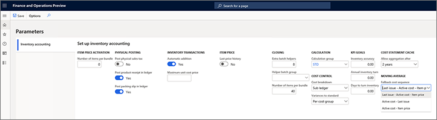

# Moving average fallback cost sequence

[!include [banner](../includes/banner.md)]

One way that you can calculate the cost of your inventory is by using a _moving average_. Up to three cost values can be associated with each inventory item:

- **Last issue** – The last issue cost that was assigned before inventory went negative
- **Active cost** – The latest cost that was activated in a costing version
- **Item price** – The cost that is specified for the released product

To determine which of these cost values should be used in moving average calculations, the system uses a _fallback cost sequence_ to establish the order of preference for the values. If the preferred cost value isn't available, the system uses the next-preferred value, and so on.

In previous versions of Microsoft Dynamics 365 Supply Chain Management, the system used a fixed fallback cost sequence (_Last issue – Active cost – Item price_). In version 10.0.11, this sequence is still the default sequence. However, you can also turn on a feature that lets you select among three available fallback cost sequences. This feature can be especially useful for organizations that regularly use negative inventory values.

To make the selector for the fallback cost sequence available, you (or an admin) must use [Feature management](../../fin-ops-core/fin-ops/get-started/feature-management/feature-management-overview.md) to turn on the feature that is named _Moving average fallback cost sequence_.

To select the fallback cost sequence for moving average calculations, follow these steps.

1. Open the **Parameters** page.
2. On the **Inventory accounting** tab, in the **Moving average** section, set the **Fallback cost sequence** field to one of the following values:

    - **Last issue – Active cost – Item price** – This sequence is the default sequence. It's the same sequence that is used if the _Moving average fallback cost sequence_ feature isn't turned on.
    - **Active cost – Last issue**
    - **Active cost – Item price** – Organizations might experience performance issues if they use business processes where inventory regularly goes negative and, at the same time, the transaction volume is high. This setting can help mitigate those performance issues.

[!INCLUDE[footer-include](../../includes/footer-banner.md)]