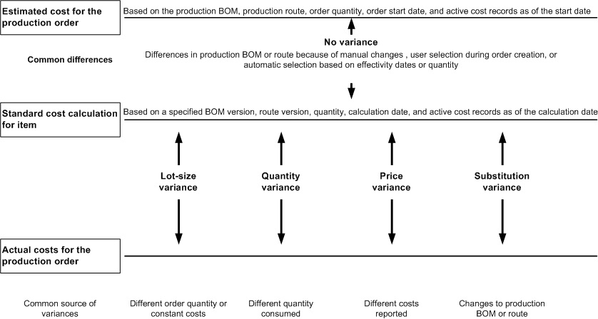

---
# required metadata

title: Production order cost analysis
description: This article provides information about the cost analysis that you can do for completed and current production orders. You can analyze the estimated costs and actual costs by using the Price calculation page or the Cost estimates and costings report. You can view information about the estimated and actual costs (and quantity) for each component item, the routing operation, and the indirect cost.
author: JennySong-SH
ms.date: 06/20/2017
ms.topic: article
ms.prod: 
ms.technology: 

# optional metadata

ms.search.form: InventCostTrans, ProdCalcTrans, ProdTableJour, ProdTableListPage, ProdSetupHistoricalCost
# ROBOTS: 
audience: Application User
# ms.devlang: 
ms.reviewer: kamaybac
# ms.tgt_pltfrm: 
ms.assetid: ded5da04-f787-49f7-b5e5-75c2a2b92930
ms.search.region: Global
ms.search.industry: Manufacturing
ms.author: yanansong
ms.search.validFrom: 2016-02-28
ms.dyn365.ops.version: AX 7.0.0

---

# Production order cost analysis

[!include [banner](../includes/banner.md)]

This article provides information about the cost analysis that you can do for completed and current production orders. You can analyze the estimated costs and actual costs by using the Price calculation page or the Cost estimates and costings report. You can view information about the estimated and actual costs (and quantity) for each component item, the routing operation, and the indirect cost.

The actual costs for a production order are based on the reported consumption of material and routing operations. You can access detailed transactions about the reported consumption of material, routing operations, and indirect costs for a production order on the **Production posting** page.

## Variance analysis for a completed production order
The variances reflect a comparison of the reported production activities and the calculation of standard costs for the production item. The variances don't reflect a comparison to the production order's estimated costs. The production activities that are reported include the consumption of material and routing operations, together with the associated indirect costs, and the quantity that is reported as finished. The following four types of variance are calculated:

-   Lot size variance
-   Production quantity variance
-   Production price variance
-   Production substitution variance

The following diagram shows the four variances that account for the difference between a production order's actual costs and the calculated costs within the item's cost record when the production order is ended. 

 

You can analyze the production variances by using the **Variance** page or the **Production variance** report. Use the display options to view detailed variances by item and operations resource, or by cost group. The policy for cost breakdown in the inventory parameters determines whether the variances are tracked by cost group. You can also use the **single**, **multi**, and **total** display options to view summarized variances. The information about detailed variances can help you understand the source of each variance. To predict variances before you end a production order, analyze the detailed information that is provided on the **Cost estimates and costings** report.

## Cost analysis for current production orders
Separate reports provide information about each type of transaction. Use these reports to analyze costs for reported production activities. Information is displayed only for current production orders that have a status of **Started** or **Reported as finished**.

-   **Materials in process** − This report lists the picking list transactions that are reported against the current production orders as of a specified transaction date. The report indicates the quantity of a component that was issued and the cost amount for each transaction. Use the selection criteria for a single component item. For example, you can print information about the component’s issued quantity against applicable production orders. The issued quantity isn't updated by the quantities that are reported as finished for the parent item. Therefore, the actual quantity of raw materials in process might be overstated.
-   **Work in process** − This report lists route transactions (or job transactions) that are reported against the current production orders as of a specified transaction date. The report indicates the hours, amount, and quantity (both good quantity and error quantity) that are reported for each transaction. It also includes information such as the operation number, operation ID, and operations resource. Additionally, this report shows the total time and amount for all transactions against the production order, and the quantity that is reported as finished.
-   **Indirect costs in process** − This report lists the indirect costs that have been incurred against production orders. This data is based on reported consumption of routing operations and components as of a specified transaction date. The report indicates the type of indirect cost (surcharge or rate), the costing sheet code for the indirect cost, and the cost amount for each transaction. This report doesn't provide information about the route card or pick list transaction that generated the indirect cost.
-   **In process production costing** − This report lists the combined consumption of material, routing operations, and indirect cost against the production orders as of a specified transaction date.
-   **Finished items in process** − This report lists current production orders and the report-as-finished transactions as of a specified transaction date.

## Additional resources

[Common sources of production variances](common-sources-of-production-variances.md)

[!INCLUDE[footer-include](../../includes/footer-banner.md)]