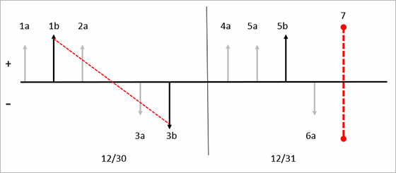
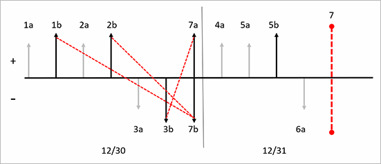
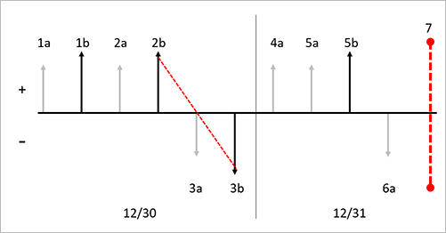

# Weighted average date with Include physical value and marking

[!include [banner](../includes/banner.md)]

*Weighted average date* is an inventory model that is based on an average that is calculated by multiplying each component (item transaction) by a factor (cost price) that reflects its importance (quantity) on each day in the period. In other words, this inventory model assigns the cost of issue transactions based on the mean value of all inventory that is received each day, plus any on-hand inventory from the previous day.

When you run an inventory closing by using the weighted average date inventory model, two methods can be used to create a settlement. Typically, all receipts are settled against a virtual issue that holds the total received quantity and value. This virtual issue has a corresponding virtual receipt that the issues are settled from. In this way, all issues get the same average cost each day. The virtual issue and the virtual receipt can be considered a virtual transfer. This virtual transfer is referred to as *weighted average inventory closing transfer*. Therefore, this settlement method is known as a *weighted average summarized settlement*. If there is only one receipt, all issues can be settled from it, and no virtual transfer is created. This settlement method is referred to as *direct settlement*. Any inventory that is on hand after the inventory close is performed is valued at the weighted average from the last day of the previous period and included in the weighted average date calculation in the next period.

You can override the weighted average date principle by marking inventory transactions so that a specific item receipt is settled against a specific issue. A periodic inventory close is required when you use the weighted average date inventory model to create settlements and adjust the value of issues according to the weighted average date principle. Until you run the inventory close, issue transactions are valued at the running average when the physical and financial updates occurred. Unless you're using marking, the running average is calculated when the physical or financial update is performed.

The weighted average date inventory costing method is calculated by using the following formula each day:

*Cost* = \[(*Q**b* × *P**b*) + &#x2211;*n*(*Q**n* × *P**n*)\] ÷ (*Q**b* + &#x2211;*n**Q**n*)

- *Q* = Quantity of the transaction
- *P* = Price of the transaction

In other words, the weighted average cost equals the beginning quantity times the beginning price, plus the sum of each receipt quantity times its receipt price, all divided by the beginning quantity plus the sum of the receipt quantities.

During inventory close, the calculation is performed every day during the closing period.

> [!NOTE]
> For more information about settlements, see [Inventory close](inventory-close.md).

The following examples show the effect of using weighted average date with five configurations:

- Weighted average date direct settlement when the **Include physical value** option isn't used
- Weighted average date summarized settlement when the **Include physical value** option isn't used
- Weighted average date direct settlement when the **Include physical value** option is used
- Weighted average date summarized settlement when the **Include physical value** option is used
- Weighted average date when marking is used

## Weighted average date direct settlement when the Include physical value option isn't used

The direct settlement principle creates settlements directly between receipts and issues, without creating additional inventory transactions. The system uses this direct settlement principle in the following situations:

- One receipt and one or more issues have been posted in the period.
- Only issues have been posted in the period, and the inventory contains on-hand items from a previous closing.

In this example, the **Include physical value** checkbox is cleared on the **Item model group** page for the released product. The diagram that follows shows these transactions:

**Day 1:**

- 1a. Inventory physical receipt for a quantity of 10 at a cost of USD 10.00 each.
- 1b. Inventory financial receipt for a quantity of 10 at a cost of USD 10.00 each.
- 2a. Inventory physical receipt for a quantity of 10 at a cost of USD 20.00 each.
- 3a. Inventory physical issue for a quantity of 1 at a cost price of USD 10.00 (running average of financially posted transactions).
- 3b. Inventory financial issue for a quantity of 1 at a cost price of USD 10.00 (running average of financially posted transactions).

**Day 2:**

- 4a. Inventory physical receipt for a quantity of 1 at a cost of USD 25.00 each.
- 5a. Inventory physical receipt for a quantity of 1 at a cost of USD 30.00 each.
- 5b. Inventory financial receipt for a quantity of 1 at a cost of USD 30.00 each.
- 6a. Inventory financial issue for a quantity of 1 at a cost of USD 20.00 each (running average of financially posted transactions).

**Day 3:**

- 7\. Inventory close is performed. Based on the weighted average date method, the system uses the direct settlement method for December 30 (12/30) because only one receipt is financially updated on 12/30. In this example, one settlement is created between transactions 1b and 3b. An adjustment of USD 10.00 is made to bring the value of transaction 3b up to 20.00. No adjustment or settlement is made on December 31 (12/31) because there are no financially updated issues on 12/31.

The following diagram shows this series of transactions and the effects of using the weighted average inventory model and the direct settlement principle without the **Include physical value** option.

**Key to the diagram:**

- Inventory transactions are represented by vertical arrows.
- Physical transactions are represented by shorter light gray arrows.
- Financial transactions are represented by longer black arrows.
- Receipts into inventory are represented by vertical arrows above the axis.
- Issues out of inventory are represented by vertical arrows below the axis.
- Each new receipt or issue transaction is designated by a new label.
- Each vertical arrow is labeled with a sequential identifier, such as *1a*. The identifiers indicate the order of inventory transaction postings in the timeline.
- Dates are separated by thin black vertical lines. The dates are noted at the bottom of the diagram.
- Inventory closings are represented by red vertical dashed lines.
- Settlements that are performed by inventory close are represented by red diagonal dashed arrows that go from a receipt to an issue.

## Weighted average date summarized settlement when the Include physical value option isn't used

When there are multiple receipts in a period, weighted average date uses the summarized settlement principle, where all receipts in a single day are summarized into a transaction that is named *weighted average inventory closing*. All the receipts for the day will be settled against the issue of the newly created inventory transaction. All issues for the day will be settled against the receipt of the new inventory transaction. If there is remaining on-hand inventory value after the inventory close, the on-hand inventory value is included in the receipt transaction of the weighted average inventory closing transactions.

The diagram that follows shows these transactions:

**Day 1:**

- 1a. Inventory physical receipt for a quantity of 1 at a cost of USD 10.00 each.
- 1b. Inventory financial receipt for a quantity of 1 at a cost of USD 10.00 each.
- 2a. Inventory physical receipt for a quantity of 1 at a cost of USD 20.00 each.
- 2b. Inventory financial receipt for a quantity of 1 at a cost of USD 22.00 each.
- 3a. Inventory physical issue for a quantity of 1 at a cost price of USD 16.00 (running average of financially posted transactions).
- 3b. Inventory financial issue for a quantity of 1 at a cost price of USD 16.00 (running average of financially posted transactions).

**Day 2:**

- 4a. Inventory physical receipt for a quantity of 1 at a cost of USD 25.00 each.
- 5a. Inventory physical receipt for a quantity of 1 at a cost of USD 30.00 each.
- 5b. Inventory financial receipt for a quantity of 1 at a cost of USD 30.00 each.
- 6a. Inventory physical issue for a quantity of 1 at a cost price of USD 23.00 (running average of financially posted transactions).

**Day 3:**

- 7\. Inventory close is performed.
- 7a. Weighted average inventory close transaction financial issue is created to sum the settlements of all the inventory financial receipts.

    - Transaction 1b is settled for a quantity of 1 with a settled amount of USD 10.00.
    - Transaction 2b is settled for a quantity of 1 with a settled amount of USD 22.00.
    - Transaction 7a is created for a quantity of 2 with a settled amount of USD 32.00. This transaction offsets the sum of the two receipt transactions that are financially updated in the period.

- 7b. Weighted average inventory close transaction financial receipt is created as the offset for financially posted issues.

    - Transaction 3b is settled for a quantity of 1 with a settled amount of USD 16.00. This transaction isn't adjusted because it's the weighted average of financially posted transactions on December 1 (12/1).
    - Transaction 7b is created for a quantity of 2 with a financial amount of USD 32.00 and a settled amount of USD 16.00 to offset transaction 3b. This transaction offsets the sum of the one issue transaction that is financially updated in the period. The transaction remains open because there is still one on hand.

The following diagram shows this series of transactions and the effects of using the weighted average inventory model and the summarized settlement principle, but without using the **Include physical value** option.

**Key to the diagram:**

- Inventory transactions are represented by vertical arrows.
- Physical transactions are represented by shorter light gray arrows.
- Financial transactions are represented by longer black arrows.
- Receipts into inventory are represented by vertical arrows above the axis.
- Issues out of inventory are represented by vertical arrows below the axis.
- Each new receipt or issue transaction is designated by a new label.
- Each vertical arrow is labeled with a sequential identifier, such as *1a*. The identifiers indicate the order of inventory transaction postings in the timeline.
- Dates are separated by thin black vertical lines. The dates are noted at the bottom of the diagram.
- Inventory closings are represented by red vertical dashed lines.
- Settlements that are performed by inventory close are represented by red diagonal dashed arrows that go from a receipt to an issue.

## Weighted average date direct settlement when the Include physical value option is used

In the current version of the product, the **Include physical value** option works differently with the weighted average date inventory model than it worked in earlier versions. When you select the **Include physical value** checkbox for an item on the **Item model group** page, the system will use physically updated receipts when it calculates the estimated issue cost price, or running average. Issues will be posted based on this estimated cost price during the period. During the inventory close, only financially updated receipts will be considered in the weighted average calculation.

The diagram that follows shows these transactions:

**Day 1:**

- 1a. Inventory physical receipt for a quantity of 10 at a cost of USD 10.00 each.
- 1b. Inventory financial receipt for a quantity of 10 at a cost of USD 10.00 each.
- 2a. Inventory physical receipt for a quantity of 10 at a cost of USD 20.00 each.
- 3a. Inventory physical issue for a quantity of 1 at a cost price of USD 15.00 (running average of physically and financially posted transactions).
- 3b. Inventory financial issue for a quantity of 1 at a cost price of USD 15.00 (running average of physically and financially posted transactions).

**Day 2:**

- 4a. Inventory physical receipt for a quantity of 1 at a cost of USD 25.00 each.
- 5a. Inventory physical receipt for a quantity of 1 at a cost of USD 30.00 each.
- 5b. Inventory financial receipt for a quantity of 1 at a cost of USD 30.00 each.
- 6a. Inventory physical issue for a quantity of 1 at a cost of USD 21.25 each (running average of physically and financially posted transactions).

**Day 3:**

- 7\. Inventory close is performed. Based on the weighted average date method, the system uses the direct settlement method for December 30 (12/30) because only one receipt is financially updated on 12/30. In this example, one settlement is created between transactions 1b and 3b. No adjustment is made to the issue on 12/30. Additionally, no adjustment or settlement is made on December 31 (12/31) because there are no financially updated issues on 12/31.

The following diagram shows this series of transactions and the effects of using the weighted average inventory model and the direct settlement principle with the **Include physical value** option.

**Key to the diagram:**

- Inventory transactions are represented by vertical arrows.
- Physical transactions are represented by shorter light gray arrows.
- Financial transactions are represented by longer black arrows.
- Receipts into inventory are represented by vertical arrows above the axis.
- Issues out of inventory are represented by vertical arrows below the axis.
- Each new receipt or issue transaction is designated by a new label.
- Each vertical arrow is labeled with a sequential identifier, such as *1a*. The identifiers indicate the order of inventory transaction postings in the timeline.
- Dates are separated by thin black vertical lines. The dates are noted at the bottom of the diagram.
- Inventory closings are represented by red vertical dashed lines.
- Settlements that are performed by inventory close are represented by red diagonal dashed arrows that go from a receipt to an issue.

## Weighted average date summarized settlement when the Include physical value option is used

In the current version of the product, the **Include physical value** option works differently with weighted average than it worked in earlier versions. When you select the **Include physical value** checkbox for an item on the **Item model group** page, the system will use physically updated receipts when it calculates the estimated cost price, or running average. Issues will be posted based on this estimated cost price during the period. During the inventory close, only financially updated receipts will be considered in the weighted average calculation. We recommend that you perform a monthly inventory close when you use the weighted average inventory model. In this example of weighted average date summarized settlement, the inventory model is marked to include physical value.

The diagram that follows shows these transactions:

**Day 1:**

- 1a. Inventory physical receipt for a quantity of 1 at a cost of USD 10.00 each.
- 1b. Inventory financial receipt for a quantity of 1 at a cost of USD 10.00 each.
- 2a. Inventory physical receipt for a quantity of 1 at a cost of USD 20.00 each.
- 2b. Inventory financial receipt for a quantity of 1 at a cost of USD 22.00 each.
- 3a. Inventory physical issue for a quantity of 1 at a cost price of USD 16.00 (running average of physically and financially posted transactions).
- 3b. Inventory financial issue for a quantity of 1 at a cost price of USD 16.00 (running average of physically and financially posted transactions).

**Day 2:**

- 4a. Inventory physical receipt for a quantity of 1 at a cost of USD 25.00 each.
- 5a. Inventory physical receipt for a quantity of 1 at a cost of USD 30.00 each.
- 5b. Inventory financial receipt for a quantity of 1 at a cost of USD 30.00 each.
- 6a. Inventory physical issue for a quantity of 1 at a cost price of USD 23.67 (running average of physically and financially posted transactions).

**Day 3:**

- 7\. Inventory close is performed.
- 7a. Weighted average inventory close transaction financial issue is created to sum the settlements of all the inventory financial receipts.

    - Transaction 1b is settled for a quantity of 1 with a settled amount of USD 10.00.
    - Transaction 2b is settled for a quantity of 1 with a settled amount of USD 22.00.
    - Transaction 7a is created for a quantity of 2 with a settled amount of USD 32.00. This transaction offsets the sum of the two receipt transactions that are financially updated in the period.

- 7b. Weighted average inventory close transaction financial receipt is created as the offset for financially posted issues.

    - Transaction 3b is settled for a quantity of 1 with a settled amount of USD 16.00. This transaction isn't adjusted because it's the weighted average of financially posted transactions on December 1 (12/1).
    - Transaction 7b is created for a quantity of 2 with a financial amount of USD 32.00 and a settled amount of USD 16.00 to offset transaction 3b. This transaction offsets the sum of the one issue transaction that is financially updated in the period. The transaction remains open because there is still one on hand.

The following diagram shows this series of transactions and the effects of using the weighted average inventory model and the summarized settlement principle without the **Include physical value** option.

**Key to the diagram:**

- Inventory transactions are represented by vertical arrows.
- Physical transactions are represented by shorter light gray arrows.
- Financial transactions are represented by longer black arrows.
- Receipts into inventory are represented by vertical arrows above the axis.
- Issues out of inventory are represented by vertical arrows below the axis.
- Each new receipt or issue transaction is designated by a new label.
- Each vertical arrow is labeled with a sequential identifier, such as *1a*. The identifiers indicate the order of inventory transaction postings in the timeline.
- Dates are separated by thin black vertical lines. The dates are noted at the bottom of the diagram.
- Inventory closings are represented by red vertical dashed lines.
- Settlements that are performed by inventory close are represented by red diagonal dashed arrows that go from a receipt to an issue.

## Weighted average date when marking is used

Marking is a process that lets you link, or mark, an issue transaction to a receipt transaction. Marking can occur either before or after a transaction is posted. You can use marking when you want to make sure of the exact cost of the inventory when the transaction is posted or the inventory close is performed.

For example, your Customer Service department accepted a rush order from an important customer. Because it's a rush order, you will have to pay more for this item to service your customer's request. You must be sure that the cost of this inventory item is reflected in the margin, or cost of goods sold (COGS), for this sales order invoice.

When the purchase order is posted, the inventory is received at a cost of USD 120.00. If the sales order document is marked to the purchase order before the packing slip or invoice is posted, COGS will be USD 120.00 instead of the current running average cost for the item. If the marking occurs after sales order packing slip or invoice is posted, the COGS will be posted at the running average cost price.

Before inventory close is performed, these two transactions can still be marked to each other.

If a receipt transaction is marked to an issue transaction, the valuation method that is selected for the item's item model group will be disregarded, and the system will settle these transactions to each other.

You can mark an issue transaction to a receipt before the transaction is posted. You can do this marking from a sales order line on the **Sales order details** page. The open receipt transactions are shown on the **Marking** page.

You can also mark an issue transaction to a receipt after the transaction is posted. You can match or mark an issue transaction for an open receipt transaction for an inventoried item from a posted inventory adjustment journal.

The diagram that follows shows these transactions:

**Day 1:**

- 1a. Inventory physical receipt for a quantity of 1 at a cost of USD 10.00 each.
- 1b. Inventory financial receipt for a quantity of 1 at a cost of USD 10.00 each.
- 2a. Inventory physical receipt for a quantity of 1 at a cost of USD 20.00 each.
- 2b. Inventory financial receipt for a quantity of 1 at a cost of USD 22.00 each.
- 3a. Inventory physical issue for a quantity of 1 at a cost price of USD 16.00 (running average of financially posted transactions).
- 3b. Inventory financial issue for a quantity of 1 at a cost price of USD 16.00 (running average of financially posted transactions).
- 3c. Inventory financial issue for transaction 3b is marked to inventory financial issue for transaction 2b.

**Day 2:**

- 4a. Inventory physical receipt for a quantity of 1 at a cost of USD 25.00 each.
- 5a. Inventory physical receipt for a quantity of 1 at a cost of USD 30.00 each.
- 5b. Inventory financial receipt for a quantity of 1 at a cost of USD 30.00 each.
- 6a. Inventory physical issue for a quantity of 1 at a cost price of USD 23.00 (running average of financially posted transactions).

**Day 3:**

- 7\. Inventory close is performed. Based on the marking principle that uses the weighted average method, the marked transactions are settled against each other. In this example, transaction 3b is settled against transaction 2b, and an adjustment for USD 6.00 is posted to transaction 3b to bring the value to USD 22.00. In this example, no additional settlements are made because the close creates settlements only for financially updated transactions.

The following diagram shows this series of transactions and the effects of using the weighted average inventory model with marking.

**Key to the diagram:**

- Inventory transactions are represented by vertical arrows.
- Physical transactions are represented by shorter light gray arrows.
- Financial transactions are represented by longer black arrows.
- Receipts into inventory are represented by vertical arrows above the axis.
- Issues out of inventory are represented by vertical arrows below the axis.
- Each new receipt or issue transaction is designated by a new label.
- Each vertical arrow is labeled with a sequential identifier, such as *1a*. The identifiers indicate the order of inventory transaction postings in the timeline.
- Dates are separated by thin black vertical lines. The dates are noted at the bottom of the diagram.
- Inventory closings are represented by red vertical dashed lines.
- Settlements that are performed by inventory close are represented by red diagonal dashed arrows that go from a receipt to an issue.

[!INCLUDE[footer-include](../../includes/footer-banner.md)]
