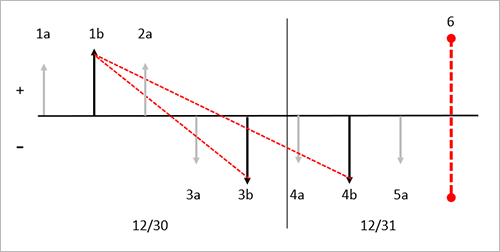
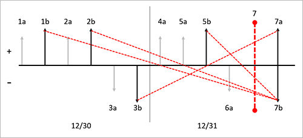
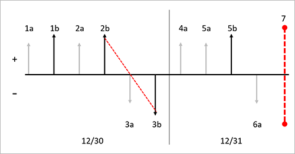

# Weighted average with physical value and marking

[!include [banner](../includes/banner.md)]

Weighted average is an inventory model based on an average that results from the multiplication of each component (item transaction) by a factor (cost price) reflecting its importance (quantity). Another way to say this is that weighted average is an inventory model that assigns the cost of issue transactions based on the mean value of all inventory received during the period, plus any on-hand inventory from the previous period.

When you run an inventory closing using the weighted average inventory model, there are two ways a settlement can be created. Typically, all receipts are settled against a virtual issue, which holds the total received quantity and value. This virtual issue has a corresponding virtual receipt from which the issues are settled. In this manner, all issues get the same average cost. The virtual issue and receipt can be seen as a virtual transfer, which is named the *weighted average inventory closing transfer*. This settlement method is called a *weighted average summarized settlement*. If there is only one receipt, all issues can be settled from it and the virtual transfer will not be created. This settlement method is referred to as a *direct settlement*. Any inventory that is on hand after the inventory close is performed is valued at the weighted average from the previous period and included in the weighted average calculation in the next period.

You can override the weighted average principle by marking inventory transactions so that a specific item receipt is settled against a specific issue. A periodic inventory close is required when you use the weighted average inventory model to create settlements and adjust the value of issues according to the weighted average principle. Until you run the inventory close process, issue transactions are valued at the running average when the physical and financial updates occurred. Unless you're using marking, the running average is calculated when the physical or financial update is performed.

The weighted average inventory costing method is calculated by the following formula:

- Weighted average = (\[Q1 × P1\] + \[Q2 × P2\] + \[Q*n* × P*n*\]) ÷ (Q1 + Q2 + Q*n*)

Q = quantity of the transaction  
P = price of the transaction

Settlements are inventory close postings that adjust the issues to the correct weighted average as of the closing date. The following examples illustrate the effect of using weighted average with five different configurations:

- Weighted average direct settlement without the **Include physical value** option
- Weighted average summarized settlement without the **Include physical value** option
- Weighted average direct settlement with the **Include physical value** option
- Weighted average summarized settlement with the **Include physical value** option
- Weighted average with marking

## Weighted average direct settlement without Include physical value

The direct settlement principle creates settlements directly between receipts and issues without creating additional inventory transactions. The system uses this direct settlement principle in the following situations:

- One receipt and one or more issues have been posted in the period.
- Only issues have been posted in the period and the inventory contains on-hand items from a previous closing.

In this example, the **Include physical value** checkbox is cleared on the **Item model group** for the released product. The illustration that follows shows these transactions:

- 1a. Inventory physical receipt for a quantity of 10 at a cost of USD 10.00 each.
- 1b. Inventory financial receipt for a quantity of 10 at a cost of USD 10.00 each.
- 2a. Inventory physical receipt for a quantity of 10 at a cost of USD 20.00 each.
- 3a. Inventory physical issue for a quantity of 1 at a cost price of USD 10.00 (running average of financially posted transactions).
- 3b. Inventory financial issue for a quantity of 1 at a cost price of USD 10.00 (running average of financially posted transactions).
- 4a. Inventory physical issue for a quantity of 1 at a cost of USD 10.00 each (running average of financially posted transactions).
- 4b. Inventory financial issue for a quantity of 1 at a cost of USD 10.00 each (running average of financially posted transactions).
- 5a. Inventory physical issue for a quantity of 1 at a cost of USD 10.00 each (running average of financially posted transactions).
- 6\. Inventory close is performed. Based on the weighted average method, the system uses the direct settlement method because only one receipt is financially updated in the period. In this example, one settlement is created between 1b and 3b, and another between 1b and 4b. No adjustment is made because the running average is the same as the weighted average.

The following diagram illustrates this series of transactions with the effects of choosing the weighted average inventory model and the direct settlement principle without the **Include physical value** option.

**Key to diagram**

- Inventory transactions are represented by vertical arrows.
- Physical transactions are represented by shorter light gray arrows.
- Financial transactions are represented by longer black arrows.
- Receipts into inventory are represented by vertical arrows above the axis.
- Issues out of inventory are represented by vertical arrows below the axis.
- Each new receipt or issue transaction is designated by a new label.
- Each vertical arrow is labeled with a sequential identifier, such as *1a*. The identifiers indicate the order of inventory transaction postings in the timeline.
- Each date in the diagram is separated by a thin black vertical line. The date is noted at the bottom of the diagram.
- Inventory closings are represented by a red vertical dashed line.
- Settlements that are performed by inventory close are represented by red diagonal dashed arrows that go from a receipt to an issue.

## Weighted average summarized settlement without the Include physical value option

When there are multiple receipts in a period, weighted average uses the summarized settlement principle where all receipts within in a closing period are summarized into a transaction called *weighted average inventory closing*. All the receipts for the period will be settled against the issue of the newly created inventory transaction. All issues for the period will be settled against the receipt of the new inventory transaction. If there is remaining on-hand inventory value after the inventory close, the on-hand inventory value is included in the receipt transaction of the weighted average inventory closing transactions.

The following transactions are illustrated in the graphic that follows:

- 1a. Inventory physical receipt for a quantity of 1 at a cost of USD 10.00 each.
- 1b. Inventory financial receipt for a quantity of 1 at a cost of USD 10.00 each.
- 2a. Inventory physical receipt for a quantity of 1 at a cost of USD 20.00 each.
- 2b. Inventory financial receipt for a quantity of 1 at a cost of USD 22.00 each.
- 3a. Inventory physical issue for a quantity of 1 at a cost price of USD 16.00 (running average of financially posted transactions).
- 3b. Inventory financial issue for a quantity of 1 at a cost price of USD 16.00 (running average of financially posted transactions).
- 4a. Inventory physical receipt for a quantity of 1 at a cost of USD 25.00 each.
- 5a. Inventory physical receipt for a quantity of 1 at a cost of USD 30.00 each.
- 5b. Inventory financial receipt for a quantity of 1 at a cost of USD 30.00 each.
- 6a. Inventory physical issue for a quantity of 1 at a cost price of USD 23.00 (running average of financially posted transactions).
- 7\. Inventory close is performed.
- 7a. Weighted average inventory close transaction financial issue is created to sum the settlements of all the inventory financial receipts.
  - Transaction 1b is settled for a quantity of 1 with an amount settled of USD 10.00.
  - Transaction 2b is settled for a quantity of 1 with an amount settled of USD 22.00.
  - Transaction 5b is settled for a quantity of 1 with an amount settled of USD 30.00.
  - Transaction 7a. is created for a quantity of 3 with an amount settled of USD 62.00. This transaction offsets the sum of the three receipt transactions that are financially updated in the period.
- 7b. Weighted average inventory close transaction financial receipt is created as the offset to financially posted issues.
  - Transaction 3b is settled for a quantity of 1 with an amount settled of USD 20.67. This transaction is adjusted by USD 4.67 to bring the original value of USD 16.00 to 20.67 which is the weighted average of financially posted transactions for the period.
  - Transaction 7b. is created for a quantity of 1 with an amount settled of USD 20.67 to offset 3b. This transaction offsets the sum of the one issue transaction that is financially updated in the period.

The following diagram illustrates this series of transactions with the effects of choosing the weighted average inventory model and the summarized settlement principle without the **Include physical value** option.

**Key to diagram**

- Inventory transactions are represented by vertical arrows.
- Physical transactions are represented by shorter light gray arrows.
- Financial transactions are represented by longer black arrows.
- Receipts into inventory are represented by vertical arrows above the axis.
- Issues out of inventory are represented by vertical arrows below the axis.
- Each new receipt or issue transaction is designated by a new label.
- Each vertical arrow is labeled with a sequential identifier, such as *1a*. The identifiers indicate the order of inventory transaction postings in the timeline.
- Each date in the diagram is separated by a thin black vertical line. The date is noted at the bottom of the diagram.
- Inventory closings are represented by a red vertical dashed line.
- Settlements that are performed by inventory close are represented by red diagonal dashed arrows that go from a receipt to an issue.

## Weighted average direct settlement with the Include physical value option

The parameter **Include physical value** works differently with the weighted average inventory model than in earlier versions of the product. When you select the **Include physical value** option for an item in the **Item model group** form, the system will use physically updated receipts when calculating the estimated issue cost price, or running average. Issues will be posted based on this estimated cost price during the period. During the inventory close, financially updated receipts only will be considered in the weighted average calculation.

The following transactions are illustrated in the graphic that follows:

- 1a. Inventory physical receipt for a quantity of 10 at a cost of USD 10.00 each.
- 1b. Inventory financial receipt for a quantity of 10 at a cost of USD 10.00 each.
- 2a. Inventory physical receipt for a quantity of 10 at a cost of USD 20.00 each.
- 3a. Inventory physical issue for a quantity of 1 at a cost price of USD 15.00 (running average of physically and financially posted transactions).
- 3b. Inventory financial issue for a quantity of 1 at a cost price of USD 15.00 (running average of physically and financially posted transactions).
- 4a. Inventory physical issue for a quantity of 1 at a cost of USD 15.00 each (running average of physically and financially posted transactions).
- 4b. Inventory financial issue for a quantity of 1 at a cost of USD 15.00 each (running average of physically and financially posted transactions).
- 5a. Inventory physical issue for a quantity of 1 at a cost of USD 15.00 each (running average of physically and financially posted transactions).
- 6\. Inventory close is performed. Based on the weighted average method, the system uses the direct settlement method because only one receipt is financially updated in the period. In this example, one settlement is created between 1b and 3b, and another between 1b and 4b. Transaction 3b and 4b are each adjusted by USD -5.00 to bring the value to USD 10.00.

The following diagram illustrates this series of transactions with the effects of choosing the weighted average inventory model and the direct settlement principle with the **Include physical value** option.

**Key to diagram**

- Inventory transactions are represented by vertical arrows.
- Physical transactions are represented by shorter light gray arrows.
- Financial transactions are represented by longer black arrows.
- Receipts into inventory are represented by vertical arrows above the axis.
- Issues out of inventory are represented by vertical arrows below the axis.
- Each new receipt or issue transaction is designated by a new label.
- Each vertical arrow is labeled with a sequential identifier, such as *1a*. The identifiers indicate the order of inventory transaction postings in the timeline.
- Each date in the diagram is separated by a thin black vertical line. The date is noted at the bottom of the diagram.
- Inventory closings are represented by a red vertical dashed line.
- Settlements that are performed by inventory close are represented by red diagonal dashed arrows that go from a receipt to an issue.

## Weighted average summarized settlement with the Include physical value option

The **Include physical value** parameter works differently with weighted average than in earlier versions. Select the **Include physical value** checkbox for an item on the **Item model group** page. Then the system will use physically updated receipts in the calculation of estimated cost price, or running average. Issues will be posted based on this estimated cost price during the period. During the inventory close, financially updated receipts only will be considered in the weighted average calculation. We recommend a monthly inventory close when you use the weighted average inventory model. In this weighted average summarized settlement example, the inventory model is marked to include physical value.

The following transactions are illustrated in the graphic that follows:

- 1a. Inventory physical receipt for a quantity of 1 at a cost of USD 10.00 each.
- 1b. Inventory financial receipt for a quantity of 1 at a cost of USD 10.00 each.
- 2a. Inventory physical receipt for a quantity of 1 at a cost of USD 20.00 each.
- 2b. Inventory financial receipt for a quantity of 1 at a cost of USD 22.00 each.
- 3a. Inventory physical issue for a quantity of 1 at a cost price of USD 16.00 (running average of physically and financially posted transactions).
- 3b. Inventory financial issue for a quantity of 1 at a cost price of USD 16.00 (running average of physically and financially posted transactions).
- 4a. Inventory physical receipt for a quantity of 1 at a cost of USD 25.00 each.
- 5a. Inventory physical receipt for a quantity of 1 at a cost of USD 30.00 each.
- 5b. Inventory financial receipt for a quantity of 1 at a cost of USD 30.00 each.
- 6a. Inventory physical issue for a quantity of 1 at a cost price of USD 23.67 (running average of physically and financially posted transactions).
- 7\. Inventory close is performed.
- 7a. Weighted average inventory close transaction financial issue is created to sum the settlements of all the inventory financial receipts.
  - Transaction 1b is settled for a quantity of 1 with an amount settled of USD 10.00.
  - Transaction 2b is settled for a quantity of 1 with an amount settled of USD 22.00.
  - Transaction 5b is settled for a quantity of 1 with an amount settled of USD 30.00.
  - Transaction 7a. is created for a quantity of 3 with an amount settled of USD 62.00.  
- 7b. Weighted average inventory close transaction financial receipt is created as the offset the financially closed issue transactions.
  - Transaction 3b is settled for a quantity of 1 with an amount settled of USD 20.67. This transaction is adjusted by USD 4.67 to bring the original value of USD 16.00 to 20.67 which is the weighted average of financially posted transactions for the period.
  - Transaction 7b. is created for a quantity of 1 with an amount settled of USD 20.67 to offset 3b.

The following diagram illustrates this series of transactions with the effects of choosing the weighted average inventory model and the summarized settlement principle without the **Include physical value** option.

**Key to diagram**

- Inventory transactions are represented by vertical arrows.
- Physical transactions are represented by shorter light gray arrows.
- Financial transactions are represented by longer black arrows.
- Receipts into inventory are represented by vertical arrows above the axis.
- Issues out of inventory are represented by vertical arrows below the axis.
- Each new receipt or issue transaction is designated by a new label.
- Each vertical arrow is labeled with a sequential identifier, such as *1a*. The identifiers indicate the order of inventory transaction postings in the timeline.
- Each date in the diagram is separated by a thin black vertical line. The date is noted at the bottom of the diagram.
- Inventory closings are represented by a red vertical dashed line.
- Settlements that are performed by inventory close are represented by red diagonal dashed arrows that go from a receipt to an issue.

## Weighted average with marking

Marking is a process that lets you link, or mark, an issue transaction to a receipt transaction. Marking can occur either before or after a transaction is posted. You can use marking when you want to make sure of the exact cost of the inventory when the transaction is posted or when the inventory close is performed.

For example, your Customer Service department accepted a rush order from an important customer. Because this is a rush order, you will have to pay more for this item to service your customer's request. You must be certain the cost of this inventory item is reflected in the margin, or cost of goods sold (COGS), for this sales order invoice.

When the purchase order is posted, the inventory is received at a cost of USD 120.00. For example, this sales order document is marked to the purchase order before the packing slip or invoice is posted. Then COGS will be USD 120.00 instead of the current running average cost for the item. If the sales order packing slip or invoice is posted before the marking occurs, the COGS will be posted at the running average cost price.

Before inventory close is performed, these two transactions can still be marked to each other.

A receipt transaction is marked to an issue transaction. Then, the valuation method selected for the item's item model group will be disregarded and the system will settle these transactions to each other.

You can mark an issue transaction to a receipt before the transaction is posted. You can do this from a sales order line on the **Sales order details** page. The open receipt transactions are shown on the **Marking** page.

You can mark an issue transaction to a receipt after the transaction has been posted. You can match or mark an issue transaction for an open receipt transaction for an inventoried item from a posted inventory adjustment journal.

The following transactions are illustrated in the graphic that follows:

- 1a. Inventory physical receipt for a quantity of 1 at a cost of USD 10.00 each.
- 1b. Inventory financial receipt for a quantity of 1 at a cost of USD 10.00 each.
- 2a. Inventory physical receipt for a quantity of 1 at a cost of USD 20.00 each.
- 2b. Inventory financial receipt for a quantity of 1 at a cost of USD 22.00 each.
- 3a. Inventory physical issue for a quantity of 1 at a cost price of USD 16.00 (running average of financially posted transactions).
- 3b. Inventory financial issue for a quantity of 1 at a cost price of USD 16.00 (running average of financially posted transactions).
- 3c. Inventory financial issue for 3b is marked to inventory financial issue for 2b.
- 4a. Inventory physical receipt for a quantity of 1 at a cost of USD 25.00 each.
- 5a. Inventory physical receipt for a quantity of 1 at a cost of USD 30.00 each.
- 5b. Inventory financial receipt for a quantity of 1 at a cost of USD 30.00 each.
- 6a. Inventory physical issue for a quantity of 1 at a cost price of USD 23.00 (running average of financially posted transactions).
- 7\. Inventory close is performed. Based on the marking principle that uses the weighted average method, the marked transactions are settled against each other. In this example, 3b is settled against 2b, and an adjustment for USD 6.00 is posted to 3b to bring the value to USD 22.00. In this example, no additional settlements are made because the close creates settlements only for financially updated transactions.

The following diagram illustrates this series of transactions with the effects of choosing the weighted average inventory model with marking.

**Key to diagram**

- Inventory transactions are represented by vertical arrows.
- Physical transactions are represented by shorter light gray arrows.
- Financial transactions are represented by longer black arrows.
- Receipts into inventory are represented by vertical arrows above the axis.
- Issues out of inventory are represented by vertical arrows below the axis.
- Each new receipt or issue transaction is designated by a new label.
- Each vertical arrow is labeled with a sequential identifier, such as *1a*. The identifiers indicate the order of inventory transaction postings in the timeline.
- Each date in the diagram is separated by a thin black vertical line. The date is noted at the bottom of the diagram.
- Inventory closings are represented by a red vertical dashed line.
- Settlements that are performed by inventory close are represented by red diagonal dashed arrows that go from a receipt to an issue.

[!INCLUDE[footer-include](../../includes/footer-banner.md)]
