---
# required metadata

title: Engineering change management feature walkthrough
description: This topic provides an end-to-end walkthrough that shows how to work with engineering change management.
author: t-benebo
ms.date: 09/28/2020
ms.topic: article
ms.prod: 
ms.technology: 

# optional metadata

# ms.search.form:  [Operations AOT form name to tie this topic to]
audience: Application User
# ms.devlang: 
ms.reviewer: kamaybac
# ms.tgt_pltfrm: 
# ms.custom: [used by loc for topics migrated from the wiki]
ms.search.region: Global
# ms.search.industry: [leave blank for most, retail, public sector]
ms.author: benebotg
ms.search.validFrom: 2020-09-28
ms.dyn365.ops.version: 10.0.15
---

# Engineering change management feature walkthrough

[!include [banner](../includes/banner.md)]

This topic provides an end-to-end walkthrough that shows how to work with engineering change management. It goes through each of the most important scenarios:

- Basic feature configuration
- How an engineering company creates a new engineering product
- How an engineering company releases an engineering product to a local company
- How a local company can review and accept a product that has been released to it by an engineering company
- How a local company can use an engineering product in standard transactions
- How to add an engineering product to a sales order
- How to request changes to an engineering product by creating an engineering change request
- How to schedule and implement requested changes by creating an engineering change order
- How to release a product that has been changed

All the exercises in this topic use the standard sample data that is provided for Microsoft Dynamics 365 Supply Chain Management. Additionally, each exercise builds on the previous exercise. Therefore, we recommend that you work through the exercises in order, from beginning to end, especially if you've never used the engineering change management feature before. In this way, you will gain a complete understanding of the feature.

## Set up for the sample scenario

To follow the sample scenario that is provided in this topic, you must first prepare the feature by making demo data available and adding a few custom records.

Before you try to do any of the exercises in the rest of this topic, follow the instructions in all the following subsections. These subsections also introduce several important settings pages that you will use when you set up engineering change management for your own organization.

### Make standard demo data available

Work on a system where the [standard demo data is installed](../../fin-ops-core/dev-itpro/deployment/deploy-demo-environment.md). The standard demo data adds data for several demo legal entities (companies and organizations). As you work through the exercises, you will use the company picker on the right side of the navigation bar to switch between one company (*DEMF*) that is set up as an *engineering organization* and another company (*USMF*) that is set up as an *operational organization*.

### Set up an engineering organization

An engineering organization owns the engineering data, and is responsible for product design and product changes. To set up your engineering organizations, follow these steps.

1. Go to **Engineering change management &gt; Setup &gt; Engineering organizations**.
1. Select **New** to add a row to the grid, and set the following values for it:

    - **Engineering organization:** *DEMF*
    - **Organization name:** *Contoso Entertainment System Germany*

    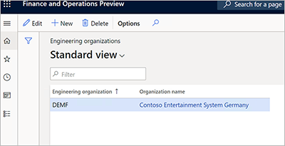

### Set up the version product dimension group

1. Go to **Product information management &gt; Setup &gt; Dimensions and variant groups &gt; Product dimension groups**.
1. Select **New** to create a product dimension group.
1. Set the **Name** field to *Version*.
1. Select **Save** to save the new dimension and load values onto the **Product dimensions** FastTab.
1. On the **Product dimensions** FastTab, set **Version** as an active product dimension.

    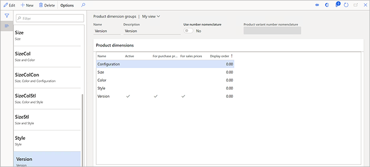

### Set up product lifecycle states

As an engineering product goes through its lifecycle, it's important that you be able to control which transactions are allowed for each lifecycle state. To set up the product lifecycle states, follow these steps.

1. Go to **Engineering change management &gt; Setup &gt; Product lifecycle state**.
1. Select **New** to add a lifecycle state, and set the following values for it:

    - **State:** *Operational*
    - **Description:** *Operational*

1. Select **Save** to save the new lifecycle state and load values onto the **Enabled business processes** FastTab.
1. On the **Enabled business processes** FastTab, select the business processes that should be available. For this example, leave the **Policy** field set to *Enabled* for all business processes.

    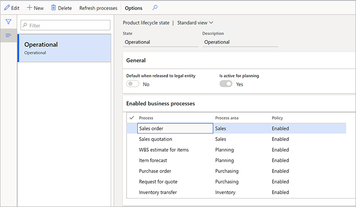

1. Select **New** to add another lifecycle state, and set the following values for it:

    - **State:** *Prototype*
    - **Description:** *Prototype*

1. Select **Save** to save the new lifecycle state and load values onto the **Enabled business processes** FastTab.
1. On the **Enabled business processes** FastTab, select the business processes that should be available. For this example, set the **Policy** field to *Enabled with warning* for all business processes.

     business processes for a lifecycle state")

### Set up a version number rule

1. Go to **Engineering change management &gt; Setup &gt; Product version number rule**.
1. Select **New** to add a rule, and set the following values for it:

    - **Name:** *Auto*
    - **Number rule:** *Auto*
    - **Format:** *V-\#\#*

    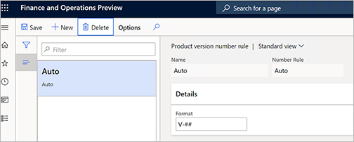

### Set up a product release policy

1. Go to **Engineering change management &gt; Setup &gt; Product release policies**.
1. Select **New** to add a release policy, and set the following values for it:

    - **Name:** *Components*
    - **Description:** *Components*

1. On the **General** FastTab, set the following values:

    - **Product type:** *Item*
    - **Apply templates:** *Always*
    - **Active:** *Yes*

1. On the **All products** FastTab, select **Add** to add a line, and set the following values for it:

    - **Company:** *DEMF*
    - **Template released product:** *D0006*

1. Select **Add** to add another line, and set the following values for it:

    - **Company accounts ID:** *USMF*
    - **Template released product:** *D0006*
    - **Receive BOM:** Select this check box.
    - **Copy BOM approval:** Select this check box.
    - **Copy BOM activation:** Select this check box.
    - **Receive route:** Select this check box.
    - **Copy route approval:** Select this check box.
    - **Copy route activation:** Select this check box.

    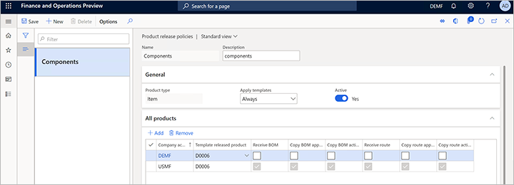

### Set up an engineering product category 

Engineering product categories provide the basis for creating engineering products (that is, products that are versioned and controlled through engineering change management). To set up engineering product categories, follow these steps.

1. Go to **Engineering change management &gt; Engineering product category details**.
1. Select **New** to create a category.
1. On the **Details** FastTab, set the following values:

    - **Name:** *Components*
    - **Engineering organization:** *DEMF*
    - **Product type:** *Item*
    - **Track version in transactions:** *Yes*
    - **Product dimension group:** *Version*
    - **Product lifecycle state at creation:** *Operational*
    - **Version number rule:** *Auto*
    - **Enforce effectivity:** *No*
    - **Use number rule nomenclature:** *No*
    - **Use name rule nomenclature:** *No*
    - **Use description rule nomenclature:** *No*

1. On the **Release policy** FastTab, set the **Product release policy** field to *Components*.
1. Select **Save**.

    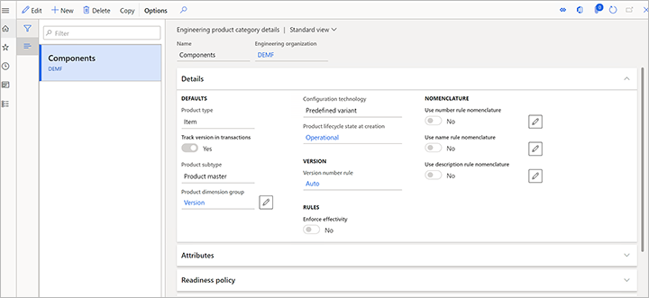

### Set up product acceptance conditions

1. Use the company picker on the right side of the navigation bar to switch to the *USMF* legal entity (company).
1. Go to **Engineering change management &gt; Setup &gt; Engineering change management parameters**.
1. On the **Release control** tab, in the **Product acceptance** section, set the **Product acceptance** field to *Manual*.

    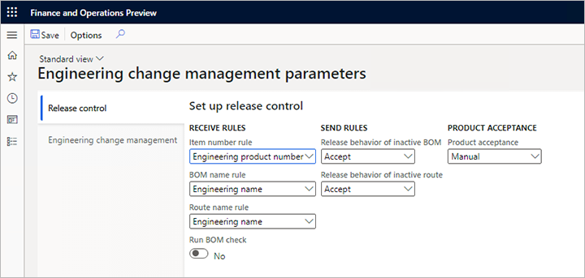

## Create a new engineering product

An engineering product is a product that is versioned and controlled through engineering change management. In other words, you can control the changes during its life, and the change information will be saved using engineering change orders. To create engineering products, follow these steps.

1. Make sure that you're in the legal entity of your engineering organization (*DEMF* for this example). Use the company picker on the right side of the navigation bar as required.
1. Open the **Released products** page by following one of these steps:

    - Go to **Product information management &gt; Products &gt; Released products**.
    - Go to **Engineering change management &gt; Common &gt; Released products**.

1. On the Action Pane, on the **Product** tab, in the **New** group, select **Engineering product**.
1. In the **New product** dialog box, set the following values:

    - **Engineering Product Category:** *Components*
    - **Product number:** *Z0001*
    - **Product name:** *Speaker set*

    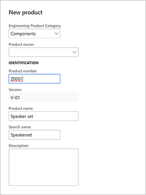

    Note that the **Version** field is automatically set by using the product version number rule that you set up earlier.

1. Select **OK** to create the product and close the dialog box.
1. The details page for the new product is opened. Notice that values are already filled in for some fields, such as **Storage dimension group**, **Tracking dimension group**, and/or **Item model group**. These fields were automatically set because the product is being released in the *DEMF* legal entity and uses the *Components* product release policy, which is associated with the *Components* engineering product category. Because you previously used item *D0006* as a template to set up a line for the *DEMF* legal entity, the values that were filled in were taken from item *D0006*.

    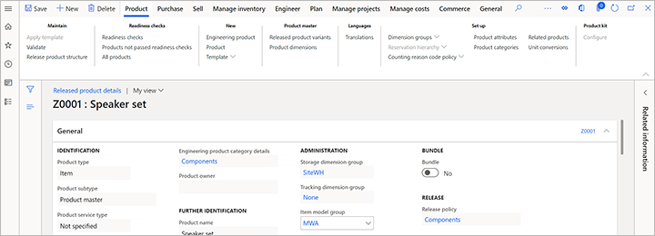

1. On the Action Pane, on the **Engineer** tab, in the **Engineering change management** group, select **Engineering versions** to view the versions of the product.

    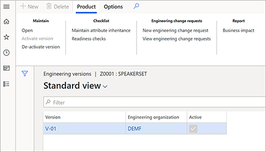

1. On the **Engineering versions** page, notice that there is only one version for the product, and it's active.
1. Select the version to view its details.

    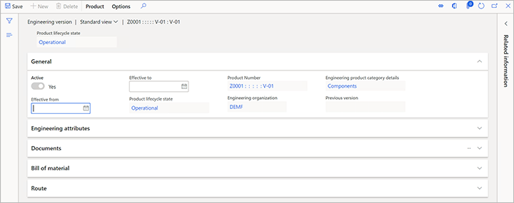

1. On the **Engineering version** page, on the **Bill of material** FastTab, select **Create BOM**.
1. In the **Create BOM** dialog box, set the following values:

    - **BOM number:** Z0001
    - **Name:** Speaker set
    - **Site:** 1

    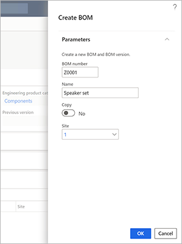

1. Select **OK** to add the BOM and close the dialog box.
1. On the **Bill of materials** FastTab, select **Bill of material**.
1. On the **Bill of materials** page, on the **Bill of materials lines** FastTab, add three lines, one each for item numbers *D0001*, *D0003*, and*D0006*.

    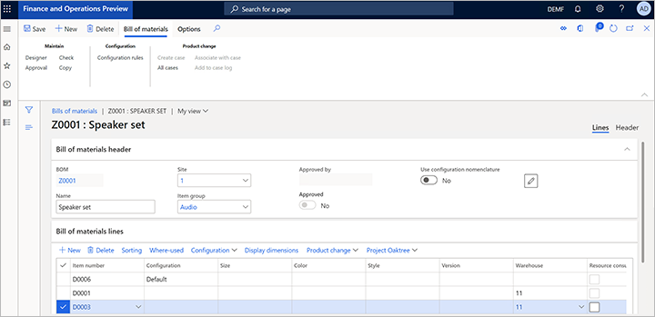

1. Select **Save**.
1. Close the page.
1. On the **Engineering version** page, on the **Bill of material** FastTab, select **Approve**.
1. In the dialog box that appears, select **OK**.

    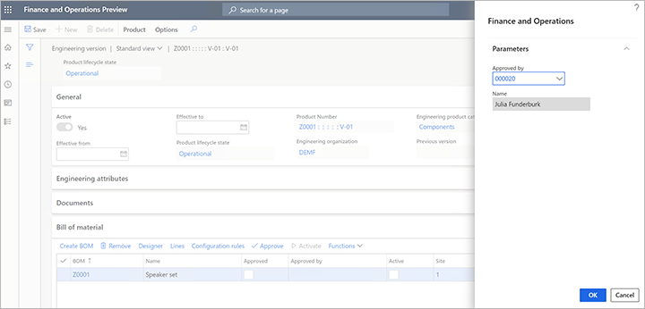

1. On the **Engineering version** page, on the **Bill of material** FastTab, select **Activate**.
1. Notice that the **Active** and **Approved** check boxes are selected for the BOM.

    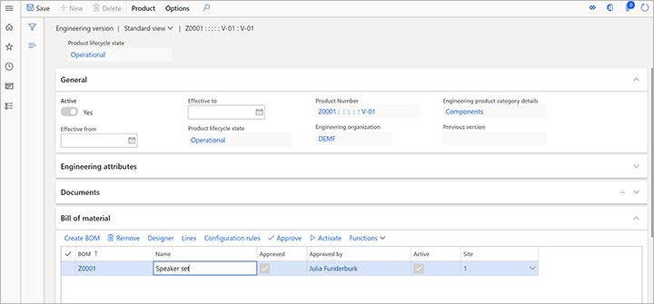

1. Close the page.

## Release an engineering product to a local company

The product has now been designed by the Engineering department. For this example, the product is a prototype that engineering has designed for a customer. Because the customer is a customer of the *USMF* legal entity, the product must be released to that legal entity.

1. Keep the legal entity set to *DEMF*. (Use the company picker on the right side of the navigation bar as required.)
1. Go to **Product information management &gt; Products &gt; Released products**.
1. Select product *Z0001*.
1. On the Action Pane, on the **Product** tab, in the **Maintain** group, select **Release product structure** to open the **Release products** wizard.
1. On the **Select engineering products to release** page, select the **Select** check box for product *Z0001*.

    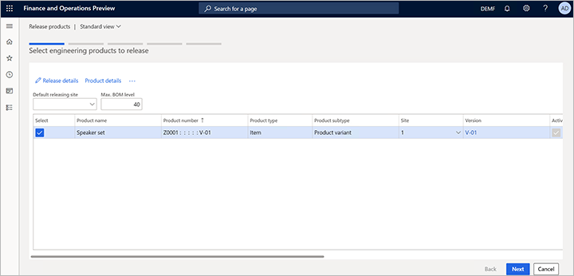

1. Select **Release details**.
1. The **Product release details** page appears, where you can review the details of the product that will be released, and its product structure. Notice that the **Send BOM** option is set to *Yes*. Therefore, both product *Z0001* and all its child items from the BOM will be released.

    You can select any child item in the left pane to review its details. If any child item has a BOM, you can also select to release the BOM of that child item.

    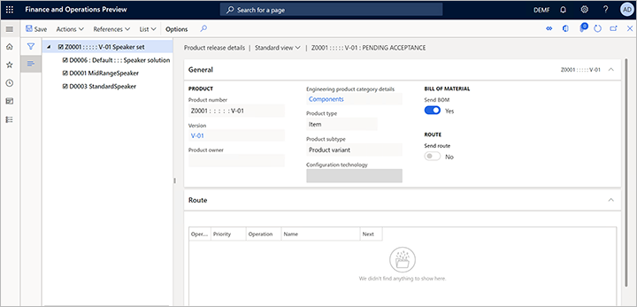

1. Close the page to return to the **Release products** wizard.
1. Select **Next** to open the **Select products to release** page. If you had selected any standard (non-engineering) products, they would appear on this page. Note that when you release a standard product by selecting **Release product structure**, its BOM and route are also released.

    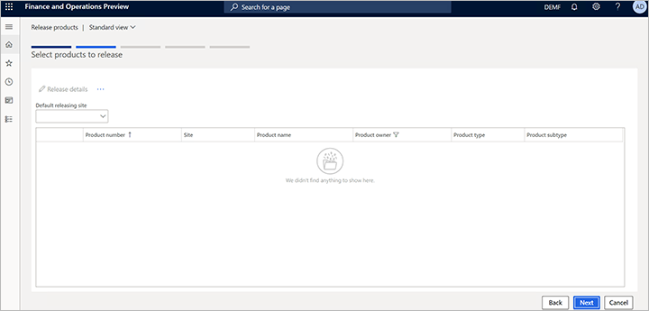

1. Select **Next** to open the **Select product variants to release** page. For this example, there aren't any variants.
1. Select **Next** to open the **Select companies** page.
1. Select the companies that the product should be released to. For this example, select the check box for **USMF**.

    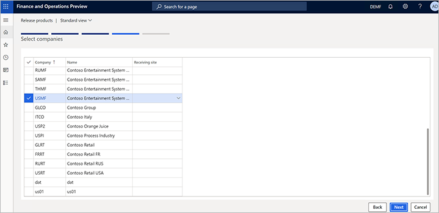

1. Select **Next** to open the **Confirm selection** page.
1. Select **Finish**.

## Review and accept the product before you release it in the local company

The Engineering department has now released the information to the local companies where the product will be used. For this example, the local company is *USMF*.

Because you set the **Product acceptance** field to *Manual* on the **Engineering change management parameters** page for the *USMF* company, products must be manually accepted before they are released to that company. In other words, they must be reviewed and accepted before they become released products.

To review the product and release it in the *USMF* company, follow these steps.

1. Set the legal entity to *USMF*. (Use the company picker on the right side of the navigation bar.)
1. Go to **Engineering change management &gt; Common &gt; Product releases &gt; Open product releases**.

    The **Open product releases** page shows product *Z0001*, which has a status of *Pending acceptance*.

    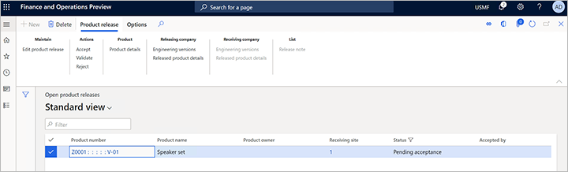

1. Select the value in the **Product number** column to open the **Product release details** page. Notice the following details:

    - The **General** FastTab shows information about the product release, such as the releasing company (*DEMF* for this example), the releasing site (*1*), and the receiving site (*1*). Because you didn't specify a receiving site in the **Release products** wizard, the the releasing site value is copied to the receiving site.
    - The **Release details** FastTab shows information about the product and the version that was released. Here, you can modify settings such as the effectivity dates.
    - The **Route** FastTab shows the route of the product. However, for this example, you didn't release any routes.

    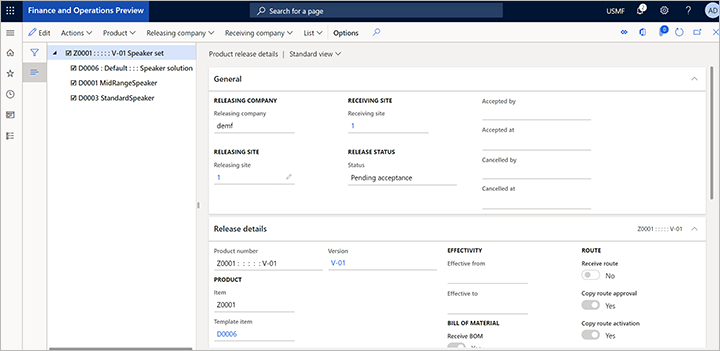

1. When you've finished reviewing the information, you're ready to accept the product and, in this way, release it in the *USMF* company. On the Action Pane, select **Actions &gt; Accept**.
1. The product is now released in the *USMF* company. Go to **Product information management &gt;Products &gt; Released products**. You should see item *Z0001*.

## Use the product in transactions in the local company

The master data manager for the *USMF* company wants to make sure that the product is in a *Prototype* state, to ensure that users will be warned if they accidentally add it to processes that they are working on.

1. Go to **Product information management &gt; Products &gt; Released products**.
1. Select product *Z0001* to open its details page. (You can use the filter to find the product.)
1. On the Action Pane, on the **Engineer** tab, in the **Engineering change management** group, select **Engineering versions**.
1. On the **Engineering versions** page, select version number *V-01* to open its details page.
1. On the Action Pane, on the **Product** tab, in the **Lifecycle state** group, select **Change lifecycle state**.
1. In the **Change lifecycle state** drop-down dialog box, set the **State** field to *Prototype*, and then select **OK**.

    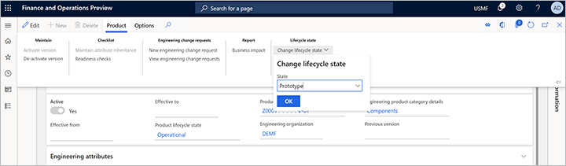

## Add the engineering product to a sales order

The product can now be sold to a customer. To add the product to a sales order, follow these steps.

1. Go to **Sales and marketing &gt; Sales orders &gt; All sales orders**.
1. On the Action Pane, select **New**.
1. In the **Create sales order** dialog box, set the **Customer account** field to *US-0002*, and then select **OK**.
1. The new sales order is opened. On the **Sales order lines** FastTab, add a row, and set the **Item number** field to *Z000* for it.
1. On the Action Pane, select **Save**.

    You receive a warning message that informs you that the item has a status of *Prototype*. However, because the message is just a warning, the sales order was still created.

    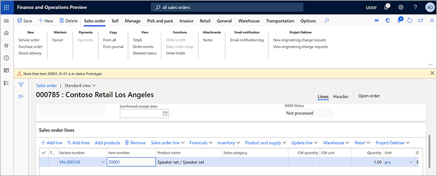

## Request changes in the engineering product

The product was sent to a customer, but the customer wasn't completely satisfied and provides feedback that includes suggestions for improvement. While the customer is speaking with a sales clerk on the phone, the sales clerk can request the changes that the customer is describing.

1. Go to **Sales and marketing &gt; Sales orders &gt; All sales orders**.
1. Find and open the sales order that you created in the previous exercise.
1. On the **Sales order lines** FastTab, select **Engineering change management &gt; New engineering change request**.

    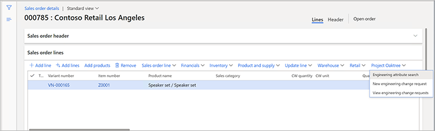

1. Fill in the engineering change request, based on the customer's feedback. For this example, set the following values:

    - **Change request:** *555*
    - **Title:** *Z0001 customer change*
    - **Priority:** *low*
    - **Category:** set change
    - **Severity:** *Medium*

1. On the **Information** FastTab, select **New &gt; Note** to add a note to the grid.
1. In the **Description** field for the new note, indicate that item *D0003* should be deleted from the BOM. If you must add more information for the note, you can enter text in the **Notes** field.

    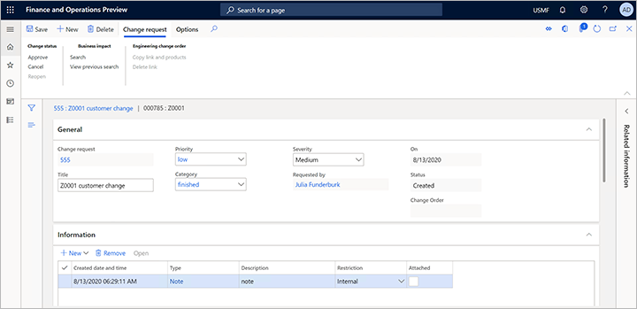

1. On the Action Pane, select **Save**.
1. Notice that the item has automatically been added on the **Products** FastTab, and that the source of the engineering change request (the sales order) has been added on the **Source** FastTab.

## Make changes to the product by using an engineering change order

The sales clerk knows that the product is important and was designed especially for the customer. Therefore, the sales clerk calls an engineer in the *DEMF* company to notify them about the change request. In this way, the engineer can speed up the process.

The engineer now reviews the request from the customer and creates a change order for the product.

1. Because the engineer works in the *DEMF* company, set the legal entity to *DEMF*. (Use the company picker on the right side of the navigation bar.)
1. Go to **Engineering change management &gt; Common &gt; Engineering change requests**.
1. Open change request *555*.
1. Review the information, and then approve the change. On the Action Pane, on the **Change request** tab, in the **Change status** group, select **Approve**.
1. Go to **Engineering change management &gt; Common &gt; Engineering change orders**.
1. On the Action Pane, select **New** to create a change order, and set the following values for it:

    - **Change order:** *555*
    - **Title:** *Z0001 customer change*
    - **Category:** *Customer change*
    - **Priority:** *Low*
    - **Severity:** *Medium*

1. On the **Impacted products** FastTab, select **New &gt; Add existing product** to add a row to the grid, and set the following values for it:

    - **Product:** *Z0001*
    - **Impact:** *New version*

    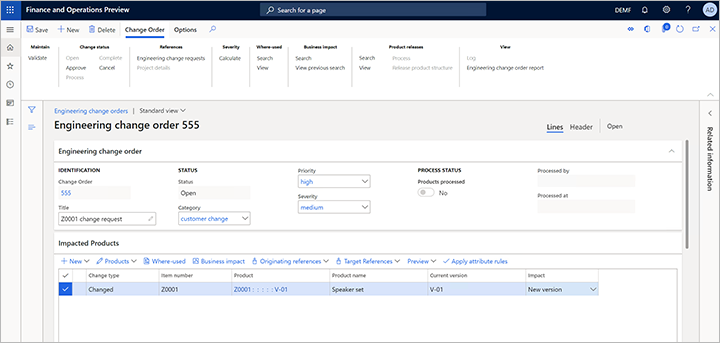

1. Notice that, because you set the **Impact** field to *New version*, the **New version** field on the **Details** tab of the **Product details** FastTab shows what the new version number will be (*V-02* for this example).

    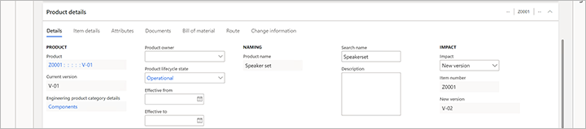

1. On the Action Pane, select **Save**.
1. On the **Product details** FastTab, on the **Bill of material** tab, select **Lines** to open the BOM for version *V-01* of product *Z0001*.

    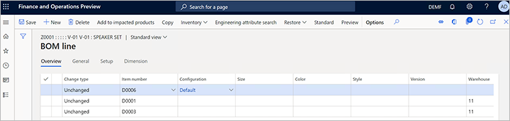

1. Select the line for item number *D0003*, and then, on the Action Pane, select **Delete**. The value of the **Change type** field for this line changes to *Deleted*.
1. On the Action Pane, select **Save**.

    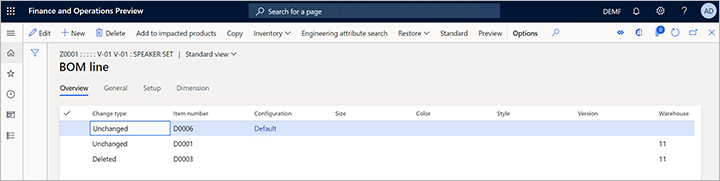

1. Close the **BOM line** page to return to the **Engineering change order** page.
1. On the **Product details** FastTab, on the **Bill of material** tab, notice that the value of the **Change type** field for BOM *Z0001* is now *Changed*.

    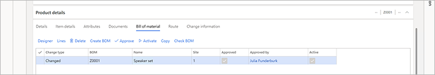

    The order must now be approved before the changes can be processed. When the changes are processed, the products are updated with the changes that are included in the engineering change order. For this example, the person who creates the engineering change order has been specified as the approver.

1. On the Action Pane, on the **Change order** tab, in the **Change status** group, select **Approve**.
1. Select **Process** to update the product's information.

## Release the changed product

The product can now be released again to the *USMF* company and then sent to the customer. To release the product directly from the engineering change order, follow these steps.

1. Open the engineering change order that you created in the previous exercise, if it isn't already open.
1. On the Action Pane, on the **Change order** tab, in the **Product releases** group, select **Search**.
1. The search results show which companies the affected products have been released to. Close the search results.
1. On the Action Pane, on the **Change order** tab, in the **Product releases** group, select **View** to open the **Releases** dialog box, where you can view the results of the previous search.
1. Select each company that you want to release products to.
1. Select **OK** to close the **Releases** dialog box and return to the change order.
1. On the Action Pane, on the **Change order** tab, in the **Product releases** group, select **Process** to release the affected products to the selected companies. Alternatively, select **Release product structure** to start the release process.

## Complete the change order

To mark the change order as completed, which indicates that no further actions remain, select **Complete** on the Action Pane.

[!INCLUDE[footer-include](../../includes/footer-banner.md)]
