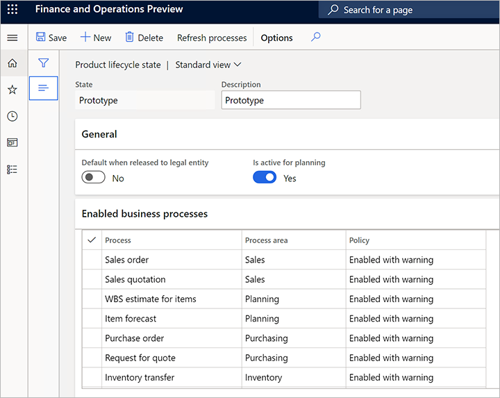

---
# required metadata

title: Engineering change management feature walkthrough
description: This topic provides an end-to-end walkthrough of how to work with engineering change management. 
author: t-benebo
manager: tfehr
ms.date: 09/28/2020
ms.topic: article
ms.prod: 
ms.service: dynamics-ax-applications
ms.technology: 

# optional metadata

# ms.search.form:  [Operations AOT form name to tie this topic to]
audience: Application User
# ms.devlang: 
ms.reviewer: kamaybac
ms.search.scope:  Core, Operations
# ms.tgt_pltfrm: 
# ms.custom: [used by loc for topics migrated from the wiki]
ms.search.region: Global
# ms.search.industry: [leave blank for most, retail, public sector]
ms.author: benebotg
ms.search.validFrom: 2020-09-28
ms.dyn365.ops.version: Release 10.0.15
---

# Engineering change management feature walkthrough

[!include [banner](../includes/banner.md)]

This topic provides an end-to-end walkthrough of how to work with engineering change management. It steps through each of the most important scenarios, including:

- Basic feature configuration.
- How an engineering company creates a new engineering product.
- How the engineering company releases an engineering product to a local company.
- How the local company can review and accept a product that has been released to them by the engineering company.
- How the local company can use an engineering product in standard transactions.
- How to add an engineering product to a sales order.
- How to request changes to an engineering product by creating an engineering change request.
- How schedule and implement requested changes by creating an engineering change order.
- How to release the changed product.

The exercises in this topic are all built using the standard sample data provided for Supply Chain Management. The exercises also build on each other, so we recommend you work through them from start to finish to gain a complete understanding of the engineering change management feature, especially if you have never used it before.

## Set up for the sample scenario

To follow the sample scenario provided in this topic, you must first prepare the feature by enabling demo data and adding a few custom records.

Follow all the instructions in this section and its subsections before you try to do any of the exercises in the remainder of this topic. This section also introduces several important settings pages that you'll use when setting up engineering change management for your own organization.

### Enable standard demo data

Work on a system that has the [standard demo data installed](../../fin-ops-core/dev-itpro/deployment/deploy-demo-environment.md). This adds demo data for several demo legal entities (companies and organizations). As you work through the sample scenarios, you'll use the company picker at the right side of the navigation bar to move between one company set up as an *engineering organization* (DEMF) and another one set up as an *operational organization* (USMF)

### Set up an engineering organization

The engineering organization owns the engineering data and is responsible for the product design and change. You must specify your engineering organization(s) doing the following:

1. Go to **Engineering change management&gt; Setup &gt; Engineering organizations**.

1. Select **New** to add a new row to the grid and make the following settings for it:

    - **Engineering organization** – Enter *DEMF*.
    - **Organization name** – Select *Contoso Entertainment System Germany* (DEMF).

    

### Set up the version product dimension group

1. Go to **Product information management &gt; Setup &gt; Dimensions and variant groups &gt; Product dimension groups**.

1. Select **New** to create a new product dimension group set **Name** to *Version*.

1. Select **Save** to save the new dimension and load values into the **Product dimensions** FastTab.

1. On the **Product dimensions** FastTab, set **Version** as an active version dimension.

    

### Set up product lifecycle states

As an engineering product traverses through its lifecycle, it's important that you can control which transactions are allowed per lifecycle state. To set up the product lifecycle states, follow these steps:

1. Go to **Engineering change management &gt; Setup &gt; Product lifecycle state**.

1. Select **New** to add a new lifecycle state and enter the following values for it:

    - **State** – *Operational*

    - **Description** – *Operational*

1. Select **Save** to save the new lifecycle state and load values into the **Enabled business processes** FastTab.

1. Select which business processes to enable. In this case, leave **Policy** set to *Enabled* for all business processes.

    

1. Select **New** to add another lifecycle state and enter the following values for it:

    - **State** – *Prototype*
    - **Description** – *Prototype*

1. Select **Save** to save the new lifecycle state and load values into the **Enabled business processes** FastTab.

1. Select which business processes to enable. This time, set **Policy** to *Enabled with warning* for all business processes.

    

### Set up a version number rule

Do the following:

1. Go to **Engineering change management &gt; Setup &gt; Product version number rule**.

1. Select **New** to add a new rule and enter the following values for it:

    - **Name** – *Auto*
    - **Number rule** – *Auto*
    - **Format** – *V-\#\#*

    

### Set up a product release policy

Do the following:

1. Go to **Engineering change management &gt; Setup &gt; Product release policies**.

1. Select **New** to add a new release policy and enter the following values for it .

    - **Name** – *Components*
    - **Description** – *Components*

1. On the **General** FastTab, make the following settings:

    - **Product type** – *Item*
    - **Apply templates** – *Always*
    - **Active** – *Yes*

1. On the **All products** FastTab, select **Add** on the toolbar to add a line and make the following settings for it:

    - **Company** – *DEMF*
    - **Template released product** – *D0006*

1. Select **Add** to add another line and make the following settings for it:

    - **Company accounts ID** – *USMF*
    - **Template released product** – *D0006*
    - **Receive BOM** – Select this check box.
    - **Copy BOM approval** – Select this check box.
    - **Copy BOM activation** – Select this check box.
    - **Receive route** – Select this check box.
    - **Copy route approval** – Select this check box.
    - **Copy route activation** – Select this check box.

    

### Set up an engineering product category 

Engineering product categories provide the basis for creating engineering products, which are products that are versioned and controlled with engineering change management.

1. Go to **Engineering change management &gt; Engineering product category details**.

1. Create a new category by selecting **New**.

1. On the **Details** FastTab, make the following settings:

    - **Name** – *Components*
    - **Engineering organization** – *DEMF*
    - **Product type** – *Item*
    - **Track version in transactions** – *Yes*
    - **Product dimension group** – *Version*
    - **Product lifecycle state at creation** – *Operational*
    - **Version number rule** – *Auto*
    - **Enforce effectivity** – *No*
    - **Use number rule nomenclature** – *No*
    - **Use name rule nomenclature** – *No*
    - **Use description rule nomenclature** – *No*

1. On the **Release policy** FastTab, set **Product release policy** to *Components*.

1. Select **Save**.

    

### Set up product acceptance conditions

Do the following:

1. Set the **Legal entity** to *USMF* (use the company picker at the right side of the top navigation bar).

1. Go to **Engineering change management &gt; Setup &gt; Engineering change management parameters**.

1. Open the **Release control** tab.

1. Under the group **Product acceptance**, set the field **Product acceptance** to *Manual*.

    

## Create a new engineering product

An engineering product is a product that is versioned and controlled through engineering change management. In other words, you will be able to control the changes during its life and the change information will be kept with engineering change orders. To create an engineering product, follow these steps:

1. Make sure you are in the **Legal entity** of your engineering organization, in this case *DEMF* (use the company picker at the right side of the top navigation bar).

1. Go to the **Released products** form by doing one of the following:

    - Go to **Product information management &gt; Products &gt; Released products**.

    - Go to **Engineering change management &gt; Common &gt; Released products**.

1. On the Action Pane, open the **Product** tab. Then, from the **New** group, select **Engineering product**.

1. The **New product** dialog box opens. Make the following settings:

    - **Engineering Product Category** – *Components*
    - **Product number** – *Z0001*
    - **Product name** – *Speaker set*

    

    Note that **Version** is automatically filled in using the product number version rule we established earlier.

1. Select **OK** to create the product and close the dialog box.

1. The details page for your new product opens. Notice that some values are already filled in, such as the **Storage dimension group**, **Tracking dimension group** and/or **Item model group**. This is done automatically because the product is released in DEMF and uses the product release policy *Components* (which is associated with the Engineering product category *Components*). We previously set up a line for DEMF using item*D0006* as a template, so these values are defaulted from item *D0006*.

    

1. On the Action Pane, open the **Engineer** tab. Then, from the **Engineering change management** group, select **Engineering versions** to view the versions of the product.

    

1. As you can see, there is only one version for the product, and it is active.

1. Select the version to view its details.

    

1. Expand the **Bill of material** FastTab, and then select **Create BOM** from its toolbar.

1. The **Create BOM** dialog box opens. Make the following settings:

    - **BOM number** – Z0001
    - **Name** – Speaker set
    - **Site** – 1

    

1. Select **OK** to add the BOM and close the dialog box.

1. Select **Lines** from the **Bill of material** toolbar to open the **Bill of materials** page. On the Bill of materials FastTab, add three lines—one each for **Item number** *D0001*, *D0003* and*D0006*.

    

1. Select **Save**.

1. Close the page.

1. On the **Bill of material** toolbar, select **Approve**.

1. A dialog box opens. Select **OK**.

    

1. On the **Bill of material** toolbar, select **Activate**.

1. Now you can see that the BOM is **Active** and **Approved**.

    

1. Close the page.

## Release the engineering product to the local company

The product is now designed by the engineering department. In this case, it's a product is a prototype that engineering has designed for a customer. The customer is a customer of the legal entity USMF, therefore the product must be released to USMF.

1. Keep the **Legal entity** set to *DEMF* (use the company picker at the right side of the top navigation bar if needed).

1. Go to **Product information management &gt; Products &gt; Released products**.

1. Select the product *Z0001*.

1. On the Action Pane, open the **Product** tab. Then, from the **Maintain** group, select **Release product structure**. The **Release products** wizard launches.

1. Mark the **Select** check box for product *Z0001*.

    

1. Select **Release details**.

1. The **Product release details** page opens.

    - On this page, you can review the details of the product that will be released and its product structure.
    - Notice that **Send BOM** is set to *Yes*, which means that both product Z0001 and all of its child items from the BOM will be released.
    - You can select any of the child items to review its details. If any of the child items had a BOM, you could also choose to release the BOM of those child items.

    

1. Close the page to return to the **Release products** wizard.

1. Select **Next** to open the **Select products to release** page. On this page of the wizard, you would be able to see if you had selected any standard (non-engineering) products. Note that when you release a standard product using **Release product structure**, its BOM and route are also released.

    

1. Select **Next** to open the **Select product variants to release** page. We don't have any variants in this example.

1. Select **Next** to open the **Select companies** page.

1. Select the companies the product will be released to. Select the check box for **USMF**.

    

1. Select **Next** to open the **Confirm selection** page.

1. Select **Finish**.

## Review and accept the product before release at the local company

The engineering department has now released the information to the local companies where the product will be used. In this case to USMF.

Because we set **Product acceptance** to *Manual* in the**Engineering change management parameters** for company USMF, the products must be manually accepted before they are released to USMF. In other words, the product must be reviewed and accepted before it becomes a released product. Let's review the product and release it in USMF:

1. Set the **Legal entity** to *USMF* (use the company picker at the right side of the top navigation bar).

1. Go to **Engineering change management &gt; Common &gt; Product releases &gt; Open product releases**.

1. Product Z0001 is shown here with a **Status** of *Pending acceptance*.

    

1. Select the value in the **Product number** column to open its **Product release details**.

    - The **General** FastTab shows information about the product release, such as the **Releasing company** and **Releasing site** (*DEMF*, site*1*) and the**Receiving site** (*1*). Because we didn't specify a site in the release wizard, the site from the releasing site is copied over.
    - The **Release details** FastTab shows information about the product and the version released. Here you can modify settings such as the effectivity dates, for example.
    - The **Route** FastTab shows the route of the product, but in this case, we didn't release any routes.

    

1. Now that you have reviewed the information, you are ready to accept the product, and thereby release it in USMF. On the Action Pane, select **Actions &gt; Accept**.

1. The product is now released on USMF. Go to **Product information management &gt;Products &gt; Released products** and you will be able to see item Z0001.

## Use the product in transactions at the local company

The master data manager for USMF wants to make sure that the product is in a prototype state to ensure that users will be warned if they accidentally add it to a processes they are working on.

1. Go to **Product information management &gt; Products &gt; Released products**.

1. Select the product Z0001 to open its product details page (you can use the filter to find it).

1. On the Action Pane, open the **Engineer** tab and then, from the **Engineering change management** group, select **Engineering versions**.

1. The **Engineering versions** page opens. Select the version number V-01 to open the version details page.

1. On the Action Pane, open the **Product** tab and then, from the **Lifecycle state** group, select **Change lifecycle state**. The **Change lifecycle state** drop-down dialog box opens.

    

1. The **Change lifecycle state** drop-down dialog box opens. Set the **State** to *Prototype* and select**OK**.

## Add the engineering product to a sales order

The product can now be sold to a customer. To add the product to a sales order:

1. Go to **Sales and marketing &gt; Sales orders &gt; All sales orders**.

1. On the Action Pane, select **New**.

1. The **Create sales order** dialog box opens. Set **Customer account** to *US-0002* and select**OK**.

1. Your new sales order opens. On the **Sales order lines** FastTab, add a row and set its **Item number** to *Z000*.

1. On the Action Pane, select **Save**.

1. The message bar shows a warning that tells you that the item has a status of prototype. However, it is just a warning, so the sales order was still created.

    

## Request changes in the engineering product

The product was sent to a customer, but the customer wasn't completely satisfied and returned feedback with suggestions for improvement. The salesclerk, while talking with the customer on the phone, can request the changes that the customer is describing by doing the following:

1. Go to **Sales and marketing &gt; Sales orders &gt; All sales orders**.

1. Find and open the sales order you created for the previous exercise.

1. From the **Sales order lines** toolbar, select **Engineering change management &gt; New engineering change request**.

    

1. Now the salesclerk fills in the engineering change request page based on the customer feedback. Make the following settings:

    - **Change request** – *555*
    - **Title** – *Z0001 customer change*
    - **Priority** – *low*
    - **Category** – set change
    - **Severity** – *Medium*

1. On the **Information** FastTab, select **New &gt; Note** from the toolbar to add a new note to the grid. In the **Description** column for the new note, indicate that item D0003 should be deleted from the BOM. You can add more information for the selected row by entering text in the **Notes** field if needed.

    

1. On the Action Pane, select **Save**.

1. Notice that the item has been automatically added on the **Products** FastTab and the source of the engineering change request (the sales order) has been added on the **Source** FastTab.

## Make changes to the product using an engineering change order

Because the salesclerk knows this product is important and designed especially for the customer, the salesclerk calls an engineer at DEMF to make them aware of the change request so the engineer can speed up the process.

The engineer will now review the request by the customer and make a change order for the product.

1. The engineer works at DEMF, so set the **Legal entity** to *DEMF* (use the company picker at the right side of the top navigation bar).

1. Go to **Engineering change management &gt; Common &gt; Engineering change requests**.

1. Open change request 555.

1. The engineer reviews the information and approves the change. On the Action Pane, open the **Change request** tab and then, from the **Change status** group, select **Approve**. The **Change lifecycle state** drop-down dialog box opens.

1. Now the engineer must create a new engineering change order. Go to **Engineering change management &gt; Common &gt; Engineering change orders**.

1. On the Action Pane, select **New** to create a new change order and make the following settings for it:

    - **Change order** – *555*
    - **Title** – *Z0001 customer change*
    - **Category** – *Customer change*
    - **Priority** – *Low*
    - **Severity** – *Medium*

1. On the **Impacted products** FastTab, select **New &gt; Add existing product** to add a new row to the grid and then make the following settings for it:

    - **Product** – *Z0001*
    - **Impact** – *New version*

    

1. Notice that because **Impact** was set to *New version*, on the**Product details** FastTab, you can open the **Details** tab to see what the **New version** will be (in this case, *V-02*).

    

1. On the Action Pane, select **Save**.

1. On the **Product details** FastTab, open the **Bill of material** tab and select **Lines** from its toolbar. The BOM for Z0001 V-01 is shown.

    

1. Select the line with **Item number** *D0003* and select**Delete** on the Action Pane. The **Change type** for this line changes to *Deleted*.

1. Select **Save** on the Action Pane.

    

1. Close the **BOM line** page to go back to the **Engineering change order** page.

1. On the **Product details** FastTab, open the **Bill of material** tab. Note that **BOM** *Z0001* now shows a **Change type** of *Changed*.

    

1. Now the order must be approved before the changes can be processed. When the changes are processed, the products are updated with the changes included in the engineering change order. In this demo, the approver has been set as the person that creates the engineering change order.

1. On the Action Pane, open the **Change order** tab and then, from the **Change status** group, select **Approve**.

1. Still on the **Change order** tab, from the **Change status** group, select **Process** to update the product's information.

1. Still on the **Change order** tab, from the **Change status** group, select **Complete** to mark the change order as complete.

## Release the changed product

Now the product can be released again to USMF and then sent to the customer. You can release it directly from the engineering change order using the following steps:

1. Open the engineering change order you created for the previous exercise if it isn't already.

1. On the Action Pane, open the **Change order** tab and then, from the **Product releases** group, select **Search**.

1. The search results show you which companies the impacted products have been released to.

1. Close the search results.

1. Still on the **Change order** tab, from the **Product releases** group, select **View** to open the **Releases** dialog box, where you can view the results of the previous search.

1. Select each company that you want to release to.

1. Select **OK** to close the **Releases** dialog box to return to the change order.

1. On the Action Pane, open the **Change order** tab and then, from the **Product releases** group, select **Process** to release the impacted products to the companies you selected on the **Releases** dialog box. Or use **Release product structure** to launch the release process.
