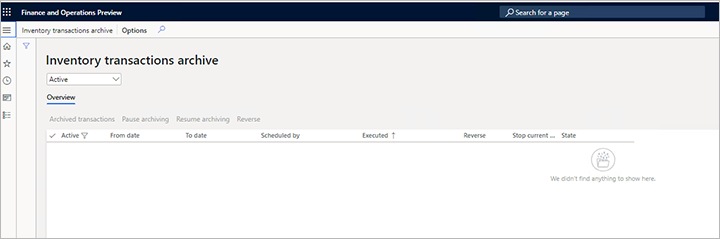
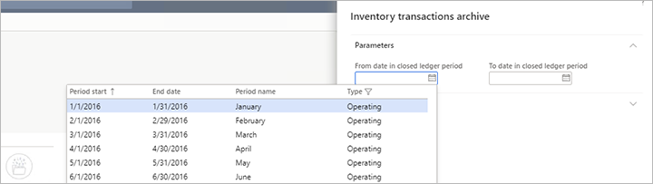
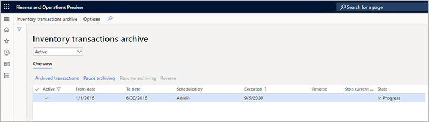
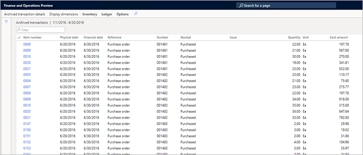

---
# required metadata

title: Archive inventory transactions
description: This article describes how to archive inventory transaction data to help improve system performance.
author: yufeihuang
ms.date: 05/10/2022
ms.topic: article
ms.prod: 
ms.technology: 

# optional metadata

ms.search.form: InventTransArchiveProcessForm
audience: Application User
# ms.devlang: 
ms.reviewer: kamaybac
# ms.tgt_pltfrm: 
# ms.custom: [used by loc for articles migrated from the wiki]
ms.search.region: Global
# ms.search.industry: [leave blank for most, retail, public sector]
ms.author: yufeihuang
ms.search.validFrom: 2021-03-01
ms.dyn365.ops.version: 10.0.18
---
# Archive inventory transactions

[!include [banner](../../includes/banner.md)]

Over time, the inventory transactions table (`InventTrans`) will continue to grow and consume more database space. Therefore, queries that are made against the table will gradually become slower. This article describes how you can use the *Inventory transactions archive* feature to archive data about inventory transactions to help improve system performance.

> [!NOTE]
> Only financially updated inventory transactions can be archived in a selected closed ledger period. To be archived, financially updated outbound inventory transactions must have an issue status of *Sold*, and inbound inventory transactions must have a receipt status of *Purchased*.

When you archive inventory transactions, all related transactions are moved to the `InventTransArchive` table. Inventory issue transactions and inventory receipt transactions are archived separately, based on the combination of the item ID (`itemId`) and inventory dimension ID (`inventDimId`), and they are put into the summarized issue and summarized receipt transactions.

If an `itemId` and `inventDimId` combination contains only one receipt or issue transaction, the transaction won't be archived.

## Turn on the feature in your system

If your system doesn't already include the features that is described in this article, go to [Feature management](../../fin-ops-core/fin-ops/get-started/feature-management/feature-management-overview.md), and turn on the *Inventory transactions archive* feature. Note that this feature cannot be disabled once it has been enabled.

## Things to consider before you archive inventory transactions

Before you archive inventory transactions, you should consider the following business scenarios, because they will be affected by the operation:

- When you audit inventory transactions from related documents, such as purchase order lines, they will be shown as archived. To review the archived transactions, you must go to **Inventory management \> Periodic tasks \> Clean up \> Inventory transactions archive**.
- Inventory closing can't be canceled for archived periods. 
- Standard cost conversion can't be done for archived periods. 
- Inventory reports that are sourced from inventory transactions will be affected when you archive inventory transactions. These reports include the inventory aging report and inventory value reports.
- Inventory forecasts might be affected if they are run during the time horizon of archived periods.

## Prerequisites

Inventory transactions can be archived only during periods where the following conditions are met:

- The ledger period must be closed.
- Inventory closing must be run on or after the to-period date of the archive.
- The period must be at least one year before the from-period date of the archive.
- There must not be any existing inventory recalculations.

## Archive inventory transactions

To archive inventory transactions, follow these steps.

1. Go to **Inventory management** \> **Periodic tasks** \> **Clean up** \> **Inventory transaction archive**.

    The **Inventory transactions archive** page appears and shows a list of archived process records.

    

1. On the Action Pane, select **Inventory transactions archive** to create an inventory transaction archive.
1. In the **Inventory transactions archive** dialog box, on the **Parameters** FastTab, set the following fields:

    - **From date in closed ledger period** – Select the earliest transaction date to include in the archive.
    - **To date in closed ledger period** – Select the latest transaction date to include in the archive.

    

    > [!NOTE]
    > Only periods that meet the [prerequisites](#prerequisites) will be available for selection.

1. On the **Run in the background** FastTab, set up batch processing details as you require. Follow the usual steps for batch jobs in Microsoft Dynamics 365 Supply Chain Management.
1. Select **OK**.
1. You receive a message that prompts you to confirm that you want to continue. Read the message carefully, and then select **Yes** if you want to continue.

    You receive a message that states that your inventory transactions archive job has been added to the batch queue. The job will now start to archive inventory transactions from the selected period.

## View archived inventory transactions

The **Inventory transactions archive** page shows your full archiving history. Each row in the grid shows information such as the date when the archive was created, the user who created it, and its status.



In the drop-down list at the top of the page select one of the following values to filter the archives that are shown in the grid:

- **Active** – Show only active archives.
- **All** – Show all archives.

For each archive in the grid, the following information is provided:

- **Active** – A check mark indicates that the archive is active.
- **From date** – The date of the oldest transaction that can be included in the archive.
- **To date** – The date of the latest transaction that can be included in the archive.
- **Scheduled by** – The user account that created the archive.
- **Executed** – The date when the archive was created.
- **Stop current update** – A check mark indicates that the archive is in progress, but it has been paused.
- **State** – The processing status of the archive. The possible values are *Waiting*, *In progress*, and *Finished*.

The toolbar above the grid provides the following buttons that you can use to work with a selected archive:

- **Archived transactions** – View the full details of the selected archive. The **Archived transactions** page that appears shows all the transactions in the archive.

    

    To view more information about a specific transaction on the **Archived transactions** page, select it in the grid, and then, on the Action Pane, select **Archived transaction details**. The **Archived transaction details** page that appears shows information such as the ledger posting, related subledger references, and financial dimensions.

- **Pause archiving** – Pause a selected archive that is currently being processed. The pause takes effect only after the archiving task has been generated. Therefore, there might be a short delay before the pause takes effect. If an archive has been paused, a check mark appears in its **Stop current update** field.
- **Resume archiving** – Resume processing for a selected archive that is currently paused.

## Extend your code to support custom fields

If the `InventTrans` table contains one or more custom fields, then you may need to extend the code to support them, depending on how they are named.

- If the custom fields from the `InventTrans` table have the same field names as in the `InventtransArchive` table, that means they are 1:1 mapped. Therefore, you can just put the custom fields into the `InventoryArchiveFields` fields group of the `inventTrans` table.
- If the custom field names in the `InventTrans` table don't match the field names in the `InventtransArchive` table, then you need to add code to map them. For example, if you have a system field called  `InventTrans.CreatedDateTime`, then you must create a field in the `InventTransArchive` table with a different name (such as `InventtransArchive.InventTransCreatedDateTime`) and add extensions to the `InventTransArchiveProcessTask` and  `InventTransArchiveSqlStatementHelper` classes, as shown in the following sample code.

The following sample code shows an example of how to add the required extension to the `InventTransArchiveProcessTask` class.

```xpp
[ExtensionOf(classStr(InventTransArchiveProcessTask))]
Final class InventTransArchiveProcessTask_Extension
{

    protected void addInventTransFields(SysDaSelection _selectionObject)
    {
        _selectionObject.add(fieldStr(InventTrans, ModifiedBy))
            .add(fieldStr(InventTrans, CreatedBy)).add(fieldStr(InventTrans, CreatedDateTime));

        next addInventTransFields(_selectionObject);
    }


    protected void addInventTransArchiveFields(SysDaSelection _selectionObject)
    {
        _selectionObject.add(fieldStr(InventTransArchive, InventTransModifiedBy))
            .add(fieldStr(InventTransArchive, InventTransCreatedBy)).add(fieldStr(InventTransArchive, InventTransCreatedDateTime));

        next addInventTransArchiveFields(_selectionObject);
    }
}
```

The following sample code shows an example of how to add the required extension to the `InventTransArchiveSqlStatementHelper` class.

```xpp
[ExtensionOf(classStr(InventTransArchiveSqlStatementHelper))]
final class InventTransArchiveSqlStatementHelper_Extension
{
    private str     inventTransModifiedBy;  
    private str     inventTransCreatedBy;
    private str     inventTransCreatedDateTime;

    protected void initialize()
    {
        next initialize();
        inventTransModifiedBy = new SysDictField(tablenum(InventTrans), fieldNum(InventTrans, ModifiedBy)).name(DbBackend::Sql);
        inventTransCreatedDateTime = new SysDictField(tablenum(InventTrans), fieldNum(InventTrans, CreatedDateTime)).name(DbBackend::Sql);
        inventTransCreatedBy = new SysDictField(tablenum(InventTrans), fieldNum(InventTrans, CreatedBy)).name(DbBackend::Sql);
    }

    protected str buildInventTransArchiveSelectionFieldsStatement()
    {
        str     ret;

        ret = next buildInventTransArchiveSelectionFieldsStatement();
        
        if (inventTransModifiedBy)
        {
            ret += ',';
            ret += strFmt('%1',  new SysDictField(tablenum(InventTransArchive), fieldNum(InventTransArchive, InventTransModifiedBy)).name(DbBackend::Sql));
        }

        if (inventTransCreatedBy)
        {
            ret += ',';
            ret += strFmt('%1',  new SysDictField(tablenum(InventTransArchive), fieldNum(InventTransArchive, InventTransCreatedBy)).name(DbBackend::Sql));
        }

        if (inventTransCreatedDateTime)
        {
            ret += ',';
            ret += strFmt('%1',  new SysDictField(tablenum(InventTransArchive), fieldNum(InventTransArchive, InventTransCreatedDateTime)).name(DbBackend::Sql));
        }

        return ret;
    }

    protected str buildInventTransTargetFieldsStatement()
    {
        str     ret;

        ret = next buildInventTransTargetFieldsStatement();

        if (inventTransModifiedBy)
        {
            ret += ',';
            ret += strFmt('%1', inventTransModifiedBy);
        }

        if (inventTransCreatedBy)
        {
            ret += ',';
            ret += strFmt('%1', inventTransCreatedBy);
        }

        if (inventTransCreatedDateTime)
        {
            ret += ',';
            ret += strFmt('%1', inventTransCreatedDateTime);
        }

        return ret;
    }
}
```
