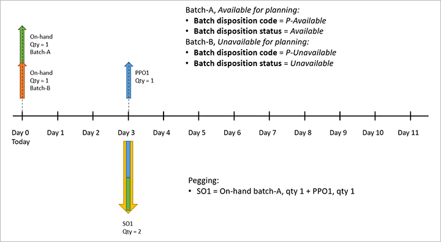

# Use batch disposition codes to mark batches as available or unavailable

This article describes how to set up and use *batch disposition codes*. Each batch disposition code has a status of either *Available* or *Unavailable*. You assign batch disposition codes to inventory batches to indicate whether each batch is available for master planning, reservation, picking, and/or shipping.

To use batch disposition codes, you must set up the codes and assign them to the batches that you want to manage.

## Set up batch disposition codes

You must set up each batch disposition code that you want to use in your system. You can create as many codes as you want. (For example, you can create codes to identify the different reasons why a batch might be available or unavailable). However, you will often have just two codes: one for *available* and one for *unavailable*. You can also create custom codes that enable a batch to be used for some operations but not others.

Follow these steps to set up batch disposition codes.

1. Go to **Inventory management \> Setup \> Batch \> Batch disposition master**.
1. The **Batch disposition master** page lists your current batch disposition codes, and lets you create, delete, and edit them. Follow one of these steps:

    - To edit an existing code, select it in the list pane.
    - To create a new code, select **New** on the Action Pane.

1. Set the following fields on the header of the new or selected code:

    - **Batch disposition code** – Enter the display name for the code.
    - **Description** – Describe how the code should be used.
    - **Batch disposition status** – Select the status that applies to batches that the code is assigned to:

        - *Unavailable* – The batches can't be used for master planning, reservation, picking, or shipping. When you select this value, all the **Block** options on the **Setup** FastTab are set to *Yes*, and all the **Nettable** options are set to *No*. However, you can change some of these settings to add exceptions.
        - *Available* – The batches can be used for master planning, reservation, picking, and/or shipping. When you select this value, all the **Block** options on the **Setup** FastTab are set to *No*, and all the **Nettable** options are set to *Yes*. These settings will be read-only while the **Batch disposition status** field is set to *Available*.

1. If you set the **Batch disposition status** field to *Unavailable*, you can customize the block status of each operation (reserve, pick, and ship) for each type of order (sales, transfer, and production). For production orders, you can choose to block or unblock the production picking journal. You can also choose to block or unblock master planning. Use the options on the **Setup** FastTab to block or unblock each operation as you require. Set the **Nettable** option to *Yes* to enable master planning, or set it to *No* to block master planning.

## Assign batch disposition codes to batches

After you define the batch disposition codes that you require, follow these steps to assign them to batches.

1. Go to **Warehouse management \> Setup \> Inventory \> Batches**.
1. Select one or more batches to assign a batch disposition code to.
1. On the Action Pane, on the **Reset** tab, select **Reset batch disposition code**.
1. In the **Change the restrictions on the inventory batch** dialog box, set the **New batch disposition code** field to the name of the code that you want to assign.
1. Select **OK** to apply the new setting and save your change.

    On the **Batches** page, the values in the **Batch disposition code** and **Batch disposition status** columns are updated so that they reflect the new settings for the selected batches.

## Master planning example

This example shows how batch disposition codes can affect master planning.

For this example, batch disposition codes are set up in the following way:

- *P-Available:*

    - **Batch disposition status:** *Available*
    - **Nettable:** *Yes*

- *P-Unavailable:*

    - **Batch disposition status:** *Unavailable*
    - **Nettable:** *No*

There is a product (*Product-1*) that has two batches: *Batch-A* and *Batch-B*. These batches are set up in the following way:

- *Batch-A:*

    - **Batch disposition code:** *P-Available*
    - **On-hand quantity:** 1

- *Batch-B:*

    - **Batch disposition code:** *P-Unavailable*
    - **On-hand quantity:** 1

There is a sales order (*SO1*) for a quantity of 2 of product *Product-1*. The delivery date is three days from today.

You run master planning and set the following values that are relevant to this example:

- **Planned order:** *Purchase order*
- **Replenishment strategy:** *Requirement*
- **Lead time:** *0*

As a result of the planning run, the system uses the available batch (*Batch-A*) to cover a quantity of 1 of product *Product-1* for sales order *SO1*. However, it can't use batch *Batch-B* because that batch is marked as unavailable for planning. Therefore, to cover the remaining quantity, the system creates a planned purchase order (*PPO1*) for a new batch of product *Product-1*.

The following illustration shows a timeline for the planning result.

