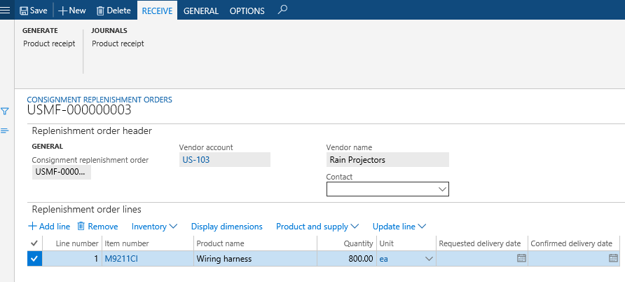
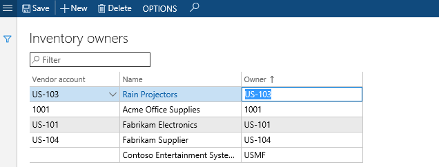
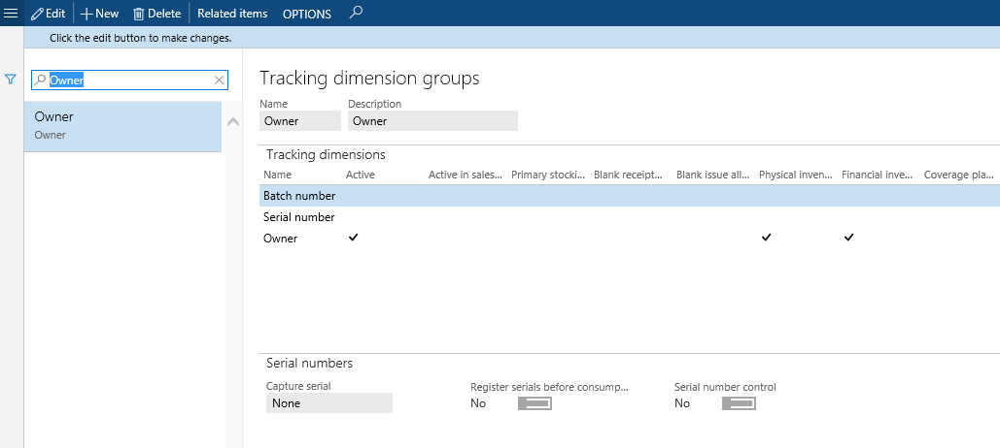

# Set up consignment

[!include [banner](../includes/banner.md)]

This article explains how to use the inbound consignment inventory processes.

Consignment inventory is inventory that’s owned by a vendor, but stored at your site. When you’re ready to consume or use the inventory, you take over the ownership of the inventory. This article includes information about how to physically receive vendor-owned inventory on-hand without creating general ledger transactions, how to start a production process where the vendor-owned inventory can be physically reserved. and how to change the ownership of the raw material in order to be able to process the consumption as part of the production order processing. There’s also some information about how vendors can monitor consumption of their inventory using the vendor collaboration interface.

## Overview of the consignment process

In this example scenario, company USMF has a consignment agreement with vendor US-104 for the raw material M9211CI.

1. A consignment replenishment order is manually created by someone in USMF, based on the expected demand. The order is created for vendor US-104 and a line is added for item MS9211CI.
1. The vendor gets informed about the expected delivery. This can happen in one of three ways:
    - Someone working at USMF sends the order information to the vendor.
    - The vendor can monitor the expected inventory on-hand using the vendor collaboration interface.
    - Someone working at USMF filters the data on the **On-hand inventory** page to show only the records for vendor US-104, where the receipt status is **Ordered**, and then sends this information to the vendor.
1. The inventory is delivered from US-104 to USMF.
1. When the material arrives at USMF, the consignment replenishment order is updated with a product receipt. Only the physical quantities of the vendor-owned inventory are recorded. There are no general ledger transactions created, because the inventory is still owned by the vendor.
1. The vendor monitors updates to the physical on-hand inventory using the **On-hand consignment inventory** page.
1. Now that the physical inventory is on-hand, the production process reserves the vendor-owned inventory and starts the production order for the finished goods that are going to consume the raw material M9211CI.
1. The owner of the reserved raw materials that are going to be consumed in today’s production is changed from US-104 to USMF. This is done using an Inventory ownership change journal. This process creates purchase orders where the **Origin** field is set to **Consignment**.
1. The vendor monitors the consumption (change of ownership) on the **Products received from consignment inventory** page and issues an invoice based on the agreements between the two companies.
1. The production process consumes the raw material via a production picking list. The physical reservation is automatically updated to reflect that the on-hand inventory is owned by USMF.
1. The invoice from US-104 is processed against the purchase orders which were auto-generated when the inventory ownership change journal was processed. Payment is made to vendor US-104 for the inventory that was consumed.

USMF carries out additional periodic processes:

- The physical movement of the vendor-owned inventory between different warehouses is processed using a transfer journal.
- The physical inventory on-hand is updated using an **Item counting** journal. Counting can also be used by the vendor to update the on-hand inventory, if they have permission to do this.

The vendor, US-104, can monitor the updates using the **On-hand consignment inventory** page.

## Consignment replenishment orders

A consignment replenishment order is a document that is used to request and keep track of inventory quantities of products that a vendor intends to deliver within a certain date interval by creating ordered inventory transactions. Typically, this will be based on the forecast and actual demand of the specific products. The inventory that’s going to be received against the consignment replenishment order remains in the ownership of the vendor. Only the possession of the products related to the physical receipt update is recorded and therefore no general ledger transaction updates occur.

The **Owner** dimension is used to separate information about which inventory is owned by the vendor and which is owned by the receiving legal entity. Consignment replenishment order lines have an **Open order** status as long as the full quantity of the lines has not been received or cancelled. When the full quantity has been received or canceled, the status is changed to **Completed**. The physical on-hand inventory that’s related to a consignment replenishment order can be recorded using a Registration process as well as a Product receipt update process. Registration can be done as part of the item arrival process or by manually updating the order lines. When the Product receipt update process is used, a record is made in the product receipt journal, which can be used to acknowledge the receipt of goods to the vendors.

## Inventory ownership change journal

The **Inventory ownership change** journal is used to record the transfer of ownership of consignment inventory from the vendor to the legal entity that's consuming it. No expected inventory transactions are created for the journal. Like any inventory journal, it must be identified with an Inventory journal name. These names are created on the **Inventory journal names** page, and the **Journal type** must be set to **Ownership change**.

The only inventory transactions created are those that relate to a posted journal. When the journal is posted:

- The vendor-owned inventory is issued using an **Ownership change** reference with a **Sold** status.
- On-hand inventory is received by the legal entity that’s consuming it using a product receipt updated inventory transaction on the purchase order. This sets the status of the order to **Received**. Purchase orders used for consignment have the **Origin** field set to **Consignment**.

It’s not possible to update the quantity on consignment purchase order lines after the order has been created.

## Vendor collaboration in consignment processes

If your vendors are using the vendor collaboration interface, they can use this to monitor the consumption of inventory at your site. The vendor collaboration interface has three pages related to the inbound consignment process:

- **Purchase orders** **consuming consignment inventory** - Shows detailed purchase order information related to the ownership change from the consignment process.
- **Products received from consignment inventory** - Shows information about the items and quantities that have product receipts updated during the ownership change process.
- **On-hand consignment inventory** - Shows information about the consignment items that they are expected to deliver, and the items that are already physically available at the customer site.

For more information about setting up vendors to use vendor collaboration, see [Manage vendor collaboration users](../procurement/manage-vendor-collaboration-users.md).

## Inventory owners

In order to record physical inbound consignment inventory, you need to define a vendor owner. This is done on the **Inventory owner** page. When you select a **Vendor account** this generates default values for the **Name** and **Owner** fields. The value in the **Owner** field will be visible to the vendor, so you might want to change it if your vendor account names aren’t easy for external people to recognize. It’s possible to edit the **Owner** field, but only up to the point when you save the **Inventory owner** record. The **Name** field is populated with the name of the party that the vendor account is associated with, and this cannot be changed.

## Tracking dimension group

Items that are going to be used in consignment processes must be associated with a **Tracking dimension group** where the **Owner** dimension is set to **Active**. The Owner dimension always has the **Physical inventory** and **Financial inventory** options selected. The **Coverage plan by dimension** is never selected.

[!INCLUDE[footer-include](../../includes/footer-banner.md)]
