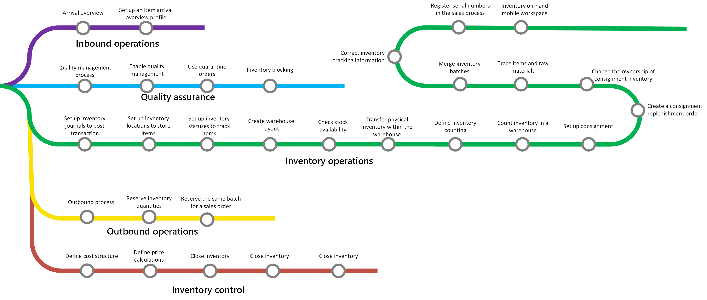

# Inventory management overview

[!include [banner](../includes/banner.md)]

You can use Inventory management to perform the following tasks:

- [Inbound operations](arrival-overview.md)
- [Quality assurance](quality-management-processes.md)
- [Inventory activities](inventory-journals.md)
- [Outbound operations](outbound-process.md)
- [Inventory control](../cost-management/inventory-close.md)

## Learning map

The following learning map shows the major concepts and tasks that make up the framework of the Inventory management module.

## Related information

### What's new and in development

Go to the [Dynamics 365 Release Planner](https://releaseplans.microsoft.com/?app=Supply+Chain+Management) to see what new features have been released and what new features are in development.

### Inventory accounting

Learn more in [Inventory close](../cost-management/inventory-close.md).

### Manufacturing and Supply Chain Management blogs

You can find opinions, news, and other information about Inventory management and other solutions on the
[Dynamics AX Manufacturing R&D Team Blog](/archive/blogs/axmfg/) and [Supply Chain Management in Dynamics AX R&D Team Blog](https://blogs.msdn.microsoft.com/dynamicsaxscm).

[!INCLUDE[footer-include](../../includes/footer-banner.md)]
