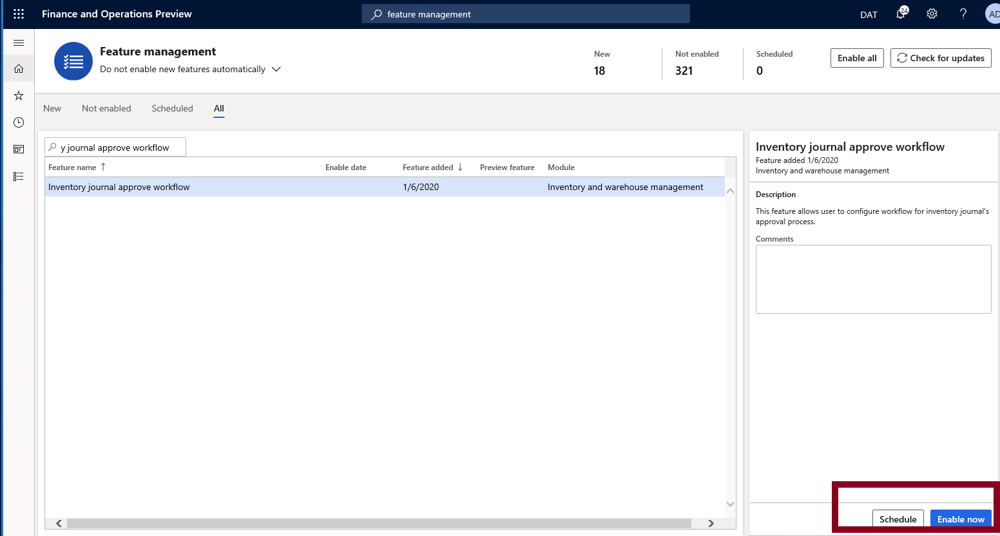

# Inventory Journal workflow

This topic describes how we can use inventory journal workflow to post various types of physical inventory transactions.

The inventory journals in Supply Chain Management are used to post physical inventory transactions of various types, such as the posting of issues and receipts, inventory movements, the creation of bills of materials (BOMs), and the reconciliation of physical inventory, but they are divided into different types.

## Prerequisites

- Microsoft Dynamics 365 Finance and Operation apps version 10.0.9+
- Enable Inventory journal approval workflow in the Feature Management

## Instructions

1. Enable "Inventory journal approval workflow" in the Feature management

    In the Feature Management, select feature name as "Inventory journal approve workflow" and enable the feature. Once enabled, the user can configure workflow for inventory journal"s approval process.

1. Configure the Inventory Management workflows

    - Navigate to **Inventory management > Setup > Inventory management workflows**
    - Click **New** and the user can select the proper workflow type to configure the inventory workflows.
    
    The Inventory journal approval workflow type can be created for the following types of inventory journal：
    
    - Tag Counting Journal
    - Movement Journal
    - Ownership Change journal
    - Transfer Journal
    - Inventory Counting Journal
    - Inventory BOM Journal
    - Inventory Adjustment Journal
    
    For workflow configuration details, you can refer to [Workflow system overview](../../fin-ops-core/fin-ops/organization-administration/overview-workflow-system.md).

1. Configure the Inventory journal approval workflow in the Journal Name

    - Navigate to >  **Inventory management**  >  **Setup**  >  **Journal names**  >  **Inventory**
    - Select  **journal name**  and then, in the  **general**  fast tab, set  **approval workflow**  >  **Approval workflow**  =  **Yes**  and then select the  **workflow**  from Workflow list

1. Manage the Inventory journal approval workflow in the Inventory journal

In the Inventory Journal, the workflow button will be active as per the inventory management workflow and journal name workflow configuration. The post button will be active once the journal will be approved

The Inventory journal approval history can be viewed in the Inventory journal approval workflow.
