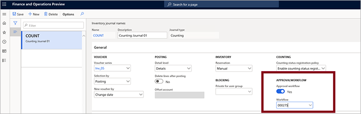
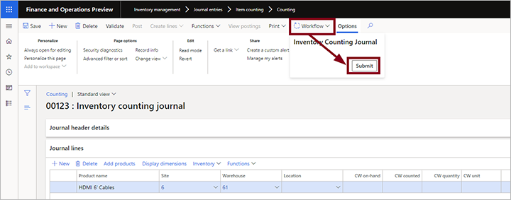

---
# required metadata

title: Inventory journal approval workflows
description: This article describes how to set up and use inventory journal approval workflows for various types of physical inventory transactions. Inventory journal workflows help ensure that only approved inventory journals can be posted to transactions.
author: yufeihuang
ms.date: 08/05/2022
ms.topic: article
ms.prod: 
ms.technology: 

# optional metadata

ms.search.form: InventJournalTableWorkflowDropDialog
audience: Application User
# ms.devlang: 
ms.reviewer: kamaybac
# ms.tgt_pltfrm: 
# ms.custom: [used by loc for articles migrated from the wiki]
ms.search.region: Global
# ms.search.industry: [leave blank for most, retail, public sector]
ms.author: yufeihuang
ms.search.validFrom: 2020-07-21
ms.dyn365.ops.version: 10.0.13
---

# Inventory journal approval workflows

[!include [banner](../includes/banner.md)]

This article describes how to set up and use inventory journal approval workflows for various types of physical inventory transactions, such as issues and receipts, inventory movements, bills of materials (BOMs), and the reconciliation of physical inventory. Inventory journal workflows help ensure that only approved inventory journals can be posted to transactions.

> [!NOTE]
> Inventory journal approval workflows apply only to transactions recorded using the Inventory Management module. They don't work with inventory journals triggered from the Warehouse Management module.

## Turn the Inventory journal approval workflows feature on or off

To use this feature, it must be turned on for your system. As of Supply Chain Management version 10.0.21, the feature is turned on by default. As of Supply Chain Management version 10.0.29, the feature is mandatory and can't be turned off. If you're running a version older than 10.0.29, then admins can turn this functionality on or off by searching for the *Inventory journal approve workflow* feature in the [Feature management](../../fin-ops-core/fin-ops/get-started/feature-management/feature-management-overview.md) workspace.

## Create your inventory journal approval workflows

To set up this feature, you must create a workflow for each of the inventory journal types you want to control. Because different inventory journal types can have different approval hierarchies and workflow steps, you can configure individual workflows for each inventory journal type.

Workflows support version control, and each has a workflow ID and an active version. You can choose to activate each new workflow version immediately upon creation or keep it inactive. If you need different workflows for the same journal type, then create multiple workflows for that journal type, and then assign each of these to a different journal name that uses that type.

To create your inventory journal approval workflows:

1. Go to **Inventory Management \> Setup\> Inventory management workflows**.
1. Select **New** on the Action Pane.
1. Choose the inventory journal type for which you want to set up a workflow:
    - **Inventory tag counting journal**
    - **Inventory ownership change journal**
    - **Inventory movement journal**
    - **Inventory transfer journal**
    - **Inventory counting journal**
    - **Inventory BOM journal**
    - **Inventory adjustment journal**

    

1. The workflow editor app launches on your machine. (You may be asked to approve this action.) Use it to design your workflow as needed. For details about how to use the workflow editor, see [Workflow system overview](../../fin-ops-core/fin-ops/organization-administration/overview-workflow-system.md).
1. After saving and closing the workflow editor app, you must choose whether to activate this workflow version or keep it as inactivate.

> [!NOTE]
> Workflows provide version control, which means that you can view a list of versions you have created and choose which one is active. To view the list of available versions and choose which to activate, select a workflow listed on the **Inventory management workflows** page. On the Action Pane, open the **Workflow** tab, and select **Versions**. Only one version can be active at a time for each workflow ID.

## Assign approval workflows to inventory journal names

The next step is to assign a inventory journal workflow to each inventory journal name. For each inventory journal type, you can set up multiple inventory journal names.

To associate an inventory journal workflow with an inventory journal name:

1. Go to **Inventory management \> Setup \> Journal names \> Inventory**.
1. Select a journal name from the list column to open its settings page.
1. On the **General** FastTab, set **Approval workflow** to **Yes**. If you are prompted to approve the action, select **Yes**.

    

1. Open the **Workflow** drop-down list and select the appropriate workflow. The list shows each active workflow that you have created using the workflow editor app.

## Create an inventory journal and send it for approval

After you associate an inventory journal name with its matching inventory journal approval workflow, you'll be able to create new inventory journals that use that name and then send these journals for approval using that workflow. You won't be able post the inventory journal until it has been approved by the approvers configured in the workflow.

1. On the navigation pane, expand **Inventory management \> Journal entries \> Items** and then select an inventory journal type.
1. Select **New** to create a new journal of your selected type.
1. The **Create inventory journal** dialog box opens. Fill out the form as needed and then select **OK** to save the journal.
1. Complete the journal as required.
1. When you create or open an inventory journal with an approval workflow associated with it, the **Workflow** button will be active in the Action Pane. When you are ready to submit the journal for approval, select the **Workflow** button to open a drop-down dialog box and then select **Submit**. The approval request will then route to the relevant approver, who will be alerted using the notification method configured for the workflow.

    

To recall an approval request, open the relevant journal, select the **Workflow** button and then select **Recall**. This will reset the workflow.

When your journal has been approved, you'll be able to post it. To post the journal, select **Post** from the Action Pane. If the **Post** button isn't active the journal hasn't been approved yet.

## Respond to an inventory journal approval request

If you are an approver, you should receive a message each time your approval is needed (as configured in the relevant workflow). Then you can approve or reject a journal approval request by doing the following:

1. On the navigation pane, expand **Inventory management \> Journal entries \> Items** and then select an inventory journal type.
1. Open the relevant journal and review it.
1. Select the **Workflow** button on the Action Pane to open a drop-down dialog box. Select one of the following:
    - **Approve** - To approve the request.
    - **Reject** - To reject the reject the request.
    - **More \> Request change** - To send a message to the requester asking them to change something specific and then resubmit.
    - **More \> Delegate** - To delegate the approval to another user.
    - **More \> Recall** - To recall the approval request (resets the workflow).
    - **More \> Workflow history** - To view the history of this approval workflow so far.

## Review the approval history

As with other types of workflows, you can use the **Workflow history** page to view the approval workflow history for any journal.

To review the workflow history for a journal:

1. On the navigation pane, expand **Inventory management \> Journal entries \> Items** and then select an inventory journal type.
1. Open the relevant journal.
1. Select the **Workflow** button on the Action Pane to open a drop-down dialog box. Select **Workflow history**. For more information, see [View workflow history](../../fin-ops-core/fin-ops/organization-administration/tasks/view-workflow-history.md).

[!INCLUDE[footer-include](../../includes/footer-banner.md)]