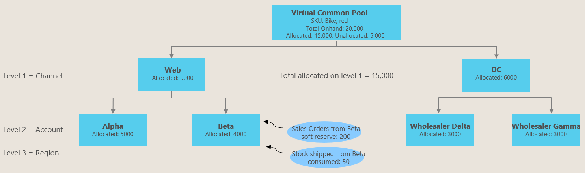

# Inventory Visibility inventory allocation

[!include [banner](../includes/banner.md)]

## Business background and purpose

Organizations often have to preallocate their on-hand stock to their most important sales channels, customer groups, regions, and promotional events to ensure that the preallocated stock is protected against any other use and can be consumed only via sales transactions that are relevant to the allocation. Inventory allocation in Inventory Visibility is a component of the sales operational planning process, and is done before any actual sales activities occur or a sales order is created.

For example, a company that is named Contoso produces a popular bike. Unfortunately, because a recent supply chain disruption has affected all in-transit stock of that bike, Contoso has only limited on-hand stock and must make best use of it. Contoso operates both online and in-store sales. In each sales channel, the company has a few important corporate partners (marketplaces and large retailers) that demand that a specific portion of the bike's available inventory be saved for them. Therefore, the bicycle company must be able to balance stock distribution across channels and also manage the expectations of its VIP partners. The best way to achieve both goals is to use inventory allocation, so that each channel and retailer can receive specific allocated quantities that can be sold to consumers later.

Inventory allocation has two basic business purposes:

- **Inventory protection (ring fencing)** – Organizations want to preallocate restricted or limited stock to prioritized channels, regions, VIP customers, and subsidiary companies. The Inventory Visibility allocation feature aims to protect the allocated inventory, so that the other allocations, reservations, or other sales demands won't affect the previously allocated inventory.
- **Oversell control** – The Inventory Visibility allocation feature aims to put a restriction on the previously allocated quantities, so that the receiving party (for example, a channel or customer group) won't over-consume them when the actual sales transaction that is based on a soft reservation goes into effect.

## Allocation definition in Inventory Visibility Service

### Allocation Virtual Pool

Although the allocation feature in Inventory Visibility doesn't set aside physical inventory quantities, it does refer to the available physical inventory quantity to define its initial *available to allocate* virtual pool quantity. Inventory allocation in Inventory Visibility is a soft allocation. It's done before actual sales transactions occur and doesn't depend on sales orders. For example, you can allocate stock to your most important sales channels or large corporate retailers before any end customers visit the sales channel or retail store to purchase it.

### Difference between inventory allocation and soft reservation

[Soft reservations](inventory-visibility-reservations.md) are often linked to actual sales transactions (sales order lines). Both allocation and soft reservation can be used independently, but if you want to use them together, soft reservation should be done after allocation. We recommend that you do inventory allocation first and then soft reserve against the allocated quantities to achieve near-real-time consumption against allocation. For more information, see [Consume as a soft reservation](#consume-to-soft-reserved).

The inventory allocation feature lets sales planners or key account managers manage and preallocate important stock across allocation groups (such as channels, regions, and customer groups). It also supports real-time tracking, adjustment, and analytics of consumption against allocated quantities, to ensure that replenishment or reallocation can be done on time. This ability to have real-time visibility into allocation, consumption, and allocation balance is especially important at fast-sale or promotion events.

## Terminology

The following terms and concepts are useful in discussions of inventory allocation:

- **Allocation group** – The group that owns the allocation, such as a sales channel, customer group, or order type.
- **Allocation group value** – The value of each allocation group. For example, *web* or *store* might be the value of the sales channel allocation group, whereas *VIP* or *normal* might be the value of the customer allocation group.
- **Allocation hierarchy** – A means to combine allocation groups in a hierarchical manner. A maximum of eight levels of hierarchy are supported. In Power Apps, on the **Allocation Configuration** page for Inventory Visibility, they are labeled **Group0** to **Group7**. For example, you could define *Channel* as hierarchy level 1 (**Group0**), *Region* as level 2 (**Group1**), and *Customer group* as level 3 (**Group2**). During inventory allocation, you must follow the allocation hierarchy sequence when you specify the value of the allocation group. For example, you could create an allocation of 200 red bikes to the *Web* channel, the *London* region, and the *VIP* customer group.
- **Available to allocate** – The *virtual common pool* that indicates the quantity that is available for further allocation. It's a calculated measure that you can freely define by using your own formula. If you're also using the soft reservation feature, we recommend that you use the same formula to calculate available-to-allocate and available-to-reserve.
- **Allocated** – A physical measure that shows the allocated quota that can be consumed by the allocation groups. It's deducted at the same time that the consumed quantity is added.
- **Consumed** – A physical measure that indicates that quantities that have been consumed against the original allocated quantity. As numbers are added to this physical measure, the Allocated physical measure is automatically reduced.

The following illustration shows the business workflow for inventory allocation.


The following illustration shows the allocation hierarchy and allocation groups. The *virtual common pool* shown here is the available-to-allocate quantity.

[](media/inventory-visibility-allocation-hierarchy.png)

## Set up inventory allocation

The inventory allocation feature consists of the following components:

- The predefined, allocation-related data source, physical measures, and calculated measures.
- Customizable allocation groups that have a maximum of eight levels.
- A set of allocation application programming interfaces (APIs):
  - allocate
  - reallocate
  - unallocate
  - consume
  - query

The process of configuring the allocation feature has three steps:

- Enable the feature in the Inventory Visibility app by going to **Configuration \> Feature Management & Settings \> Allocation**.
- Set up the [data source](inventory-visibility-configuration.md#data-source-configuration) and its [measures](inventory-visibility-configuration.md#data-source-configuration-physical-measures).
- Set up the allocation group name and hierarchy.

### Predefined data source

When you enable the allocation feature and call the configuration update API, Inventory Visibility creates one predefined data source and several initial measures.

The data source is named `@iv`. It includes a set of default physical measures. You can view them from the Inventory Visibility app by going to **Configuration \> Data Source**. You should see **Datasource - @IV**. Expand the `@iv` data source to view the list of initial physical measures:

- `@iv`
  - `@allocated`
  - `@cumulative_allocated`
  - `@consumed`
  - `@cumulative_consumed`

Select the **Calculated Measures** tab to view the initial calculated measure, which is named `@iv.@available_to_allocate`:

- `@iv`
  - `@iv.@available_to_allocate` = `??` – `??` – `@iv.@allocated`

### Add other physical measures to the available-to-allocate calculated measure

To use allocation, you must correctly set up the formula for the available-to-allocate calculated measure (`@iv.@available_to_allocate`). For example, you have the `fno` data source and the `onordered` measure, and the `pos` data source and the `inbound` measure, and you want to do allocation on the on-hand stock for the sum of `fno.onordered` and `pos.inbound`. In this case, `@iv.@available_to_allocate` should contain `pos.inbound` and `fno.onordered` in the formula. Here's an example:

`@iv.@available_to_allocate` = `fno.onordered` + `pos.inbound` – `@iv.@allocated`

> [!NOTE]
> Data source `@iv` is a predefined data source and the physical measures defined in `@iv` with prefix `@` are predefined measures. These measures are a predefined configuration for the allocation feature, so don't change or delete them or you're likely to encounter unexpected errors when using the allocation feature.
>
> You can add new physical measures to the predefined calculated measure `@iv.@available_to_allocate`, but you must not change its name.

### Manage allocation groups

A maximum of eight allocation group names can be set, corresponding to **Group0** to **Group7** in the hierarchy. **Group0** and **Group7** correspond to the highest and lowest levels of hierarchy, respectively. When creating an allocation, hierarchies must be specified from the highest to the lowest order. For example, suppose your configuration has *Country/region* for **Group0**, *State* for **Group1**, and *City* for **Group2**. *Country/region* and *State* are both required when specifying *City*, however, an allocation can be created with *Country/region* and *State*, or *Country/region* only. Follow these steps to view and update allocation groups.

1. Sign in to your Power Apps environment, and open **Inventory Visibility**.
1. Open the **Configuration** page, and then, on the **Allocation** tab, select **Edit Configuration**. In the default allocation configuration, there are four levels of hierarchy, from the highest to lowest: *Channel* (**Group0**), *customerGroup* (**Group1**), *Region* (**Group2**), and *OrderType* (**Group3**).
1. You can remove an existing allocation group by selecting the **X** next to it. You can also add new allocation groups to the hierarchy by entering the name of each new group directly in the field.

    > [!IMPORTANT]
    > Be careful when you delete or change the allocation hierarchy mapping. For guidance, see [Tips for using allocation](#allocation-tips).

1. When you've finished configuring the allocation group and hierarchy settings, select **Save**, then select **Update Configuration** in the upper right. The values of the configured allocation groups will be updated when you create an allocation by using either the user interface or API POST (/api<wbr>/environment<wbr>/\{environmentId\}<wbr>/allocation<wbr>/allocate). Details about both approaches are provided later in this article.

If you use four group names and set them to \[`channel`, `customerGroup`, `region`, `orderType`\], these names will be valid for allocation-related requests when you call the configuration update API.

### <a name="allocation-tips"></a>Tips for using allocation

- For every product, the allocation function should use in the same *dimension level* according to the product index hierarchy you set in the [product index hierarchy configuration](inventory-visibility-configuration.md#index-configuration). For example, suppose your index hierarchy is \[`Site`, `Location`, `Color`, `Size`\]. If you allocate some quantity for one product in the dimension level \[`Site`, `Location`, `Color`\], the next time you want to allocate this product, you should also allocate at the same level, \[`Site`, `Location`, `Color`\]. If you use the level \[`Site`, `Location`, `Color`, `Size`\] or \[`Site`, `Location`\], the data will be inconsistent.
- **Modifying allocation groups and the hierarchy:** If allocation data already exists in the system, deletion of existing allocation groups or a shift in the allocation group hierarchy will corrupt the existing mapping between the allocation groups. Therefore, be sure to use the `unallocate` API to remove all old data before updating the configuration. However, you don't need to clean up the data if you are only adding new allocation groups to the lowest hierarchy.
- Allocation will succeed only if the product has a positive `available_to_allocate` quantity.
- To allocate products from a high *allocation hierarchy* group to a subgroup, use the `Reallocate` API. For example, you have an allocation group hierarchy \[`channel`, `customerGroup`, `region`, `orderType`\], and you want to allocate some product from allocation group \[`Online`, `VIP`\] to the sub allocation group \[`Online`, `VIP`, `EU`\], use the `Reallocate` API to move the quantity. If you use the `Allocate` API, it will allocate the quantity from the virtual common pool.
- To view overall product availability (the common pool), use the [query on-hand](inventory-visibility-api.md#query-on-hand) API to request the inventory amount that is *available to allocate*. You can then make allocation decisions based on this information.

## <a name="using-allocation-api"></a>Use the allocation APIs

The following table lists the allocation APIs that are available.

| Method | API | Description |
| --- | --- | --- |
| POST | /api<wbr>/environment<wbr>/\{environmentId\}<wbr>/allocation<wbr>/allocate | Create an allocation |
| POST | /api<wbr>/environment<wbr>/\{environmentId\}<wbr>/allocation<wbr>/unallocate | Revert or remove allocated records |
| POST | /api<wbr>/environment<wbr>/\{environmentId\}<wbr>/allocation<wbr>/reallocate | Move allocated quantities from an existing allocation to other allocation groups |
| POST | /api<wbr>/environment<wbr>/\{environmentId\}<wbr>/allocation<wbr>/consume | Deduct (use) the allocated quantity |
| POST | /api<wbr>/environment<wbr>/\{environmentId\}<wbr>/allocation<wbr>/query | Check existing allocation records against the allocation groups and hierarchy |

### Allocate

Call the `Allocate` API to allocate a product that has specific dimensions. Here's the schema for the request body.

```json
{
    "id": "string",
    "productId": "string",
    "dimensionDataSource": "string",
    "groups": {
        "groupA": "string",
        "groupB": "string",
        "groupC": "string"
    },
    "quantity": decimal,
    "organizationId": "string",
    "dimensions": {
        "dimension1": "string",
        "dimension2": "string",
        "dimension3": "string"
    }
}
```

For example, you want to allocate a quantity of 10 for product *Bike*, site *1*, location *11*, color *red*, channel *Online*, customer group *VIP*, and region *US*. To do this allocation, you can make a call that has the following body content.

```json
{
    "id": "test101",
    "productId": "Bike",
    "groups": {
        "channel": "Online",
        "customerGroup": "VIP",
        "region": "US"
    },
    "quantity": 10,
    "organizationId": "usmf",
    "dimensions": {
        "siteId": "1",
        "locationId": "11",
        "colorId": "red"
    }
}
```

The quantity must always be more than 0 (zero).

> [!NOTE]
> More often than not, `siteId` and `locationId` are required because they aren't empty for most data sources. In the rare case where either `siteId` or `locationId` is empty for a data source, allocation from that data source must omit the empty dimension too.

### Unallocate

Use the `Unallocate` API to reverse the `Allocate` operation. Negative quantity isn't allowed in an `Allocate` operation. The body of `Unallocate` is identical to the body of `Allocate`.

### Reallocate

Use the `Reallocate` API to move some allocated quantity to another group combination. Here's the schema for the request body.

```json
{
    "id": "string",
    "productId": "string",
    "dimensionDataSource": "string",
    "sourceGroups": {
        "groupA": "string",
        "groupB": "string",
        "groupC": "string"
    },
    "groups": {
        "groupD": "string",
        "groupE": "string",
        "groupF": "string"
    },
    "quantity": decimal,
    "organizationId": "string",
    "dimensions": {
        "dimension1": "string",
        "dimension2": "string",
        "dimension3": "string"
    }
}
```

For example, you can move two bikes that have the dimensions \[site=1, location=11, color=red\] from allocation group \[Online, VIP, US\] to allocation group \[Online, VIP, EU\] by calling the `Reallocate` API and providing the following body text.

```json
{
    "id": "test102",
    "productId": "Bike",
    "sourceGroups": {
        "channel": "Online",
        "customerGroup": "VIP",
        "region": "US"
    },
    "groups": {
        "channel": "Online",
        "customerGroup": "VIP",
        "region": "EU"
    },
    "quantity": 2,
    "organizationId": "usmf",
    "dimensions": {
        "siteId": "1",
        "locationId": "11",
        "colorId": "red"
    }
}
```

### Consume

Use the `Consume` API to post the consumption quantity against allocation. For example, you could use this API to move allocated quantity to some real measures. Here's the schema for the request body.

```json
{
    "id": "string",
    "productId": "string",
    "dimensionDataSource": "string",
    "groups": {
        "groupA": "string",
        "groupB": "string",
        "groupC": "string"
    },
    "quantity": decimal,
    "organizationId": "string",
    "dimensions": {
        "dimension1": "string",
        "dimension2": "string",
        "dimension3": "string"
    },
    "physicalMeasures": {
        "datasource1": {
            "measure": "string" // Addition or Subtraction
        }
    }
}
```

For example, there are eight allocated bikes that have the dimensions \[site=1, location=11, color=red\] for allocation group \[Online, VIP, US\]. The following available-to-allocate formula is used:

`@iv.@available_to_allocate` = `fno.onordered` + `pos.inbound` – `@iv.@allocated`

The eight bikes are allocated from the `pos.inbound` measure.

Now, three bikes are sold, and they're taken from the allocation pool. To register this move, you can make a call that has the following request body.

```json
{
    "id": "test103",
    "organizationId": "usmf",
    "productId": "Bike",
    "dimensions": {
        "siteId": "1",
        "locationId": "11",
        "colorId": "red"
    },
    "groups": {
        "channel": "Online",
        "customerGroup": "VIP",
        "region": "US"
    },
    "quantity": 3,
    "physicalMeasures": {
        "pos": {
            "inbound": "Subtraction"
        }
    }
}
```

After this call, the allocated quantity for the product will be reduced by 3. In addition, Inventory Visibility will generate an on-hand change event where `pos.inbound` = *-3*. Alternatively, you can keep the `pos.inbound` value as is, and just consume the allocated quantity. However, in this case, you must either create another physical measure to keep the consumed quantities or use the predefined measure `@iv.@consumed`.

In this request, notice that the physical measure you use in the consume request body should use the opposite modifier type(Addition or Subtraction), compared with the modifier type used in the calculated measure. So in this consume body, `iv.inbound` has the value `Subtraction`, not `Addition`.

The `fno` data source can't be used in the consume body as we always claimed that Inventory Visibility can't change any data for the `fno` data source. The data flow is one-way, which means that all quantity changes for the `fno` data source must come from your Supply Chain Management environment. 

### <a name="consume-to-soft-reserved"></a>Consume as a soft reservation

The `Consume` API can also consume the allocated quantity as a soft reservation. In this case, the `Consume` operation will reduce the allocated quantity and then create a soft reservation for that quantity. To use this approach, you must also be using the [soft reservation](inventory-visibility-reservations.md) feature of Inventory Visibility.

For example, you've set a soft reservation physical measure as `iv.softreserved`. The following formula is used for the available-to-reserve calculated measure:

`iv.available_to_reserve` = `fno.onordered` + `pos.inbound` – `iv.softreserved`

To use this setup with the allocation feature, add `@iv.@allocated` to `iv.available_to_reserve` to produce the following formula:

`iv.available_to_reserve` = `fno.onordered` + `pos.inbound` – `iv.softreserved` – `@iv.@allocated`

Then update `@iv.@available_to_allocate` to the same value.

When you want to consume a quantity of 3 and directly reserve this quantity, you can make a call that has the following request body.

```json
{
    "id": "???",
    "organizationId": "usmf",
    "productId": "Bike",
    "dimensions": {
        "siteId": "1",
        "locationId": "11",
        "colorId": "red"
    },
    "groups": {
        "channel": "Online",
        "customerGroup": "VIP",
        "region": "US"
    },
    "quantity": 3,
    "physicalMeasures": {
        "iv": {
            "softreserved": "Addition"
        }
    }
}
```

In this request, notice that `iv.softreserved` has the value `Addition`, not `Subtraction`.

### Query

Use the `Query` API to retrieve allocation related information for some products. You can use dimension filters and allocation group filters to narrow down the results. *The dimensions must match exactly the one you want to retrieve*, for example, \[site=1, location=11\] will have unrelated results compared with \[site=1, location=11, color=red\].

```json
{
    "productId": "string",
    "organizationId": "string",
    "dimensions": {
        "dimension1": "string",
        "dimension2": "string",
        "dimension3": "string"
    },
    "groups": {
        "additionalProp1": "string",
        "additionalProp2": "string",
        "additionalProp3": "string"
    },
}
```

For example, use \[site=1, location=11, color=red\] and empty groups field to get all allocation records:

```json
{
    "organizationId": "usmf",
    "productId": "Bike",
    "dimensions": {
        "siteId": "1",
        "locationId": "11",
        "colorId": "red"
    },
    "groups": {},
}
```

Use \[site=1, location=11, color=red\] and groups \[channel=Online, customerGroup=VIP, region=US\] to get allocation records for this group:

```json
{
    "organizationId": "usmf",
    "productId": "Bike",
    "dimensions": {
        "siteId": "1",
        "locationId": "11",
        "colorId": "red"
    },
    "groups": {
        "channel": "Online",
        "customerGroup": "VIP",
        "region": "US"
    },
}
```

## Use the allocation user interface

You can manually manage allocations through the user interface by opening the Inventory Visibility app and going to **Operational Visibility \> Allocation**. From there, you can perform any of the actions that are described in the following subsections.

### Create an allocation

Follow these steps to create an allocation from the **Allocation** page of the Inventory Visibility app.

1. Select **Allocate**.
1. Set the base fields, dimensions, and target allocation groups values. (When you select the collect data source in the **Dimensions** section, first use the drop-down list to specify the dimensions (for example, `siteId`). Then enter dimension values in the fields that appear.)
1. Select **submit**.

### Consume an allocation

Select **Consume** to consume an allocation. To ensure that you consume within the correct allocation group and hierarchy, enter the same sets of organization and dimension details when you create the allocation.

### Reallocate an allocation

Select **Reallocate** to move existing allocated quantity from one set of allocation groups to another.

### Query existing allocations

Select **Query**, and then enter product, organization, dimension, and allocation group values to obtain query results of existing allocations.
