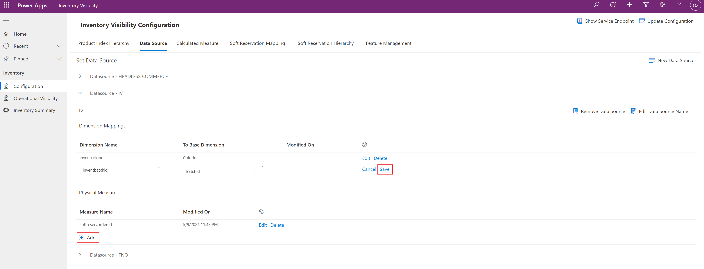

# Configure Inventory Visibility

[!include [banner](../includes/banner.md)]

This article describes how to configure Inventory Visibility using the Inventory Visibility app in Power Apps.

## <a name="introduction"></a>Introduction

Before you start to work with Inventory Visibility, you must complete the following configuration as described in this article:

- [Data source configuration](#data-source-configuration)
- [Partition configuration](#partition-configuration)
- [Product index hierarchy configuration](#index-configuration)
- [Reservation configuration (optional)](#reservation-configuration)
- [Query preload configuration (optional)](#query-preload-configuration)
- [Default configuration sample](#default-configuration-sample)

## Prerequisites

Before you begin, install and set up the Inventory Visibility Add-in as described in [Install and set up Inventory Visibility](inventory-visibility-setup.md).

## <a name="configuration"></a>The Configuration page of the Inventory Visibility app

In Power Apps, the **Configuration** page of the [Inventory Visibility app](inventory-visibility-power-platform.md) helps you set up the on-hand configuration and soft reservation configuration. After the add-in is installed, the default configuration includes the value from Microsoft Dynamics 365 Supply Chain Management (the `fno` data source). You can review the default settings. Additionally, based on your business requirements and the inventory posting requirements of your external system, you can modify the configuration to standardize the way that inventory changes can be posted, organized, and queried across multiple systems. The remaining sections of the article explain how to use each part of the **Configuration** page.

After the configuration is completed, be sure to select **Update Configuration** in the app.

## <a name="feature-switch"></a>Enable Inventory Visibility features in Power Apps feature management

The Inventory Visibility Add-in adds several new features to your Power Apps installation. By default, these features are turned off. To use them, open the **Configuration** page, and then, on the **Feature Management** tab, turn on the following features as you require.

| Feature Management name | Description |
|---|---|
| *OnHandReservation* | This feature lets you create reservations, consume reservations, and/or unreserve specified inventory quantities by using Inventory Visibility. For more information, see [Inventory Visibility reservations](inventory-visibility-reservations.md). |
| *OnHandMostSpecificBackgroundService* | This feature provides an inventory summary for products, together with all dimensions. The inventory summary data will periodically be synced from Inventory Visibility. The default synchronization frequency is once every 15 minutes, and can be set as high as once every 5 minutes. For more information, see [Inventory summary](inventory-visibility-power-platform.md#inventory-summary). |
| *OnHandIndexQueryPreloadBackgroundService* | This feature periodically fetches and stores a set of on-hand inventory summary data based on your preconfigured dimensions. It provides an inventory summary that only includes the dimensions that are relevant to your daily business and that is compatible with items enabled for warehouse management processes (WMS). For more information, see [Turn on and configure preloaded on-hand queries](#query-preload-configuration) and [Preload a streamlined on-hand query](inventory-visibility-power-platform.md#preload-streamlined-onhand-query). |
| *OnhandChangeSchedule* | This optional feature enables the on-hand change schedule and available to promise (ATP) features. For more information, see [Inventory Visibility on-hand change schedule and available to promise](inventory-visibility-available-to-promise.md). |
| *Allocation* | This optional feature enables Inventory Visibility to have the ability for inventory protection (ring fencing) and oversell control. For more information, see [Inventory Visibility inventory allocation](inventory-visibility-allocation.md). |
| *AdvancedWHS* | This optional feature enables Inventory Visibility to support items that are enabled for warehouse management processes (WMS). For more information, see [Inventory Visibility support for WMS items](inventory-visibility-whs-support.md). |

> [!IMPORTANT]
> We recommend that you use either the *OnHandIndexQueryPreloadBackgroundService* feature or the *OnHandMostSpecificBackgroundService* feature, not both. Enabling both features will impact performance.

## <a name="get-service-endpoint"></a>Find the service endpoint

If you don't know the correct Inventory Visibility service endpoint, open the **Configuration** page in Power Apps, and then select **Show Service Details** in the upper-right corner. The page will show the correct service endpoint. You can also find the endpoint in Microsoft Dynamics Lifecycle Services, as described in [Find the endpoint according to your Lifecycle Services environment](inventory-visibility-api.md#endpoint-lcs).

> [!NOTE]
> Use of an incorrect endpoint can cause a failed Inventory Visibility installation and errors when Supply Chain Management is synced to Inventory Visibility. If you aren't sure what your endpoint is, contact your system administrator. Endpoint URLs use the following format:
>
> `https://inventoryservice.<RegionShortName>-il<IsLandNumber>.gateway.prod.island.powerapps.com`

## <a name="data-source-configuration"></a>Data source configuration

Each data source represents a system that your data comes from. Example data source names include `fno` (which corresponds to Supply Chain Management) and `pos` (which stands for "point of sale"). By default, Supply Chain Management is set up as a default data source (`fno`) in Inventory Visibility.

> [!NOTE]
> The `fno` data source is reserved for Supply Chain Management. If your Inventory Visibility Add-in is integrated with a Supply Chain Management environment, we recommend that you don't delete configurations that are related to `fno` in the data source.

To add a data source, follow these steps.

1. Sign in to your Power Apps environment, and open **Inventory Visibility**.
1. Open the **Configuration** page.
1. On the **Data Source** tab, select **New Data Source** to add a data source (for example `ecommerce` or another meaningful data source ID).

> [!NOTE]
> When you add a data source, be sure to validate your data source name, physical measures, and dimension mappings before you update the configuration for the Inventory Visibility service. You won't be able to modify these settings after you select **Update Configuration**.

The data source configuration includes the following parts:

- Dimensions (dimension mapping)
- Physical measures
- Calculated measures

### <a name="data-source-configuration-dimension"></a>Dimensions (dimension mapping)

The purpose of the dimension configuration is to standardize the multi-system integration for posting events and queries, based on dimension combinations. Inventory Visibility provides a list of base dimensions that can be mapped from the dimensions of your data source. Thirty-three dimensions are available for mapping.

- If you're using Supply Chain Management as one of your data sources, 13 dimensions are already mapped to the Supply Chain Management standard dimensions by default. The other 12 dimensions (`inventDimension1` through `inventDimension12`) are also mapped to custom dimensions in Supply Chain Management. The remaining eight dimensions (`ExtendedDimension1` through `ExtendedDimension8`) are extended dimensions that you can map to external data sources.
- If you don't use Supply Chain Management as one of your data sources, you can freely map the dimensions. The following table shows the full list of available dimensions.

> [!NOTE]
> If you use Supply Chain Management, and change the default dimension mappings between Supply Chain Management and Inventory Visibility, the changed dimension won't sync data. Therefore, if your dimension isn't on the default dimension list, and you're using an external data source, we recommend that you use `ExtendedDimension1` through `ExtendedDimension8` to do the mapping.

| Dimension type | Base dimension |
|---|---|
| Product | `ColorId` |
| Product | `SizeId` |
| Product | `StyleId` |
| Product | `ConfigId` |
| Tracking | `BatchId` |
| Tracking | `SerialId` |
| Location | `LocationId` |
| Location | `SiteId` |
| Inventory status | `StatusId` |
| Warehouse specific | `WMSLocationId` |
| Warehouse specific | `WMSPalletId` |
| Warehouse specific | `LicensePlateId` |
| Others | `VersionId` |
| Inventory (custom) | `InventDimension1` through `InventDimension12` |
| Extension | `ExtendedDimension1` through `ExtendedDimension8` |
| System | `Empty` |

> [!NOTE]
> The dimension types that are listed in the preceding table are for your reference only. You don't have to define them in Inventory Visibility.
>
> The inventory (custom) dimensions might be reserved for Supply Chain Management. In that case, use the extended dimensions instead.

External systems can access Inventory Visibility through its RESTful APIs. For the integration, Inventory Visibility lets you configure the *external data source* and the mapping from the *external dimensions* to the *base dimensions*. Here's an example of a dimension mapping table.

| External dimension | Base dimension |
|---|---|
| `MyColorId` | `ColorId` |
| `MySizeId` | `SizeId` |
| `MyStyleId` | `StyleId` |
| `MyDimension1` | `ExtendedDimension1` |
| `MyDimension2` | `ExtendedDimension2` |

By configuring a dimension mapping, you can send the external dimensions directly to Inventory Visibility. Inventory Visibility will then automatically convert external dimensions to base dimensions.

To add dimension mappings, follow these steps.

1. Sign in to your Power Apps environment, and open **Inventory Visibility**.
1. Open the **Configuration** page.
1. On the **Data Source** tab, select the data source where you want to do the dimension mapping. Then, in the **Dimension Mappings** section, select **Add** to add dimension mappings.

    

1. In the **Dimension Name** field, specify the source dimension.
1. In the **To Base Dimension** field, select the dimension in Inventory Visibility that you want to map.
1. Select **Save**.

For example, you've already created a data source that is named `ecommerce`, and it includes a product color dimension. In this case, to do the mapping, you can first add `ProductColor` to the **Dimension Name** field in the `ecommerce` data source and then select `ColorId` in the **To Base Dimension** field.

### <a name="data-source-configuration-physical-measures"></a>Physical measures

When a data source posts an inventory change to Inventory Visibility, it posts that change by using *physical measures*. Physical measures modify the quantity and reflect the inventory status. You can define your own physical measures based on your requirements. Queries can be based on the physical measures.

Inventory Visibility provides a list of default physical measures that are mapped to Supply Chain Management (the `fno` data source). These default physical measures are taken from the inventory transaction statuses on the **On-hand list** page in Supply Chain Management (**Inventory Management \> Inquiries and Report \> On-hand list**). The following table provides an example of physical measures.

| Physical measure name | Description |
|---|---|
| `NotSpecified` | Not specified |
| `Arrived` | Arrived |
| `AvailOrdered` | Available ordered |
| `AvailPhysical` | Available physical |
| `Deducted` | Deducted |
| `OnOrder` | OnOrder |
| `Ordered` | Ordered |
| `PhysicalInvent` | Physical inventory |
| `Picked` | Picked |
| `PostedQty` | Posted quantity |
| `QuotationIssue` | Quotation issue |
| `QuotationReceipt` | Quotation receipt |
| `Received` | Received |
| `Registered` | Registered |
| `ReservOrdered` | Ordered reserved |
| `ReservPhysical` | Physical reserved |
| `OrderedSum` | Ordered in total |

If your data source is Supply Chain Management, you don't have to re-create the default physical measures. However, for external data sources, you can create new physical measures by following these steps.

1. Sign in to your Power Apps environment, and open **Inventory Visibility**.
1. Open the **Configuration** page.
1. On the **Data Source** tab, select the data source to add physical measures to (for example, the `ecommerce` data source). Then, in the **Physical Measures** section, select **Add**, and specify the measure name (for example, `Returned` if you want to record returned quantities in this data source to Inventory Visibility). Save your changes.

### Extended dimensions

Customers who want to use external data sources in the data source can take advantages of the extensibility that Dynamics 365 offers by creating [Class Extensions](../../fin-ops-core/dev-itpro/extensibility/class-extensions.md) for the `InventOnHandChangeEventDimensionSet` and `InventInventoryDataServiceBatchJobTask` classes.

Be sure to synchronize with the database after creating the extensions in order for the custom fields to be added in the `InventSum` table. You can then refer to the "Dimensions" section earlier in this article, to map your custom dimensions to any of the eight extended dimensions in `BaseDimensions` in Inventory.

> [!NOTE] 
> For additional details about creating extensions, see [Extensibility home page](../../fin-ops-core/dev-itpro/extensibility/extensibility-home-page.md).

### Calculated measures

You can use Inventory Visibility to query on both inventory physical measures and *custom calculated measures*. Calculated measures provide a customized computation formula that consists of a combination of physical measures. This functionality lets you define a set of physical measures that will be added, and/or a set of physical measures that will be subtracted, to form the customized measurement.

> [!IMPORTANT]
> A calculated measure is a composition of physical measures. Its formula can include only physical measures without duplicates, not calculated measures.

The configuration lets you define a set of calculated measure formulas that includes modifiers of addition or subtraction to get the total aggregated output quantity.

To set up a custom calculated measure, follow these steps.

1. Sign in to your Power Apps environment, and open **Inventory Visibility**.
1. Open the **Configuration** page.
1. On the **Calculated Measure** tab, select **New Calculate Measure** to add a calculated measure.
1. Set the following fields for the new calculated measure:

    - **New calculated measure name** – Enter the name of the calculated measure.
    - **Data source** – Select the data source to include the new calculated measure in. The querying system is a data source.

1. Select **Add** to add a modifier to the new calculated measure.
1. Set the following fields for the new modifier:

    - **Modifier** – Select the modifier type (*Addition* or *Subtraction*).
    - **Data source** – Select the data source where the measure that provides the modifier value should be found.
    - **Measure** – Select the name of the measure (from the selected data source) that provides the value for the modifier.

1. Repeat steps 5 through 6 until you've added all the required modifiers and completed the formula for your calculated measure.
1. Select **Save**.

For example, a fashion company operates across three data sources:

- `pos` – Corresponds to the store channel.
- `fno` – Corresponds to Supply Chain Management.
- `ecommerce` – Corresponds to your web channel.

Without calculated measures, when you query for product D0002 (Cabinet) under site 1, warehouse 11, and a `ColorID` dimension value of `Red`, you might get the following query result, which shows inventory quantities under each preconfigured physical measure. However, you don't have visibility into the total available for reservation quantities across your data sources.

```json
[
    {
        "productId": "D0002",
        "dimensions": {
            "SiteId": "1",
            "LocationId": "11",
            "ColorId": "Red"
        },
        "quantities": {
            "pos": {
                "inbound": 80.0,
                "outbound": 20.0
            },
            "fno": {
                "availphysical": 100.0,
                "orderedintotal": 50.0,
                "orderedreserved": 10.0
            },
            "ecommerce": {
                "received": 90.0,
                "scheduled": 30.0,
                "issued": 60.0,
                "reserved": 40.0
            }
        }
    }
]
```

You then configure a calculated measure that is named `MyCustomAvailableforReservation`, as shown in the following table. This calculated measure will be consumed by the consumption system.

| Consumption system | Calculated measure | Data source | Physical measure | Calculation type |
|---|---|---|---|---|
| `CrossChannel` | `MyCustomAvailableforReservation` | `fno` | `availphysical` | `Addition` |
| `CrossChannel` | `MyCustomAvailableforReservation` | `fno` | `orderedintotal` | `Addition` |
| `CrossChannel` | `MyCustomAvailableforReservation` | `fno` | `orderedreserved` | `Subtraction` |
| `CrossChannel` | `MyCustomAvailableforReservation` | `pos` | `inbound` | `Addition` |
| `CrossChannel` | `MyCustomAvailableforReservation` | `pos` | `outbound` | `Subtraction` |
| `CrossChannel` | `MyCustomAvailableforReservation` | `ecommerce` | `received` | `Addition` |
| `CrossChannel` | `MyCustomAvailableforReservation` | `ecommerce` | `scheduled` | `Addition` |
| `CrossChannel` | `MyCustomAvailableforReservation` | `ecommerce` | `issued` | `Subtraction` |
| `CrossChannel` | `MyCustomAvailableforReservation` | `ecommerce` | `reserved` | `Subtraction` |

When this computation formula is used, the new query result will include the customized measurement.

```json
[
    {
        "productId": "D0002",
        "dimensions": {
            "SiteId": "1",
            "LocationId": "11",
            "ColorId": "Red"
        },
        "quantities": {
            "pos": {
                "inbound": 80.0,
                "outbound": 20.0
            },
            "fno": {
                "availphysical": 100.0,
                "orderedintotal": 50.0,
                "orderedreserved": 10.0
            },
            "ecommerce": {
                "received": 90.0,
                "scheduled": 30.0,
                "issued": 60.0,
                "reserved": 40.0
            },
            "CrossChannel": {
                "MyCustomAvailableforReservation": 220.0
            }
        }
    }
]
```

The `MyCustomAvailableforReservation` output, based on the calculation setting in the custom measurements, is 100 + 50 – 10 + 80 – 20 + 90 + 30 – 60 – 40 = 220.

## <a name="partition-configuration"></a>Partition configuration

Currently, the partition configuration consists of two base dimensions (`SiteId` and `LocationId`) that indicate how the data is distributed. Operations under the same partition can deliver higher performance at lower cost. The following table shows the default partition configuration that the Inventory Visibility Add-in provides.

| Base dimension | Hierarchy |
|---|---|
| `SiteId` | 1 |
| `LocationId` | 2 |

The solution includes this partition configuration by default. Therefore, *you don't have to define it yourself*.

> [!IMPORTANT]
> Don't customize the default partition configuration. If you delete or change it, you're likely to cause an unexpected error.

## <a name="index-configuration"></a>Product index hierarchy configuration

Most of the time, the inventory on-hand query won't be only at the highest "total" level. Instead, you might also want to see results that are aggregated based on the inventory dimensions.

Inventory Visibility provides flexibility by letting you set up *indexes* to improve the performance of your queries. These indexes are based on a dimension or a combination of dimensions. An index consists of a *set number*, a *dimension*, and a *hierarchy*, as defined in the following table.

| Name | Description |
|---|---|
| Set number | Dimensions that belong to the same set (index) will be grouped together, and the same set number will be allocated to them. |
| Dimension | Base dimensions that the query result is aggregated on. |
| Hierarchy | The hierarchy lets you increase the performance of specific combinations of dimension when used in filter and group-by query parameters. For example, if you set up a dimension set with a hierarchy sequence of `(ColorId, SizeId, StyleId)`, then the system can process queries related to four dimension combinations more quickly. The first combination is empty, the second is `(ColorId)`, the third is `(ColorId, SizeId)`, and the fourth is `(ColorId, SizeId, StyleId)`. Other combinations won't be sped up. Filters aren't restricted by order but must be inside these dimensions if you want to improve their performance. For more information, see the example that follows. |

To set up your product hierarchy index, follow these steps.

1. Sign in to your Power Apps environment, and open **Inventory Visibility**.
1. Open the **Configuration** page.
1. On the **Product Hierarchy Index** tab, in the **Dimension Mappings** section, select **Add** to add dimension mappings.
1. By default, a list of indexes is provided. To modify an existing index, select **Edit** or **Add** in the section for the relevant index. To create a new index set, select **New index set**. For each row in every index set, in the **Dimension** field, select from the list of base dimensions. Values for the following fields are automatically generated:

    - **Set number** – Dimensions that belong to the same group (index) will be grouped together, and the same set number will be allocated to them.
    - **Hierarchy** – The hierarchy increases the performance of specific combinations of dimension when used in filter and group-by query parameters.

> [!TIP]
> Here are a few tips to keep in mind when setting up your index hierarchy:
>
> - Base dimensions that are defined in the partition configuration shouldn't be defined in index configurations. If a base dimension is defined again in the index configuration, you won't be able to query by this index.
> - If you only need to query inventory that is aggregated by all dimension combinations, then set up a single index that contains the base dimension `Empty`.

### Example

This section provides an example that shows how the hierarchy works.

The following table provides a list of available inventory for this example.

| Item | ColorId | SizeId | StyleId | Quantity |
|---|---|---|---|---|
| D0002 | Black | Small | Wide | 1 |
| D0002 | Black | Small | Regular | 2 |
| D0002 | Black | Large | Wide | 3 |
| D0002 | Black | Large | Regular | 4 |
| D0002 | Red | Small | Wide | 5 |
| D0002 | Red | Small | Regular | 6 |
| D0002 | Red | Large | Regular | 7 |

The following table shows how the index hierarchy is set up.

| Set Number | Dimension | Hierarchy |
|---|---|---|
| 1 | `ColorId` | 1 |
| 1 | `SizeId` | 2 |
| 1 | `StyleId` | 3 |

The index lets you query the on-hand inventory in the following ways:

- `()` – Grouped by all

    - D0002, 28

- `(ColorId)` – Grouped by `ColorId`

    - D0002, Black, 10
    - D0002, Red, 18

- `(ColorId, SizeId)` – Grouped by the combination of `ColorId` and `SizeId`

    - D0002, Black, Small, 3
    - D0002, Black, Large, 7
    - D0002, Red, Small, 11
    - D0002, Red, Large, 7

- `(ColorId, SizeId, StyleId)` – Grouped by the combination of `ColorId`, `SizeId`, and `StyleId`

    - D0002, Black, Small, Wide, 1
    - D0002, Black, Small, Regular, 2
    - D0002, Black, Large, Wide, 3
    - D0002, Black, Large, Regular, 4
    - D0002, Red, Small, Wide, 5
    - D0002, Red, Small, Regular, 6
    - D0002, Red, Large, Regular, 7

## <a name="reservation-configuration"></a>Reservation configuration (optional)

Reservation configuration is required if you want to use the soft reservation feature. The configuration consists of two fundamental parts:

- Soft reservation mapping
- Soft reservation hierarchy

### Soft reservation mapping

When you make a reservation, you might want to know whether on-hand inventory is currently available for reservation. The validation is linked to a calculated measure that represents a computation formula of a combination of physical measures.

By setting up the mapping from the physical measure to the calculated measure, you enable the Inventory Visibility service to automatically validate reservation availability, based on the physical measure.

Before you set up this mapping, the physical measures, calculated measures, and their data sources must be defined on the **Data source** and **Calculated measure** tabs of the **Configuration** page in Power Apps (as described earlier in this article).

To define the soft reservation mapping, follow these steps.

1. Define the physical measure that serves as the soft reservation measure (for example, `SoftReservPhysical`).
1. On the **Calculated measure** tab of the **Configuration** page, define the *available for reservation* (AFR) calculated measure that contains the AFR computation formula that you want to map to the physical measure. For example, you might set up `AvailableToReserve` (available for reservation) so that it's mapped to the previously defined `SoftReservPhysical` physical measure. In this way, you can find which quantities that have the `SoftReservPhysical` inventory status will be available for reservation. The following table shows the AFR computation formula.

    | Calculation type | Data source | Physical measure |
    |---|---|---|
    | Addition | `fno` | `AvailPhysical` |
    | Addition | `pos` | `Inbound` |
    | Subtraction | `pos` | `Outbound` |
    | Subtraction | `iv` | `SoftReservPhysical` |

    We recommend that you set up the calculated measure so that it contains the physical measure that the reservation measure is based on. In this way, the calculated measure quantity will be affected by the reservation measure quantity. Therefore, in this example, the `AvailableToReserve` calculated measure of the `iv` data source should contain the `SoftReservPhysical` physical measure from `iv` as a component.

1. Open the **Configuration** page.
1. On the **Soft Reservation Mapping** tab, set up the mapping from the physical measure to the calculated measure. For the previous example, you might use the following settings to map `AvailableToReserve` to the previously defined `SoftReservPhysical` physical measure.

    | Physical measure data source | Physical measure | Available for reservation data source | Available for reservation calculated measure |
    |---|---|---|---|
    | `iv` | `SoftReservPhysical` | `iv` | `AvailableToReserve` |

    > [!NOTE]
    > If you can't edit the **Soft Reservation Mapping** tab, you may need to turn on the *OnHandReservation* feature on the **Feature Management** tab.

Now, when you do reservation on `SoftReservPhysical`, Inventory Visibility will automatically find `AvailableToReserve` and its related computation formula to do the reservation validation.

For example, you have the following on-hand inventory in Inventory Visibility.

```json
{
    "productId": "D0002",
    "dimensions": {
        "SiteId": "1",
        "LocationId": "11",
        "ColorId": "Red"
    },
    "quantities": {
        "iv": {
            "SoftReservPhysical": 90
        },
        "fno": {
            "availphysical": 70.0,
        },
        "pos": {
            "inbound": 50.0,
            "outbound": 20.0
        }
    }
}
```

In this case, the following calculation applies:

`AvailableToReserve` = `fno.availphysical` + `pos.inbound` – `pos.outbound` – `iv.SoftReservPhysical`  
= 70 + 50 – 20 – 90  
= 10

Therefore, if you try to make reservations on `iv.SoftReservPhysical`, and the quantity is less than or equal to `AvailableToReserve` (10), the soft reservation request will succeed.

> [!NOTE]
> When you call the reservation API, you can control the reservation validation by specifying the Boolean `ifCheckAvailForReserv` parameter in the request body. A value of `True` means that the validation is required, whereas a value of `False` means that the validation isn't required (although you might end up with a negative `AvailableToReserve` quantity, the system will still allow you to soft reserve). The default value is `True`.

### Soft reservation hierarchy

The reservation hierarchy describes the sequence of dimensions that must be specified when reservations are made. It works in the same way that the product index hierarchy works for on-hand queries.

The reservation hierarchy is independent of the product index hierarchy. This independence lets you implement category management where users can break down the dimensions into details to specify the requirements for making more precise reservations. Your soft reservation hierarchy should contain `SiteId` and `LocationId` as components, because they construct the partition configuration. When you do the reservation, you must specify a partition for the product.

Here's an example of a soft reservation hierarchy.

| Base dimension | Hierarchy |
|---|---|
| `SiteId` | 1 |
| `LocationId` | 2 |
| `ColorId` | 3 |
| `SizeId` | 4 |
| `StyleId` | 5 |

In this example, you can do reservation in the following dimension sequences. You must specify a partition for the product when you do the reservation. Therefore, the basic hierarchy that you can use is `(SiteId, LocationId)`.

- `(SiteId, LocationId)`
- `(SiteId, LocationId, ColorId)`
- `(SiteId, LocationId, ColorId, SizeId)`
- `(SiteId, LocationId, ColorId, SizeId, StyleId)`

A valid dimension sequence should strictly follow the reservation hierarchy, dimension by dimension. For example, the hierarchy sequence `(SiteId, LocationId, SizeId)` isn't valid, because `ColorId` is missing.

## Available to promise configuration (optional)

You can set up Inventory Visibility to let you schedule future on-hand changes and calculate available-to-promise (ATP) quantities. ATP is the quantity of an item that is available and can be promised to a customer in the next period. Use of this calculation can greatly increase your order fulfillment capability. To use this feature, you must enable it on the **Feature Management** tab and then set it up on the **ATP Setting** tab. For more information, see [Inventory Visibility on-hand change schedules and available to promise](inventory-visibility-available-to-promise.md).

## <a name="query-preload-configuration"></a>Turn on and configure preloaded on-hand queries (optional)

Inventory Visibility can periodically fetch and store a set of on-hand inventory summary data based on your preconfigured dimensions. This provides the following benefits:

- A cleaner view that stores an inventory summary that only includes the dimensions that are relevant to your daily business.
- An inventory summary that is compatible with items enabled for warehouse management processes (WMS).

See [Preload a streamlined on-hand query](inventory-visibility-power-platform.md#preload-streamlined-onhand-query) for more information about how to work with this feature after you have set it up.

> [!IMPORTANT]
> We recommend that you use either the *OnHandIndexQueryPreloadBackgroundService* feature or the *OnHandMostSpecificBackgroundService* feature, not both. Enabling both features will impact performance.

Follow these steps to set up the feature:

1. Sign into the Inventory Visibility power app.
1. Go to **Configuration \> Feature Management & Settings**.
1. If the *OnHandIndexQueryPreloadBackgroundService* feature is already enabled, then we recommend you turn it off for now because the cleanup process might take a very long time to complete. You'll turn it on again later in this procedure.
1. Open the **Preload Setting** tab.
1. In the **Step 1: Clean up Preload Storage** section, select **Clean** to clean up the database and make it ready to accept your new group-by settings.
1. In the **Step 2: Set up Group By Values** section, in the **Group Result By** field, enter a comma-separated list of field names by which to group your query results. Once you have data in the preload storage database, you won't be able to change this setting until you clean the database, as described in the previous step.
1. Go to **Configuration \> Feature Management & Settings**.
1. Turn on the *OnHandIndexQueryPreloadBackgroundService* feature.
1. Select **Update Configuration** in the upper-right corner of the **Configuration** page to commit your changes.

## Complete and update the configuration

After you've completed the configuration, you must commit all the changes to Inventory Visibility. Follow these steps to commit your changes.

1. In Power Apps, on the **Configuration** page, select **Update Configuration** in the upper-right corner. 
1. The system requests sign-in credentials. Enter the following values:

    - **Client Id** – The Azure application ID that you created for Inventory Visibility.
    - **Tenant Id** – Your Azure tenant ID.
    - **Client Secret** – The Azure application secret that you created for Inventory Visibility.

    For more information about these credentials and how to find them, see [Install and set up Inventory Visibility](inventory-visibility-setup.md).

    > [!IMPORTANT]
    > Be sure to validate your data source name, physical measures, and dimension mappings before you update the configuration. You won't be able to modify these settings after you update it.

1. After sign-in, select **Update Configuration** again. The system applies your settings and shows what has changed.

## <a name="default-configuration-sample"></a>Default configuration sample

During its initialization stage, Inventory Visibility sets up a default configuration, which is detailed here. You can modify this configuration as you require.

### Data source configuration

#### Configuration of the iv data source

This section describes how the `iv` data source is configured.

##### Physical measures configured for the "iv" data source

The following physical measures are configured for the `iv` data source:

- `Ordered`
- `SoftReservPhysical`
- `SoftReservOrdered`
- `ReservOrdered`
- `ReservPhysical`

##### OrderedTotal calculated measure

The `OrderedTotal` calculated measure is configured for the `iv` data source as shown in the following table.

| Calculation type | Data source | Physical measure |
|---|---|---|
| Addition | `fno` | `Ordered` |
| Addition | `fno` | `Arrived` |
| Addition | `iv` | `Ordered` |

##### OnHand calculated measure

The `OnHand` calculated measure is configured for the `iv` data source as shown in the following table.

| Calculation type | Data source | Physical measure |
|---|---|---|
| Addition | `fno` | `PhysicalInvent` |
| Addition | `iom` | `OnHand` |
| Addition | `erp` | `Unrestricted` |
| Addition | `erp` | `QualityInspection` |
| Addition | `pos` | `PosInbound` |
| Subtraction | `pos` | `PosOutbound` |

##### ReservedTotal calculated measure

The `ReservedTotal` calculated measure is configured for the `iv` data source as shown in the following table.

| Calculation type | Data source | Physical measure |
|---|---|---|
| Addition | `fno` | `ReservPhysical` |
| Addition | `fno` | `ReservOrdered` |
| Addition | `iv` | `SoftReservPhysical` |
| Addition | `iv` | `SoftReservOrdered` |
| Addition | `iv` | `ReservPhysical` |
| Addition | `iv` | `ReservOrdered` |

##### SoftReserved calculated measure

The `SoftReserved` calculated measure is configured for the `iv` data source as shown in the following table.

| Calculation type | Data source | Physical measure |
|---|---|---|
| Addition | `iv` | `SoftReservPhysical` |
| Addition | `iv` | `SoftReservOrdered` |

##### HardReserved calculated measure

The `HardReserved` calculated measure is configured for the `iv` data source as shown in the following table.

| Calculation type | Data source | Physical measure |
|---|---|---|
| Addition | `fno` | `ReservPhysical` |
| Addition | `fno` | `ReservOrdered` |
| Addition | `iv` | `ReservPhysical` |
| Addition | `iv` | `ReservOrdered` |

##### OpenOrder calculated measure

The `OpenOrder` calculated measure is configured for the `iv` data source as shown in the following table.

| Calculation type | Data source | Physical measure |
|---|---|---|
| Addition | `fno` | `OnOrder` |
| Addition | `iom` | `OnOrder` |

##### OnHandAvailable calculated measure

The `OnHandAvailable` calculated measure is configured for the `iv` data source as shown in the following table.

| Calculation type | Data source | Physical measure |
|---|---|---|
| Addition | `fno` | `PhysicalInvent` |
| Addition | `iom` | `OnHand` |
| Addition | `erp` | `Unrestricted` |
| Addition | `erp` | `QualityInspection` |
| Addition | `pos` | `PosInbound` |
| Subtraction | `fno` | `ReservPhysical` |
| Subtraction | `iv` | `SoftReservPhysical` |
| Subtraction | `pos` | `PosOutbound` |

##### AvailableToReserve calculated measure

The `AvailableToReserve` calculated measure is configured for the `iv` data source as shown in the following table.

| Calculation type | Data source | Physical measure |
|---|---|---|
| Addition | `fno` | `PhysicalInvent` |
| Addition | `iom` | `OnHand` |
| Addition | `erp` | `Unrestricted` |
| Addition | `erp` | `QualityInspection` |
| Addition | `pos` | `PosInbound` |
| Addition | `fno` | `Ordered` |
| Addition | `fno` | `Arrived` |
| Addition | `iv` | `Ordered` |
| Subtraction | `fno` | `ReservPhysical` |
| Subtraction | `fno` | `ReservOrdered` |
| Subtraction | `iv` | `SoftReservPhysical` |
| Subtraction | `iv` | `SoftReservOrdered` |
| Subtraction | `iv` | `ReservPhysical` |
| Subtraction | `iv` | `ReservOrdered` |
| Subtraction | `pos` | `PosOutbound` |

##### InventorySupply calculated measure

The `InventorySupply` calculated measure is configured for the `iv` data source as shown in the following table.

| Calculation type | Data source | Physical measure |
|---|---|---|
| Addition | `fno` | `Ordered` |
| Addition | `fno` | `Arrived` |
| Addition | `iv` | `Ordered` |
| Addition | `fno` | `PhysicalInvent` |
| Addition | `iom` | `OnHand` |
| Addition | `erp` | `Unrestricted` |
| Addition | `erp` | `QualityInspection` |
| Addition | `pos` | `PosInbound` |
| Subtraction | `pos` | `PosOutbound` |

##### InventoryDemand calculated measure

The `InventoryDemand` calculated measure is configured for the `iv` data source as shown in the following table.

| Calculation type | Data source | Physical measure |
|---|---|---|
| Addition | `fno` | `OnOrder` |
| Addition | `iom` | `OnOrder` |
| Addition | `iv` | `SoftReservPhysical` |
| Addition | `iv` | `SoftReservOrdered` |
| Addition | `fno` | `ReservPhysical` |
| Addition | `fno` | `ReservOrdered` |
| Addition | `iv` | `ReservPhysical` |
| Addition | `iv` | `ReservOrdered` |

#### Configuration of the "fno" data source

This section describes how the `fno` data source is configured.

##### Dimension mappings for the "fno" data source

The dimension mappings that are listed in the following table are configured for the `fno` data source.

| External dimension | Base dimension |
|---|---|
| `InventBatchId` | `BatchId` |
| `InventColorId` | `ColorId` |
| `InventLocationId` | `LocationId` |
| `InventSerialId` | `SerialId` |
| `InventSiteId` | `SiteId` |
| `InventSizeId` | `SizeId` |
| `InventStatusId` | `StatusId` |
| `InventStyleId` | `StyleId` |
| `LicensePlateId` | `LicensePlateId` |
| `WMSLocationId` | `WMSLocationId` |
| `WMSPalletId` | `WMSPalletId` |
| `ConfigId` | `ConfigId` |
| `InventVersionId` | `VersionId` |
| `InventDimension1` | `CustomDimension1` |
| `InventDimension2` | `CustomDimension2` |
| `InventDimension3` | `CustomDimension3` |
| `InventDimension4` | `CustomDimension4` |
| `InventDimension5` | `CustomDimension5` |
| `InventDimension6` | `CustomDimension6` |
| `InventDimension7` | `CustomDimension7` |
| `InventDimension8` | `CustomDimension8` |
| `InventDimension9` | `CustomDimension9` |
| `InventDimension10` | `CustomDimension10` |
| `InventDimension11` | `CustomDimension11` |
| `InventDimension12` | `CustomDimension12` |

##### Physical measures configured for the "fno" data source

The following physical measures are configured for the `fno` data source:

- `Arrived`
- `PhysicalInvent`
- `ReservPhysical`
- `onorder`
- `notspecified`
- `availordered`
- `availphysical`
- `picked`
- `postedqty`
- `quotationreceipt`
- `received`
- `ordered`
- `ReservOrdered`

#### Configuration of the "pos" data source

This section describes how the data source `pos` is configured.

##### Physical measures for the "pos" data source

The following physical measures are configured for the `pos` data source:

- `PosInbound`
- `PosOutbound`

##### AvailQuantity calculated measure

The `AvailQuantity` calculated measure is configured for the `pos` data source as shown in the following table.

| Calculation type | Data source | Physical measure |
|---|---|---|
| Addition | `fno` | `AvailPhysical` |
| Addition | `pos` | `PosInbound` |
| Subtraction | `pos` | `PosOutbound` |

#### Configuration of the "iom" data source

The following physical measures are configured for the `iom` (intelligent order management) data source:

- `OnOrder`
- `OnHand`

#### Configuration of the "erp" data source

The following physical measures are configured for the `erp` (enterprise resource planning) data source:

- `Unrestricted`
- `QualityInspection`

### Partition configuration

The following table shows the default partition configuration.

| Base dimension | Hierarchy |
|---|---|
| `SiteId` | 1 |
| `LocationId` | 2 |

### Index configuration

The following table shows the default index configuration.

| Set Number | Dimension | Hierarchy |
|---|---|---|
| 1 | `ColorId` | 1 |
| 1 | `SizeId` | 2 |
| 1 | `StyleId` | 3 |

### Reservation configuration

This section describes the default reservation configuration.

#### Reservation mapping

The following table shows the default reservation mapping.

| Physical measure data source | Physical measure | Available for reservation data source | Available for reservation calculated measure |
|---|---|---|---|
| `iv` | `SoftReservPhysical` | `iv` | `AvailableToReserve` |

#### Reservation hierarchy

The following table shows the default reservation hierarchy.

| Base dimension | Hierarchy |
|---|---|
| `SiteId` | 1 |
| `LocationId` | 2 |
| `ColorId` | 3 |
| `SizeId` | 4 |

[!INCLUDE[footer-include](../../includes/footer-banner.md)]
