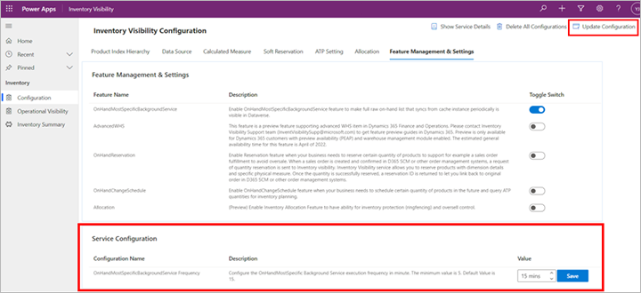

## Inventory summary

The **Inventory summary** page provides an inventory summary for products together with all dimensions. It's a customized view for the *Inventory OnHand Sum* entity. Inventory summary data is synced periodically from Inventory Visibility.

To enable the **Inventory summary** page and set the synchronization frequency, follow these steps:

1. Sign into the Inventory Visibility power app.
1. Go to **Settings \> Feature Management \> Inventory Summary \> Manage**.
    - `Feature Name` is an non-editable field with value "OnHandMostSpecificBackgroundService"
    - `Enable feature` controls on-off of the feature. Feature is enabled when toggled on, and disabled otherwise. Please remember to update configuration to make this change take effect.
    - `Synchronize frequency` controls the frequency (by minitues) at which inventory summary data is synced. The minimum can be set to 5 minutes.
1. Go to **Settings \> Admin Settings \> Update Configuration \> Manage** to update configuration to activate all the changes.

If you are using UI version 1 (Legacy UI), please follow these steps to set up the feature:

1. Open the **Configuration** page.
1. Open the **Feature Management & Settings** tab.
1. Set the toggle switch for the *OnHandMostSpecificBackgroundService* feature to *Yes*.
1. When the feature is enabled, the **Service Configuration** section becomes available and includes a row for configuring the **OnHandMostSpecificBackgroundService** feature. This setting lets you choose the frequency at which inventory summary data is synced. Use the **Up** and **Down** buttons in the **Value** column to change the time between syncs (which can be as low as 5 minutes). Then select **Save**.

    

1. Select **Update configuration** to save all the changes.

> [!NOTE]
> The *OnHandMostSpecificBackgroundService* feature only tracks on-hand inventory changes that occurred after you turned on the feature. Data for products that haven't changed since you turned on the feature won't be synced from the Inventory Visibility cache to the Dataverse environment.
>
> When you change the settings for a calculated measure, data on the **Inventory summary** page won't update automatically until the related product data is modified.
>
> If your **Inventory summary** page doesn't show all of the on-hand information you are expecting, open Supply Chain Management in FnO, go to **Inventory Management > Periodic tasks > Inventory Visibility integration**, disable the batch job and reenable it. This will do the initial push, and all data will sync to the *Inventory OnHand Sum* entity minitues after the initial push. If you want to use the *OnHandMostSpecificBackgroundService* feature, we recommend that you turn it on before you create any on-hand changes and enable the **Inventory Visibility integration** batch job.

## Filter and browse the inventory summaries

Go to **Inventory Snapshot \> Inventory Summary** to view your data. By using the **Advanced filter** that Dataverse provides, you can create a personal view that shows the rows that are important to you. The advanced filter options let you create a wide range of views, from simple to complex. They also let you add grouped and nested conditions to the filters. To learn more about how to use the advanced filter, see [Edit or create personal views using advanced grid filters](/powerapps/user/grid-filters-advanced).

The **Inventory summary** page provides three fields above the grid (**Default dimension**, **Custom dimension**, and **Measure**) that you can use to control which columns are visible. You can also select any column header to filter or sort the current result by that column. The following screenshot highlights the dimension, filtering, result count, and "load more" fields available on the **Inventory summary** page.

At the bottom of the **Inventory summary** pages, you'll find information such as "2 records (2 selected)" or "50 records". This information refers to the currently loaded records from the **Advanced filter** result. The text "2 selected" refers to the number of records that have been selected by using the column header filter for the loaded records. There's also a **Load more** button that you can use to load more records from Dataverse. The default number of loaded records is 50. When you select **Load more**, the next 1,000 available records will be loaded into the view. The number on the **Load more** button indicates the currently loaded records and the total number of records for the **Advanced Filter** result.