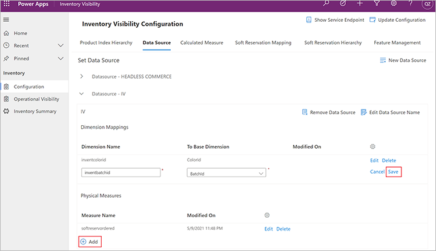
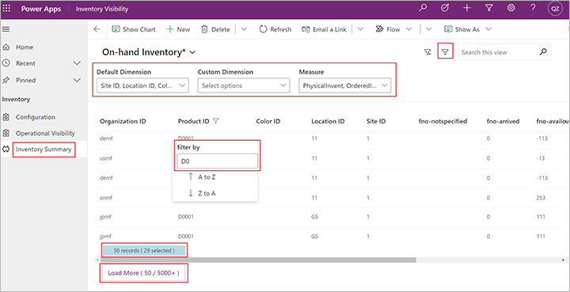

# Inventory Visibility app

[!include [banner](../includes/banner.md)]
[!INCLUDE [cc-data-platform-banner](../../includes/cc-data-platform-banner.md)]

This topic describes how to use the Inventory Visibility app.

Inventory Visibility provides a model-driven app for visualization. The app contains three pages: **Configuration**, **Operational visibility**, and **Inventory summary**. It has the following features:

- It provides a user interface (UI) for on-hand configuration and soft reservation configuration.
- It supports real-time on-hand inventory queries on various dimension combinations.
- It provides a UI for posting reservation requests.
- It provides a customized view of the inventory on-hand for products together with all dimensions

## Prerequisites

Before you begin, install and set up the Inventory Visibility Add-in as described in [Set up Inventory Visibility](inventory-visibility-setup.md).

## Configuration

The **Configuration** page helps you set up the on-hand configuration and soft reservation configuration. After the add-in is installed, the default configuration includes the value from Microsoft Dynamics 365 Supply Chain Management (the `fno` data source). You can review the default setting. Additionally, based on your business requirements and the inventory posting requirements of your external system, you can modify the configuration in [Dataverse](/powerapps/maker/common-data-service/data-platform-intro) to standardize the way that inventory changes can be posted, organized, and queried across the multiple systems.

### Define data sources

You define each *data source* that you want to integrate with Inventory Visibility. Inventory Visibility supports integration with various data sources, such as your point of sale (POS) system, Supply Chain Management, and other external systems. By default, Supply Chain Management is set up as a default data source (`fno`) in Inventory Visibility.

To add a data source, follow these steps.

1. Sign in to your Power Apps environment, and open **Inventory Visibility**.
1. Open the **Configuration** page.
1. On the **Data Source** tab, select **New Data Source** to add a data source.

> [!NOTE]
> When you add a data source, be sure to validate your data source name, physical measures, and dimension mappings before you update the configuration for the Inventory Visibility service. You won't be able to modify these settings after you select **Update Configuration**.

### Set up dimension mappings

Inventory Visibility provides a list of base dimensions that can be mapped from the dimensions of your data source. Thirty-three dimensions are available for mapping.

- By default, if you're using Supply Chain Management as one of your data sources, 13 dimensions are mapped to the Supply Chain Management standard dimensions. Twelve other dimensions (`inventDimension1` through `inventDimension12`) are mapped to custom dimensions in Supply Chain Management. The remaining eight dimensions are extended dimensions that you can map to external data sources.
- If you don't use Supply Chain Management as one of your data sources, you can freely map the dimensions. The following table shows the full list of available dimensions.

> [!NOTE]
> If your dimension isn't in the default dimension list, and you're using an external data source, we recommend that you use `ExtendedDimension1` through `ExtendedDimension8` to do the mapping.

| Dimension type | Dimension name |
|---|---|
| Product | `ColorId` |
| Product | `SizeId` |
| Product | `StyleId` |
| Product | `ConfigId` |
| Tracking | `BatchId` |
| Tracking | `SerialId` |
| Location | `LocationId` |
| Location | `SiteId` |
| Inventory Status | `StatusId` |
| Warehouse Specific | `WMSLocationId` |
| Warehouse Specific | `WMSPalletId` |
| Warehouse Specific | `LicensePlateId` |
| Other | `VersionId` |
| Inventory (Custom) | `InventDimension1` through `InventDimension12` |
| Other | `ExtendedDimension1` through `ExtendedDimension8` |

To add dimension mappings, follow these steps.

1. Sign in to your Power Apps environment, and open **Inventory Visibility**.
1. Open the **Configuration** page.
1. On the **Data Source** tab, in the **Dimension Mappings** section, select **Add** to add dimension mappings.
1. In the **Dimension Name** field, specify the source dimension.
1. In the **To Base Dimension** field, select the dimension in Inventory Visibility that you want to map.
1. Select **Save**.

For example, if your data source includes a product color dimension, you can map it to the `ColorId` base dimension to add a `ProductColor` custom dimension in the `exterchannel` data source. It's then mapped to the `ColorId` base dimension.

## Create a physical measure

When a data source posts an inventory change to Inventory Visibility, it posts that change by using *physical measures*. Physical measures are modifiers that reflect the summarized inventory transaction statuses. Queries can be based on the physical measures.

Inventory Visibility has a list of default physical measures. These default physical measures are taken from the inventory transaction statuses on the **On-hand list** page in Supply Chain Management (**Inventory Management \> Inquiries and Report \> On-hand list**).

| Modifier | Name |
|---|---|
| `PhysicalInvent` | Physical Inventory |
| `ReservPhysical` | Physical Reserved |
| `AvailPhysical` | Available Physical |
| `ReservOrdered` | Ordered Reserved |
| `PostedQty` | Posted Quantity |
| `Deducted` | Deducted |
| `Picked` | Picked |
| `Received` | Received |
| `Registered` | Registered |
| `Arrived` | Arrived |
| `Ordered` | Ordered |
| `OnOrder` | On Order |
| `QuotationReceipt` | Quotation Receipt |
| `QuotationIssue` | Quotation Issue |

If the data source is Supply Chain Management, you don't have to re-create the default physical measures. However, for external data sources, you can create new physical measures by following these steps.

1. Sign in to your Power Apps environment, and open **Inventory Visibility**.
1. Open the **Configuration** page.
1. On the **Data Source** tab, in the **Physical Measures** section, select **Add**, specify a source measure name, and save your changes.

## Define the product hierarchy index

By setting up aggregated dimension groups, you can use Inventory Visibility to query on-hand inventory status. In Inventory Visibility, each dimension group is known as an *index*. Each index corresponds to a set number. You can decide which dimensions will be used to set up the indexing, based on the way that you will query on Inventory Visibility.

To set up your product hierarchy index, follow these steps.

1. Sign in to your Power Apps environment, and open **Inventory Visibility**.
1. Open the **Configuration** page.
1. On the **Product Hierarchy Index** tab, in the **Dimension Mappings** section, select **Add** to add dimension mappings.
1. By default, a list of indexes is provided. To modify an existing index, select **Edit** or **Add** in the section for the relevant index. To create a new index set, select **New index set**. For each row in every index set, in the **Dimension** field, select from the list of base dimensions. Values for the following fields are automatically generated:

    - **Set number** – Dimensions that belong to the same group (index) will be grouped together, and the same set number will be allocated to them.
    - **Hierarchy** – The hierarchy is used to define the supported dimension combinations that can be queried in a dimension group (index). For example, if you set up a dimension group that has a hierarchy sequency of *Style*, *Color*, and *Size*, the system supports the result of three query groups. The first group is style only. The second group is a combination of style and color. And the third group is a combination of style, color, and size. The other combinations aren't supported.

For more information, see [Product index hierarchy configuration](inventory-visibility-configuration.md#index-configuration).

### Example

This section provides an example that shows how the hierarchy works. The following table provides a list of available inventory for this example.

| Item | Style | Color | Size | Quantity |
|---|---|---|---|---|
| I0001 | Wide | Black | Small | 1 |
| I0001 | Wide | Black | Large | 2 |
| I0001 | Wide | Red | Small | 3 |
| I0001 | Regular | Black | Small | 4 |
| I0001 | Regular | Black | Large | 5 |
| I0001 | Regular | Red | Small | 6 |
| I0001 | Regular | Red | Large | 7 |

The following table shows how the index hierarchy is set up.

| Key | Set number | Hierarchy |
|---|---|---|
| `StyleId` | 1 | 1 |
| `ColorId` | 1 | 2 |
| `SizeId` | 1 | 3 |

Based on the preceding settings, the dimension combination for the Inventory Visibility query is *Style*, *Color*, and *Size*. The hierarchy setup enables external systems to query the on-hand inventory in the following ways:

- `()` – Grouped by all. Here is the output:

    - I0001, 28

- `(StyleId)` – Group by style. Here is the output:

    - I0001, Wide, 6
    - I0001, Regular, 22

- `(StyleId, ColorId)` – Grouped by the combination of style and color. Here is the output:

    - I0001, Wide, Black,3
    - I0001, Wide, Red, 3
    - I0001, Regular, Black, 9
    - I0001, Regular, Red, 13

- `(StyleId, ColorId, SizeId)` – Grouped by the combination of style, color, and size. Here is the output:

    - I0001, Wide, Black, Small,1
    - I0001, Wide, Black, Large, 2
    - I0001, Wide, Red, Small, 3
    - I0001, Regular, Black, Small, 4
    - I0001, Regular, Black, Large, 5
    - I0001, Regular, Red, Small, 6
    - I0001, Regular, Red, Large, 7

## Set up a custom calculated measure

You can use Inventory Visibility to query on both inventory physical measures and *custom calculated measures*.

The configuration lets you define a set of modifiers that are added or subtracted to get the total aggregated output quantity.

1. Sign in to your Power Apps environment, and open **Inventory Visibility**.
1. Open the **Configuration** page.
1. On the **Calculated Measure** tab, select **New Calculate Measure** to add a calculated measure. Then set the fields as described in the following table.

    | Field | Value |
    |---|---|
    | New calculated measure name | Enter the name of the calculated measure. |
    | Data source | The querying system is a data source. |
    | Modifier data source | Enter the data source of the modifier. |
    | Modifier | Enter the modifier name. |
    | Modifier type | Select the modifier type (*Addition* or *Subtraction*). |

The following table shows an example of the `MyCustomAvailableforReservation` custom calculated measurement. For more information about this example, see [Data source configuration](inventory-visibility-configuration.md#data-source-configuration).

| Calculated measure data source | Calculated measure | Modifier data source | Modifier | Modifier type |
|---|---|---|---|---|
| `CustomChannel` | `MyCustomAvailableforReservation` | `fno` | `availphysical` | `Addition` |
| `CustomChannel` | `MyCustomAvailableforReservation` | `fno` | `orderedintotal` | `Addition` |
| `CustomChannel` | `MyCustomAvailableforReservation` | `fno` | `orderedreserved` | `Subtraction` |
| `CustomChannel` | `MyCustomAvailableforReservation` | `mypos` | `Inbound` | `Addition` |
| `CustomChannel` | `MyCustomAvailableforReservation` | `mypos` | `Outbound` | `Subtraction` |
| `CustomChannel` | `MyCustomAvailableforReservation` | `exterchannel` | `received` | `Addition` |
| `CustomChannel` | `MyCustomAvailableforReservation` | `exterchannel` | `issued` | `Subtraction` |
| `CustomChannel` | `MyCustomAvailableforReservation` | `Exteexterchannelrchannel` | `reserved` | `Subtraction` |

### Set up a soft reservation mapping

[!INCLUDE [preview-banner-section](../../includes/preview-banner-section.md)]

Before you can edit the **Soft Reservation Mapping** tab, you must turn on the *OnHandReservation* feature on the **Feature Management** tab.

By setting up the mapping from the physical measure to the calculated measure, you enable the Inventory Visibility service to automatically validate reservation availability, based on the physical measure.

Before you set up this mapping, the physical measures, calculated measures, and their data sources must be defined on the **Data source** and **Calculated measure** tabs of the **Configuration** page in Power Apps (as described earlier in this topic).

To define the soft reservation mapping, follow these steps.

1. Define the physical measure that serves as the soft reservation measure (for example, `softreservordered`).
1. On the **Calculated measure** tab of the **Configuration** page, define the *available for reservation* (AFR) calculated measure that contains the AFR computation formula that you want to map to the physical measure. For example, you might set up `availforreserv` (available for reservation) so that it's mapped to the previously defined `softreservordered` physical measure. In this way, you can find which quantities that have the `softreservordered` inventory status will be available for reservation. The following table shows the AFR computation formula.

    | Modifier | Data source | Measure |
    |---|---|---|
    | `Addition` | `fno` | `availphysical` |
    | `Addition` | `pos` | `inbound` |
    | `Subtraction` | `pos` | `outbound` |
    | `Subtraction` | `iv` | `softreservordered` |

1. We recommend that you to set up the AFR calculated measure so that it contains the physical measure that serves as the soft reservation measure. In this way, the AFR calculated measure quantity will be affected by the reservation measure quantity. So in this example, the `availforreserv` calculated measure of the `iv` data source should contain the `softreservordered` physical measure from `iv` as component.

1. Open the **Configuration** page.
1. On the **Soft Reservation Mapping** tab, set up the mapping from the physical measure to the calculated measure. For the previous example, you might use the following settings to map `availforreserv` to the previously defined `softreservordered` physical measure.

    | Physical measure data source | Physical measure | Available for reservation data source | Available for reservation calculated measure |
    |---|---|---|---|
    | `iv` | `softreservordered` | `iv` | `availforreserv` |

### Set up a soft reservation hierarchy

[!INCLUDE [preview-banner-section](../../includes/preview-banner-section.md)]

Before you can edit the **Soft Reservation Hierarchy** tab, you must turn on the *OnHandReservation* feature on the **Feature Management** tab.

The reservation hierarchy describes the sequence of dimensions that must be specified when reservations are made. It works in the same way that the product index hierarchy works for on-hand queries.

The reservation hierarchy can differ from the on-hand index hierarchy. This independence lets you implement category management where users can break down the dimensions into details to specify the requirements for making more precise reservations. Your soft reservation hierarchy should contain `SiteId` and `LocationId` as components because they construct the partition configuration. When you do the reservation, you must specify a partition for the product.

#### Example

The following reservation hierarchy is set up in your system.

| Dimension | Hierarchy |
|---|---|
| `SiteId` | 1 |
| `LocationId` | 2 |
| `ColorId` | 3 |
| `SizeId` | 4 |
| `StyleId`| 5 |

Given this reservation hierarchy, you can do reservation in the following dimension orders. You must specify a partition for the product when you do the reservation, so the basic hierarchy you can use is `(SiteId, LocationId)`

- `(SiteId, LocationId)`
- `(SiteId, LocationId, ColorId)`
- `(SiteId, LocationId, ColorId, SizeId)`
- `(SiteId, LocationId, ColorId, SizeId, StyleId)`

The dimension order should strictly follow the reservation hierarchy sequence, dimension by dimension. For example, reservations that have `(SiteId, LocationId, ColorId, StyleId)` won't be allowed in this example because this sequence isn't defined in the reservation hierarchy.

### Control feature management

The Inventory Visibility Add-in provides features such as *OnHandReservation* and *OnHandMostSpecificBackgroundService*. By default, these features are turned off. To use them, open the **Configuration** page in Power Apps, and then, on the **Feature Management** tab, turn them on.

### Complete and update the configuration

After you've completed the configuration, you must commit all the changes to Inventory Visibility. To commit changes, select **Update Configuration** in the upper-right corner of the **Configuration** page in Power Apps.

The first time that you select **Update Configuration**, the system requests your credentials.

- **Client Id** – The Azure application ID that you created for Inventory Visibility.
- **Tenant Id** – Your Azure tenant ID.
- **Client Secret** – The Azure application secret that you created for Inventory Visibility.

After you sign in, the configuration is updated in the Inventory Visibility service.

> [!NOTE]
> Be sure to validate your data source name, physical measures, and dimension mappings before you update the configuration for the Inventory Visibility service. You won't be able to modify these settings after you select **Update Configuration**.

### Find the service endpoint

If you don't know the correct Inventory Visibility service endpoint, open the **Configuration** page in Power Apps, and then select **Show Service Endpoint** in the upper-right corner. The page will show the correct service endpoint.

## Operational visibility

The **Operational Visibility** page provides the results of a real-time on-hand inventory query, based on various dimension combinations. When the *OnHandReservation* feature is turned on, you can also post reservation requests from the  **Operational Visibility** page.

### On-hand query

The **Onhand Query** tab shows the results of a real-time on-hand inventory query.

When you select the **Onhand Query** tab, the system requests your credentials so that it can get the bearer token that is required to query the Inventory Visibility service. You can just paste the bearer token into the **BearerToken** field and close the dialog box. You can then post an on-hand query request.

If the bearer token isn't valid, or if it has expired, you must paste a new one into the **BearerToken** field. Enter the correct **Client ID**, **Tenant ID**, **Client Secret** values, and then select **Refresh**. The system will automatically get a new, valid bearer token.

To post an on-hand query, enter the query in the request body. Use the pattern that is described in [Query by using the post method](inventory-visibility-api.md#query-with-post-method).

### Reservation posting

[!INCLUDE [preview-banner-section](../../includes/preview-banner-section.md)]

Use the **Reservation Posting** tab to post a reservation request. Before you can post a reservation request, you must turn on the *OnHandReservation* feature. For more information about this feature, see [Inventory Visibility reservations](inventory-visibility-reservations.md).

To post a reservation request, you must enter a value in the request body. Use the pattern that is described in [Create one reservation event](inventory-visibility-api.md#create-one-reservation-event). Then select **Post**. To view the request response details, select **Show details**. You can also get the `reservationId` value from the response details.

## Inventory summary

**Inventory summary** is a customized view for the *Inventory OnHand Sum* entity. It provides an inventory summary for products together with all dimensions. Periodically, the inventory summary data will be synchronized from Inventory Visibility. Before you can see data in the **Inventory summary** tab, you must turn on the *OnHandMostSpecificBackgroundService* feature on the **Feature Management** tab.

By using the **Advanced filter** that Dataverse provides, you can create a personal view that shows the rows that are important to you. The advanced filter options lets you create a wide range of views, from simple to complex. They also let you add grouped and nested conditions to the filters. To learn more about how to use the **Advanced filter**, see [Edit or create personal views using advanced grid filters](/powerapps/user/grid-filters-advanced).

The top of the customized view provides three fields: **Default dimension**, **Custom dimension**, and **Measure**. You can use these fields to control which columns are visible.

You can select the column header to filter or sort the current result.

The bottom of the customized view shows information such as "50 records (29 selected)" or "50 records." This information refers to the currently loaded records from the **Advanced filter** result. The text "29 selected" refers to the number of records that have been selected by using the column header filter for the loaded records.

At the bottom of the view is a **Load more** button that you can use to load more records from Dataverse. The default number of records that is loaded is 50. When you select **Load more**, the next 1,000 available records are loaded into the view. The number on the **Load more** button indicates the currently loaded records and the total number of records for the **Advanced Filter** result.

