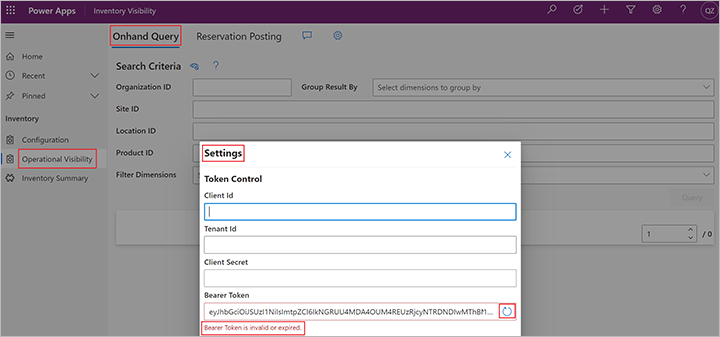

# Use the Inventory Visibility app

[!include [banner](../includes/banner.md)]

This article describes how to use the Inventory Visibility app.

Inventory Visibility provides a model-driven app for visualization. The app contains three pages: **Configuration**, **Operational visibility**, and **Inventory summary**. It has the following features:

- It provides a user interface (UI) for on-hand configuration and soft reservation configuration.
- It supports real-time on-hand inventory queries on various dimension combinations.
- It provides a UI for posting reservation requests.
- It provides a view of the inventory on-hand for products together with all dimensions.
- It provides a view of an on-hand inventory list for products together with predefined dimensions. The on-hand list view can be either a full summary or a preloaded result from an on-hand query.

## Prerequisites

Before you begin, install and set up the Inventory Visibility Add-in as described in [Install and set up Inventory Visibility](inventory-visibility-setup.md).

## Open and authenticate the Inventory Visibility app

To open and authenticate the Inventory Visibility app, follow these steps.

1. Sign in to your Power Apps environment.
1. Open the **Inventory Visibility** app.
1. Open the **Operational Visibility** page from the left pane.
1. Select the **Settings** button (gear symbol) at the top of the page.
1. In the **Settings** dialog box, enter the **Client Id**,**Tenant Id**, and **Client Secret** values that you noted when you [installed and set up Inventory Visibility](inventory-visibility-setup.md).
1. Select the **Refresh** button next to the **Bearer Token** field. The system generates a new bearer token, based on the information that you've entered.

    

1. When you receive a valid bearer token, close the dialog box. The bearer token will expire after some time. Therefore, you must occasionally refresh it when you have to update the configuration, post data, or query data.

## Configure the Inventory Visibility app

The **Configuration** page of the Inventory Visibility app helps you set up the general data management configuration and feature configuration. After the add-in is installed, the default configuration includes a default setup for Microsoft Dynamics 365 Supply Chain Management (the `fno` data source). You can review the default setting. Afterwards, based on your business requirements and the inventory posting requirements of your external system, you can modify the configuration to standardize the way that inventory changes can be posted, organized, and queried across the multiple systems.

For complete details on how to configure the solution, see [Configure Inventory Visibility](inventory-visibility-configuration.md).

## Operational visibility

The **Operational Visibility** page provides the results of a real-time on-hand inventory query, reservation posting, and allocation based on various dimension combinations. When the *OnHandReservation* feature is [turned on](inventory-visibility-configuration.md), you can also post reservation requests from the  **Operational Visibility** page.

### On-hand query

The **Onhand Query** tab of the **Operational Visibility** page lets you query the real-time on-hand inventory. Follow these steps to set up and run a query.

1. Open the **Inventory Visibility** app.
1. Open the **Operational Visibility** page from the left pane.
1. On the **Onhand query** tab, enter the **Organization ID**, **Site ID**, and **Location ID** values that you want to query.
1. In the **Product ID** field, enter one or more product IDs to get an exact match for your query. If you leave **Product ID** field blank, the results will include all products at the specified site and location.
1. To get a more granular result (for example, a view by dimension values such as color and size), select group-by dimensions in the **Group Result By** field.
1. To find items that have a specific dimension value (such as color = red), select the dimension in the **Filter Dimensions** field, and then enter a dimension value.
1. Select **Query**. You'll receive either a success (green) message or a failed (red) message. If the query fails, check your query criteria, and make sure that your [bearer token](#open-authenticate) hasn't expired.

Another way to make an on-hand query is to make direct API requests. You can use either `/api/environment/{environmentId}/onhand/indexquery` or `/api/environment/{environmentId}/onhand`. For more information, see [Inventory Visibility public APIs](inventory-visibility-api.md).

### Reservation posting

Use the **Reservation Posting** tab of the **Operational Visibility** page to post a reservation request. Before you can post a reservation request, you must turn on the *OnHandReservation* feature. For more information about this feature and how to turn it on, see [Inventory Visibility reservations](inventory-visibility-reservations.md).

> [!NOTE]
> The capability to make a soft reservation through the user interface is intended to let you test the feature. Each soft reservation request should be associated with a transaction order line change (creation, modify, delete, and so on). Therefore, we recommend that you make only soft reservations that are linked to a back-end order. For more information, see [Inventory Visibility reservations](inventory-visibility-reservations.md).

Follow these steps to post a soft reservation request by using the user interface.

1. Open the **Inventory Visibility** app.
1. Open the **Operational Visibility** page from the left pane.
1. On the **Reservation Posting** tab, in the **Quantity** field, specify the quantity that you want to soft reserve.
1. Clear the **Enable negative inventory to support oversell** checkbox to prevent the stock from being oversold or over-reserved.
1. In the **Operator** field, select the data source and physical measure that apply to the soft-reserved quantity.
1. Enter the **Organization ID**, **Site ID**, **Location ID**, and **Product ID** values that you want to query.
1. To get a more granular result, select a data source, dimensions, and dimension values.

Another way to post a soft reservation is to make direct API requests. Use the pattern that is described in [Create one reservation event](inventory-visibility-api.md#create-one-reservation-event). Then select **Post**. To view the request response details, select **Show details**. You can also get the `reservationId` value from the response details.

### Allocation

For information about how to manage allocations from the user interface and APIs, see [Inventory Visibility inventory allocation](inventory-visibility-allocation.md).

## Inventory summary

The **Inventory summary** page provides an inventory summary for products together with all dimensions. It's a customized view for the *Inventory OnHand Sum* entity. Inventory summary data is synced periodically from Inventory Visibility.

To enable the **Inventory summary** page and set the synchronization frequency, follow these steps:

1. Open the **Configuration** page.
1. Open the **Feature Management & Settings** tab.
1. Set the toggle switch for the *OnHandMostSpecificBackgroundService* feature to *Yes*.
1. When the feature is enabled, the **Service Configuration** section becomes available and includes a row for configuring the **OnHandMostSpecificBackgroundService** feature. This setting lets you choose the frequency at which inventory summary data is synced. Use the **Up** and **Down** buttons in the **Value** column to change the time between syncs (which can be as low as 5 minutes). Then select **Save**.

    

1. Select **Update configuration** to save all the changes.

> [!NOTE]
> The *OnHandMostSpecificBackgroundService* feature only tracks on-hand inventory changes that occurred after you turned on the feature. Data for products that haven't changed since you turned on the feature won't be synced from the inventory service cache to the Dataverse environment.
>
> When you change the settings for a calculated measure, data on the **On-hand inventory** page won't update automatically until the related product data is modified.
>
> If your **Inventory summary** page doesn't show all of the on-hand information you are expecting, open Supply Chain Management, go to **Inventory Management > Periodic tasks > Inventory Visibility integration**, disable the batch job, and reenable it. This will do the initial push, and all data will sync to the *Inventory OnHand Sum* entity in the next 15 minutes. If you want to use the *OnHandMostSpecificBackgroundService* feature, we recommend that you turn it on before you create any on-hand changes and enable the **Inventory Visibility integration** batch job.

## Preload a streamlined on-hand query

[!INCLUDE [preview-banner-section](../../includes/preview-banner-section.md)]
<!-- KFM: Preview until further notice -->

Supply Chain Management stores a great deal of information about your current on-hand inventory and makes it available for a wide variety of purposes. However, many everyday operations and third-party integrations require just a small subset of these details, and querying the system for all of them can result in large data sets that take time to assemble and transfer. Therefore, the Inventory Visibility service can periodically fetch and store a streamlined set of on-hand inventory data to make that optimized information continuously available. The stored on-hand inventory details are filtered based on configurable business criteria to ensure that only the most relevant information is included. Because the filtered on-hand inventory lists are stored locally in the Inventory Visibility service and are regularly updated, they support quick access, on-demand data exports, and streamlined integration with external systems.

The **Preload the Inventory Visibility Summary** page provides a view for the *On-hand Index Query Preload Results* entity. Unlike the *Inventory summary* entity, the *On-hand Index Query Preload Results* entity provides an on-hand inventory list for products together with selected dimensions. Inventory Visibility syncs the preloaded summary data every 15 minutes.

To view data on the **Preload the Inventory Visibility Summary** tab, you must turn on and configure the *OnHandIndexQueryPreloadBackgroundService* feature. See [Turn on and configure preloaded on-hand queries](inventory-visibility-configuration.md#query-preload-configuration) for instructions.

> [!NOTE]
> As with the *OnHandMostSpecificBackgroundService* feature, the *OnHandIndexQueryPreloadBackgroundService* feature only tracks on-hand inventory changes that occurred after you turned on the feature. Data for products that haven't changed since you turned on the feature won't be synced from the inventory service cache to the Dataverse environment.
>
> When you change the settings for a calculated measure, data on the **OnHand Index Query Preload Results** page won't update automatically until the related product data is modified.
>
> If your **Inventory summary** page doesn't show all of the on-hand information you are expecting, go to **Inventory Management > Periodic tasks > Inventory Visibility integration**, disable the batch job, and reenable it. This will do the initial push, and all data will sync to the *On-hand Index Query Preload Results* entity in next 15 minutes. If you want to use this feature, we recommend that you turn it on before you create any on-hand changes and enable the **Inventory Visibility integration** batch job.

## Filter and browse the inventory summaries

By using the **Advanced filter** that Dataverse provides, you can create a personal view that shows the rows that are important to you. The advanced filter options let you create a wide range of views, from simple to complex. They also let you add grouped and nested conditions to the filters. To learn more about how to use the advanced filter, see [Edit or create personal views using advanced grid filters](/powerapps/user/grid-filters-advanced).

The **Inventory summary** page provides three fields above the grid (**Default dimension**, **Custom dimension**, and **Measure**) that you can use to control which columns are visible. You can also select any column header to filter or sort the current result by that column. The following screenshot highlights the dimension, filtering, result count, and "load more" fields available on the **Inventory summary** page.

Because you'll have predefined the dimensions used for loading summary data, the **Preload the Inventory Visibility summary** page displays dimension-related columns. *The dimensions aren't customizable&mdash;the system only supports site and location dimensions for preloaded on-hand lists.* The **Preload the Inventory Visibility summary** page provides filters that are similar to those on the **Inventory summary** page, except the dimensions are already selected. The following screenshot highlights the filtering fields available on the **Preload the Inventory Visibility summary** page.

At the bottom of the **Preload the Inventory Visibility summary** and  **Inventory summary** pages, you'll find information such as "50 records (29 selected)" or "50 records". This information refers to the currently loaded records from the **Advanced filter** result. The text "29 selected" refers to the number of records that have been selected by using the column header filter for the loaded records. There's also a **Load more** button that you can use to load more records from Dataverse. The default number of loaded records is 50. When you select **Load more**, the next 1,000 available records will be loaded into the view. The number on the **Load more** button indicates the currently loaded records and the total number of records for the **Advanced Filter** result.
