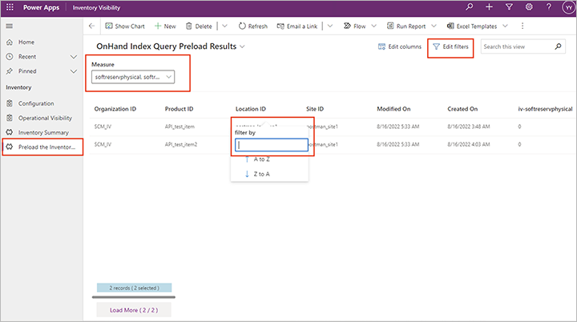

# <a name="preload-streamlined-onhand-query"></a>Preload a streamlined on-hand query

Supply Chain Management stores a great deal of information about your current on-hand inventory and makes it available for a wide variety of purposes. However, many everyday operations and third-party integrations require just a small subset of these details, and querying the system for all of them can result in large data sets that take time to assemble and transfer. Therefore, the Inventory Visibility service can periodically fetch and store a streamlined set of on-hand inventory data to make that optimized information continuously available. The stored on-hand inventory details are filtered based on configurable business criteria to ensure that only the most relevant information is included. Because the filtered on-hand inventory lists are stored locally in the Inventory Visibility service and are regularly updated, they support quick access, on-demand data exports, and streamlined integration with external systems.

The **Preload the Inventory Visibility Summary** page provides a view for the *On-hand Index Query Preload Results* entity. Unlike the *Inventory summary* entity, the *On-hand Index Query Preload Results* entity provides an on-hand inventory list for products together with selected dimensions. Inventory Visibility syncs the preloaded summary data every 15 minutes.

To view data on the **Preload the Inventory Visibility Summary** tab, you must turn on and configure the *OnHandIndexQueryPreloadBackgroundService* feature. See [Turn on and configure preloaded on-hand queries](#query-preload-configuration) for instructions.

> [!NOTE]
> As with the *OnHandMostSpecificBackgroundService* feature, the *OnHandIndexQueryPreloadBackgroundService* feature only tracks on-hand inventory changes that occurred after you turned on the feature. Data for products that haven't changed since you turned on the feature won't be synced from the inventory service cache to the Dataverse environment.
>
> When you change the settings for a calculated measure, data on the **Preload the Inventory Visibility Summary** page won't update automatically until the related product data is modified.
>
> If your **Preload the Inventory Visibility Summary** page doesn't show all of the on-hand information you are expecting, go to **Inventory Management > Periodic tasks > Inventory Visibility integration**, disable the batch job, and reenable it. This will do the initial push, and all data will sync to the *On-hand Index Query Preload Results* entity in next 15 minutes. If you want to use this feature, we recommend that you turn it on before you create any on-hand changes and enable the **Inventory Visibility integration** batch job.

## <a name="query-preload-configuration"></a>Turn on and configure preloaded on-hand queries from Inventory Visibility app

Inventory Visibility can periodically fetch and store a set of on-hand inventory summary data based on your preconfigured dimensions. This provides the following benefits:

- A cleaner view that stores an inventory summary that only includes the dimensions that are relevant to your daily business.
- An inventory summary that is compatible with items enabled for warehouse management processes (WMS).

> [!IMPORTANT]
> We recommend that you use either the *OnHandIndexQueryPreloadBackgroundService* feature or the *OnHandMostSpecificBackgroundService* feature, not both. Enabling both features will impact performance.

If you are using UI version 2, please follow these steps to set up the feature:

1. Sign into the Inventory Visibility power app.
1. Go to **Settings \> Feature Management \> Preloaded Onhand \> Manage**.
    - `Feature Name` is an non-editable field with value "OnHandIndexQueryPreloadBackgroundService"
    - `Enable feature` controls on-off of the feature. Feature is enabled when toggled on, and disabled otherwise. Please remember to update configuration to make this change take effect.

1. Configure the ```group by values``` in the section **Preload Group By Dimensions**
1. Select **New OnHand Index Query Preload Configuration** to create a new onhand index query preload configuration record, you can specify the ```GroupByValue``` and ```order``` fields for this record. After you specify the value, Select **Save & Close**. Preloaded onhand will only take Set 0 as group by value, other sets will be ignored.
1. If you want to change the group-by configurations, you need to go to **Settings \> Admin Settings \> Delete preloaded onhand data \> Manage** to clean up the database and make it ready to accept your new group-by settings.
1. Go to **Settings \> Admin Settings \> Update Configuration \> Manage** to update configuration to activate all the changes.


## Turn on and configure preloaded on-hand queries from Inventory Visibility app's Legacy UI

If you are using UI version 1, please follow these steps to set up the feature:

1. Sign into the Inventory Visibility power app.
1. Go to **Inventory Visibility (Legacy UI) \> Configuration \> Feature Management & Settings**.
1. If the *OnHandIndexQueryPreloadBackgroundService* feature is already enabled, then we recommend you turn it off for now because the cleanup process might take a very long time to complete. You'll turn it on again later in this procedure.
1. Open the **Preload Setting** tab.
1. In the **Step 1: Clean up Preload Storage** section, select **Clean** to clean up the database and make it ready to accept your new group-by settings.
1. In the **Step 2: Set up Group By Values** section, in the **Group Result By** field, enter a comma-separated list of field names by which to group your query results. Once you have data in the preload storage database, you won't be able to change this setting until you clean the database, as described in the previous step.
1. Go to **Inventory Visibility (Legacy UI) \> Configuration \> Feature Management & Settings**.
1. Turn on the *OnHandIndexQueryPreloadBackgroundService* feature.
1. Select **Update Configuration** in the upper-right corner of the **Configuration** page to commit your changes.

## <a name="additional-tip-for-viewing-data"></a>Filter and browse Preload the Inventory Visibility Summary

By using the **Advanced filter** that Dataverse provides, you can create a personal view that shows the rows that are important to you. The advanced filter options let you create a wide range of views, from simple to complex. They also let you add grouped and nested conditions to the filters. To learn more about how to use the advanced filter, see [Edit or create personal views using advanced grid filters](/powerapps/user/grid-filters-advanced).

Because you'll have predefined the dimensions used for loading summary data, the **Preload the Inventory Visibility summary** page displays dimension-related columns. *The dimensions aren't customizable&mdash;the system only supports site and location dimensions for preloaded on-hand lists.* The **Preload the Inventory Visibility summary** page provides filters that are similar to those on the **Inventory summary** page, except the dimensions are already selected. The following screenshot highlights the filtering fields available on the **Preload the Inventory Visibility summary** page.



At the bottom of the **Preload the Inventory Visibility summary** pages, you'll find information such as "50 records (29 selected)" or "50 records". This information refers to the currently loaded records from the **Advanced filter** result. The text "29 selected" refers to the number of records that have been selected by using the column header filter for the loaded records. There's also a **Load more** button that you can use to load more records from Dataverse. The default number of loaded records is 50. When you select **Load more**, the next 1,000 available records will be loaded into the view. The number on the **Load more** button indicates the currently loaded records and the total number of records for the **Advanced Filter** result.
