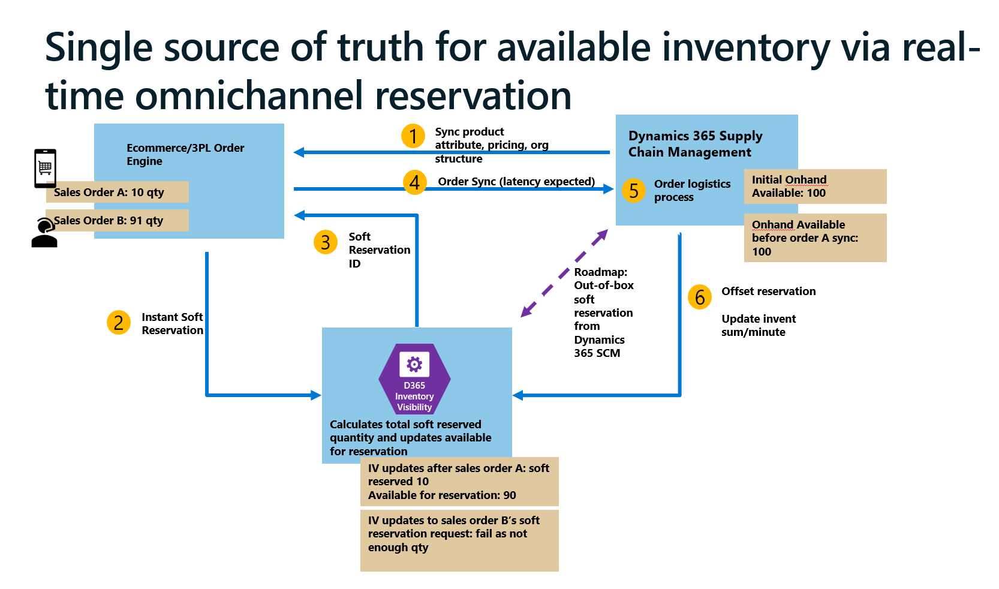

# Inventory Visibility reservations

[!include [banner](../includes/banner.md)]

This article describes a typical use case for soft reservations and explains how to set them up in Inventory Visibility. It includes information about how to create soft reservations, offset them upon physical consumption, and adjust or unreserve specified inventory quantities.

In Microsoft Dynamics 365 Supply Chain Management version 10.0.33 or later, you can make soft reservations from sales orders. Soft reservation requests will then be posted to Inventory Visibility, and the available-for-reservation quantity will be validated in Inventory Visibility.

## Sample use case for soft reservation

Soft reservations help organizations achieve a single source of truth for available inventory, especially during the order fulfillment process. This functionality is useful for organizations where the following conditions exist:

- The organization has at least two different systems that are directly taking outbound orders.
- The organization is very strict and wants to prevent double-booking of product inventory, which can happen if multiple systems are able to overbook the last piece of stock. This situation is prevented when all order systems can make instant soft reservation API calls to Inventory Visibility, which provides a single source of truth for inventory availability.

[](media/inventory-visibility-soft-reservation.png)

The previous illustration shows how soft reservation works and highlights the following operations:

- Your initial inventory level is synced to Inventory Visibility from Microsoft Dynamics 365 Supply Chain Management.
- Soft reservations are posted from each of your order channels or systems to Inventory Visibility. Inventory Visibility validates inventory availability and tries to make a soft reservation. If soft reservation succeeds, Inventory Visibility adds to the soft reserved quantity, deducts from the available for reservation (AFR) quantity, and respond with a soft reservation ID.
- At this time, your physical inventory quantity remains the same.
- You can then sync either single or aggregated soft-reserved orders (order lines) into Supply Chain Management to make hard reservations and release to the warehouse or update the final inventory quantity.
- You can set the system to [offset soft reservations](#offset-scm) when physical inventory is updated in Supply Chain Management.

Soft reservations are usually created, consumed, and canceled by using API calls to the Inventory Visibility service.

> [!NOTE]
> You can optionally set up Supply Chain Management (and other third-party systems) to automatically offset the quantity that has been reserved by using Inventory Visibility. The offset quantity is deleted from the reservation records in Inventory Visibility.
>
> By default, the offset function is automatically turned on when you enable the soft reservation feature.

## <a name="turn-on"></a>Turn on and set up the reservation feature in Inventory Visibility

> [!NOTE]
> If use Inventory Visibility (Legacy UI), please directly follow [Configuration in Inventory Visibility app (Legacy)](#configuration-in-inventory-visibility-app-legacy).

1. Sign in to Power Apps and open Inventory Visibility.
1. Go to **Feature Management** section under **Settings (Preview)** on the left panel.
1. Find **Soft Reservation** feature, click **Managed** button.
1. Turned on **Enable Feature** toggle.

5. Set up **Filter unconfigured dimensions** toggle:

    Users enabled the *Inventory Visibility integration with soft reservation on sales order lines* feature is required to enable the **Filter unconfigured dimensions** toggle. <br>
    This toggle controls the behavior when user reserves with dimensions not specified in [Reservation Dimensions](#configure-reservation-dimensions). <br> 
    - *Disabled* - Reservation requests including dimensions not defined in Reservation Dimensions will fail.
    - *Enabled* - Reservation requests including dimensions not defined in Reservation Dimensions will fail, but undefined dimensions will be ignored.

    When switching the status of **Filter unconfigured dimensions** toggle, previous reservation should all be reversed for data consistency. Use [Clean up reservation data API](inventory-visibility-api.md#clean-up-reservation-data) to clean up existing soft reservation records.

### Configure Reservation Mappings

When you make a reservation, you might want to know whether on-hand inventory is currently available for reservation. The validation is linked to a calculated measure that represents a computation formula of a combination of physical measures.

By setting up the mapping from the physical measure to the calculated measure, you enable the Inventory Visibility service to automatically validate reservation availability, based on the physical measure.

We have already provided default Reservation mappings, you can check and use them directly, you can also follow steps below to define your own Reservation mappings.

Please note that the physical measures, calculated measures, and their data sources must be defined on the **Data source settings** under **Feature Management** tab. For how to configure measures and data sources, see [Configure Inventory Visibility](inventory-visibility-configuration.md) for more details.

1. Define the physical measure that serves as the soft reservation measure (for example, `SoftReservPhysical`).
1. Define the *available for reservation* (AFR) calculated measure that contains the AFR computation formula that you want to map to the physical measure. For example, you might set up `AvailableToReserve` (available for reservation) so that it's mapped to the previously defined `SoftReservPhysical` physical measure. In this way, you can find which quantities that have the `SoftReservPhysical` inventory status will be available for reservation. The following table shows the AFR computation formula.

    | Calculation type | Data source | Physical measure |
    |---|---|---|
    | Addition | `fno` | `AvailPhysical` |
    | Addition | `pos` | `Inbound` |
    | Subtraction | `pos` | `Outbound` |
    | Subtraction | `iv` | `SoftReservPhysical` |

    We recommend that you set up the physical measure on which the reservation measure is based as a component of the calculated measure. In this way, the calculated measure quantity will be affected by the quantity of reservation. For example, here we use the `SoftReservPhysical` physical measure from `iv` as a component of the `AvailableToReserve` calculated measure of the `iv` data source.

1. In the **Reservation mapping** section, set up the mapping from the physical measure to the calculated measure. As for the previous example, you might use the following settings to map `AvailableToReserve` to the previously defined `SoftReservPhysical` physical measure.

    | Physical measure data source | Physical measure | Available for reservation data source | Available for reservation calculated measure |
    |---|---|---|---|
    | `iv` | `SoftReservPhysical` | `iv` | `AvailableToReserve` |

Now, when you do reservation on `SoftReservPhysical`, Inventory Visibility will automatically find `AvailableToReserve` and its related computation formula to do the reservation validation.

For example, when you have the following on-hand inventory in Inventory Visibility.

```json
{
    "productId": "D0002",
    "dimensions": {
        "SiteId": "1",
        "LocationId": "11",
        "ColorId": "Red"
    },
    "quantities": {
        "iv": {
            "SoftReservPhysical": 90
        },
        "fno": {
            "availphysical": 70.0,
        },
        "pos": {
            "inbound": 50.0,
            "outbound": 20.0
        }
    }
}
```

In this case, the following calculation applies:

`AvailableToReserve` = `fno.availphysical` + `pos.inbound` – `pos.outbound` – `iv.SoftReservPhysical`  
= 70 + 50 – 20 – 90  
= 10

Therefore, if you try to make reservations on `iv.SoftReservPhysical`, and the quantity is less than or equal to `AvailableToReserve` (10), the soft reservation request will succeed.

### Configure Reservation Dimensions

The reservation dimensions configuration lists feasible product dimensions when reservations are made. <br>**Reservation dimensions must contain partition configuration as components.**

Here's an example of reservation dimensions.

| Base dimension | Hierarchy |
|---|---|
| `SiteId` | 1 |
| `LocationId` | 2 |
| `ColorId` | 3 |
| `SizeId` | 4 |
| `StyleId` | 5 |

In this example, the partition schema is ByLocation, the basic partition dimension is `(SiteId, LocationId)`. 

### Configuration in Inventory Visibility app (Legacy)

1. Sign in to the Inventory Visibility app.
1. Open the **Configuration** page, select the `Use Soft Reservation for Sales Order in FinOps` checkbox if you plan to receive soft reservation data from Dynamics 365 Supply Chain Management.
1. Review the default soft reservation hierarchy on the **Soft Reservation** tab. Add new dimensions to the hierarchy if required.
1. In the **Set Soft Reservation Mapping** section, view the default settings. By default, the soft-reserved inventory quantities will be recorded against the `softreservephysical` physical measure of the data source `iv`. The *Available for reservation* calculated measure is mapped to `availabletoreserve`. If you want to update the `availabletoreserve` calculated measure, go to the **Configuration** page, and then, on the **Calculated Measure** tab, expand and modify the calculated measure.

Please go to sections [reservation mappings](#configure-reservation-mappings) and [reservation hierarchy](#configure-reservation-dimensions) for details.

## Use the reservation feature in Inventory Visibility

When you call the reservation API, the system marks the reservation of the specified goods and quantities.

Here's an example scenario and a sample API query body. The company Contoso sells product D0002 (Cabinet) from its e-commerce website. A customer places a sales order for a small red cabinet via the website. Contoso decides to fulfill this order by using the following dimensions:

- Organization ID = usmf
- Site = 1
- Warehouse = 11
- Product = D0002
- Color = red
- Size = small

Contoso has already set up an API connection to Inventory Visibility from its own e-commerce system. When the order is received, the system instantly triggers an API call to make a soft reservation for the cabinet in Inventory Visibility.

### Create soft reservations using the reservation API

Reservations are made in the Inventory Visibility service by submitting a POST request to the service's URL, such as `/api/environment/{environmentId}/onhand/reserve`.

For a reservation, the request body must contain an organization ID, a product ID, reserved quantities, and dimensions.

When you call the reservation API, you can control the reservation validation by specifying the Boolean `ifCheckAvailForReserv` parameter in the request body. A value of `True` means that the validation is required, whereas a value of `False` means that the validation isn't required. The default value is `True`.

If you want to cancel a reservation or unreserve specified inventory quantities, set the quantity to a negative value, and set the `ifCheckAvailForReserv` parameter to `False` to skip the validation.

Here's an example of the request body that references the sales order in the previous context.

```json
# Url

#Replace {endpoint} with your system endpoint.
    {endpoint}/api/environment/{environmentId}/onhand/reserve

# Method
Post

# Header
# replace {access_token} with the one get from security service
Api-version: "1.0"
Content-Type: "application/json"
Authorization: "Bearer {access_token}"

# Body
{
    "id": "Testrequest",
    "organizationId": "usmf",
    "productId": "D0002",
    "dimensions": {
        "SiteId": "1",
        "LocationId": "11",
        "ColorId": "red",
        "SizeId": "small"
    },
    "quantityDataSource": "iv",
    "modifier": "softreservphysical",
    "quantity": 1,
    "ifCheckAvailForReserv": true
}
```
`dimensions` must be defined in [Reservation Dimensions](#configure-reservation-dimensions) and must contain the partition for the product. Here are examples of feasible dimension combinations using default configuration.
 
- `(SiteId, LocationId)`
- `(SiteId, LocationId, SizeId)`
- `(SiteId, LocationId, ColorId, SizeId)`
- `(SiteId, LocationId, ColorId, SizeId, StyleId)`

> [!NOTE]
> Reservation on different *dimension level* are independent. For example, suppose your defined Reservation Dimensions are \[`SiteId`, `LocationId`, `ColorId`, `SizeId`\]. If you reserve some quantity for one product on dimension level \[`SiteId`, `LocationId`, `ColorId`\], reservations on other levels, like \[`Site`, `Location`, `Color`, `Size`\] or \[`Site`, `Location`\] will not be affected.

A successful soft reservation request returns a *soft reservation ID* for each reservation record. The soft reservation ID isn't a unique identifier for an individual soft reservation record, but a combination of the product ID and dimension values that are associated with the soft reservation request. You can record the soft reservation ID on the order line when you sync the successfully reserved orders to Supply Chain Management or another ERP system for offset.

## <a name="offset-scm"></a>Integration soft reservations and offsets with Supply Chain Management

You can trigger a soft reservation from a Supply Chain Management sales order and then make an offset back to Inventory Visibility when the order lines are hard reserved (that is, changed to a status of *Reserve physical*, *Reserve ordered*, *Picked*, and so on). The process differs slightly, depending on the soft reservation feature that you're using (*Inventory Visibility integration with reservation offset* or *Inventory Visibility integration with soft reservation on sales order lines*).

### Configuration in Dynamics 365 Supply Chain Management

1. Sign in to Supply Chain Management, and make sure that you've enabled **one** of the following two features in [feature management](../../fin-ops-core/fin-ops/get-started/feature-management/feature-management-overview.md). *Do not enable both features.*

    - *Inventory Visibility integration with reservation offset* – This feature requires version 10.0.22 or later.
    - *Inventory Visibility integration with soft reservation on sales order lines* – This feature is recommended if you're running Supply Chain Management 10.0.33 or later.

    > [!IMPORTANT]
    > These two features are incompatible with each other. Therefore, enable only one of them. We recommend that you enable *Inventory Visibility integration with soft reservation on sales order lines* for all new installations that are running Supply Chain Management version 10.0.33 or later. If you're already using the *Inventory Visibility integration with reservation offset* feature, you can continue to use it if you don't have to make direct soft reservations from Supply Chain Management sales orders. However, you can also change to the newer feature if you prefer, provided that you meet the system requirements.

#### Configure additional settings if the Inventory Visibility integration with soft reservation on sales order lines feature is enabled

If you enabled the *Inventory Visibility integration with soft reservation on sales order lines* feature, follow these steps to configure additional settings.

1. In Supply Chain Management, go to **Inventory Management \> Setup \> Inventory Visibility integration parameters**.
1. On the **Enable soft reservation** tab, in the **Default soft reserve block level** field, specify how the system should behave if you try to process sales order lines that no soft reservation exists for in Inventory Visibility. Select one of the following values:

    - *Block* – You won't be able to process a sales order line to a hard reservation (reserve physical) or further unless Inventory Visibility has already recorded a successful soft reservation for the line.
    - *Warning* – You'll receive a warning message if you try to process a sales order line to a hard reservation (reserve physical) but no matching soft reservation has been made in Inventory Visibility.
    - *Ignore* – The system won't check for a soft reservation in Inventory Visibility when you try to process order lines in Supply Chain Management.

> [!TIP]
> You don't have to enable or set up the offset modifier, because offset for soft reservation is always enabled and will be triggered when a sales line proceeds to hard reservation status (or further, if the hard reservation step is skipped).

#### Configure additional settings if the Inventory Visibility integration with reservation offset feature is enabled

If you enabled the *Inventory Visibility integration with reservation offset* feature, follow these steps to configure additional settings.

1. In Supply Chain Management, go to **Inventory Management \> Setup \> Inventory Visibility integration parameters**.
1. On the **Reservation offset** tab, set the following fields:

    - **Enable reservation offset** – Set to *Yes* to enable this functionality.
    - **Reservation offset modifier** – Select the inventory transaction status that will offset reservations that are made in Inventory Visibility. This setting determines the order processing stage that triggers offsets. The stage is traced by the order's inventory transaction status. Select one of the following values:

        - *On order* – Orders that have an *On order* status will send an offset request when they're created. The offset quantity will be the quantity of the created order (line).
        - *Reserve* – Orders that have a *Reserve* status will send an offset request when they're either order reserved or physically reserved. When you offset at the *Reserve* status, the order will send an offset request at any new inventory status that's closest to reserved picked (for example, pick, packing-slip posted, or invoiced). This behavior occurs even if you skip the reservation in Supply Chain Management and continue to another inventory status (for example, if you skip from release to warehouse to pick and pack). The request will be triggered only once. If it's been triggered at pick, it won't duplicate the offset when a packing slip is posted. The offset quantity will be the same as the quantity of the inventory transaction status when the offset was triggered (in other words, *Reserved ordered*/*Reserve Physical*, or a later status, on the corresponding order line).

### Create soft reservations and offsets when you use the Inventory Visibility integration with soft reservation on sales order lines feature

When you use the *Inventory Visibility integration with soft reservation on sales order lines* feature, you can post soft reservations and also offset soft reservations from sales order lines in Supply Chain Management. The offset capabilities in this feature support both *internally* and *externally* created sales lines.

1. Sign in to Supply Chain Management
1. Go to **Sales and marketing \> Sales Orders \> All Sales Orders**.
1. On the Action Pane, select **New** to create a sales order.
1. Fill in the **Create sales order** dialog box in the usual way, and then select **OK** to finish creating the new order.
1. The new order is opened. Enter a sales line. Be sure to specify **Product ID**, **Site**, **Warehouse**, and **Quantity** values. Specify any other inventory dimension values that are applicable.
1. There are two ways to make a soft reservation from a sales order. Follow one of these steps:

    - *To soft reserve the whole order, including all lines*, select **Inventory Visibility integration \> Soft reservation** on the Action Pane. Then select one of the following options:

        - **Reserve entire order directly** – Make an instant soft reservation API call to Inventory Visibility.
        - **Reserve entire order by batch** – Add the reservation requests to a batch queue that's associated with a batch job that syncs Supply Chain Management with Inventory Visibility about once per minute.

    - *To soft reserve a specific order line*, select the sales line, and then select **Inventory \> Inventory Visibility integration \> Soft reserve** on the toolbar of the FastTab toolbar to open the **Inventory service reservation details** dialog box. Then select either to reserve directly or to add the reservation as a batch job. The following information is shown:

        - **Unreserved** – The quantity that wasn't soft reserved.
        - **Soft reserve success** – The quantity that was successfully soft reserved.
        - **Batch reserve in progress** – The quantity that was added to the soft reservation batch queue.
        - **Direct reserve in progress** – The quantity that triggered an instant soft reservation API call to Inventory Visibility.
        - **Failed - not enough stock** – The quantity that couldn't be soft reserved because of unavailable stock.
        - **Failed - other reason** – The quantity that couldn't be soft reserved for another reason, such as a failed API call, connection issues, or other issues.
        - **Offset quantity** – The total offset quantity, including both offset success and in-progress quantities.
        - **Pending to offset quantity** – The quantity that skipped soft reservation and proceeded directly to hard reservation or further physical inventory consumption.

1. To view and edit the soft reservation status of a sales line, select the line on the **Sales order lines** FastTab, and then, on the **Line details** FastTab, select the **General** tab. If your system is set to block or warn when a soft reservation couldn't be made, you might see a block notice here. To help avoid the risk of overselling, we strongly recommend that you don't choose to override the soft reservation validation unless overrides are permitted in your business.

    When a soft reservation is successfully made, a soft reservation ID is automatically returned and recorded for each sales line.

    By default, the soft reservation offset is triggered when the line reaches a hard reservation status (*Reserve physical* or *Reserve ordered*) or later. Sales lines that show a valid soft reservation ID and a qualifying trigger status will automatically be added to the offset batch queue.

> [!NOTE]
> If you must reverse a successful soft reservation, open the relevant sales order, and then select **Revert reservation directly** or **Revert reservation by batch** at the sales order or sales line level.

### Import sales orders that have been soft reserved externally

It's likely that your company has other order channels that also post soft reservation to Inventory Visibility. Sales orders that have been soft reserved externally might have to be imported into Supply Chain Management if you're using it as your system of record. Follow these steps to import sales orders that have been soft reserved externally.

1. Sign in to Supply Chain Management.
1. Go to **System Administration \> Work spaces \> Data management**.
1. Select the **Framework parameters** tile.
1. On the **Data import/export framework parameters** page, on the **Entity settings** tab, select **Refresh entity list**.
1. Go back to **System Administration \> Work spaces \> Data management**.
1. Select the **Export** tile.
1. On the **New Record** page, in the **Group name** field, enter a name.
1. On the **Selected entities** FastTab, select **Add entity** on the toolbar, and then, in the drop-down dialog box, set the following values:

    - **Entity name** – Select *Sales order lines V2*.
    - **Target data format** – Select *Excel*.
    - **Select fields** – Select *Importable fields*.

1. Select **Add** to apply your settings, and then select **Close** to close the dialog box.
1. A new line is added to the grid. On the new line, select the button in the **Filter** column.
1. In the **Inquiry** dialog box, the grid on the **Range** tab should already have one row. Edit the row so that it has the following values:

    - **Table** – Select *Sales order lines V2*.
    - **Derived table** – Select *Sales order lines V2*.
    - **Field** – Select *Sales order*.
    - **Criteria** – Select any sales order number.

1. Select **OK** to apply your settings and close the dialog box.
1. On the Action Pane, select **Export**.
1. On the **Execution summary** page, on the **Entity processing status** FastTab, select **Download file** on the toolbar.
1. Open the downloaded file in Excel, and remove all the data rows. Leave only the header row.
1. Add new rows that include the sales order line details that you want to import into Supply Chain Management.
1. For each row, in addition to the usual order data, be sure to include soft reservation details in the following columns:

    - **INVENTORYSERVICERESERVATIONID** – Enter the soft reservation ID from the external reservation.
    - **ISSOFTRESERVEDEXTERNALLY** – Enter *Yes*.

1. Import the completed Excel file. You'll be able to check import status after completion.
1. After the file is successfully imported, you can confirm that the new sales orders have soft reservation details by opening those orders in Supply Chain Management.

> [!NOTE]
> After you import sales orders that include soft reservation details, you won't be able to modify the soft reservation or revert it from Supply Chain Management. If the data that you imported isn't correct, delete the affected sales line, and then re-import it.

### Create soft reservations and offsets when you use the Inventory Visibility integration with reservation offset feature

When you use the *Inventory Visibility integration with reservation offset* feature, you can't trigger soft reservation directly from Supply Chain Management. Instead, this feature supports only the offset of sales order lines that were created *externally* from Supply Chain Management. When externally created soft-reserved sales lines are replicated into Supply Chain Management, offsets might be required from Supply Chain Management to Inventory Visibility.

You can offset a soft-reserved quantity after the quantity on an order is physically deducted in Supply Chain Management or another ERP system. Inventory Visibility offers out-of-box soft reservation offset integration with Supply Chain Management.

Follow these steps to offset a soft reservation.

1. Sign in to Supply Chain Management.
1. Go to **Sales and marketing \> Sales Orders \> All Sales Orders**.
1. On the Action Pane, select **New**. Create a new order and a new sales line.
1. Re-create the external sales order, and add a sales line that uses the same product ID, organization, site, warehouse, and dimensions values.
1. On the **Sales order lines** FastTab, select the sales line that you just entered, and then, on the toolbar, select **Inventory \> Reservation ID**.
1. Follow one of these steps:

    - Copy the soft reservation ID in your soft reservation request response, and paste it into the **Reservation ID** field.
    - Leave the **Reservation ID** field blank, but select the **Inventory service auto offset** checkbox. The system will automatically determine which product and product dimensions to offset, based on the item ID and dimension values that are entered on the selected line.

1. Select **OK**.
1. While the same sales line is still selected, physically reserve the ordered quantity by selecting **Inventory \> Reservation** on the toolbar of the **Sales order lines** FastTab.
1. If you've previously set the **Reservation offset modifier** field to *Reserved*, the offset will be triggered when the order line has a status of *Reserve physical* or *Reserve ordered*. A batch job runs once a minute to sync offset requests from Supply Chain Management to Inventory Visibility.

> [!NOTE]
> For transaction statuses that include a specified reserve offset modifier, the transaction update will offset the corresponding reservation record when all the following conditions are met:
>
> - The reservation ID on the inventory transaction matches the reservation ID of the reservation record in Inventory Visibility.
> - The dimensions of the inventory transaction match the dimensions of the reservation record in Inventory Visibility.
> - Changes in inventory transaction status trigger offsets for reservations when the inventory transaction status reflects the fact that an order process has been completed or skipped.

Offset quantities follow the inventory quantities that are specified on the relevant inventory transactions. An offset will take effect only if reserved quantity remains in Inventory Visibility.

### Check for failed reservation offsets

To check for failed reservation offsets, go to **Inventory Management \> Periodic tasks \> Inventory Visibility integration**. A failed offset might be caused by an incorrect soft reservation ID, an internet issue, a broken system connection, and so on.

### Cancel or revert a soft reservation

If an original order line is canceled or deleted, and you must revert the corresponding soft reservation, post a negative quantity that has the exact same information in your API query body.
