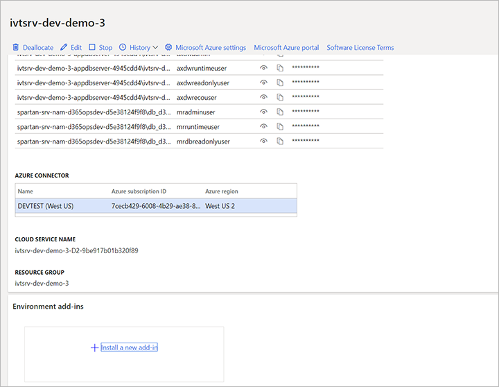
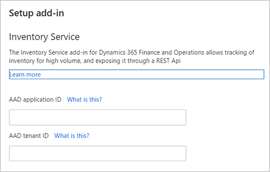

# Install and set up Inventory Visibility

[!include [banner](../includes/banner.md)]

This article describes how to install the Inventory Visibility Add-in for Microsoft Dynamics 365 Supply Chain Management.

You must use [Microsoft Dynamics Lifecycle Services](https://lcs.dynamics.com/v2) to install the Inventory Visibility Add-in. Lifecycle Services is a collaboration portal that provides an environment and a set of regularly updated services that help you manage the application lifecycle of your finance and operations apps. For more information, see [Lifecycle Services resources](../../fin-ops-core/dev-itpro/lifecycle-services/lcs.md).

> [!TIP]
> We recommend that you join the Inventory Visibility Add-in user group, where you can find useful guides, get our latest updates, and post any questions you may have about using Inventory Visibility. To join, please send email to the Inventory Visibility product team at [inventvisibilitysupp@microsoft.com](mailto:inventvisibilitysupp@microsoft.com) and include your Supply Chain Management environment ID.

## Inventory Visibility prerequisites

Before you install the Inventory Visibility, you must complete the following tasks:

- Obtain a Lifecycle Services implementation project where at least one environment is deployed.
- Make sure that the prerequisites for setting up add-ins have been completed. For information about these prerequisites, see [Add-ins overview](../../fin-ops-core/dev-itpro/power-platform/add-ins-overview.md). Inventory Visibility doesn't require dual-write linking.

The following table lists the countries/regions where Inventory Visibility is currently supported.

| Azure region | Region short name |
|---|---|
| Asia East | eas |
| Asia Southeast | seas |
| Australia East | eau |
| Australia Southeast | seau |
| Brazil South | sbr |
| Canada Central | cca |
| Canada East | eca |
| China East 2 | cne2 |
| China North 2 | cnn2 |
| Europe North | neu |
| Europe West | weu |
| France Central | cfr |
| France South | sfr |
| India Central | cin |
| India South | sin |
| Japan East | ejp |
| Japan West | wjp |
| Norway East | eno |
| Norway West | wno |
| South Africa West | wza |
| South Africa North | nza |
| Switzerland North | nch |
| Switzerland West | wch |
| UAE North | nae |
| UK South | suk |
| UK West | wuk |
| US East | eus |
| US West | wus |

If you have any questions about these prerequisites, contact the Inventory Visibility product team at [inventvisibilitysupp@microsoft.com](mailto:inventvisibilitysupp@microsoft.com).

## Install the Inventory Visibility Add-in

Before you install the add-in, register an application and add a client secret to Azure Active Directory (Azure AD) under your Azure subscription. For instructions, see [Register an application](/azure/active-directory/develop/quickstart-register-app) and [Add a client secret](/azure/active-directory/develop/quickstart-register-app#add-a-certificate). Be sure to make a note of the **Application (client) ID**, **Client secret**, and **Tenant ID** values, because you'll need them later.

> [!IMPORTANT]
> If you have more than one Lifecycle Services environment, create a different Azure AD application for each of them. If you use the same application ID and tenant ID to install the Inventory Visibility Add-in for different environments, a token issue will occur for older environments. As a result, only the last installation will be valid.

After you register an application and add a client secret to Azure AD, follow these steps to install the Inventory Visibility Add-in.

1. Sign in to [Lifecycle Services](https://lcs.dynamics.com/Logon/Index).
1. On the home page, select the project where your environment is deployed.
1. On the project page, select the environment where you want to install the add-in.
1. On the environment page, scroll down until you find the **Environment add-ins** section in the **Power Platform integration** section. There, you can find the Dataverse environment name. Confirm that the Dataverse environment name is the one that you want to use for Inventory Visibility.

    > [!NOTE]
    > Currently, only Dataverse environments that were created by using Lifecycle Services are supported. If your Dataverse environment was created in some other way (for example, by using the PowerApps Admin Center), and if it's linked to your Supply Chain Management environment, you must first fix the mapping issue before installing Inventory Visibility Add-in.
    >
    > It's possible that your dual-write environment is linked to a Dataverse instance while Lifecycle Services is not set up for Power Platform integration. This linking mismatch can cause unexpected behavior. We recommend that the Lifecycle Services environment details match what you are connected to in dual-write so that the same connection can be used by business events, virtual tables, and add-ins. See [Linking mismatch](../../fin-ops-core/dev-itpro/data-entities/dual-write/lcs-setup.md#linking-mismatch) for information about how to fix the mapping issue. Once the mapping issue is resolved, you can then proceed to install Inventory Visibility.

1. In the **Environment add-ins** section, select **Install a new add-in**.

    

1. Select the **Install a new add-in** link. A list of available add-ins appears.
1. In the list, select **Inventory Visibility**.
1. Set the following fields for your environment:

    - **AAD application (client) ID** – Enter the Azure AD application ID that you created and made a note of earlier.
    - **AAD tenant ID** – Enter the tenant ID that you made a note of earlier.

    

1. Agree to the terms and condition by selecting the **Terms and conditions** checkbox.
1. Select **Install**. The status of the add-in is shown as **Installing**. When the installation is completed, refresh the page. The status should change to **Installed**.
1. In Dataverse, select the **Apps** section in the left navigation, and verify that the **Inventory Visibility** Power Apps is installed successfully. If the **Apps** section doesn't exist, contact the Inventory Visibility product team at [inventvisibilitysupp@microsoft.com](mailto:inventvisibilitysupp@microsoft.com).

> [!NOTE]
> If the system warns you that you don't have permission to install Inventory Visibility on Lifecycle Services, you must contact the administrator to modify your permission.
>
> If it takes more than an hour to install from the Lifecycle Services page, then your user account probably lacks permission to install solutions in the Dataverse environment. Follow these steps to resolve the issue:
>
> 1. Cancel the Inventory visibility add-in installation process from the Lifecycle Services page.
> 1. Sign in to the [Microsoft 365 admin center](https://admin.microsoft.com) and make sure that the user account you want to use to install the add-in has the "Dynamics 365 Unified Operations Plan" license assigned to it. Assign the license if needed.
> 1. Sign in to the [Power Platform admin center](https://admin.powerplatform.microsoft.com) using the relevant user account. Then install the inventory visibility add-in by doing the following steps:
>     1. Select the environment where you want to install the add-in.
>     1. Select **Dynamics 365 Apps**.
>     1. Select **Install App**.
>     1. Select **Inventory Visibility**
>
> 1. After the installation is completed, go back to the Lifecycle Services page and try again to reinstall the **Inventory Visibility** add-in.

## Set up Inventory Visibility in Supply Chain Management

### Deploy the Inventory Visibility integration package

If you're running Supply Chain Management version 10.0.17 or earlier, contact the Inventory Visibility on-board support team at [inventvisibilitysupp@microsoft.com](mailto:inventvisibilitysupp@microsoft.com) to get the package file. Then deploy the package in Lifecycle Services.

> [!NOTE]
> If a version mismatch error occurs during deployment, you must manually import the X++ project into your development environment. Then create the deployable package in your development environment, and deploy it in your production environment.
>
> The code is included with Supply Chain Management version 10.0.18. If you're running that version or later, deployment isn't required.

Make sure that the following features are turned on in your Supply Chain Management environment. (By default, they're turned on.)

| Feature description | Code version | Toggle class |
|---|---|---|
| Enable or disable using inventory dimensions on InventSum table      | 10.0.11 | InventUseDimOfInventSumToggle      |
| Enable or disable using inventory dimensions on InventSumDelta table | 10.0.12 | InventUseDimOfInventSumDeltaToggle |

### Set up Inventory Visibility integration

Once you've installed the add-in, prepare your Supply Chain Management system to work with it by doing the following steps.

1. In Supply Chain Management, open the **[Feature management](../../fin-ops-core/fin-ops/get-started/feature-management/feature-management-overview.md)** workspace, and turn on the *Inventory Visibility Integration* feature.
1. Go to **Inventory Management \> Set up \> Inventory Visibility Integration parameters**.
1. Open the **General** tab and make the following settings:
    - **Inventory Visibility endpoint** – Enter the URL of the environment where you're running Inventory Visibility. For more information, see [Find the service endpoint](inventory-visibility-configuration.md#get-service-endpoint).
    - **Maximum number of records in a single request** – Set to the maximum number of records to include in a single request. You must enter a positive integer less than or equal to 1000. The default value is 512. We strongly recommend keeping the default value unless you have received advice from Microsoft Support or are otherwise certain that you need to change it.

1. Go to **Inventory Management \> Periodic \> Inventory Visibility Integration**, and enable the job. All inventory change events from Supply Chain Management will now be posted to Inventory Visibility.
1. The following optional features enhance the functionality of Inventory Visibility. Decide whether you want to use one or both of these features. If you do, set them up. (You can also set them up later.)

    - **Soft reservations and offsets** – Soft reservations help organizations achieve a single source of truth for available inventory, especially during the order fulfillment process. For information about how to enable and set up this feature, see [Inventory Visibility reservations](inventory-visibility-reservations.md).
    - **Support for warehouse management processes (WMS) items** – This feature lets you use WMS items with Inventory Visibility. For information about how to enable and set up this feature, see [Inventory Visibility support for WMS items](inventory-visibility-whs-support.md).

## Uninstall the Inventory Visibility Add-in

To uninstall the Inventory Visibility Add-in, follow these steps:

1. Sign in to Supply Chain Management.
1. Go to **Inventory Management \> Periodic \> Inventory Visibility Integration** and disable the job.
1. Go to Lifecycle Services and open the page for the environment where you want to uninstall the add-in  (see also [Install the Inventory Visibility Add-in](#install-add-in)).
1. Select **Uninstall**.
1. The uninstallation process now terminates the Inventory Visibility Add-in, unregisters the add-in from Lifecycle Services, and deletes any temporary data that is stored in the Inventory Visibility Add-in data cache. However,  primary inventory data that was synced to your Dataverse subscription is still stored there. To delete this data, complete the rest of this procedure.
1. Open [Power Apps](https://make.powerapps.com).
1. Select **Environment** on the navigation bar.
1. Select the Dataverse environment that is bonded with your Lifecycle Services environment.
1. Go to **Solutions** and delete the following solutions in the following order:
    1. Dynamics 365 Inventory Visibility – Anchor
    1. Dynamics 365 Inventory Visibility – Plugins
    1. Dynamics 365 Inventory Visibility – Application
    1. Dynamics 365 Inventory Visibility – Controls
    1. Dynamics 365 Inventory Visibility – Base

    After you delete these solutions, the data that is stored in tables will also be deleted.

> [!NOTE]
> If you restore a Supply Chain Management database after uninstalling the Inventory Visibility Add-in, and then want to reinstall the add-in, make sure that you have deleted the old Inventory Visibility data that is stored in your Dataverse subscription (as described in the previous procedure) before you reinstall the add-in. This will prevent data inconsistency issues that could otherwise occur.

## Clean Inventory Visibility data from Dataverse before restoring the Supply Chain Management database

If you have been using Inventory Visibility and then restore your Supply Chain Management database, then your restored database may contain data that is no longer consistent with data previously synced by Inventory Visibility to Dataverse. This data inconsistency can cause system errors and other issues. Therefore, it's important that you always clean all Inventory Visibility data from Dataverse before you restore a Supply Chain Management database.

If you need to restore a Supply Chain Management database, use the following procedure:

1. Uninstall the Inventory Visibility Add-in and remove all related data in Dataverse, as described in [Uninstall the Inventory Visibility Add-in](#uninstall-add-in)
1. Restore your Supply Chain Management database, for example as described in [Database point-in-time restore (PITR)](../../fin-ops-core/dev-itpro/database/database-point-in-time-restore.md) or [Point-in-time restore of the production database to a sandbox environment](../../fin-ops-core/dev-itpro/database/database-pitr-prod-sandbox.md).
1. If you still want to use it, then reinstall and set up the Inventory Visibility Add-in as described in [Install the Inventory Visibility Add-in](#install-add-in) and [Set up Inventory Visibility integration](#setup-inventory-visibility-integration)

[!INCLUDE[footer-include](../../includes/footer-banner.md)]
