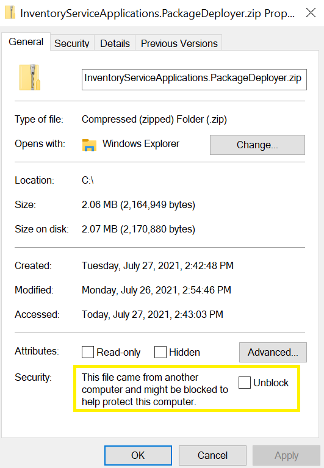

# Inventory Visibility setup

[!include [banner](../includes/banner.md)]
[!include [preview banner](../includes/preview-banner.md)]
[!INCLUDE [cc-data-platform-banner](../../includes/cc-data-platform-banner.md)]

This topic describes how to install the Inventory Visibility Add-in for Dynamics 365 Supply Chain Management.

You must install the Inventory Visibility Add-in using Microsoft Dynamics Lifecycle Services (LCS). LCS is a collaboration portal that provides an environment and a set of regularly updated services that help you manage the application lifecycle of your Dynamics 365 finance and operations apps.

For more information, see [Lifecycle Services resources](../../fin-ops-core/dev-itpro/lifecycle-services/lcs.md).

## Inventory Visibility prerequisites

Before you install the Inventory Visibility, you must do the following:

- Obtain an LCS implementation project with at least one environment deployed.
- Make sure that the prerequisites for setting up add-ins provided in the [Add-ins overview](../../fin-ops-core/dev-itpro/power-platform/add-ins-overview.md) have been completed. Inventory Visibility doesn't require dual-write linking.
- Contact the Inventory Visibility team at [inventvisibilitysupp@microsoft.com](mailto:inventvisibilitysupp@microsoft.com) to get the following required files:
  - `InventoryServiceApplication.PackageDeployer.zip`
  - `Inventory Visibility Integration.zip` (if the version of Supply Chain Management that you're running is earlier than version 10.0.18)

> [!NOTE]
> The currently supported countries and regions include: Canada (CCA, ECA), the United States (WUS, EUS), the European Union (NEU, WEU), the United Kingdom (SUK, WUK), and Australia (EAU, SEAU).

If you have any questions about these prerequisites, please contact the Inventory Visibility product team.

## Set up Dataverse

To set up Dataverse for use with Inventory Visibility, use the package deployer tool to deploy the Inventory Visibility package. The following subsections describe how to complete each of these tasks.

> [!NOTE]
> Currently, we only support Dataverse environments created using the LCS page. If your Dataverse environment was created in some other way (such as using the Power Apps admin center) and is linked to your Supply Chain Management environment, please contact the Inventory Visibility product team to resolve the mapping issue first and then install Inventory Visibility.

### Migrate from an old version of Dataverse solution

If you have installed an older version of the Inventory Visibility Dataverse solution, follow the below instruction to update your version. There are two cases:

- Case 1: If you set up Dataverse manually by importing the solution `Inventory Visibility Dataverse Solution_1_0_0_2_managed.zip`, then do the following steps:

    1. download the following three files:
      - `Inventory Visibility Dataverse Solution_1_0_0_3_managed.zip`
      - `InventoryServiceBase_managed.cab`
      - `InventoryServiceApplication.PackageDeployer.zip`

    1. Manually import `Inventory Visibility Dataverse Solution_1_0_0_3_managed.zip` and `InventoryServiceBase_managed.cab` into Dataverse by doing the following steps:
       1. Open the URL of your Dataverse environment.
       1. Go to the **Solutions** page.
       1. Select **Import**.

    1. Use the package deployer tool deploy the `InventoryServiceApplication.PackageDeployer.zip` package. See the [Use the package deployer tool to deploy the package](#deploy-package) section for instructions.

- Case 2: If you set up Dataverse using the package deployer tool before installing the older `.*PackageDeployer.zip` package,  download `InventoryServiceApplication.PackageDeployer.zip` and update by following the instructions provided in [Use the package deployer tool to deploy the package](#deploy-package).

### Use the package deployer tool to deploy the package

1. Install developer tools as described in [Download tools from NuGet](/dynamics365/customerengagement/on-premises/developer/download-tools-nuget).

1. Unblock `InventoryServiceApplication.PackageDeployer.zip` that you downloaded from the Teams group.

   Right-click the file and select **Properties**. In the **Properties** window, open the **General** tab and find the **Security** section. Select **Unblock** and apply. If there is no **Security** section on the **General** tab, then the file isn't blocked, so just go to next step.

   

1. Unzip `InventoryServiceApplication.PackageDeployer.zip` to find the following content:

   - folder `InventoryServiceApplication`
   - file `[Content_Types].xml`
   - file `Microsoft.Dynamics.InventoryServiceApplication.PackageExtension.dll`

1. Copy each of these folders and files to the `.\Tools\PackageDeployment` directory, which was created when you installed the developer tools.

1. Execute `.\Tools\PackageDeployment\PackageDeployer.exe`. Follow the instructions on your screen to import the solutions.

## Install the Inventory Visibility Add-in

Before you install the add-in, follow the instructions given in [Quickstart: Register an application with the Microsoft identity platform](/azure/active-directory/develop/quickstart-register-app) to register an application and add a client secret to AAD under your Azure subscription.

- [Register an application](/azure/active-directory/develop/quickstart-register-app)
- [Add a client secret](/azure/active-directory/develop/quickstart-register-app#add-a-certificate)
- The **Application (client) ID**, **Client secret**, and **Tenant ID** will be used in the following steps.

After you register an application and add a client secret to AAD, do the following to install the Inventory Visibility Add-in:

1. Sign in to the [Lifecycle Services (LCS)](https://lcs.dynamics.com/Logon/Index) portal.
1. On the home page, select the project where your environment is deployed.
1. On the project page, select the environment where you want to install the add-in.
1. On the environment page, scroll down until you see the **Environment add-ins** section in the **Power Platform integration** section, where you can find the Dataverse environment name.
1. In the **Environment add-ins** section, select **Install a new add-in**.

   

1. Select the **Install a new add-in** link. A list of available add-ins opens.
1. Select **Inventory Visibility** in the list.
1. Enter values for the following fields for your environment (the AAD application ID is the one you created at the start of this section):

   - **AAD application (client) ID**
   - **AAD tenant ID**

   

1. Agree to the terms and condition by selecting the **Terms and conditions** check box.
1. Select **Install**. The status of the add-in will show as **Installing**. When it's done, refresh the page to see the status change to **Installed**.

## Uninstall the Inventory Visibility Add-in

To uninstall the Inventory Visibility Add-in, select **Uninstall** from LCS page. The uninstallation will terminate the Inventory Visibility Add-in, unregister the add-in from LCS, and delete any temporal data stored within the Inventory Visibility Add-in data cache. The primary inventory data stored in your Dataverse subscription will not be deleted by the uninstall process.

To uninstall inventory data stored in your Dataverse subscription, go to https://make.powerapps.com, select **Environment** from the navigation bar and select the Dataverse environment bonded with your LCS environment. Then go to **Solutions** and delete the following 5 solutions:

- Anchor solution for Inventory Visibility application in Dynamics 365 solutions
- Dynamics 365 FNO SCM Inventory Visibility Applications Solution
- Inventory Service Configuration
- Inventory Visibility Standalone
- Dynamics 365 FNO SCM Inventory Visibility Base Solution

After you delete these solutions, the data stored in tables will also be deleted.

## Set up Dynamics 365 Supply Chain Management

### Deploy the Inventory Visibility integration package

If you're running Supply Chain Management version 10.0.17 or earlier, contact the Inventory Visibility on-board support team at [inventvisibilitysupp@microsoft.com](mailto:inventvisibilitysupp@microsoft.com) to get the package file. Then deploy the package in LCS.

> [!NOTE]
> If a version mismatch error occurs during deployment, you must manually import the X++ project into your development environment. Then create the deployable package in your development environment, and deploy it in your production environment.
>
> The code is included with Supply Chain Management version 10.0.18. If you're running that version or later, deployment isn't required.

Make sure that the following features are turned on in your Supply Chain Management environment. (By default, they are turned on.)

| Feature description | Code version | Toggle class |
| --- | --- | --- |
| Enable or disable using inventory dimensions on InventSum table      | 10.0.11      | InventUseDimOfInventSumToggle      |
| Enable or disable using inventory dimensions on InventSumDelta table | 10.0.12      | InventUseDimOfInventSumDeltaToggle |

### Set up Inventory Visibility integration

1. In Dynamics 365 Supply Chain Management, open the **[Feature management](../../fin-ops-core/fin-ops/get-started/feature-management/feature-management-overview.md)** workspace, and turn on the *Inventory Visibility Integration* feature.
1. Go to **Inventory Management \> Set up \> Inventory Visibility Integration parameters**, and enter the URL of the environment where you're running Inventory Visibility, see [Find endpoint according to your LCS environment](inventory-visibility-power-platform.md#get-service-endpoint) for more details.
1. Go to **Inventory Management \> Periodic \> Inventory Visibility Integration** and enable the job. All inventory change events from Supply Chain Management will now be posted to Inventory Visibility.

[!INCLUDE[footer-include](../../includes/footer-banner.md)]