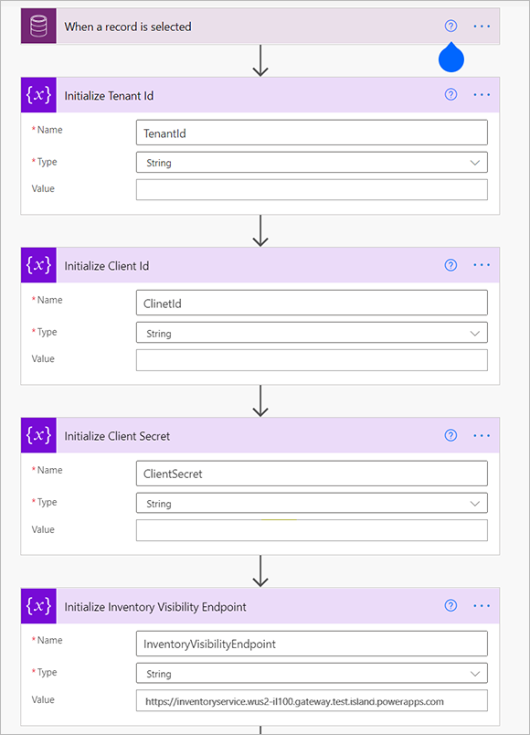

---
# required metadata

title: Inventory Visibility Add-in
description: This topic describes how to install and configure the Inventory Visibility Add-in for Dynamics 365 Supply Chain Management.
author: sherry-zheng
ms.date: 10/26/2020
ms.topic: article
ms.prod: 
ms.technology: 

# optional metadata

# ms.search.form: [Operations AOT form name to tie this topic to]
audience: Application User
# ms.devlang: 
ms.reviewer: kamaybac
# ms.tgt_pltfrm: 
# ms.custom: [used by loc for topics migrated from the wiki]
ms.search.region: Global
# ms.search.industry: [leave blank for most, retail, public sector]
ms.author: chuzheng
ms.search.validFrom: 2020-10-26
ms.dyn365.ops.version: Release 10.0.15
---

# Inventory Visibility Add-in

[!include [banner](../includes/banner.md)]
[!include [preview banner](../includes/preview-banner.md)]
[!INCLUDE [cc-data-platform-banner](../../includes/cc-data-platform-banner.md)]

The Inventory Visibility Add-in is an independent and highly scalable microservice that enables real-time on-hand inventory tracking, thus providing a global view of inventory visibility.

All information that relates to on-hand inventory is exported to the service in near real-time through low-level SQL integration. External systems access the service through RESTful APIs to query on-hand information on given sets of dimensions, thus retrieving a list of available on-hand positions.

Inventory Visibility is a microservice built on Microsoft Dataverse, which means you can extend it by building Power Apps and applying Power BI to provide customized functionality to meet your business requirements. It is also possible to upgrade the index to do inventory queries.

Inventory Visibility provides configuration options that let it integrate with multiple third-party systems. It supports the standardized inventory dimension, customized extensibility, and standardized, configurable calculated quantities.

This topic describes how to install and configure the Inventory Visibility Add-in for Dynamics 365 Supply Chain Management, and how to use its application programming interface (API).

## Install the Inventory Visibility Add-in

You need to install the Inventory Visibility Add-in using Microsoft Dynamics Lifecycle Services (LCS). LCS is a collaboration portal that provides an environment and a set of regularly updated services that help you manage the application lifecycle of your Dynamics 365 Finance and Operations apps.

For more information, see [Lifecycle Services resources](https://docs.microsoft.com/dynamics365/fin-ops-core/dev-itpro/lifecycle-services/lcs).

### Prerequisites

Before you install the Inventory Visibility Add-in, you must do the following:

- Obtain an LCS implementation project with at least one environment deployed.
- Make sure that the prerequisites for setting up add-ins provided in the [Add-ins overview](../../fin-ops-core/dev-itpro/power-platform/add-ins-overview.md) have been completed. Inventory Visibility doesn't require dual-write linking.
- Contact the Inventory Visibility Team at [inventvisibilitysupp@microsoft.com](mailto:inventvisibilitysupp@microsoft.com) to get the following three required files:
    - `Inventory Visibility Dataverse Solution.zip`
    - `Inventory Visibility Configuration Trigger.zip`
    - `Inventory Visibility Integration.zip` (if the version of Supply Chain Management that you're running is earlier than version 10.0.18)
- Follow the instructions given in [Quickstart: Register an application with the Microsoft identity platform](/azure/active-directory/develop/quickstart-register-app) to register an application and add a client secret to AAD under your azure subscription.
    - [Register an application](/azure/active-directory/develop/quickstart-register-app)
    - [Add a client secret](azure/active-directory/develop/quickstart-register-app#add-a-certificate)
    - The **Application(Client) Id**, **Client Secret** and **Tenant ID** will be used in the following steps.

> [!NOTE]
> The currently supported countries and regions include Canada, the United States, and the European Union (EU).

If you have any questions about these prerequisites, please contact the Inventory Visibility product team.

### <a name="setup-microsoft-dataverse"></a>Set up Dataverse

Follow these steps to set up Dataverse.

1. Add a service principle to your tenant:

    1. Install Azure AD PowerShell Module v2 as described in [Install Azure Active Directory PowerShell for Graph](https://docs.microsoft.com/powershell/azure/active-directory/install-adv2).
    1. Run the following PowerShell command.

        ```powershell
        Connect-AzureAD # (open a sign in window and sign in as a tenant user)

        New-AzureADServicePrincipal -AppId "3022308a-b9bd-4a18-b8ac-2ddedb2075e1" -DisplayName "d365-scm-inventoryservice"
        ```

1. Create an application user for Inventory Visibility in Dataverse:

    1. Open the URL of your Dataverse environment.
    1. Go to **Advanced Setting \> System \> Security \> Users**, and create an application user. Use the view menu to change the page view to **Application Users**.
    1. Select **New**. Set the application ID to *3022308a-b9bd-4a18-b8ac-2ddedb2075e1*. (The object ID will automatically be loaded when you save your changes.) You can customize the name. For example, you can change it to *Inventory Visibility*. When you've finished, select **Save**.
    1. Select **Assign Role**, and then select **System Administrator**. If there is a role that is named **Common Data Service User**, select it too.

    For more information, see [Create an application user](https://docs.microsoft.com/power-platform/admin/create-users-assign-online-security-roles#create-an-application-user).

1. If the default language of your Dataverse is not **English**:

    1. Go to **Advanced Setting \> Administration \> Languages**,
    1. Select **English (LanguageCode=1033)** and select **Apply**.

1. Import the `Inventory Visibility Dataverse Solution.zip` file, which includes Dataverse configuration related entities and Power Apps:

    1. Go to the **Solutions** page.
    1. Select **Import**.

1. Import the configuration upgrade trigger flow:

    1. Go to the Microsoft Flow page.
    1. Make sure that the connection that is named *Dataverse (legacy)* exists. (If it doesn't exist, create it.)
    1. Import the `Inventory Visibility Configuration Trigger.zip` file. After it's imported, the trigger will appear under **My flows**.
    1. Initialize the following four variables, based on the environment information:

        - Azure Tenant ID
        - Azure Application Client ID
        - Azure Application Client Secret
        - Inventory Visibility Endpoint

            For more information about this variable, see the [Set up Inventory Visibility integration](#setup-inventory-visibility-integration) section later in this topic.

        

    1. Select **Turn on**.

### <a name="install-add-in"></a>Install the add-in

To install the Inventory Visibility Add-in, do the following:

1. Sign in to the [Lifecycle Services (LCS)](https://lcs.dynamics.com/Logon/Index) portal.
1. On the home page, select the project where your environment is deployed.
1. On the project page, select the environment where you want to install the add-in.
1. On the environment page, scroll down until you see the **Environment add-ins** section in the **Power Platform integration** section, where you can find the Dataverse environment name.
1. In the **Environment add-ins** section, select **Install a new add-in**.

    

1. Select the **Install a new add-in** link. A list of available add-ins opens.
1. Select **Inventory Visibility** in the list.
1. Enter values for the following fields for your environment:

    - **AAD application (client) ID**
    - **AAD tenant ID**

    

1. Agree to the terms and condition by selecting the **Terms and conditions** check box.
1. Select **Install**. The status of the add-in will show as **Installing**. When it's done, refresh the page to see the status change to **Installed**.

### <a name="uninstall-add-in"></a>Uninstall the add-in

To uninstall the add-in, select **Uninstall**. When you refresh LCS, the Inventory Visibility Add-in will be removed. The uninstall process removes the add-in registration and also starts a job to clean up all the business data that is stored in the service.

## Consume on-hand inventory data from Supply Chain Management

### <a name="deploy-inventory-visibility-package"></a>Deploy the Inventory Visibility integration package

If you're running Supply Chain Management version 10.0.17 or earlier, contact the Inventory Visibility on-board support team at [inventvisibilitysupp@microsoft.com](mailto:inventvisibilitysupp@microsoft.com) to get the package file. Then deploy the package in LCS.

> [!NOTE]
> If a version mismatch error occurs during deployment, you must manually import the X++ project into your development environment. Then create the deployable package in your development environment, and deploy it in your production environment.
> 
> The code is included with Supply Chain Management version 10.0.18. If you're running that version or later, deployment isn't required.

Make sure that the following features are turned on in your Supply Chain Management environment. (By default, they are turned on.)

| Feature description | Code version | Toggle class |
|---|---|---|
| Enable or disable using inventory dimensions on InventSum table | 10.0.11 | InventUseDimOfInventSumToggle |
| Enable or disable using inventory dimensions on InventSumDelta table | 10.0.12 | InventUseDimOfInventSumDeltaToggle |

### <a name="setup-inventory-visibility-integration"></a>Set up Inventory Visibility integration

1. In Supply Chain Management, open the **[Feature management](../../fin-ops-core/fin-ops/get-started/feature-management/feature-management-overview.md)** workspace, and turn on the **Inventory Visibility Integration** feature.
1. Go to **Inventory Management \> Set up \> Inventory Visibility Integration parameters**, and enter the URL of the environment where you're running Inventory Visibility.

    Find your LCS environment's Azure region, and then enter the URL. The URL has the following form:

    `https://inventoryservice.<RegionShortName>-il301.gateway.prod.island.powerapps.com`

    For example, if you're in Europe, your environment will have one of the following URLs:

    - `https://inventoryservice.neu-il301.gateway.prod.island.powerapps.com`
    - `https://inventoryservice.weu-il301.gateway.prod.island.powerapps.com`

    The following regions are currently available.

    | Azure region | Region short name |
    |---|---|
    | Australia east | eau |
    | Australia southeast | seau |
    | Canada central | cca |
    | Canada east | eca |
    | North Europe | neu |
    | West Europe | weu |
    | East US | eus |
    | West US | wus |

1. Go to **Inventory Management \> Periodic \> Inventory Visibility Integration**, and enable the job. All inventory change events from Supply Chain Management will now be posted to Inventory Visibility.

## <a name="inventory-visibility-public-api"></a>The Inventory Visibility Add-in public API

The public REST API of the Inventory Visibility Add-in presents several specific endpoints for integration. It supports three main interaction types:

- Posting on-hand inventory changes to the add-in from an external system
- Querying current on-hand quantities from an external system
- Automatic synchronization with Supply Chain Management on-hand inventory

Automatic synchronization isn't part of the public API. Instead, it's handled in the background for environments where the Inventory Visibility Add-in is enabled.

### <a name="inventory-visibility-authentication"></a>Authentication

The platform security token is used to call the Inventory Visibility Add-in. Therefore, you must generate an *Azure Active Directory (Azure AD) token* by using your Azure AD application. You must then use the Azure AD token to get the *access token* from the security service.

Get a security service token by doing the following:

1. Sign in to Azure portal and use it to find the `clientId` and `clientSecret` for your Supply Chain Management application.
1. Fetch an Azure Active Directory token (`aadToken`) by submitting an HTTP request with the following properties:
    - **URL** - `https://login.microsoftonline.com/${aadTenantId}/oauth2/token`
    - **Method** - `GET`
    - **Body content (form data)**:

        | key | value |
        | --- | --- |
        | client_id | ${aadAppId} |
        | client_secret | ${aadAppSecret} |
        | grant_type | client_credentials |
        | resource | 0cdb527f-a8d1-4bf8-9436-b352c68682b2 |
1. You should receive an `aadToken` in response, which resembles the following example.

    ```json
    {
        "token_type": "Bearer",
        "expires_in": "3599",
        "ext_expires_in": "3599",
        "expires_on": "1610466645",
        "not_before": "1610462745",
        "resource": "0cdb527f-a8d1-4bf8-9436-b352c68682b2",
        "access_token": "eyJ0eX...8WQ"
    }
    ```

1. Formulate a JSON request that resembles the following:

    ```json
    {
        "grant_type": "client_credentials",
        "client_assertion_type":"aad_app",
        "client_assertion": "{Your_AADToken}",
        "scope":"https://inventoryservice.operations365.dynamics.com/.default",
        "context": "5dbf6cc8-255e-4de2-8a25-2101cd5649b4",
        "context_type": "finops-env"
    }
    ```

    Where:
    - The `client_assertion` value must be the `aadToken` you received in the previous step.
    - The `context` value must be the environment ID where you want to deploy the add-in.
    - Set all of other values as shown in the example.

1. Submit an HTTP request with the following properties:
    - **URL** - `https://securityservice.operations365.dynamics.com/token`
    - **Method** - `POST`
    - **HTTP header** - Include the API version (key is `Api-Version` and value is `1.0`)
    - **Body content** - Include the JSON request that you created in the previous step.

1. You will get an `access_token` in response. This is what you need as a bearer token to call the Inventory Visibility API. Here is an example.

    ```json
    {
        "access_token": "{Returned_Token}",
        "token_type": "bearer",
        "expires_in": 1200
    }
    ```

### <a name="inventory-visibility-sample-request"></a>Sample Request

For your reference, here is a sample http request, you can use any tools or coding language to send this request, such as  ``Postman``.

```json
# Url
# replace {RegionShortName} and {EnvironmentId} with your value
https://inventoryservice.{RegionShortName}-il301.gateway.prod.island.powerapps.com/api/environment/{EnvironmentId}/onhand

# Method
Post

# Header
# replace {access_token} with the one get from security service
Api-version: "1.0"
Content-Type: "application/json"
Authorization: "Bearer {access_token}"

# Body
{
    "id": "id-bike-0001",
    "organizationId": "usmf",
    "productId": "Bike",
    "quantities": {
        "pos": {
            "inbound": 5
        }  
    },
    "dimensions": {
        "SizeId": "Small",
        "ColorId": "Red",
        "SiteId": "1",
        "LocationId": "11"
    }
}
```

### <a name="inventory-visibility-configuration"></a>Configure the Inventory Visibility API

Before using the service, you must complete the configurations described in the following subsections. The configuration may vary based on the details of your environment. It primarily includes four parts:

- [Partitioning](#partitioning)
- [Dimension configurations](#dimension-configurations)
- [Indexing](#indexing)
- [Custom measurement](#custom-measurement)

#### Partitioning

Partitioning can significantly influence the performance of the Inventory Visibility API. It's a good idea to define a scheme that allows for small groupings of data while still allowing for meaningful data queries.

The `organizationId` (`dataAreaId` in Supply Chain Management) will always be part of the partitioning, and by default Inventory Visibility is set to partition by dimensions as *Site + Location*. This means that the service must always be queried with these dimensions defined on the filters.

> [!NOTE]
> *Site* and *Location* are two general default dimensions in Inventory Visibility. In Supply Chain Management, those dimensions are called *Site* (`InventSiteId`) and *Warehouse* (`InventLocationId`)

### Dimension configurations

Inventory Visibility will provide a list of general default dimensions to enable the multiple source system integration.

The following table lists the inventory dimensions that will be the default dimension names in Inventory Visibility.

| Dimension type | Dimension name |
|---|---|
| Product | `ColorId` |
| Product | `SizeId` |
| Product | `StyleId` |
| Product | `ConfigId` |
| Tracking | `BatchId` |
| Tracking | `SerialId` |
| Location | `LocationId` |
| Location | `SiteId` |
| Inventory Status | `StatusId` |
| Warehouse Specific | `WMSLocationId` |
| Warehouse Specific | `WMSPalletId` |
| Warehouse Specific | `LicensePlateId` |

> [!NOTE]
> The dimension type listed in the previous table is for reference only. You don't need to define the dimension type in Inventory Visibility.

If a custom dimension exists and needs to flow to a default value when consumed by Inventory Visibility, you can configure the **Custom dimension** name in Inventory Visibility.

External systems access Inventory Visibility through RESTful APIs that enable on-hand information on given sets of dimensions to be queried. For the integration, Inventory Visibility enables you to configure the *external channel data source* and the source dimension to the *target dimensions* in Inventory Visibility.

The target dimensions should be one of the following:

- Default dimensions in Inventory Visibility
- Custom dimensions

The purpose of dimension configuration is to standardize the multi-system integration for the query on dimensions and the posting event with dimensions.

#### Indexing

Most of the time, the inventory on-hand query will not only be on the highest "total" level, but you may want to see results aggregated based on the inventory dimensions.

Inventory Visibility provides flexibility by allowing you to set up the indexes, which are based on the dimension or the combination of the dimensions.

> [!NOTE]
> Currently, you can only configure indexes to a maximum of five. You need to carefully consider which dimension or dimension combination you will use before the implementation to ensure that it will meet your business needs. For example, if you want to query products as follows:

- Query the aggregated product on-hand by the *Color* and *Size* dimensions.
- In some cases, you just want to query on the product in total.

You would have two indexes defined as the following:

- `["ColorId", "SizeId"]`
- `[]`

The empty bracket will aggregate based on the product ID within the partition.

The indexing defines how you can group your results based on the `groupBy` query setting. In this case if you don't define any `groupBy` values, you'll get totals by `productid`. Otherwise, if you define `groupBy` as `groupBy=ColorId&groupBy=SizeId`, you'll get multiple lines returned, based on the different color and size combinations in the system.

You can put your query criteria in the request body.

Here is a sample query on the product with color and size combination.

```json
{
    "filters": {
        "OrganizationId": ["usmf"],
        "ProductId": ["MyProduct1", "MyProduct2"],
        "LocationId": ["21"],
        "SiteId": ["2"],
        "ColorId": ["Red"]
    },
    "groupByValues": [
        "SizeId",
        "ColorId"
    ],
    "returnNegative": true
}
```

For the `filters` field, currently only `ProductId` supports multiple values. If the `ProductId` is an empty array, all products will be queried.

#### Custom measurement

The default measurement quantities are linked to Supply Chain Management. However, you may want to have a quantity that is made up of a combination of the default measurements. To do this, you can have a configuration of custom quantities, which will be added to the output of the on-hand queries.

The functionality simply allows you to define a set of measures that will be added, and/or a set of measures that will be subtracted, in order to form the custom measurement.

For example, with the following query condition, you will configure the custom measurement quantity as `MyCustomAvailableforReservation` to be consumed by the consumption system.

```json
[
    {
        "productId": "MyProduct",
        "dimensions": {
            "colorid": "Red"
        },
        "quantities": {
            "mypos": {
                "outbound": 20.0,
                "inbound": 80.0
            },
            "fno": {
                "availphysical": 100.0,
                "orderedintotal": 50.0,
                "orderedreserved": 10.0
            },
            "exterchannel": {
                "received": 90.0,
                "scheduled": 30.0,
                "issued": 60.0,
                "reserved": 40.0
            }
        }
    }
]

```


| Consumption system | Calculated measurers | Data source | Modifier | Modifier calculation type |
|---|---|---|---|---|
| `CustomChannel` | `MyCustomAvailableforReservation` | `fno` | `availphysical` | Addition |
| `CustomChannel` | `MyCustomAvailableforReservation` | `fno` | `orderedintotal` | Addition |
| `CustomChannel` | `MyCustomAvailableforReservation` | `fno` | `orderedreserved` | Subtraction |
| `CustomChannel` | `MyCustomAvailableforReservation` | `mypos` | `inbound` | Addition |
| `CustomChannel` | `MyCustomAvailableforReservation` | `mypos` | `outbound` | Subtraction |
| `CustomChannel` | `MyCustomAvailableforReservation` | `exterchannel` | `received` | Addition |
| `CustomChannel` | `MyCustomAvailableforReservation` | `exterchannel` | `scheduled` | Addition |
| `CustomChannel` | `MyCustomAvailableforReservation` | `exterchannel` | `issued` | Subtraction |
| `CustomChannel` | `MyCustomAvailableforReservation` | `exterchannel` | `reserved` | Subtraction |

With that, the query on the custom measurement quantity will return the following output.

```json
[
    {
        "productId": "MyProduct",
        "dimensions": {
            "colorid": "Red"
        },
        "quantities": {
            "mypos": {
                "outbound": 20.0,
                "inbound": 80.0
            },
            "fno": {
                "availphysical": 100.0,
                "orderedintotal": 50.0,
                "orderedreserved": 10.0
            },
            "exterchannel": {
                "received": 90.0,
                "scheduled": 30.0,
                "issued": 60.0,
                "reserved": 40.0
            },
            "CustomChannel": {
                "MyCustomAvailableforReservation": 220.0
            }
        }
    }
]
```

The `MyCustomAvailableforReservation` output is based on the calculation setting in the custom measurements as:  
 *100 + 50 + 80 + 90 + 30 &ndash; 10 &ndash; 20 &ndash; 60 &ndash; 40 = 220*

### Posting on-hand changes

The exact URL that the event will be posted to will depend on your geographical region. It will take the form:

`https://{serviceURL}/api/environment/{environmentId}/onhand`

When authenticated, this URL can be used along with the HTTP `POST` method to send on-hand change events to the service.

A special header is used for communicating with Dynamics 365 services through HTTP requests, denoting the environment ID of the Supply Chain Management instance the data is linked to. For example:

`x-ms-environment-id: 2db79622-f97a-4d64-9844-d12efed41796`

#### Posting on-hand changes query example 1

This example shows a scenario where you will set up the dimension configuration in Power Apps.

Use the following query to configure the dimension mapping in Power Apps:

```json
{
    "PosSizeId": "SizeId",
    "PosColorId": "ColorId",
    "PosSiteId": "SiteId",
    "PosLocationId": "LocationId"
}
```

Now you can specify the `dimensionDataSource` and use custom dimensions in your queries. The system will automatically convert custom dimensions to base dimensions.

```json
{
    "id": "demo-test-00007",
    "organizationId": "usmf",
    "productId": "MyProduct",
    "quantities": {
        "pos": {
            "Outbound": 1
        }
    },
    "dimensionDataSource": "pos",
    "dimensions": {
        "PosSizeId": "Large",
        "PosColorId": "Red",
        "PosSiteId": "2",
        "PosLocationId": "21"
    }
}
```

#### Posting on-hand changes query example 2

This example shows a scenario where no mappings are set up for the dimension configuration in Power Apps, so the posting should also use the base dimensions. All dimensions must be base dimensions when the `dimensionDataSource` field is null, empty, or whitespace.

```json
{
    "id": "demo-test-00007",
    "organizationId": "usmf",
    "productId": "MyProduct",
    "quantities": {
        "pos": {
            "Outbound": 1
        }
    },
    "dimensions": {
        "SizeId": "Large",
        "ColorId": "Red",
        "SiteId": "2",
        "LocationId": "21"
    }
}
```

#### JSON document field properties

The fields from the JSON query examples provided previously have the properties listed in the following table.

| Field ID | Description |
|---|---|
| `id` | A unique ID for the specific change event. This ID is used to ensure that if communication with the service fails during posting, resubmitting the event would not result in the same event being counted twice in the system. |
| `organizationId` | The identifier of the organization linked to the event. This maps to Supply Chain Management organizations or data area IDs. |
| `productId` | The identifier of the product in question. |
| `quantity` | The quantity by which the on-hand needs to be changed. If, for instance, 10 new bagels were added to a shelf, this value would be 10. If 3 bagels were then removed from the shelf or sold, this value would be -3. |
| `dimensionDataSource` | The data source of the dimensions used in the posting change event and query. If you specify the data source, you can use the custom dimensions from the specified data source. With the dimension configuration, Inventory Visibility can map the custom dimensions to the general default dimensions. If the `dimensionDataSource` is not specified, you can only use the general default dimensions in your queries.   |
| `dimensions` | A dynamic bag of key/value pairs. These will map to some of the dimensions in Supply Chain Management, but you could also add custom dimensions (like *Source*) that may denote if the event was coming from Supply Chain Management or an external system. |

### Querying current on-hand

The endpoint for querying the current on-hand will have a similar URL:

`https://{serviceURL}/api/environment/{environmentId}/onhand/indexquery`

It will be queried with the HTTP `POST` method.

#### Current on-hand query example 1

This example shows a scenario where you have already completed the dimension configuration in Power Apps.

Use the following query to configure the dimension mapping in Power Apps:

```json
{
    "PosSizeId": "SizeId",
    "PosColorId": "ColorId",
    "PosSiteId": "SiteId",
    "PosLocationId": "LocationId"
}
```

Now you can specify the `dimensionDataSource` and use custom dimensions in your queries. The system will automatically convert custom dimensions to base dimensions. You can specify the `DimensionDataSource` in `filters` and specify custom dimensions in both `filters` and `groupByValues`. The system will automatically convert custom dimensions to base dimensions.

```json
{
    "filters": {
        "OrganizationId": ["usmf"],
        "ProductId": ["MyProduct"],
        "DimensionDataSource": ["Pos"],
        "PosLocationId": ["21"],
        "PosSiteId": ["2"],
        "PosColorId": ["Red"]
    },
    "groupByValues": [
        "PosSizeId",
        "PosColorId"
    ],
    "returnNegative": true
}
```

#### Current on-hand query example 2

This example shows a scenario where no mappings are set up for the dimension configuration in Power Apps, so the posting should also use the base dimensions. All dimensions must be base dimensions when the `dimensionDataSource` field, under `filters` is null, empty, or whitespace.

```json
{
    "filters": {
        "OrganizationId": ["usmf"],
        "ProductId": ["MyProduct"],
        "LocationId": ["21"],
        "SiteId": ["2"],
        "ColorId": ["Red"]
    },
    "groupByValues": [
        "SizeId",
        "ColorId"
    ],
    "returnNegative": true
}
```

#### Example return result

The queries shown in the previous examples could return a result like this.

```json
[
    {
        "productId": "MyProduct",
        "dimensions": {
            "colorid": "Red"
        },
        "quantities": {
            "mypos": {
                "outbound": 20.0,
                "inbound": 80.0
            },
            "fno": {
                "availphysical": 100.0,
                "orderedintotal": 50.0,
                "orderedreserved": 10.0
            },
            "exterchannel": {
                "received": 90.0,
                "scheduled": 30.0,
                "issued": 60.0,
                "reserved": 40.0
            },
            "CustomChannel": {
                "MyCustomAvailableforReservation": 220.0
            }
        }
    }
]
```

Note that the quantities fields are structured as a dictionary of measures and their associated values.


[!INCLUDE[footer-include](../../includes/footer-banner.md)]
