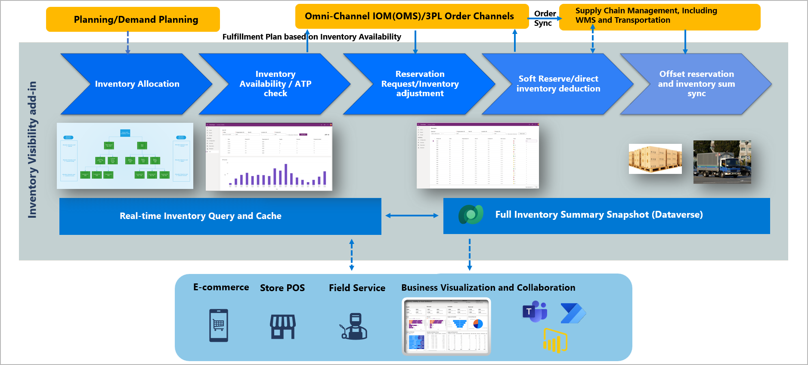

# Inventory Visibility Add-in overview

[!include [banner](../includes/banner.md)]

The Inventory Visibility Add-in (also referred to as the *Inventory Visibility service*) provides an independent and highly scalable microservice that enables real-time on-hand inventory change postings and visibility tracking across all your data sources and channels. It provides a platform that lets you manage your global inventory by using functionality that includes (but isn't limited to) the following list:

- Centrally track the latest inventory status (such as on-hand, ordered, purchased, in-transit, returned, and quarantined) across all your data sources, warehouses, and locations by connecting your Supply Chain Management or third-party logistics data sources (such as order management systems, third-party enterprise resource planning \[ERP\] systems, point of sale \[POS\] systems, and warehouse management systems) to the Inventory Visibility service.
- Query on-hand stock availability and shortages, and obtain immediate responses by calling the Inventory Visibility service directly.
- Avoid overselling, especially when your demand comes from different channels, by making real-time soft reservations in the Inventory Visibility service.
- Better manage promised orders and customer expectations by providing accurate current or next-available dates, so that the omnichannel available-to-promise (ATP) feature can calculate expected order fulfillment dates.

## Extensibility

The Inventory Visibility service is highly extensible because data input and output aren't restricted to Microsoft applications. External systems can access the service through RESTful application programming interfaces (APIs). In addition to using the out-of-box mappings that are provided for the Supply Chain Management data source and dimensions, you can integrate Inventory Visibility with multiple third-party systems by setting up additional data sources, inventory statuses measures (referred to as *physical measures* in Inventory Visibility service), and inventory dimensions via the configuration app. In this way, you can flexibly query and change your multiple data sources and predefined inventory dimensions.

Additionally, because Inventory Visibility is built on Microsoft Dataverse, its data can be used to build and integrate with Power Apps. You can also use Power BI to create customized dashboards that meet your business requirements.

## Scalability

The Inventory Visibility service can be scaled up or down, depending on your data volume. The scalability experience is mostly seamless and is conducted by the Microsoft platform team, based on automatic detection and assessment of your transaction data volume.

The following illustration shows the Inventory Visibility architecture.

## Feature highlights

### Get a global view of real-time inventory

Inventory Visibility ensures that you have access to the most up-to-date inventory quantities at all times, across all your channels, locations, and warehouses. You'll benefit most from using it to support your daily operational business whenever you must obtain inventory records. Physical on-hand inventory, quantities sold, and quantities purchased are all available out of the box. You can also configure other physical inventory measures (such as returned, quarantined, and posted data) as you require, to obtain those details in real time. Inventory Visibility can efficiently process millions of inventory change posts. This data can be aggregated and reflected in the latest inventory quantities in the service immediately, per second, or per minute, depending on the interval that data is posted at. Learn more in [Inventory Visibility public APIs](inventory-visibility-api.md).

### Central inventory adjustment

Inventory Visibility allows external systems to call its API to post inventory changes. The changes will immediately take effect in Inventory Visibility. Therefore, on-hand inventory is instantly deducted.

### Soft reservation to avoid overselling across all order channels

A *soft reservation* lets you assign or flag specific quantities to fulfill an order or demand. A soft reservation doesn't affect physical inventory, but it does deduct from the *available for reservation* inventory quantity and provides an updated quantity for future order fulfillment. This feature will be useful if sales requests or orders come into your business from one or more channels or data sources that are outside your system-of-record enterprise resource planning (ERP) system.

If you don't use soft reservations in the Inventory Visibility service, you must wait until the order is synced to, and processed by, your ERP system to get a physical inventory quantity update. This process typically has huge latency. However, soft reservations take immediate effect each time that a sales request or order is generated in your sales channels. Therefore, they help prevent oversell situations by ensuring that your omnichannel orders won't interfere with each other when they eventually reach the ERP system. Soft reservations also ensure that you can fulfill all the orders that you've promised. Therefore, they help you meet customer expectations and maintain customer loyalty. Learn more in [Inventory Visibility reservations](inventory-visibility-reservations.md).

### Immediate response of ATP quantity and dates

Visibility into your near-future projected inventory (including supply, demand, and projected on-hand details) is important, because it helps your company achieve the following goals:

- Minimize inventory levels to reduce inventory management costs.
- Facilitate internal order processing, so that salespeople can calculate shipment and delivery dates, based on the availability of the products that are ordered.
- Provide transparency about when customers can expect an out-of-stock item to become available, by providing the next-available date.

The ATP feature is easy to adopt into your daily order fulfillment process. Most importantly, like other Inventory Visibility offerings, the ATP feature is *global and real-time*. Therefore, you can set up multiple ATP calculation formulas to have full inventory availability queries that cover all your business channels and data sources. Learn more in [Inventory Visibility on-hand change schedules and available to promise](inventory-visibility-available-to-promise.md).

### Preallocate your stock to important channels or customers with Inventory Allocation

The Inventory Visibility allocation feature lets you protect and ring-fence your valuable on-hand stock for important channels, customer groups, or locations. After stock is allocated, inventory consumption is restricted to the allocated pool, and the quantities that are left in the pool will be deducted in near-real time to reflect the quantity that is still available for consumption. Learn more in [Inventory Visibility inventory allocation](inventory-visibility-allocation.md).

### Compatibility with WMS items

Microsoft aims to provide out-of-box integration with warehouse management processes (WMS), so that WMS customers can also enjoy the benefits of the Inventory Visibility service. Per the 2022 Wave 1 release (public preview in March), inventory service supports WMS item on-hand queries and ATP. The soft reservation and allocation feature will be supported for WMS customers in the next wave. Learn more in [Inventory Visibility support for WMS items](inventory-visibility-whs-support.md).

The following illustration shows a high-level summary of existing features and how they can be positioned in the data flow.

## Licensing

The Inventory Visibility service is available in the following versions:

- **Inventory Visibility Add-in for Microsoft Dynamics 365 Supply Chain Management** – For companies that have a valid Supply Chain Management license, Inventory Visibility is available at no extra cost. Because Inventory Visibility is based on Microsoft Power Platform, it's subject to Microsoft Power Platform storage capacity and API limits. Your Supply Chain Management license should include default storage and API capacity. If you require more storage and API capacity, you can purchase a professional license. For details about default API allocation and the professional license, see [Request limits and allocations](/power-platform/admin/api-request-limits-allocations) and [Licensing overview for Microsoft Power Platform](/power-platform/admin/pricing-billing-skus). With the default storage and API allocations, you can start to try out the Inventory Visibility Add-in today. For installation details, see [Install and set up Inventory Visibility](inventory-visibility-setup.md). If your estimated API and storage usage exceeds the standard allocation, you can contact your sales representative and ask them to reach out to the platform team for an exception.
- **Inventory Visibility Service as a component of IOM** – This version is for either Intelligent Order Management (IOM) customers or companies that aren't using Supply Chain Management as their ERP system. The license is included in the Intelligent Order Management bundle. Learn more in [Intelligent Order Management overview](/dynamics365/intelligent-order-management/overview).

## Inventory Visibility terminology

It's important that you understand the following concepts and terms when you're working with the Inventory Visibility Add-in:

- **Data source** – A data source represents the system that your data is from.
- **Dimensions** – Dimensions identify product characteristics. They can be storage dimensions (such as site or warehouse) or product dimensions (such as color, size, or style).
- **Physical measures** – Physical measures are quantities that measure different inventory statuses, such as on-hand, purchased, on order, or sold.
- **Calculated measures** – Calculated measures are quantitative measures that are calculated from a set of physical measures. For example, the *Total available* calculated measure is calculated as *On-hand* + *Purchased* – *On order* – *Sold*.
- **Partition** – A partition defines a hierarchy for how inventory visibility will distribute received data. Currently, the default partition is site and location.
- **Index hierarchy** – An index hierarchy further defines how you want to query inventory and obtain results that have more granularity.

For more information about these terms and concepts, see [Configure Inventory Visibility](inventory-visibility-configuration.md).

[!INCLUDE[footer-include](../../includes/footer-banner.md)]
