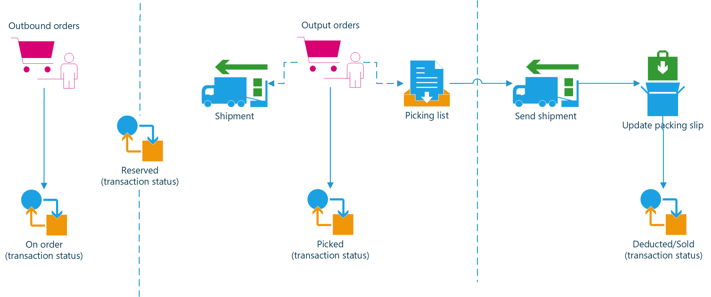
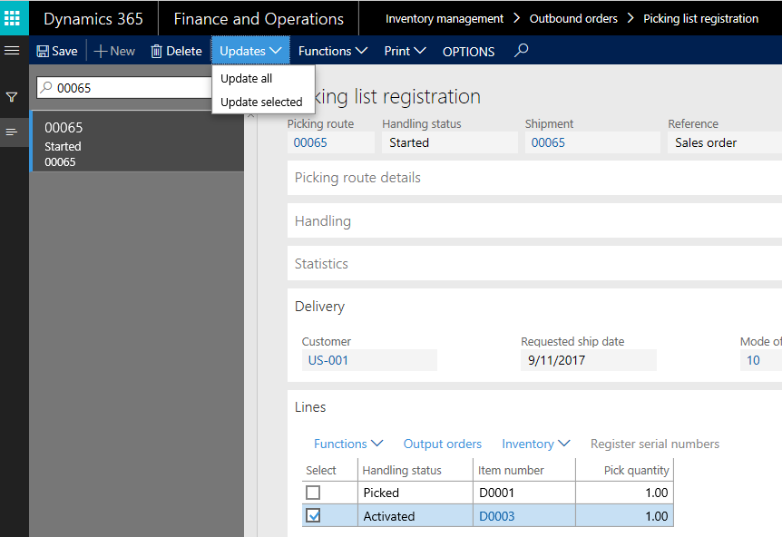

---
# required metadata

title: Outbound process overview
description: This article provides an overview of the outbound process in Inventory management. 
author: yufeihuang
ms.date: 07/25/2019
ms.topic: overview
ms.prod:
ms.technology:

# optional metadata

ms.search.form: WMSOrder, WMSShipment, MCRPickingWorkbench, WMSPickingRegistration, CustomFilterGroup
# ROBOTS:
audience: Application User
# ms.devlang:
ms.reviewer: kamaybac
# ms.tgt_pltfrm:
ms.custom: ["274363"]
ms.collection: get-started
ms.assetid: 375807b2-a426-4f1b-bc1f-2fe00fd48413
ms.search.region: global
ms.search.industry: Distribution
ms.author: yufeihuang
ms.dyn365.ops.version: AX 7.0.0
ms.search.validFrom: 2016-02-28

---

# Outbound process overview

[!include [banner](../includes/banner.md)]

This article provides an overview of the outbound process in Inventory management.

## Output orders

Output orders are used to link sales order lines and transfer order lines with the outbound picking processes that use picking lists.

When picking lists are generated from either sales orders or transfer orders, output orders and shipments are automatically created. A picking list has a one-to-one relationship with a shipment. The transfer order shipment or the sales order packing slip can be processed from the shipment. 

The following diagram shows an overview of the process for outbound orders. 

You can set up outbound rules to define how the program should handle the outbound process. You can use these rules to control the shipment process. In particular, you can use the rules to control which stage in the process a shipment can be sent during. The following settings define how the outbound processes are handled.

## Picking route status for sales and transfer orders 

Go to **Account receivable** \> **Setup** \> **Account receivable parameters**, and then, on the **Updates** tab, select a value in the **Picking route status** field.

If the **Picking route status** field is set to **Completed**, the picking process occurs automatically as part of the process of generating picking lists. If the field is set to **Activated**, the picking list lines must be manually updated.

The same setup applies to transfer orders. Go to **Inventory management** \> **Setup** \> **Inventory and warehouse management parameters**, and then, on the **Transport** tab, select a value in the **Picking route status** field.

## End output inventory orders

Go to **Inventory management** \> **Setup** \> **Inventory and warehouse management parameters**, and then, on the **General** tab, set the **End output inventory order** option.

When the warehouse worker reduces the picking list quantities, then the corresponding inventory order quantities will be removed from the shipment. When the picking list is updated at a point in time, the remaining quantities get reported back to the order if the **End output inventory order** option is set to **Yes**. If the **End output inventory order** option is set to **No**, the remaining quantities are kept as an open output order quantity and must be added to a new picking list as part of the **Open output orders** functionality. 

## Reduce quantity

The third parameter that you can use as part of the process of generating picking lists is the **Reduce quantity** parameter. The setting of this parameter works together with the **Reservation** setting that triggers a reservation process as part of the release to the warehouse.

## Example of an outbound process for a sales order

For this example, there is a sales order for two items. During picking list generation, you select the **Reduce quantity** parameter. Therefore, you release and create picking lines only for available on-hand inventory. The picking must be reported via a registration process for picking lists (**Picking route status** = **Activated**).

The inventory that hasn't already been reserved is reserved during picking list generation. The unavailable inventory can be either removed from the sales order or released to the warehouse for outbound processing later, when inventory is available for picking.

As soon as all the picking lines have been picked on the **Picking list registration** page, the associated shipment is completed. The process for sales order packing slips can then be initialized based on the picked inventory.

[!INCLUDE[footer-include](../../includes/footer-banner.md)]