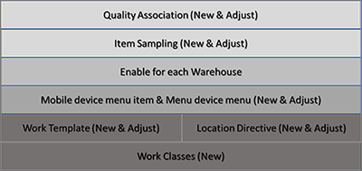

---
# required metadata

title: Quality management for warehouse processes
description: This article provides information about the Quality management for warehouse processes feature. This feature extends the capabilities of quality management and lets users integrate item sampling controls into the warehouse receiving process by using warehouse management processes (WMS). 
author: yufeihuang
ms.date: 03/23/2021
ms.topic: article
ms.prod: 
ms.technology: 

# optional metadata

# ms.search.form:  [Operations AOT form name to tie this article to]
audience: Application User
# ms.devlang: 
ms.reviewer: kamaybac
# ms.tgt_pltfrm: 
# ms.custom: [used by loc for articles migrated from the wiki]
ms.search.region: Global
# ms.search.industry: [leave blank for most, retail, public sector]
ms.author: yufeihuang
ms.search.validFrom: 2020-04-02
ms.dyn365.ops.version: 10.0.10
---

# Quality management for warehouse processes

[!include [banner](../includes/banner.md)]

The *Quality management for warehouse processes* feature lets you integrate item sampling controls into the warehouse receiving process by using warehouse management processes (WMS). Warehouse work can be automatically generated to move inventory to the quality control location, based on a percentage or a fixed quantity, or based on every *n*th license plate. After a quality order has been completed, work can be automatically generated to move inventory to the next location in the process, depending on the quality results.

The *Quality management for warehouse processes* feature extends the capabilities of the basic quality management feature. It provides the option to create quality orders for the inventory that is sent to the quality control location, although quality orders aren't always required. Therefore, it allows for a lightweight quality control process that is based on warehouse work.

## Turn on the Quality management for warehouse processes feature

To use this feature, it must be turned on for your system. As of Supply Chain Management version 10.0.32, it's turned on by default. Admins can turn this functionality on or off by searching for the *Quality Management For Warehouse Processes* feature in the [**Feature management** workspace](../../fin-ops-core/fin-ops/get-started/feature-management/feature-management-overview.md).

## Key benefits

The *Quality management for warehouse processes* feature automatically generates work as part of the receiving process, to move the inventory quantity that is required for quality control to a quality control location. If the quantity that is received exceeds the quantity that is required for quality control (according to the item sampling setup), the excess quantity is moved to an inbound location that is defined in the location directive setup. After the quality order is validated, work is automatically generated to move the quantity for the quality order to a new inbound or return location, based on the validation result and the location directive setup. The automatic generation of work that has only the quantity that must be moved to and from quality control provides an integrated process experience.

> [!NOTE]
> When the *Quality management for warehouse processes* feature is turned on, you can still take advantage of the manual process. In the manual process, inventory movement and movement by template are used to have a warehouse worker trigger the creation of warehouse work to move inventory from a quality control location to a new location. You can also still set up an inbound location directive that moves inventory in its entirety from a receiving location to a quality control location without considering the item sampling setup.

## Quality management and the Quality management for warehouse processes feature

When the *Quality management for warehouse processes* feature is turned on, it changes the setup of key warehouse management and quality management entities. The following illustration provides an overview of the entities that enable quality orders for warehouse processes. Text in parentheses indicates suggested actions when quality management was applied before the *Quality management for warehouse management processes* feature was turned on.

## Enablers: The Quality item sampling and Quality order work order types

The *Quality management for warehouse processes* feature introduces two work order types that enable the work creation process:

- **Quality item sampling** – This work order type is used to create work that moves registered inventory to quality control.
- **Quality order** – This work order type is used to create work that moves inventory from quality control to a new location, based on the location directive setup.

### Work classes, location directives, and work templates

The *Quality item sampling* and *Quality order* work order types are consumed by location directives, work classes, and work templates.

Before warehouse work can be automatically generated to move inventory to quality control, you must follow these steps to set up your system.

1. Create separate work classes for the *Quality item sampling* and *Quality order* work order types. In this way, you ensure that appropriate work can be automatically generated based on the two work order types, and that this work can then be run by using the Warehouse Management mobile app.
1. Set up a work template for each work order type:

    - Set up a work template that uses the *Quality item sampling* work order type to automatically move registered inventory to a quality control location.
    - Set up a work template that uses the *quality order* work order type to move inventory from a quality control location after quality control is completed.

1. For each work order type, set up location directives that apply the correct quality control locations that the inventory should be moved to. After quality control is completed, the location directive for the *Quality order* work order type ensures that a new destination location will be selected so that the inventory can be moved out of the quality control location.
1. Set up the relevant mobile device menu items to support the movement of received inventory to the quality control location, and the movement of inventory that passes or fails quality control from the quality control location to a new location.

For a step-by-step example that shows how to complete this setup, see the [example scenario](#example-scenario) at the end of this article.

## Enable a warehouse for quality management

Before the *Quality management for warehouse processes* feature can be applied for a specific warehouse, you must follow these steps to make the feature available for that warehouse.

1. Go to **Warehouse management \> Setup \> Warehouse \> Warehouses**.
1. Select the warehouse to enable for quality management.
1. On the **Warehouse** FastTab, set the **Enable quality order for warehouse processes** option to *Yes*. (Note that this option can be set to *Yes* only for warehouses that use warehouse management processes (WMS).)

When the **Enable quality order for warehouse processes** option is set to *Yes*, the quality association setup controls whether the *Quality management for warehouse processes* feature is actually applied for the selected warehouse. You can change the setting of the option to *No* at any time. In that case, the feature will no longer apply for the warehouse, regardless of the quality association setup.

## Quality control

The *Quality management for warehouse processes* feature controls several key settings for quality associations and item sampling.

### Quality associations

Each [quality association record](enable-quality-management.md) defines the set of tests, the acceptable quality level (AQL), and the sampling plan that apply to the quality orders that are generated. To set up a quality association record, follow these steps.

1. Go to **Inventory management \> Setup \> Quality control \> Quality associations**.
1. Create or select the quality association entry for the item or group that you're working with, or for all items.
1. On the **Conditions** FastTab, set the **Applicable warehouse type** field to one of the following values:

    - **Quality management for warehouse processes only** – Activate the *Quality management for warehouse processes* feature. You can select this value only if the reference type is either *Purchase* or *Production*.
    - **All** – Inactivate the *Quality management for warehouse processes* feature. Select this value for all reference types except *Purchase* and *Production*.

> [!NOTE]
> The *Quality management for warehouse processes* feature takes effect only if the item on the source document line uses warehouse management processes (WMS), and if the **Enable quality order for warehouse processes** option is set to *Yes* for the warehouse on the source document line.

As each item is registered (or reported as finished), the system determines which quality associations apply to it.

When the *Quality management for warehouse processes* feature is turned on, the applicable warehouse type is logically inserted into the fourth search group of the quality association search hierarchy. The following table provides a logical representation of the search hierarchy.

| Search group | Description |
|---|---|
| Group 1 | For each quality association, check the **Reference type**, **Event type**, and **Execution match** values against the item. If there is a match against the source document line, move on to group 2. |
| Group 2 | For each quality association, check the **Item code** value (*Table*, *Group*, or *All*) against the item. *Table* is more specific than *Group*, and *Group* is more specific than *All*. If there is a match for *Table* (a specific item), move on to group 3. If there is no match for *Table*, search for a match for *Group*. If there is no match for *Group*, *All* applies. If there is a match, move on to group 3. |
| Group 3 | For each quality association, check the **Account code** and **Resource code** values against the item. The logic that is applied resembles the logic that is applied for the **Item code** value. |
| Group 4 | For each quality association, check the **Applicable warehouse type** value (*Quality management for warehouse processes only* or *All*) against the item. If the **Enable quality order for warehouse processes** option is set to *Yes* for the warehouse on the source document, and the item on the source document line is set to *Use warehouse management processes*, both associations where there is a match for *Quality management for warehouse processes only* and associations where there is a match for *All* will be applicable in parallel, if both exist. If the **Enable quality order for warehouse processes** option is set to *No* for the warehouse on the source document, and the item on the source document line is set to *Use warehouse management processes*, only quality management will be applicable. |

For example, you've defined a warehouse where the **Enable quality order for warehouse processes** option is set to *Yes*, and you have two quality associations that are defined for the *Purchase* reference type: one for all items and one for the *Registration* event type. The only difference between the two quality associations is the **Applicable warehouse type** value: it's set to *All* for one quality association and *Quality management for warehouse processes only* for the other. In this case, both quality associations are equally specific, and both will be applicable.

The value of the **Test group** field for the quality associations is also a factor. This field defines the test procedure that must be applied. If the **Test group** value is the same for both associations, only one quality order will be created, for the quality association where the **Applicable warehouse type** value is *Quality management for warehouse processes only*. If the **Test group** value isn't the same for both associations, two quality orders will be created. The first quality order will be created for the quality association where the **Applicable warehouse type** value is *Quality management for warehouse processes only*. The second quality order will be created for the quality association where the **Applicable warehouse type** value is *All*.

> [!NOTE]
> The *Quality management for warehouse processes only* value is considered more specific than *All* when the criteria for the quality associations for groups 1 and 2 are the same, and when the test group is the same. Two quality orders will be created only when the test groups differ.

#### Reference types

When the **Reference type** value is *Purchase*, and the **Applicable warehouse type** value is *Quality management for warehouse processes only*, the **Event type** field on the **Process** FastTab must be set to *Registration*. *Registration* is the only supported event type for the *Purchase* reference type when you are using the *Quality management for warehouse processes* feature.

#### Quality processing policy

The *Quality management for warehouse processes* feature enables work to be created based only on item sampling. Therefore, it allows for a lightweight process. The inventory that work is created depends on the item sampling that is associated with the quality association. When the lightweight process is used, after a worker puts the quantity in the quality control location, the quality department can manually create a quality order, if a quality order is required.

The **Quality processing policy** field on the **Quality order process** FastTab controls whether a quality order is also created when work is created to move an item to the quality control location. This field can be set to *Create quality order* or *Create work only*. The default value is *Create quality order*.

> [!NOTE]
> Regardless of whether you create quality orders manually or automatically, the system automatically generates work to move items out of the quality control location when the quality order is marked as validated.

The creation of quality order work is unrelated to the quality association setup. If a work template exists that has a **Work order type** value of *Quality order*, and if the query criteria are met for that work template, validation of a quality order will trigger the creation of quality order work.

#### Referenced item sampling

Each quality association must reference an item sampling. An item sampling defines the quantity that will be sent for quality control. It can be set up so that it applies only to quality associations where the **Applicable warehouse type** value is *Quality management for warehouse processes only*. If the **Sampling scope** value for an item sampling is *Load* or *Shipment*, or the **Quantity specification** value is *Full license plate*, the item sampling can be referenced only by quality associations where the **Applicable warehouse type** value is *Quality management for warehouse processes only*.

If you define an item sampling that uses the *Quality management for warehouse processes only* applicable warehouse type, you will receive an error if you try to reference it from a quality association that doesn't use the *Quality management for warehouse processes* feature.

> [!NOTE]
> Item sampling that uses full blocking isn't supported for quality associations where the **Applicable warehouse type** field is set to *Quality management for warehouse processes only*.

### Item sampling

Item sampling controls how often items are sent for quality control. The *Quality management for warehouse processes* feature introduces the concept of *item sampling scope*. The system uses the item sampling scope when it evaluates whether and how quality orders and/or quality item sampling work and quality order work should be created.

To set up item sampling, go to **Inventory management \> Setup \> Quality control \> Item sampling**, and set the **Sampling scope** field to one of the following values:

- **Order** – The source document line will be the basis for evaluating whether and how quality orders and/or quality item sampling work and quality order work are created. This value is the default value, and when it's selected, the system works the same way that it works when the *Quality management for warehouse processes* feature isn't turned on.
- **Load** – Loads will be used as the basis for evaluating whether and how a quality order and/or work is created. This value is available only when the *Quality management for warehouse processes* feature is turned on.
- **Shipment** – Shipments will be used as the basis for evaluating whether and how a quality order and/or work is created. This value is available only when the *Quality management for warehouse processes* feature is turned on.

> [!NOTE]
> When the **Sampling scope** field is set to *Load* or *Shipment*, the load entity and shipment entities will be used, if they are available. If they aren't available, the order entity will be used.

The *Quality management for warehouse processes* feature also introduces the *Full license plate* value for the **Quantity specification** field. This value supports the creation of quality order work and quality item sampling work, based on license plates. When you select this value, the following changes occur:

- The **Break count by item** option and the **Per nth license plate** field on the **Process** FastTab become available.
- The **Value** field on the **Sampling quantity** FastTab becomes unavailable.
- The **Per updated quantity**, **Location**, and **License plate** options are all set to *Yes,* and the settings can't be changed.

The **Break count by item** option controls whether the license plate count is evaluated per item or across all items in the sampling scope. Product variants are treated as the same item. This option also controls whether the license plate count is reset for each item.

The value of the **Per nth license plate** field controls how often quality orders are created in relation to the number of items that are registered. For example, a value of *3* will send every third item to quality control, starting with the first item. The value must be more than 0 (zero).

While workers receive items by using the Warehouse Management mobile app, the system validates whether a quality association is set up for each incoming item. If a quality association is set up, the system uses the item sampling record that is configured for that quality association to determine how it will create quality orders, quality item sampling work, and purchase order work.

> [!NOTE]
> When receipt registration is done in the web client (by using the small registration page or the item arrival journal for purchase order lines), no quality item sampling work or purchase order work will be created, regardless of the setup. Instead, for items that match a quality association, the referenced item sampling will be used to control the creation of quality orders only.

## Examples of automatic generation of quality orders

The following examples show how the setup of a quality association and an associated item sampling affects the generation of quality orders when the **Applicable warehouse type** field is set to *Quality management for warehouse processes only*.

When the **Quantity specification** value is *Full license plate*, the **Per nth license plate** field controls which license plates quality item sampling work is created for. The first license plate always goes to quality control, and then the value of this field specifies that every *n*th license plate after that license plate should also go.

The **Reference type** value for the following examples is *Purchase*, and the **Event type** value is *Registration*.

| Sampling scope | Quantity specification | Per updated quantity | Per storage dimension | Break count by item | Per nth license plate | Result |
|---|---|---|---|---|---|---|
| Order | Full license plate | Yes *(locked/not editable)* | 
Location: Yes

License Plate: Yes *(locked/not editable)*
 | No | 3 | 
**Order line quantity: 100 EA**
<ol><li>Register receipt in the Warehouse Management mobile app for 20 EA, LP1
Quality item sampling work for 20 EA

Quality order 1 for 20 EA
</li><li>Register receipt in the Warehouse Management mobile app for 20 EA, LP2
Purchase order work for 20 EA (put-away)
</li><li>Register receipt in the Warehouse Management mobile app for 20 EA, LP3
Purchase order work for 20 EA (put-away)
</li><li>Register receipt in the Warehouse Management mobile app for 20 EA, LP4
Quality item sampling work for 20 EA
</li><li>Register receipt in the Warehouse Management mobile app for 20 EA, LP5
Purchase order work for 20 EA (put-away)
</li></ol> |
| Order | Fixed quantity = 1 | Yes | 
Location: Yes

License Plate: Yes
 | No | Not applicable | 
**Order line quantity: 100**
<ol><li>Register receipt in the Warehouse Management mobile app for 20 EA, LP1
Quality item sampling work for 1 EA

Quality order 1 for 1 EA

Purchase order work for 19 EA (put-away)
</li><li>Register receipt in the Warehouse Management mobile app for 20 EA, LP2
Quality Item sampling work for 1 EA

Quality order 1 for 1 EA

Purchase order work for 19 (put-away)
</li><li>Register receipt in the Warehouse Management mobile app for 20 EA, LP3
Quality item sampling work for 1 EA

Quality order 1 for 1 EA

Purchase order work for 19 EA (put-away)
</li><li>Register receipt in the Warehouse Management mobile app for 20 EA, LP4
Quality item sampling work for 1 EA

Quality order 1 for 1 EA

Purchase order work for 19 EA (put-away)
</li><li>Register receipt in the Warehouse Management mobile app for 20 EA, LP5
Quality item sampling work for 1 EA

Quality order 1 for 1 EA

Purchase order work for 19 EA (put-away)
</li></ol> |
| Order | Percent = 10 | No | 
Location: No

License Plate: No
 | No | Not applicable | 
**Order line quantity: 100 EA**
<ol><li>Register receipt in the Warehouse Management mobile app for 50 EA, LP1
Quality item sampling work for 10 EA

Quality order 1 for 10 EA

Purchase order work for 40 EA (put-away)
</li><li>Register receipt in the Warehouse Management mobile app for 50 EA, LP2
Purchase order work for 50 EA (put-away)
</li></ol> |
| Load | Percent = 5 | Yes *(locked/not editable)* | 
Location: No

License Plate: No
 | No | Not applicable | 
**Order line quantity: 500 EA**

**Two loads: first load 200 EA, second load 300 EA**
<ol><li>Register receipt in the Warehouse Management mobile app for first load for 100 EA
Quality item sampling work for 5 EA

Quality order 1 for 5 EA

Purchase order work for 95 EA (put-away)
</li><li>Register receipt in the Warehouse Management mobile app for first load for 100 EA
Quality item sampling work for 5 EA

Quality order 1 for 5 EA

Purchase order work for 95 EA (put-away)
</li><li>Register receipt in the Warehouse Management mobile app for second load for 300 EA
Quality item sampling work for 15 EA

Quality order 1 for 15 EA

Purchase order work for 285 EA (put-away)
</li></ol> |
| Order | Percent = 10 | Yes | 
Location: Yes

License Plate: Yes
 | No | Not applicable | 
**Order line quantity: 100**
<ol><li>Register receipt in the Warehouse Management mobile app for 50 EA, LP1
Quality item sampling work for 5 EA

Quality order 1 for 5 EA

Purchase order work for 45 EA (put-away)
</li><li>Register receipt in the Warehouse Management mobile app for 50 EA, LP2
Quality item sampling work for 5 EA

Quality order 1 for 5 EA

Purchase order work for 45 (put-away)
</li></ol> |
| Load | Full license plate | Yes *(locked/not editable)* | 
Location: Yes

License Plate: Yes *(locked/not editable)*
 | No | 3 | 
**Two items:**
<ul><li>**Order line quantity for item A: 120 EA (4 pallets)**</li><li>**Order line quantity for item B: 90 EA (3 pallets)**</li></ul>
**One load, two load lines with each order line**
<ol><li>Register receipt in the Warehouse Management mobile app for item A, 30 EA, LP1
Quality item sampling work for 30 EA

Quality order 1 for 30 EA
</li><li>Register receipt in the Warehouse Management mobile app for item A, 30 EA, LP2
Purchase order work for 30 EA (put-away)
</li><li>Register receipt in the Warehouse Management mobile app for item A, 30 EA, LP3
Purchase order work for 30 EA (put-away)
</li><li>Register receipt in the Warehouse Management mobile app for item A, 30 EA, LP4
Quality item sampling work for 30 EA

Quality order 1 for 30 EA
</li><li>Register receipt in the Warehouse Management mobile app for item B, 30 EA, LP5
Purchase order work for 30 EA (put-away)
</li><li>Register receipt in the Warehouse Management mobile app for item B, 30 EA, LP6
Purchase order work for 30 EA (put-away)
</li><li>Register receipt in the Warehouse Management mobile app for item A, 30 EA, LP7
Quality item sampling work for 30 EA

Quality order 1 for 30 EA
</li></ol> |
| Load | Full license plate | Yes *(locked/not editable)* | 
Location: Yes

License Plate: Yes *(locked/not editable)*
 | Yes | 3 | 
**Two items:**
<ul><li>**Order line quantity for item A: 120 EA (4 pallets)**</li><li>**Order line quantity for item B: 90 EA (3 pallets)**</li></ul>
**One load, two load lines with each order line**
<ol><li>Register receipt in the Warehouse Management mobile app for item A, 30 EA, LP1
Quality item sampling work for 30 EA

Quality order 1 for 30 EA
</li><li>Register receipt in the Warehouse Management mobile app for item A, 30 EA, LP2
Purchase order work for 30 EA (put-away)
</li><li>Register receipt in the Warehouse Management mobile app for item A, 30 EA, LP3
Purchase order work for 30 EA (put-away)
</li><li>Register receipt in the Warehouse Management mobile app for item A, 30 EA, LP4
Quality item sampling work for 30 EA

Quality order 1 for 30 EA
</li><li>Register receipt in the Warehouse Management mobile app for item B, 30 EA, LP5
Quality item sampling work for 30 EA

Quality order 1 for 30 EA
</li><li>Register receipt in the Warehouse Management mobile app for item B, 30 EA, LP6
Purchase order work for 30 EA (put-away)
</li><li>Register receipt in the Warehouse Management mobile app for item A, 30 EA, LP7
Purchase order work for 30 EA (put-away)
</li></ol> |
| Load | Percent = 10 | Yes *(locked/not editable)* | 
Location: No

License Plate: No
 | No | Not applicable | 
**Order line quantity: 100 EA**

**No loads are created. Order scope is applied.**
<ol><li>Register receipt in the Warehouse Management mobile app for 50 EA, LP1
Quality item sampling work for 5 EA

Quality order 1 for 5 EA

Purchase order work for 45 EA (put-away)
</li><li>Register receipt in the Warehouse Management mobile app for 50 EA, LP2
Quality item sampling work for 5 EA

Quality order 1 for 5 EA

Purchase order work for 45 EA (put-away)
</li></ol> |

When a worker validates one of the quality orders that are shown in the previous table, the system automatically generates quality order work to move inventory from the quality control location to the location that is defined in the location directive for the *Quality order* work order type. You can set up any location for this purpose, such as a return or storage location, depending on the test result for the quality order. For an example of this setup, see the [example scenario](#example-scenario) at the end of this article.

You can reopen a quality order that has already been validated, provided that the quality order work that is related to moving the inventory from the quality control location doesn't have a **Work status** value of *Closed* or *In progress*.

## Process insights when multiple quality associations coexist

More than one quality associations can be defined for and applied to the same source document line, and the **Applicable warehouse type** field can be set to *Quality management for warehouse processes only* for some of those quality associations and *All* for others.

In the following example, the **Reference type** value is *Purchase*.

1. The first quality association is set up in the following way:

    - **Applicable warehouse type:** *Quality management for warehouse processes only*
    - **Item code:** *A0001*
    - **Account code:** *All*
    - **Test group:** *Enclosure*
    - **Item sampling:** *5 pcs*

1. The second quality association is set up in the following way:

    - **Applicable warehouse type:** *All*
    - **Item code:** *All*
    - **Account code:** *All*
    - **Test group:** *Enclosure*
    - **Item sampling:** *1 pcs*

1. The third quality association is set up in the following way:

    - **Applicable warehouse type:** *Quality management for warehouse processes only*
    - **Item code:** *All*
    - **Account code:** *104*
    - **Test group:** *Impedance*
    - **Item sampling:** *Every second license plate* (This setting means that the first, third, fifth, and so on, license plates that are received will create a quality order.)

1. The fourth quality association is set up in the following way:

    - **Applicable warehouse type:** *All*
    - **Item code:** *All*
    - **Account code:** *All*
    - **Test group:** *Impedance*
    - **Item sampling:** *5 pcs*

1. The fifth quality association is set up in the following way:

    - **Applicable warehouse type:** *All*
    - **Item code:** *All*
    - **Account code:** *All*
    - **Test group:** *Cone*
    - **Item sampling:** *10%*

A purchase order for a quantity of 10 of item A0001 is now created for vendor 104. Then a purchase order line that has a quantity of 10 is registered as received on one license plate by using the Warehouse Management mobile app. Here is the result:

- There is one quality order from the first quality association for the *Enclosure* test group. The quantity is 5. There is no quality order from the second quality association, because the criteria for the first quality association are more specific relative to the *Enclosure* test group.
- There is one quality order for the third quality association for the *Impedance* test group. The quantity is 10. There is no quality order from the fourth quality association, because the criteria for the first quality association are more specific relative to the *Impedance* test group.
- There is one quality order for the fifth quality association for the *Cone* test group. The quantity is 1.

In connection with the creation of one quality order for each of the three quality associations, quality item sampling work is also created. The registered quantity is only 10. However, because of the item sampling setup, the sum of the quality order quantities that are created for the *Quality management for warehouse processes only* applicable warehouse type is 16, which exceeds the physical registered quantity of 10. Therefore, work won't be created for the full quality order quantities (16), because only 10 are physically available for movement to the quality control location. The priority that is used to create quality item sampling work follows the order of quality order creation:

- **First quality order (quantity = 5):** Quality item sampling work is created for 5. A quantity of 5 (10 – 5) now remains for subsequent creation of quality item sampling work.
- **Second quality order (quantity = 10):** Quality item sampling work is created for 5. A quantity of 0 (zero) now remains for subsequent creation of quality item sampling work.
- **Third quality order (quantity = 1):** No quality item sampling work is created.

As part of the process of creating the quality orders, an inventory blocking of a quantity of 10 is created. This inventory blocking is referenced against each of the three quality orders. The sum of the quality order quantities is 16.

When the quality orders are validated, the system tries to create quality order work for each quality order that is validated. Because the sum of the quality order quantities exceeds the quantity that is actually blocked and therefore available for work creation, quality order work can't be created for the full quality order quantities, as shown here. (This example continues the previous example.)

1. **Validate the second quality order that is created (quantity = 10). Quality order work is created for a quantity of 4.**

    The creation of quality order work is triggered by a change in the inventory blocking quantity. Because the sum of quality order quantities was 16, validation of a quantity of 10 will cause the remaining quality order quantities to be validated as equal to 6. The inventory blocking quantity is reduced from 10 to 6. The reduced quantity of 4 is allotted to quality order work creation.

2. **Validate the first quality order that is created (quantity = 5). Quality order work is created for a quantity of 5.**

    The creation of quality order work is triggered by a change in the inventory blocking quantity. Because the sum of quality order quantities was 6, validation of a quantity of 5 will cause the remaining quality order quantities to be validated as equal to 1. The inventory blocking quantity is reduced from 6 to 1. The reduced quantity of 5 is allotted to quality order work creation.

3. **Validate the third quality order that is created (quantity = 1). Quality order work is created for a quantity of 1.**

    The creation of quality order work is triggered by a change in the inventory blocking quantity. Because the sum of quality order quantities was 1, validation of a quantity of 1 will cause the remaining quality order quantities to be validated as equal to 0 (zero). The inventory blocking is removed (that is, the inventory blocking quantity is reduced from 1 to 0). The reduced quantity of 1 is allotted to quality order work creation.

> [!NOTE]
> The creation of quality order work depends on the inventory blocking quantity that is referenced against one or more quality orders. If the sum of the quality order quantities exceeds the referenced inventory blocking quantity, the order that the quality orders are validated in determines the creation of quality order work.

## Canceling quality item sampling work

You can cancel the work that is created for quality item sampling. To control what occurs when this work is canceled, follow these steps.

1. Go to **Warehouse management \> Setup \> Warehouse management parameters**.
1. On the **General** tab, on the **Work** FastTab, set the **Unregister receipt when cancelling work** option to one of the following values:

    - **Yes** – When quality item sampling work is canceled, the associated quality order is deleted, and the inventory is unregistered.
    - **No** – When quality item sampling work is canceled, the associated quality order isn't deleted, and the inventory isn't unregistered.

## Cross-docking

You can have a quality association setup that creates item sampling work. However, when cross-docking exists in parallel with a quality association that creates quality item sampling work, if there is only enough quantity to satisfy cross-docking, only item sampling work is created. In cases where the **Enable quality order for warehouse processes** option set to *Yes* for the receiving warehouse, and the **Applicable warehouse type** field is set to *Quality management for warehouse processes only* for a quality association, the creation of quality item sampling work takes precedence over the creation of cross-docking work. If the quantity exceeds the requirement for cross-docking, the system still creates only item sampling work.

## Destructive testing

You can define a test group that performs destructive testing. In the case of a destructive test, the assumption is that, regardless of the test result, the quantity of the item that is tested will be destroyed as part of the test. The way that the *Quality Management for warehouse processes* feature supports destructive testing resembles the way that quality management supports it when the feature isn't turned on. Before the quality order can be validated, the quality controller must specify the pick location for the quantity that has been destroyed. You can register picking from the quality order page by selecting **Inventory \> Pick** on the Action Pane. After the pick for the quality order quantity is registered, validation can be completed.

## Example scenario

### Prepare the scenario

To work through this scenario, you must prepare your system in the following way:

- Make sure that demo data is installed on the system, and select the **USMF** legal entity.
- Turn on the *Quality management for warehouse processes* feature in [feature management](../../fin-ops-core/fin-ops/get-started/feature-management/feature-management-overview.md) (as of Supply Chain Management version 10.0.32, this feature is mandatory and can't be turned off).
- Configure warehouse 51 to use the *Quality management for warehouse processes* feature by following theses steps:

    1. Go to **Warehouse management \> Setup \> Warehouse \> Warehouses**.
    1. Select warehouse 51.
    1. On the **Warehouse** FastTab, set the **Enable quality order for warehouse processes** option to *Yes*.

### Quality-in setup – Move to the quality control location

You must now prepare a basic setup that will enable your system to support the *Quality Management for warehouse processes* feature for warehouse 51. (The demo data defines a quality management location that is named *QMS*. That location is referenced several times in this scenario.) You will prepare the following elements, as described in the subsections of this section:

- Work class
- Work template
- Location directive
- Item sampling
- Quality association
- Mobile device menu items

#### Work class for quality-in

1. Go to **Warehouse management \> Setup \> Work \> Work classes**.
1. Create a work class, and set the following values:

    - **Work class ID:** *QualityIn*
    - **Description:** *Quality item sampling*
    - **Work order type:** *Quality item sampling*

#### Work template

1. Go to **Warehouse management \> Setup \> Work \> Work templates**.
1. Set the **Work order type** field to *Quality item sampling*.
1. Create a work template, and set the following values:

    - **Work template:** *51 Quality*
    - **Work template description:** *51 Quality*

1. Add a line to the work template, and set the following values:

    - **Work type:** *Pick*
    - **Work class ID:** *QualityIn*

1. Add a second line to the work template, and set the following values:

    - **Work type:** *Put*
    - **Work class ID:** *QualityIn*

#### Location directive

1. Go to **Warehouse management \> Setup \> Location directives**.
1. Set the **Work order type** field to *Quality item sampling*.
1. Create a location directive, and set the following values:

    - **Name:** *51 to quality*
    - **Work type:** *Put*
    - **Site:** 5
    - **Warehouse:** *51*

1. Add a line for the location directive, and set the following values:

    - **From quantity:** *1*
    - **To quantity:** *1000000*

1. Create a location directive action, and set the following value:

    - **Name:** *Quality*

1. For the new location directive action, select **Edit query**, and specify a **Range** record that has the following values:

    - **Table:** *Locations*
    - **Field:** *Location profile ID*
    - **Criteria:** *QMS*

1. Select **OK** to save the query, and save the new location directive.

Next, you must change the sequence of the existing purchase order location directives for warehouse 51. The demo data includes two location directives that have a **Work order type** value of *Purchase*: one is named *51 QMS*, and the other is named *51 PO Direct*. To ensure that the *Quality management for warehouse processes* feature is applied for warehouse 51, you must make sure that the *51 QMS* location directive isn't applied. However, instead of deleting that location directive (because you might want to use it in the future), you can just change the sequence.

1. Go to **Warehouse management \> Setup \> Location directives**.
1. Set the **Work order type** field to *Purchase order*.
1. In the sequence list, select sequence number 5, for the *51 PO Direct* location directive.
1. Move the selected sequence up to sequence number 4.
1. Verify that sequence number of the *51 QMS* location directive is now at least 5.

#### Item sampling

The *Quality management for warehouse processes* feature adds some new item sampling capabilities. The **Sampling scope** value can now be *Order*, *Shipment*, or *Load*, and the **Sampling quantity** value can now be *Full license plate*.

1. Go to **Inventory management \> Setup \> Quality control \> Item sampling**.
1. Create an item sampling record, and set the following values:

    - **Item sampling:** *3rd LP*
    - **Description:** *Every third license plate*
    - **Sampling Scope:** *Order*

1. On the **Sampling quantity** FastTab, set the **Quantity specification** field to *Full license plate*.
1. On the **Process** FastTab, set the **Per nth license plate** field to *3*.
1. In the **Per storage dimension** section, enable both **Warehouse** and **Inventory status**.

#### Quality associations

Create a quality association that will use the new item sampling.

1. Go to **Inventory management \> Setup \> Quality control \> Quality associations**.
1. Create a quality association record, and set the following values:

    - **Reference type:** *Purchase*
    - **Item code:** *Table*
    - **Item:** *M9201*
    - **Site:** *5*

1. On the **Process** FastTab, set the **Event type** field to *Registration*.
1. On the **Conditions** FastTab, set the **Applicable warehouse type** field to *Quality management for warehouse processes only*.
1. On the **Quality order process** FastTab, set the **Quality processing policy** field to *Create quality order*.
1. On the **Specifications** FastTab, right-click in the **Test Group** field, and then select **View details** to open the **Test groups** page.
1. On the **Test groups** page, on the **Overview** tab of the upper grid, create a test group, and set the following values:

    - **Test Group:** *QMS*
    - **Description:** *QMS test*
    - **Acceptable quantity:** *100*
    - **Item Sampling:** *3rd LP* (Select)

1. On the **Overview** tab of the lower grid, add a record for one test, and set the following values:

    - **Sequence:** *1*
    - **Test:** *Enclosure measuring*

1. On the **Test** tab of the lower grid, set the following values:

    - **Test variables:** *Pass/Fail*
    - **Default outcome:** *Pass*

1. Save the new test group, and close the **Test groups** page.
1. Back on the **Quality associations** page, in the **Test group** field, select **QMS**.
1. Save the record.

#### Mobile device menu items for quality-in

To complete the setup to move goods to the quality control location, you must make the quality item sampling work available from a mobile device menu item.

1. Go to **Warehouse management \> Setup \> Mobile device \> Mobile device menu items**.
1. Select the **Purchase Put-away** mobile device menu item.
1. On the **Work classes** FastTab, add the *QualityIn* work class ID.

#### Summary: Your setup to move goods to quality control

You've now defined a quality association that uses the *Quality management for warehouse processes* feature to trigger the creation of a quality order. You've set up the work and location data for warehouse 51 to ensure that specific work is created when purchase registration is done for item M9201. This setup ensures that every third license plate that is registered will be moved to a quality location (*QMS*), and that a quality order will be created for the license plate quantity. Everything else will be moved to put-away instead of the quality control location.

### Process quality management work

1. Go to **Procurement and sourcing \> Purchase orders \> All purchase orders**.
1. Create a purchase order, and set the following values:

    - **Specify Vendor account:** *104*
    - **Warehouse:** *51*

1. Add a purchase order line, and set the following values:

    - **Item:** *M9201*
    - **Quantity:** *20*
    - **UoM:** *ea*
    - **Warehouse:** *51*

1. Write down the purchase order number, so that you can use it later.
1. Go to a mobile device or emulator that is running the Warehouse Management mobile app, and sign in to warehouse 51 by using *51* as the user ID and *1* as the password.
1. Go to **Inbound \> Purchase Receive**, and enter the following values:

    - **PONum:** The number of the purchase order that you just created
    - **Qty:** *5*
    - **Unit:** *ea*

1. Continue to receive against the line, *5 ea* at a time, until the line is fully received. (A total of four license plates will be created.)
1. Sign out of the Warehouse Management mobile app.
1. Back in the web client, go to **Procurement and sourcing \> Purchase orders \> All purchase orders**.
1. Find and open your purchase order.
1. In the **Purchase order lines** section, select the line for item number *M9201*, and then select **Purchase order lines \> Work details**.
1. Notice that the second and third work headers that were created are regular put-away work, whereas the first and the fourth work headers are quality item sampling work. This result is consistent with the item sampling setup, which is configured to sample every third license plate.

#### Move to the quality control location

You will now move the license plates to their designated locations. The first and fourth license plates will go to the quality control location, whereas the second and third license plates will go directly to storage.

1. Go to a mobile device or emulator that is running the Warehouse Management mobile app, and sign in to warehouse 51 by using *51* as the user ID and *1* as the password.
1. Go to **Inbound \> Purchase put away**, and put away each license plate from the previous procedure until you've closed all the work.

#### Summary: Process quality management work

You've now run the quality item sampling work for the first and fourth license plates by moving them to the quality control location. You've also put away the second and third license plates. The next step is to do the quality order testing and control.

### Quality-out setup: Move from the quality control location to storage or return

When workers report quality order results, the system automatically generates work.

You will now continue with the required base setup of the work class, work template, and location directive to enable quality management for warehouse processes, so that the required work can be created to move the quality order quantity from the quality control location to a designated warehouse location.

#### Work class for quality-out

1. Go to **Warehouse management \> Setup \> Work \> Work classes**.
1. Create a work class, and set the following values:

    - **Work class ID:** *QualityOut*
    - **Description:** *Quality Out*
    - **Work order type:** *Quality Order*

#### Work templates

1. Go to **Warehouse management \> Setup \> Work \> Work templates**.
1. Change the **Work order type** value to *Quality order*.
1. Create a work template, and set the following values:

    - **Work template:** *51 quality out*
    - **Work template description:** *51 quality out*

1. Add a line, and set the following values:

    - **Work type:** *Pick*
    - **Work class ID:** **QualityOut**

1. Add a second line, and set the following values:

    - **Work type:** *Put*
    - **Work class ID:** *QualityOut*

#### Location directives

1. Go to **Warehouse management \> Setup \> Location directives**.
1. Change the **Work order type** value to *Quality order*.
1. Create a location directive, and set the following values:

    - **Name:** *51 Pass*
    - **Work type:** *Put*
    - **Site:** *5*
    - **Warehouse:** *51*

1. On the Action Pane, select **Edit query** to open the query editor dialog box.
1. On the **Range** tab, set the following values:

    - **Table:** *Quality orders*
    - **Field:** *Status*
    - **Criteria:** *Pass*

1. Select **OK** to save the query and close the dialog box.
1. On the **Lines** FastTab, add a line, and set the following values:

    - **From quantity:** *1*
    - **To quantity:** *1000000*

1. On the **Location directive actions** FastTab, add a row, and set the following value:

    - **Name:** *Pass*

1. On the **Location directive actions** FastTab, select **Edit query** to open the query editor dialog box.
1. On the **Range** tab, set the following values:

    - **Table:** *Locations*
    - **Field:** *Zone ID*
    - **Criteria:** *Bulk*

1. Select **OK** to save the query and close the dialog box.
1. On the Action Pane, select **Save** to save the new location directive.
1. Create a second location directive, and set the following values:

    - **Name:** *51 Fail*
    - **Work type:** *Put*
    - **Site:** *5*
    - **Warehouse:** *51*

1. On the Action Pane, select **Edit query** to open the query editor dialog box.
1. On the **Range** tab, set the following values:

    - **Table:** *Quality orders*
    - **Field:** *Status*
    - **Criteria:** *Fail*

1. Select **OK** to save the query and close the dialog box.
1. On the **Lines** FastTab, add a line, and set the following values:

    - **From quantity:** *1*
    - **To quantity:** *1000000*

1. On the **Location directive actions** FastTab, add a row, and set the following value:

    - **Name:** *Fail*

1. On the **Location directive actions** FastTab, select **Edit query** to open the query editor dialog box.
1. On the **Range** tab, set the following values:

    - **Table:** *Locations*
    - **Field:** *Zone ID*
    - **Criteria:** *Return*

1. Select **OK** to save the query and close the dialog box.
1. On the Action Pane, select **Save** to save the new location directive.

#### Mobile device menu items for quality-out

1. Go to **Warehouse management \> Setup \> Mobile device \> Mobile device menu items**.
1. Select the **QMS put-away** mobile device menu item.
1. On the **Work classes** FastTab, add the *QualityPut* work class ID.

Warehouse workers will now be able to pick quality order work by using the **QMS Put-away** menu item. Goods that failed quality control goods can be put in a return location, and goods that passed can be put in the bulk-001 location.

#### Summary: Your setup to move goods from quality control

You've set up the work and location data for warehouse 51, to ensure that work is automatically created when quality orders are completed. This setup ensures that each quality-controlled license plate is moved to either a bulk location or a return location.

### Process quality management work

1. Go to **Inventory management \> Periodic tasks \> Quality management \> Quality orders**.
1. Select the first quality order for the quantities that were registered.
1. Select **Validate**. The status of the test is updated to *Fail*.
1. Go to **Warehouse management \> All work**.
1. Open the work that you just created, and notice that the **Work order type** value is *Quality order*. The work includes a line where the put location is *Return* and the status is *Fail*. (If the status of the quality order were *Pass*, the put location would be *Bulk* instead.)
1. Go back to **Inventory management \> Periodic tasks \> Quality management \> Quality orders**.
1. Select the second quality order for the items that were registered.
1. Select **Results** above the lower grid. Update the **Result quantity** value to *5*, and verify that the **Test result** value is changed to a check mark.
1. Select **Validate**, and close the page.
1. Back on the **Quality orders** page, select **Validate**, and do the validation. The status is updated to *Pass*.

    > [!NOTE]
    > The validation event triggers the creation of the quality order work to move the quantity from the quality control location to a new location.

1. Go to **Warehouse management \> All work**.
1. Select the work that was just created, and notice that a second quality order work header has been created, where the put location is *BULK-001*.
1. Go to a mobile device or emulator that is running the Warehouse Management mobile app, and sign in to warehouse 51 by using *51* as the user ID and *1* as the password.
1. Go to **Quality \> Put Away from QMS**, and process each of the two license plates that are related to both pieces of work, so that all work is closed.

> [!NOTE]
> Consider adding the quality-out entry to a mobile device menu item where the activity code is *Display open work list*. For an example, see the mobile device menu item that is named **Work list** in the demo data. First add the *Quality order* work class to a user-directed menu item, because this work class is required for work to be shown in the work list. Then add the *Quality order* work class to the **Work list** menu item. Users who have access to the work list will then be able to pick and process the work that is automatically generated by quality order validation.

## Additional resources

- [Quality and nonconformance management overview](quality-management-processes.md)

[!INCLUDE[footer-include](../../includes/footer-banner.md)]