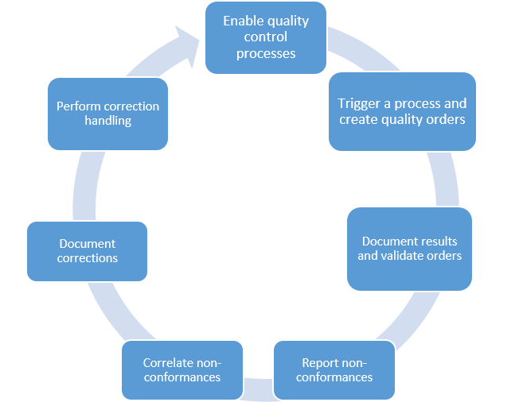

---
# required metadata

title: Quality and nonconformance management overview
description: This article introduces the quality and nonconformance management features in Microsoft Dynamics 365 Supply Chain Management and explains how they can help improve product quality in your supply chain.
author: yufeihuang
ms.date: 03/23/2021
ms.topic: overview
ms.prod:
ms.technology:

# optional metadata

ms.search.form: InventItemSampling, InventNonConformanceHistory, InventNonConformanceTable, InventQualityOrderLineResults, InventQualityOrderTable, InventTestCorrection, InventTestDiagnosticType, InventTestInstrument, InventTestReportSetup, InventTestTable
# ROBOTS:
audience: Application User
# ms.devlang:
ms.reviewer: kamaybac
# ms.tgt_pltfrm:
ms.collection: get-started
ms.assetid: 5ac8a059-5cb4-4cb5-ba14-b944bd08dae9
ms.search.region: Global
# ms.search.industry:
ms.author: yufeihuang
ms.search.validFrom: 2016-02-28
ms.dyn365.ops.version: AX 7.0.0

---

# Quality and nonconformance management overview

[!include [banner](../includes/banner.md)]

This article introduces the quality and nonconformance management features in Microsoft Dynamics 365 Supply Chain Management and explains how they can help improve product quality in your supply chain.

Quality assurance involves product testing and the management of nonconforming material. Quality management processes help guarantee a high level of product quality in your supply chain. These processes also help optimize supply chain processes and increase customer satisfaction. Quality management can help you manage turnaround times when you're dealing with nonconforming products, regardless of point of origin of those products. You can link diagnostic results to correction tasks. The system can schedule tasks to correct problems and therefore help prevent recurrences of those problems in the future. Quality management also lets you track issues (including internal problems) by problem type, and lets you identify solutions as either short-term or long-term. Statistics about key performance indicators (KPIs) provide insight into nonconformance problems that have previously occurred and the solutions that were applied to correct them. You can use historical data to help review the effectiveness of quality measures that have previously been taken and to determine appropriate measures in the future.

Quality management can help you manage turnaround times when you handle nonconforming products, regardless of their point of origin. Because diagnostic types are linked to correction reporting, Supply Chain Management can schedule tasks to correct problems and prevent them from recurring.

In addition to functionality for managing nonconformance, quality management includes functionality for tracking issues by problem type (even when the issues are internal problems), and for identifying solutions as short-term or long-term. Statistics about key performance indicators (KPIs) provide insight into the history of previous nonconformance issues and the solutions that were used to correct them. You can use historical data to review the effectiveness of previous quality measures and determine appropriate measures to use in the future.

When you set up a quality association, Supply Chain Management can generate quality orders for various business processes, events, and conditions. The quality association can cover a specific item, a specific group of items, or all items.

## Examples of the use of quality management

Quality management is flexible and can be implemented in various ways to meet the requirements of specific levels of supply chain operations. The following examples illustrate possible uses of these features:

- Automatically start a quality control process, based on predefined criteria (for example, when warehouse registration of a purchase order from a specific vendor occurs).
- Block inventory during inspection to prevent non-approved inventory from being used (full blocking of purchase order quantities).
- Use item sampling as part of a quality association to define the amount of current physical inventory that must be inspected. Sampling can be based on fixed quantities, a percentage, or a full license plate.
- Create quality orders for partial receipts. To create a quality order that is based on the quantity that is physically received with an order, you must select the **Per updated quantity** check box on the **Item sampling** page.
- Create test types that include minimum, maximum, and target test values, and perform qualitative-versus-quantitative testing that has predefined validation results.
- Specify an acceptable quality level (AQL) to control quality measure tolerances.
- Specify the resources that an inspection operation requires, such as a test area and test instruments.

> [!NOTE]
> The _Quality management for warehouse processes_ feature extends the capabilities of quality management. If you're using this feature, see [Quality management for warehouse processes](quality-management-for-warehouses-processes.md) for examples that show how quality management works when it's enabled.

## Controlling the quality management process

Here are some of the ways that you can control the quality management process:

- Create quality orders that are based on trigger points, such as "at product receipt" for inbound operations or "at product pick-up" for outbound operations.
- Document test results, and determine whether the results meet the established test criteria and AQLs.
- Use document management for detailed product specifications and user-specific notes as part of reporting during the inspection process.
- Maintain nonconforming products, and correlate those products with additional nonconformance information to track down the original cause of a problem.
- Document the cost of managing a nonconformance. This cost can include the items (such as spare parts), miscellaneous charges, and the timesheet hours that are required to correct the nonconformance.
- Schedule error correction processes by using correction handling that is linked to quality orders.

## Product testing and quality orders

Product testing is typically referred to as quality control and uses quality orders. By using the quality control functionality, you can do the following:

- Define the tests that must be performed for material. These tests include the quality specifications, the applicable test instrument, documents that describe the test, a sampling plan, and the AQLs.
- Create a quality order that identifies the tests that must be performed for a specific order, such as a purchase or production order, or for a specific inventory quantity. You can manually create a quality order, or a quality order can be automatically generated based on quality guidelines.
- Define the quality guidelines that are related to purchase, quarantine, production, or sales orders in each business process, so that a quality order that identifies the testing requirements for incoming or outgoing material can be automatically generated.
- Record the test results in a quality order, validate the test results against the AQL, and print a certificate of analysis that shows the test results.

## Nonconformance

A nonconformance describes an item that has a quality problem. The nonconformance process lets you create a nonconformance order that describes a quantity of nonconforming material, the problem source, the problem type, and explanatory notes. You can define a classification of problem types to make analysis of nonconforming material easier. You can also print a nonconformance tag and a nonconformance report to guide the disposition of nonconforming material. For example, the tag and report might indicate a condition of **Unusable** or **Restricted usage**.

The following table lists the six default nonconformance types and describes the information that must be recorded for each type.

| Nonconformance type | Source information |
|---|---|
| Customer | The customer account number, the sales order number, or a lot number of a sales order transaction. For example, the nonconformance might be related to a specific sales order shipment or to customer feedback about product quality. |
| Service request | The customer account number, the sales order number, or a lot number of a sales order transaction. For example, the nonconformance might be related to a specific sales order shipment or to a customer's complaint about item quality. |
| Vendor | The vendor account number, the purchase order number, or a lot number of a purchase order transaction. For example, the nonconformance might be related to a purchase order receipt or to a vendor's concern about a part that it supplies. |
| Production | The production order number or a lot number of a production order transaction. For example, the nonconformance might be related to a specific batch that was produced. |
| Internal | The quality order number or a lot number of a quality order transaction. For example, the nonconformance might be related to the tests that are performed as part of a quality order or to an employee's concern about product quality. |
| Co-product production | A co-product production order nonconformance that is related to batch production orders. |

Nonconformances are associated with a problem type. Problem types are defined on the **Problem types** page, where you specify which problem types can be associated with each nonconformance type. For example, the problem types for nonconformances of the **Service request** type might reflect a classification of customer complaints, whereas the problem types for nonconformances of the **Internal** type might represent a classification of defect codes.

When you create a new nonconformance, you select the nonconformance type and the problem type. The initial approval status is **New**, which represents a request for action. The next step is to change the approval status to **Approved** or **Refused**, to indicate that you will or won't take action on the nonconformance. You can also close a nonconformance (by selecting a separate check box) to indicate that you're finished with it, or you can reopen a nonconformance to indicate that additional consideration is required.

You can enter comments for a nonconformance by attaching a document. It's a good idea to define a unique document type for nonconformances by using the **Document type** page. You can then use the **Report setup** page to define whether comments for this document type should be printed on the nonconformance report and nonconformance tag. The conformance report and nonconformance tag can help with material disposition. You can selectively generate reports and tags, based on selection criteria that are associated with a nonconformance. These criteria include the nonconformance number, item, customer, vendor, and status.

The nonconformance report displays the nonconformance number, item, and problem type. Depending on your report setup policy, the report might also display related notes about the nonconformance. The nonconformance tag displays similar information, and also includes the quarantine zone and type (such as **Restricted usage** or **Unusable**) that you assigned to the nonconformance to help guide disposition of the defective material.

## Approved nonconformance

You can optionally define one or more related operations for an approved nonconformance. A related operation describes the work that should be performed, and contains a list of the quality operations that you've defined and descriptive text about the reason for the work. After you define an operation, you can optionally define the miscellaneous charges, items, and timesheet labor hours that are required in order to perform the work. The calculated costs are shown for the related operation, and the total calculated costs are shown for the nonconformance. The calculated costs and the underlying details (about items, labor hours, and miscellaneous charges) represent reference information, and they are used only in the quality management function.

You can optionally create a quality order from a nonconformance by first performing an inquiry for quality orders and then creating the new quality order. For example, a quality order might identify the need to test (or retest) the defective material. The newly created quality order displays the link to the originating nonconformance.

You can optionally link one nonconformance to another and create a new nonconformance from an existing one. For example, the link can reflect the interconnection between quality problems.

## Correction handling

The **Corrections** page lets you create a list of nonconformances that must be corrected. Each correction item is associated with the diagnostic type that caused the problem to be discovered. The **Corrections** page also contains information about who must perform a corrective action, and when. You can describe the details of the problem and the corrective action that is required by attaching a document to the correction. After the nonconformance has been addressed or corrected, you "close" the correction item by selecting the **Completed** option. You can also indicate that the solution was a short-term solution.

It's a good idea to define a unique document type for corrections by using the **Document type** page. You can then use the **Report setup** page to define whether comments for this document type are printed on the correction report. A printed correction report displays information about the nonconformance and the related nonconformance notes. The report also includes correction information, such as the diagnostic type, and the related correction notes.

## Additional resources

- [Enable quality and nonconformance management](enable-quality-management.md)
- [Inventory blocking](inventory-blocking.md)
- [Quarantine orders](quarantine-orders.md)
- [Inspect the quality of goods](tasks/inspect-quality-goods.md)

[!INCLUDE[footer-include](../../includes/footer-banner.md)]
