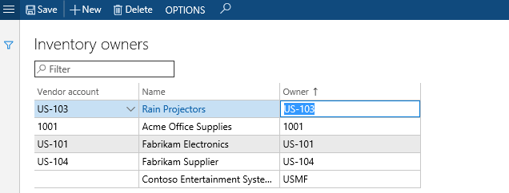
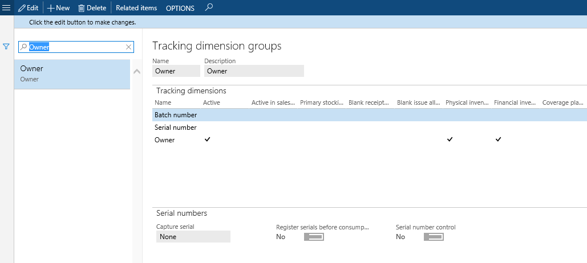

---
# required metadata

title: Set up consignment
description: This topic explains how to configure inbound consignment inventory operations.
author: perlynne
ms.date: 06/20/2017
ms.topic: article
ms.prod:
ms.technology:

# optional metadata

ms.search.form: DirPartyTable, EcoResTrackingDimensionGroup, InventJournalName, InventJournalOwnershipChange, InventOwner, InventTableInventoryDimensionGroups, VendTable
# ROBOTS:
audience: Application User
# ms.devlang:
ms.reviewer: kamaybac
# ms.tgt_pltfrm:
ms.custom: 220804
ms.assetid: 88822f78-4de5-462c-a55f-1f766c572719
ms.search.region: Global
# ms.search.industry:
ms.author: perlynne
ms.search.validFrom: 2016-11-30
ms.dyn365.ops.version: Version 1611

---

# Set up consignment

[!include [banner](../includes/banner.md)]

This topic explains how to configure inbound consignment inventory operations.

Consignment inventory is inventory that’s owned by a vendor, but stored at your site. When you’re ready to consume or use the inventory, you take over the ownership of the inventory. This topic describes the setup needed to enable consignment processes. For more information about consignment processes, see [Set up consignment](consignment.md).

## Inventory owners
In order to record physical inbound consignment inventory, you need to define a vendor owner. This is done on the **Inventory owner** page. When you select a **Vendor account** this generates default values for the **Name** and **Owner** fields. The value in the **Owner** field will be visible to the vendor, so you might want to change it if your vendor account names aren’t easy for external people to recognize. It’s possible to edit the **Owner** field, but only up to the point when you save the **Inventory owner** record. The **Name** field is populated with the name of the party that the vendor account is associated with, and this cannot be changed.

## Tracking dimension group
Items that are going to be used in consignment processes must be associated with a **Tracking dimension group** where the **Owner** dimension is set to **Active**. The Owner dimension always has the **Physical inventory** and **Financial inventory** options selected. The **Coverage plan by dimension** is never selected.

## Inventory ownership change journal
The **Inventory ownership change** journal is used to record the transfer of ownership of consignment inventory from the vendor to the legal entity that’s consuming it. Like any inventory journal, it must be identified with an Inventory journal name. These names are created on the **Inventory journal names** page, and the **Journal type** must be set to **Ownership change**.

## Vendor collaboration in consignment processes
If your vendors are using the vendor collaboration interface, they can use this to monitor the consumption of inventory at your site. For more information about setting up vendors to use vendor collaboration, see [Vendor portal user security](../procurement/configure-security-vendor-portal-users.md).

[!INCLUDE[footer-include](../../includes/footer-banner.md)]