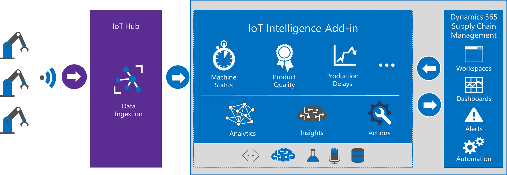

---
# required metadata

title: IoT Intelligence home page
description: This topic provides links to information about IoT Intelligence.
author: johanhoffmann
ms.date: 12/09/2020
ms.topic: article
ms.prod: 
ms.technology: 

# optional metadata

# ms.search.form: 
# ROBOTS: 
audience: Application User, Developer, IT Pro
# ms.devlang: 
ms.reviewer: kamaybac
# ms.tgt_pltfrm: 
ms.custom: "intro-internal"
ms.search.region: Global
# ms.search.industry: 
ms.author: johanho
ms.search.validFrom: 2020-04-25
ms.dyn365.ops.version: AX 7.0.0
---

# IoT Intelligence home page

[!include [banner](../../includes/banner.md)]

> [!IMPORTANT]
> This feature is currently only available in the following countries/regions:
>
> - US (United States of America)
> - EU (European Union)
> - AU (Australia)
> - CA (Canada)
> - UK (United Kingdom)

IoT Intelligence is an add-in for Microsoft Dynamics 365 Supply Chain Management. It integrates Internet of Things (IoT) signals with data in Supply Chain Management to produce actionable insights.

IoT Intelligence supports the following scenarios:

- **Production delays** – This scenario compares actual cycle time to planned cycle time. Supply Chain Management notifies you when production isn't on schedule, so that you can intervene to maximize operating efficiency and avoid order delays.
- **Equipment downtime** – This scenario compares measured uptime to user-defined parameters. Supply Chain Management notifies you when an outage threshold is exceeded, so that you can take actions such as rescheduling a production work order or creating a maintenance work order.
- **Product quality** – This scenario compares sensor readings, such as moisture and temperature, to user-defined quality metrics. Supply Chain Management notifies you when a deviation occurs, so that you can intervene to maintain quality standards and minimize waste.

The following illustration shows the interaction of Azure IoT Hub, IoT Intelligence, and Supply Chain Management.

<!-- KFM: hide setup info for now

## Setup

You can set up and configure IoT Intelligence without writing any code. Here are the basic steps.

1. [Set up Azure resources](iot-azure-setup.md) – Create an IoT hub, a Redis cache, and a key vault that can be accessed from Supply Chain Management.
2. [Message schema formats for IoT Hub](iot-schema-format.md) – Configure your devices to send messages to IoT Hub, and define the JavaScript Object Notation (JSON) message format.
3. In Feature Management, enable the IoT Intelligence feature flag. 
4. [Install the IoT Intelligence add-in in Microsoft Dynamics Lifecycle Services (LCS)](iot-lcs-setup.md) – Install the add-in in LCS, and configure the Azure secrets.
5. [Set up metrics](iot-metrics-setup.md) – Set up metrics in Supply Chain Management.
6. [Scenario setup](iot-scenario-setup.md) – Set up the scenarios in Supply Chain Management.

-->

## Tracking and maintenance

- [Monitor scenarios in Dynamics 365 Supply Chain Management](iot-management.md#monitor-scenarios)
- [Disable a scenario](iot-scenario-setup.md#disable-a-scenario)
- [Modify a running IoT Intelligence scenario](iot-management.md#modify-a-running-iot-intelligence-scenario)
- [Simulation options](iot-management.md#simulation-options)

[!INCLUDE[footer-include](../../includes/footer-banner.md)]