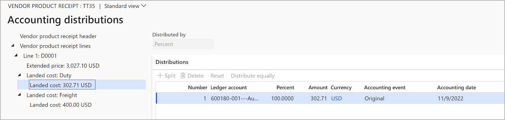

---
# Delivery information setup

title: Estimate and manage landed costs
description: The system uses your auto cost setup to determine an estimate for your landed cost. This article explains how you can define various scenarios to deliver a more accurate estimate.
author: Weijiesa
ms.date: 01/26/2021
ms.topic: article
ms.prod: 
ms.technology: 

# optional metadata

ms.search.form: ITMCostTemplateTable, ITM CostEstimateDialog, ITMCostEstimateTable, SysOperationTemplateForm
audience: Application User
# ms.devlang: 
ms.reviewer: kamaybac

# ms.tgt_pltfrm: 
# ms.custom: [used by loc for articles migrated from the wiki]
ms.search.region: Global
# ms.search.industry: [leave blank for most, retail, public sector]
ms.author: weijiesa
ms.search.validFrom: 2021-01-26
ms.dyn365.ops.version: 10.0.17
---

# Estimate and manage landed costs

[!include [banner](../../includes/banner.md)]

The system uses your [auto cost setup](auto-cost-setup.md) to determine an estimate for your landed cost. Additionally, you can define various scenarios to deliver a more accurate estimate. These scenarios are stored. Therefore, you can review them later and compare them to actuals on a report. You can also update the item price.

## Set up cost estimates

### Set up cost templates

Cost templates establish default settings that users who get the estimate won't necessarily know. Templates can help reduce complexity in the estimating process by minimizing the selections that users must specify to get an accurate estimate. If you're using the standard cost model, you can use cost templates while you set up the cost of goods.

To set up your cost templates, go to **Landed cost \> Costing setup \> Cost templates**. On the **Cost templates** page, the list pane on the left shows all current cost templates. You can use the buttons on the Action Pane to create, delete, and edit templates.

The following table describes the fields that are available for each template.

| Field | Description |
|---|---|
| Cost template | Enter a unique name for the cost template. The name typically describes the factor or cost multiplier for the template. |
| Description | Enter a description of the cost template. |
| Shipping company | Select the shipping company that should be applied when the template is used. |
| Mode of delivery | Select the mode of delivery, such as sea or air, that should be applied when the template is used. This field helps determine the auto costs that are associated with the goods on a cost estimate. |
| Shipping container type | Select the type of shipping container that should be applied when the template is used. This field helps determine the auto costs that are associated with the goods on a cost estimate. |
| Customs broker | The customs broker (vendor) that should be applied when the template is used. This field helps determine the auto costs that are associated with the cost estimate. |
| Factor | Enter the multiplier (percentage) that should automatically be applied to the cost estimate when the template is used. For example, to add 10 percent to the calculated cost estimate, enter *1.10*. |

### Create a cost estimate

Use the **Cost estimate** dialog box to generate a new cost estimate that is based on a selected cost template, a selected set of items, and other details of a journey. These settings are then used to determine the estimated landed costs of goods. These cost estimates are primarily used to work with standard cost items. By adding the estimated landed costs to the standard cost of goods in inventory, you should experience smaller variance transactions when the goods are added to a voyage, because the standard cost will reflect the estimates of those landed costs.

To open the **Cost estimate** dialog box, go to **Landed cost \> Periodic tasks \> Cost estimate**. Then set the fields that are described in the following subsections. Finally, select **OK** to create the estimate. The **Cost estimate** page (**Landed cost \> Inquiries \> Cost estimates**) then appears and shows your new estimate, as described later in this article.

### Settings on the Parameters tab

The following table describes the fields that are available on the **Parameters** tab of the **Cost estimate** dialog box.

| Field | Description |
|---|---|
| Cost template | Select a cost template. The settings that are associated with the selected template will be used to determine the auto costs that are applied. |
| Estimate date | By default, this field is set to today's date, but you can change the value. The specified date will be used to select the appropriate sales prices, purchase prices, auto costs, and the exchange rate if a shipping rate is used. |
| Measurement | Costs might depend on a measurement. For example, when air freight is used, volumetric pricing might apply. If the cost depends on a measurement, enter the value of that measurement. Otherwise, we recommend that you set this field to *1*, unless you're certain that no apportionment occurs by using measurement. Enter a decimal value. The unit is the one that is defined in the applicable auto cost record. |
| Journey template | Select a [journey template](multi-leg-journey-setup.md). This field is used to determine the correct auto costs that should be applied. |
| From port | The port that the items will be shipped from. This field is set based on the selected journey template. |
| To port | The port that the items will be shipped to. This field is set based on the selected journey template. |
| Currency | Select the currency that the items will be purchased in. |
| Containers | If multiple containers are typically used, specify the number of containers. The system will then use costs for multiple containers when it estimates the costs. |
| Folios | If multiple folios are typically used, specify the quantity. (The quantity is usually *1*.) |
| Site | Specify the site where the goods will be delivered. |

### Settings on the Items tab

On the **Items** tab, you can add as many items to the estimate as you require. Use the toolbar to add items to the grid or remove items. Select **Inventory \> Display dimensions** on the toolbar to open a dialog box where you can add dimension columns to the grid or remove columns.

The following table describes the fields that are available for each item.

| Field | Description |
|---|---|
| Item number | Select the item to determine the price for. (If the item doesn't yet exist in the system, create a dummy item, optionally attach it to a voyage item cost group, and then either leave the price blank, or create or change the price.) |
| Vendor account | Select the vendor to use for the estimate of this item. If a default vendor is assigned to the item, this field is automatically set. |
| Quantity | Select the quantity that you will purchase. |
| Cost price | The system uses its pricing rules to find an initial price, but you can override that price if necessary. |
| Sales price | Enter the expected sales price of the goods. |
| Measurement | Enter a decimal value for the measurement of the goods. The unit is the one that is set up for the applicable released product. |
| Update item weight/volume | Select this check box to update the weight or volume measurement of the released product so that it matches the **Measurement** value that is entered for this row. |
| (Other dimensions) | Depending on the dimensions that you've selected to show, you might see additional columns of information about each item. |

To view or adjust the volume and/or weight details for an item, select the item in the grid, and then use the fields at the bottom of the page.

## Manage estimated costs

To view and edit the cost estimates that you've created, go to **Landed cost \> Inquiries \> Cost estimates**. On the **Cost estimates** page, the list pane on the left shows all current cost estimates. You can use the buttons on the Action Pane to work with a selected estimate. Note that you can't create a new cost estimate from the **Cost estimates** page. Instead, use the **Cost estimate** dialog box (**Landed cost \> Periodic tasks \> Cost estimate**), as described earlier in this article.

The **Cost estimates** page shows how each estimated cost was derived. It also shows the estimated landed cost for each item. You can modify a cost estimate by changing the cost price and/or currency that is associated with the various goods. You can also modify the associated voyage costs at both the voyage level and the container level. When you use this page to modify the costs, you're prompted to recalculate the estimated costs for the items in the cost estimate. When you're ready, you can use the estimates to update the cost price of the items in the cost template.

### Information on the header

The top of the **Cost estimates** page shows the settings that were used to generate the selected cost estimate, as described in the previous section. 

### Settings and buttons on the Lines FastTab

The **Lines** FastTab lists each item that is included in the current estimate. The following table describes the field that are available for each row.

| Field | Description |
|---|---|
| Vendor account | The vendor account that is associated with the item. |
| Item number | The item number. |
| Quantity | The number of items that are used to determine the cost. |
| Cost price | The cost price according to the trade agreement. This value is shown in the local currency. |
| Measurement | The individual measurement. The unit is the one that is defined for the applicable released product. |
| Estimated landed cost | The estimated landed cost for the total quantity. |
| Per unit | The estimated landed cost divided by the quantity. |
| (Other dimensions) | Depending on the dimensions that you've selected to show, you might see additional columns of information about each item. |

The following table describes the buttons that are available on the toolbar on the **Lines** FastTab.

| Button | Description |
|---|---|
| Add | Add items to the cost estimate. After you add items, you must select **Recalculate** on the Action Pane. |
| Remove | Remove items from the cost estimate. After you remove items, you must select **Recalculate** on the Action Pane. |
| Voyage costs | Open a page where you can view and edit various types of voyage costs for the item. |
| Inventory \> Display dimensions | Open a dialog box where you can add dimension columns to the grid or remove columns. |

### Settings on the General FastTab

The **General** FastTab shows details about the item that is currently selected on the **Lines** FastTab. Much of this information is repeated from the **Lines** FastTab and can be edited in either place. However, additional details are also available here. The values of the extra fields are based on the setup of the applicable released product.

### Settings on the Dimension FastTab

The **Dimension** FastTab shows values for all available inventory dimensions for the item that is selected on the **Lines** FastTab, regardless of the dimensions that you've chosen to show there. Any values that are shown here come from the applicable cost estimate template. They are optional in the cost estimate template.

### Buttons on the Action Pane

You can use the buttons on the Action Pane of the **Cost estimates** page to work with the selected cost estimate. The following table describes the buttons that are available.

| Action | Description |
|---|---|
| Cost Inquiry | View all costs for the voyage. You can view costs at the level of the individual item as required. |
| Update standard cost | 
Update the standard cost by using the default costing version that is defined on the **Landed cost parameters** page. You can override this version.

**Note:** If an item has several item dimensions (for example, various sizes, colors, and configurations), but these dimensions haven't been selected for the estimate, the system will create a pending price for each combination.

**Important:** The price breakdown is created and is used to determine the standard cost variance per landed cost.
 |
| Voyage costs | View and edit voyage costs for all goods in the shipment. |
| Recalculate | Update the estimated landed costs after voyage costs are updated, added, or removed. |
| Lock | Lock the cost estimate record so that no more changes can be made. |

## Item cost price update

The **Item cost price update** periodic task updates all cost estimates that match the filters that you set when you run the task. The effect is similar to the effect of selecting **Update standard cost** on the Action Pane for a single estimate. However, in this case, the update applies to all matching estimates.

To run the periodic task, follow these steps.

1. Go to **Landed cost \> Periodic tasks \> Item cost price update**.
1. In the **Update cost price from estimate** dialog box, set the following fields as required to limit the scope of the update:

    - **Version** – Update only estimates that use the specified costing version.
    - **Site** – Update only estimates that use the specified site.
    - **Cost template** – Update only estimates that use the specified template.
    - **To port** – Update only estimates that use the specified "to" port.
    - **Estimate date** – Update only estimates that have the specified date.

1. Set the options on the **Records to include** and **Run in the background** FastTab as usual for periodic tasks.
1. Select **OK** to run the task.

> [!NOTE]
> This periodic task will only execute successfully provided the following information is available:
>
> - Each relevant product must have a **Gross depth**, **Gross width**, and **Gross height** defined.
> - Each relevant vendor must have a **From port** defined.

## Show landed costs in the accounting distribution of product receipts

[!INCLUDE [preview-banner-section](../../includes/preview-banner-section.md)]

<!-- KFM: Preview until further notice -->

This feature enables landed costs to be included in the accounting distribution of purchased product receipts, which makes it easier for you to identify and track these costs. This feature doesn't affect the product receipt accounting logic that's used in other places in Microsoft Dynamics 365 Supply Chain Management.

### Prerequisites

To use this feature, you must be running Supply Chain Management 10.0.34 or higher and the *(Preview) Source document and accounting distribution support for Landed Cost* feature must be turned on in [feature management](../../fin-ops-core/fin-ops/get-started/feature-management/feature-management-overview.md).

### View landed costs in the accounting distribution of product receipts

When a product receipt is posted against a purchase order, Landed cost creates a source document line for each landed cost amount. The amount from Landed cost is shown on the **Account distributions** page, which is available from the product receipt.

The following screenshot shows an example of accounting distributions that include landed costs.

