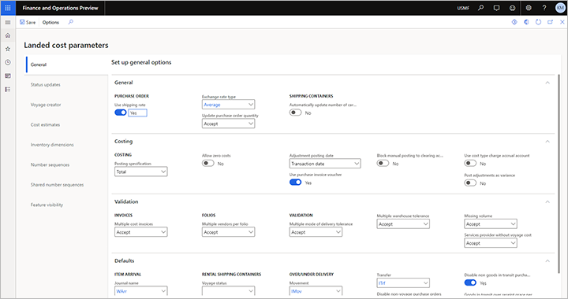

---
# required metadata

title: Landed cost parameters setup
description: This article describes how to set up general information and configuration settings that are used across the Landed cost module for posting, status updates, number sequences, and behavior.
author: Weijiesa
ms.date: 03/03/2023
ms.topic: article
ms.prod: 
ms.technology: 

# optional metadata

ms.search.form: ITMParameters
audience: Application User
# ms.devlang: 
ms.reviewer: kamaybac

# ms.tgt_pltfrm: 
# ms.custom: [used by loc for articles migrated from the wiki]
ms.search.region: Global
# ms.search.industry: [leave blank for most, retail, public sector]
ms.author: weijiesa
ms.search.validFrom: 2020-12-07
ms.dyn365.ops.version: 10.0.17
---

# Landed cost parameters setup

[!include [banner](../../includes/banner.md)]

You use the **Landed cost parameters** page to set up general information and configuration settings that are used across the **Landed cost** module for posting, status updates, number sequences, and behavior. The setup of parameters is shared across legal entities and can be modified by an administrator.

## Open the Landed cost parameters page

To work with the parameters, go to **Landed cost \> Setup \> Landed cost parameters**, and then set the fields as described in the following subsections.

## General tab

### General FastTab

The following table describes the fields that are available on the **General** FastTab of the **General** tab of the **Landed cost parameters** page.

| Setting | Description |
|---|---|
| Use shipping rate | A shipping rate is set for a defined period and is used to estimated costs of goods that use multiple currencies. Set this option to *Yes* to use a shipping rate. |
| Exchange rate type | The default collection of exchange rates that is used for multi-currency calculations for a voyage and voyage costs. |
| Update purchase order quantity | Select what occurs if a user changes the quantity on a purchase order line:<ul><li>**Accept** – The voyage quantity is automatically adjusted.</li><li>**Warning** – If the line is attached to a voyage, a warning is shown, but the voyage quantity is updated.</li><li>**Error** – If the line is attached to a voyage, an error message is shown, and the purchase order can't be updated. Therefore, the order line must first be removed from the voyage.</li></ul> |

### Costing FastTab

The following table describes the fields that are available on the **Costing** FastTab of the **General** tab of the **Landed cost parameters** page.

| Setting | Description |
|---|---|
| Posting specification | Select the value adjustment in the ledger:<ul><li>**Total** – A total figure is posted to the ledger.</li><li>**Item group** – The adjustment is specified per item group.</li><li>**Item number** – The adjustment is specified per item. This value provides the most detail.</li></ul> |
| Allow zero costs | Set this option to *No* to show an error if a user tries to post a cost estimate for a voyage invoice or purchase order that doesn't include a value for the expected voyage cost. The error message states that a cost of 0 (zero) can't be allocated, and invoice posting will fail. In this case, the user can manually update the estimate (or reconfigure the auto cost), and then either pull in the updated value or delete the cost if it doesn't apply.
Set this option to *Yes* to allow the voyage cost to be blank. In this case, a price of 0 (zero) will be allocated according to the cost area. A vendor cost invoice can then be processed against the zero-price cost when the voyage is received.

We recommend that you configure the estimate on the auto cost record to prevent a zero-price cost from appearing. Although this estimate isn't completely accurate, it should still be more accurate than an assumed zero cost.
 |
| Adjustment posting date | When you post an Accounts payable voyage cost invoice, the settlements table (inventory adjustments) is also updated. Select the date that is set by default on the **Select voyage costs** page while you're in the invoice journal:<ul><li>**Transaction date** – Use the date of the journal (posting date).</li><li>**Purchase order invoice date** – Use the financial posting date of the stock (purchase order) invoice.</li><li>**Selected date** – The user can specify a posting date. Although the date can be left blank, if it's still blank when the cost invoice is posted, the user will receive an error.</li></ul> |
| Use purchase invoice voucher | When this option is set to *Yes*, cost accrual transactions will use the same voucher number that is used for the purchase invoice. When it's set to *No*, the system will use the next available number for the **Costs accrual voucher** number sequence that is set up on the **Number sequences** tab of the **Landed cost parameters** page.
This option has an effect only when the **Post to charge account in ledger** option is set to *Yes* on the **Invoice** tab of the **Accounts payable parameters** page.
 |
| Block manual posting to clearing account | Set this option to *Yes* to prevent posting to clearing accounts where the transaction hasn't been linked to a voyage by selecting **Functions \> Select voyage costs** on the Action Pane of the vendor invoice journal. We recommend that you set this option to *Yes*, so that the voyage and clearing account can be correctly settled. |
| Use cost type charge accrual account | When this option is set to *Yes*, the charge accrual account that is configured for the relevant cost type code on the **Cost type codes** page will be used to accrue costs as an expense.
This option has an effect only when the **Post to charge account in ledger** option is set to *Yes* on the **Invoice** tab of the **Accounts payable parameters** page. |
| Post adjustments as variance | When this option is set to *Yes*, it overrides the standard functionality and forces the inventory adjustment transactions that are related to variances between estimated costs and actual costs to be posted to a variance account.
When this option is set to *No*, the inventory adjustment transactions that are related to variances are handled based on the configuration of the costing method and cost type code. For standard cost, variances will still be posted to the variance account. For moving weighted average (WMA), variances will be posted either to the variance account or to inventory.

This option has an effect only when the **Post to charge account in ledger** option is set to *Yes* on the **Invoice** tab of the **Accounts payable parameters** page.
 |

### Validation FastTab

The following table describes the fields that are available on the **Validation** FastTab of the **General** tab of the **Landed cost parameters** page.

| Setting | Description |
|---|---|
| Multiple cost invoices | Select what occurs if more than one invoice is processed against a voyage, folio, or container for the same miscellaneous charge.<ul><li>**Accept** – The system should allow multiple cost invoices.</li><li>**Warning** – A warning is shown.</li><li>**Error** – An error message is shown.</li></ul> |
| Multiple vendors per folio | Select what occurs if more than one vendor's purchase orders are added to a folio.<ul><li>**Accept** – The system should allow the action.</li><li>**Warning** – A warning is shown, but the action can still be performed.</li><li>**Error** – An error message is shown, and the action is prevented.</li></ul>
Your customs broker or local laws might mandate a specific value for this field.
 |
| Multiple mode of delivery tolerance | Select what occurs if goods from a purchase order that uses a different mode of delivery than the voyage are added to that voyage.<ul><li>**Accept** – The system should allow the action.</li><li>**Warning** – A warning is shown, but the action can still be performed.</li><li>**Error** – An error message is shown, and the action is prevented.</li></ul> |
| Multiple warehouse tolerance | Select what occurs if a voyage includes several order lines that must be delivered to different warehouses. These order lines might be spread across one or more purchase orders.<ul><li>**Accept** – The system should allow the action.</li><li>**Warning** – A warning is shown.</li><li>**Error** – An error message is shown.</li></ul> |
| Missing volume | Select what occurs if a user adds an item without a volume to a voyage.<ul><li>**Accept** – The system should accept the item.</li><li>**Warning** – A warning is shown.</li><li>**Error** – An error message is shown.</li></ul>
If volumes are used to calculate and apportion costs, we recommend that you select either *Warning* or *Error*.
 |
| Services provider without voyage cost | Select what occurs if a user tries to process an invoice for a service provider that hasn't been linked to a voyage. <ul><li>**Accept** – The system should allow the action.</li><li>**Warning** – A warning is shown.</li><li>**Error** – An error message is shown.</li></ul>
We recommend that you select *Warning*.
 |

### Defaults FastTab

The following table describes the fields that are available on the **Defaults** FastTab of the **General** tab of the **Landed cost parameters** page.

| Setting | Description |
|---|---|
| Journal name | Select the default journal that the *Create arrival journal* function should use. |
| Voyage status | Select the status that a voyage must have before users can set up a rental shipping container for it in the system. This action typically occurs when the goods are in transit or at the dock. |
| Journey template | Select the default journey template to use for new rental shipping containers. You will typically select a journey template that includes rental costs. |
| Movement | If the over/under quantity for a delivery is within the defined tolerance, a movement journal will automatically be processed. Select the default movement journal to use. The **Offset account** field for the selected movement journal name must have a value. |
| Transfer | When an under-delivery is processed, the short-receipt quantity will be transferred to an under-delivery warehouse. Select the default transfer journal to use. |
| Disable non-voyage purchase orders | Turn off the Landed cost over/under delivery functionality for purchase orders that aren't attached to a voyage. |
| Disable non goods in transit purchase orders | Turn off the Landed cost over/under delivery functionality for purchase orders that don't use goods in transit functionality. |
| Goods in transit over receipt grace period | Specify the number of days after the first receipt of a shipping container that additional over-receipts can still be completed for that shipping container. |

## Status updates tab

The system uses status values to indicate the status of each voyage. Voyage status values can automatically be applied to voyages via voyage tracking or periodic batch jobs. Alternatively, you can manually apply them by opening the voyage and then selecting a status in the **Voyage update** group on the **Manage** tab of the Action Pane. 

You can create as many voyage status values as you want. However, four of them must be defined as used for a special purpose on the **Status updates** tab of the **Landed cost parameters** page. The following table describes the fields that are available there.

| Setting | Description |
|---|---|
| Costed | Select the voyage status that identifies that a voyage has been finalized. |
| In transit | Select the voyage status that identifies that a voyage is in transit. |
| Ready for costing | Select the voyage status that identifies that a voyage is ready for costing. This status is used when all stock purchase invoices and voyage cost invoices where the **Credit on the voyage cost** field is set to *Vendor* have been processed for the voyage. Voyages that fail the costed process will have a status of *Ready for costing*.|
| Pre-costed | Select the voyage status that identifies that a voyage is being pre-costed. This status is used when a new cost transaction is added to a voyage after it has already been costed. New cost transactions might be added to a previously costed voyage when a second freight invoice or unexpected demurrage charge is received. This status is automatically applied when a new voyage cost is added to a costed voyage. |

## Voyage creator tab

The following table describes the sections on the **Voyage creator** tab of the **Landed cost parameters** page.

| Section | Description |
|---|---|
| Tolerances | The **Outside volume tolerance** and **Outside weight tolerance** fields define thresholds above which goods are considered over-volume and overweight. When a user adds goods on the **Voyage editor** page, if the volume or weight exceeds the value that you set here, the system shows a warning. The value of each field is expressed as a percentage of the maximum volume or weight that is set for the relevant shipping container type. We recommend that the value be between 5 and 10 percent of the maximum volume or weight. |
| Folio creation setup | The system can create multiple folios during the voyage creation process. Use this section to define when a new folio should be created. For each row in this section, the system will check the specified table and field, and will create a folio for each unique field value. |

## Cost estimates tab

The **Cost estimates** tab of the **Landed cost parameters** page provides just one field: **Default costing version**. This field applies only when the costing method is *Standard costing*. Select the default costing version to use for the *Item cost price update* periodic task. You might have to change this setting every time that a new financial year begins.

## Inventory dimensions tab

You use the **Inventory dimensions** tab of the **Landed cost parameters** page to control which available inventory dimensions should be shown by default on each Landed cost pages where dimensions are used.

Select a dimension, and then set the **Voyage lines**, **Goods in transit**, and/or **Cost estimates** option to *Yes* for each page where that dimension should be shown by default. Repeat this step for other dimensions, as required.

The settings on this tab establish the default dimensions for each designated page across legal entities. However, users who are working on one of the designated pages can override the default dimensions by selecting **Inventory \> Display dimensions** on the Action Pane.

## Number sequences tab

The **Number sequences** tab of the **Landed cost parameters** page lists each type of reference number sequence that Landed cost requires, but that isn't shared across legal entities. For each reference in the list, select a number sequence code.

## Shared number sequences tab

The **Shared number sequences** tab of the **Landed cost parameters** page lists each type of reference number sequence that is shared across legal entities for Landed cost. Currently, there is just one number sequence in the list. This number sequence is used for the voyage ID.

## Feature visibility tab

Landed cost adds features (fields and functions) to several frequently used pages in Microsoft Dynamics 365 Supply Chain Management. These pages include pages that are related to vendor master data, released products, purchase orders, transfer orders, and warehouse setup. If you're using Landed cost, you must make those features visible everywhere before you can benefit from them. If you aren't using Landed cost, you can hide the features to keep them out of the way.

On the **Feature visibility** tab of the **Landed cost parameters** page, set the **Activate** option to *Yes* to make Landed cost features visible wherever they are available. Set it to *No* to hide the features on common pages outside Landed cost. However, even when the option is set to *No*, the module itself, including the **Landed cost parameters** page, will remain available to users who have the correct permissions to access it.
