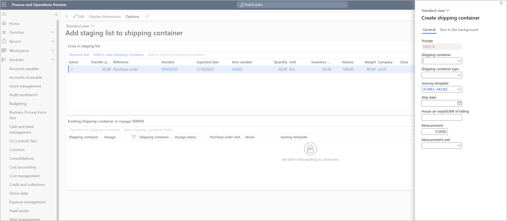

---
# required metadata

title: Manage shipping containers
description: This article describes how to work with shipping containers. Shipping containers are used to group together goods that are physically grouped together. They are also used in cases where costs must be shared only across those goods, usually because they are physically together.
author: Weijiesa
ms.date: 03/03/2023
ms.topic: article
ms.prod: 
ms.technology: 

# optional metadata

ms.search.form: ITMContainersListPage, ITMContainers
audience: Application User
# ms.devlang: 
ms.reviewer: kamaybac

# ms.tgt_pltfrm: 
# ms.custom: [used by loc for articles migrated from the wiki]
ms.search.region: Global
# ms.search.industry: [leave blank for most, retail, public sector]
ms.author: weijiesa
ms.search.validFrom: 2020-12-14
ms.dyn365.ops.version: 10.0.17
---

# Manage shipping containers

[!include [banner](../../includes/banner.md)]

Shipping containers are used to group together goods that are physically grouped together. They are also used in cases where costs must be shared only across those goods, usually because they are physically together.

## Create shipping containers for voyages

You create a shipping container by opening or creating the voyage where you will use it, and then assigning the purchase order lines that the shipping container will include. Follow these steps to create a shipping container for a voyage.

1. Follow one of these steps:

    - Go to **Landed cost \> Voyages \> All voyages**. To create a new voyage, select **New** on the Action Pane, fill in the **Create voyage** dialog box as needed, and then select **OK**. To edit an existing voyage, select it, and then select **Voyage editor** on the Action Pane. In both cases, the **Voyage editor** page is opened and shows the new or selected voyage.
    - Go to **Procurement and sourcing \> Purchase orders \> All purchase orders**. Select the purchase order to create a voyage and container for, and then, on the Action Pane, on the **Purchase** tab, in the **Landed cost** group, select **Create new voyage**. Fill in the **Create voyage** dialog box as needed, and then select **OK** to open the **Voyage editor** page.

1. Use the filters at the top of the **Voyage editor** page to find the inbound order that you want to create the shipping container for. If you created the voyage from the **All purchase orders** page, the purchase order that you selected there will already be selected in the filter here. However, you can adjust the filters as you want.
1. On the Action Pane, select **Generate data** to refresh the list of orders shown in the **Inbound orders** FastTab based on your current filter settings. (Each time you change the filter settings, you must select this button to update the inbound orders list.)
1. The **Inbound orders** FastTab shows all the qualifying purchase orders that match your filter settings. Select an inbound order to include in the new shipping container.
1. On the **Lines to select** FastTab, select the checkbox for each purchase order line that you want to include in the new shipping container.
1. Repeat steps 2 through 4 until you've found and selected all the order lines that you want to include in the new shipping container.
1. On the **Lines to select** FastTab, on the toolbar, select **Add to staging list**.
1. On the toolbar, select **View staging list**.
1. The **Add staging list or shipping container** page is opened. The purchase order lines that you selected are listed on the **Lines in staging list** FastTab. All the purchase order lines in this list will be added to the shipping container that you create. You can remove any line by selecting it and then selecting **Remove line** on the toolbar of the FastTab.
1. On the **Lines in staging list** FastTab, on the toolbar, select **Add to new shipping container**.
1. In the **Create shipping container** dialog box, on the **General** tab, define the new shipping container.

    

1. If you want to create the shipping container in batch mode, on the **Run in the background** tab, set the **Batch processing** option to *Yes*. If your container includes a large number of lines, batch mode can help improve performance.

    > [!NOTE]
    > The **Run in the background** tab is available only if the *(Preview) Enable shipping container creation and update in batch mode* feature is turned on for your system. For information about how to turn this feature on or off, see [Turn on the Landed cost module and related features for your system](landed-cost-enable.md).)
    >
    > Background processing won't be activated if the transfer quantity is less than the total quantity of the related purchase order line.

1. Select **OK** to create the shipping container and add the selected purchase order lines to it.

> [!NOTE]
> If a container already exists for your selected voyage, you can add new purchase order lines to it by selecting **Add to new existing shipping container** on the **Add staging list or shipping container** page.

### Action Pane buttons on the Voyage editor page

The following table describes the buttons that are available on the Action Pane of the **Voyage editor** page.

| Button | Description |
|---|---|
| Edit voyage header | Opens the **Edit voyage** dialog, where you can view and update header information for the current voyage. |
| Setup | Opens a drop-down dialog where you can choose which transaction types and sites to show on the page. |
| Generate data | Updates the list of orders shown in the **Inbound orders** FastTab based on the current filter settings. You must select this button to update the inbound orders list each time you change the filter settings. |
| Display dimensions | Opens a dialog where you can select the inventory dimensions that should be shown in the grid on the **Lines to select** FastTab. |

## View shipping container lists and details

To view and process goods through the shipping container page, go to **Landed cost \> Shipping containers \> All shipping containers**. The **All shipping containers** page shows a list of all available shipping containers. You can use the buttons on the Action Pane to delete and manage shipping containers. Select any shipping container in the list to view its details on the **Shipping containers** page.

The upper part of the shipping container details page shows shipping container and costing information. The **Lines** section shows the folios, items, and purchase orders or transfer orders that are attached to the container.

## Shipping containers Action Pane

The Action Pane on the **All shipping containers** and **Shipping containers** pages provides buttons that let you work with a selected shipping container. Each button performs a single action. The Action Pane also includes tabs, each of which, in turn, provides a set of related buttons. Except where noted, all buttons and tabs that are described in the following subsections are available both in the list view (that is, on the **All shipping containers** page) and in the detailed view (that is, on the **Shipping containers** page).

### Buttons on the Manage tab

The following table describes the buttons that are available on the **Manage** tab of the Action Pane.

| Button | Descriptions |
|---|---|
| Post receipts list | Post a receipt list, or view the product receipt lists for all purchase order lines in the shipping container.  |
| Post product receipt | Post a product receipt for all purchase order lines in the shipping container. |
| Post invoice | Post an invoice for all purchase order lines in the shipping container.  |
| Ship transfer order | Post a transfer order shipment for all transfer order lines in the shipping container. Only those lines in the shipping container that are a type of transfer order appear in the dialog box. |
| Receive transfer order | Post a transfer order receipt for all transfer order lines in the shipping container. The receive dialog box is the simplest way to receive goods in a shipping container or voyage, and is one of three available options. You can also receive via arrival journals or mobile device processing. |
| Create arrival journal | You can generate an arrival journal for organizations by using advanced warehouse features. The options are _Initialize quantity_ (recommended), and either _Create from goods in transit_ or _Create from purchase orders_. The last two options depend on whether goods-in-transit processing is being used. |
| Rename | Open a dialog box where you can rename a selected shipping container. |
| Change journey template | Change the journey template. After you change the journey template, you might have to select **Find auto costs** or manually add costs again, because the shipment costs will be deleted. |
| Convert to rental | Convert a selected shipping container into a rental shipping container. |

### Buttons on the General tab

The following table describes the buttons that are available on the **General** tab of the Action Pane.

| Button | Descriptions |
|---|---|
| Receipts list | Post a receipt list for all purchase order lines in the shipping container.  |
| Product Receipt | View the product receipt record, if it's used. The product receipt process will be used only if the goods don't use goods-in-transit functionality. |
| Item arrival | View the item arrival journal for the shipping container, if that journal is used. |
| Legs | Legs are used to identify separate parts of a journey. Lead times can be associated with each leg to help with shipment tracking. For more information, see [Multi-leg journey setup](multi-leg-journey-setup.md). |
| Tracking | View or update shipment tracking. |
| Goods in transit orders | You can open the **Goods in transit** page directly from the container. That page shows the goods-in-transit records for the selected shipping container only. |

## Shipping container Header view

To open the **Header** view, open a shipping container, and then select the **Header** tab in the upper right of the shipping container heading.

### Settings on the General FastTab

The following table describes the settings that are available on the **General** FastTab of the **Header** view of a shipping container.

| Field | Description |
|---|---|
| Shipping container | The name of the shipping container. |
| Voyage | The voyage that is associated with the shipping container. |
| Shipping container type | Enter the shipping container type. This field must be set. You can use it to determine the cost for freight, for example, by selecting the auto cost that is associated with the shipping container type. |
| Vessel | Enter or select the vessel. If the vessel isn't listed as a value, you can enter the vessel ID as free text. In that case, the main table isn't updated so that the vessel ID can be selected in this field later. For more information, see [Vessels](shipping-information-setup.md#vessels). |
| Unit type | Unit types are used as an additional means of grouping and identifying shipping containers. They are shown and selected on the shipping container page. For more information, see [Set up unit types](shipping-container-setup.md#unit-types). |
| Refrigeration type | Refrigeration types are used as an additional means of grouping and identifying shipping containers, usually refrigerated containers. They are shown and selected on the shipping container page. For more information, see [Set up refrigeration types](shipping-container-setup.md#refrigeration-types). |
| Measurement | This field enables a measurement to be specified in the **Landed cost** module. Measurements are often used by organizations that don't know the individual volume or weight of goods, but that require a more accurate apportionment than the amount or quantity provides. The freight forwarder will provide the weight in kilograms or the cubic measurement, and you can put it at the level of either an item or the purchase order. It can be automatically updated if the parameter is selected, or it can be manually entered. |
| Measurement unit | The unit of measure that applies to the number in the **Measurement** field. |
| Actual weight | You can record the actual weight of the carton or container. This value can be used for verification against the maximum weight that is allowed in the setup of a shipping container. |
| Number of cartons | The number of cartons is automatically updated if the parameter is selected. |
| Description of goods | A description of goods can be selected on the shipping container or folio header. It's used to help identify a voyage, shipping container, or folio of goods. For more information, see [Description of goods](shipping-information-setup.md#description-of-goods). |
| House air waybill/Bill of lading | You can specify the house air waybill or bill of lading for the shipping container. |
| Remarks | Additional information that is related to the shipping container. |
| Returnable | A value that indicates whether the shipping container can be returned after the voyage. |
| Voyage status | The status of the journey that is associated with the shipping container. |
| Purchase order status | The status of the purchase order that is associated with the shipping container. |

### Settings on the Delivery FastTab

The following table describes the settings that are available on the **Delivery** FastTab of the **Header** view of a shipping container.

| Field | Description |
|---|---|
| Created date and time | The date and time when the container was created. |
| Ex-factory date | This date is usually provided to the factory/vendor to indicate when you expect the goods to leave its premises. When you work with a factory in Asia, this date is often required instead of the date that you expect the goods by. (By contrast, for a local delivery, the date that you expect the goods by is required.) This field can be filled in from the purchase order lines in the shipping container list. |
| Ship date | This date can be printed on the purchase order document. It usually informs the factory/vendor about the date that the goods should be delivered to the port by. This field is for informational purposes only. It isn't used to estimate the expected delivery date of the goods in the shipping container. This field can be set so that it's automatically updated when the tracking control page is updated. |
| In to store date | The earliest date when the goods from the purchase orders that are linked to the voyage will be available for sale.|
| Estimated delivery date | Usually, the date when the goods are due to arrive in the warehouse. This field is for informational purposes only. It isn't used to calculate master planning on the purchase order lines in the shipping container. The expected delivery date on the purchase order lines is updated through tracking control. This field can be set up so that it's updated when the tracking control page is updated. |
| Departure date | Usually, the date when the plane or vessel actually leaves the overseas port. |
| ETA at shipping port | The estimated arrival date at the destination port ("to" port). |
| Original documents received | Optional: Update the date when the original documents were received. |
| Broker advised | Optional: Update the date when the broker was advised. |
| Original bill of lading sent | Optional: Update the date when the original bill of lading was sent. |
| Goods released | Optional: Update the date when the goods were released. |
| Customer appointment | Optional: Update the customer appointment date. |
| Delivered at warehouse | Optional: Update the date when the goods were delivered to the warehouse. |
| Verification date | Optional: Update the verification date. |
| Delivery instructions | Optional: Update the date of the delivery instructions. |
| From port | The port that the items will be shipped from. |
| To port | The port that the items will be shipped to. |
| Local forwarder | This field is for informational purposes only. The local forwarder should be selectable from the vendor table. |
| Local transport date | Enter the date that the local transport is booked for. This field can help the warehouse do its planning. |
| Local transport time | Enter the time slot. This field can help the warehouse do its planning. |
| Journey template | The journey template that is specified for the voyage. The journey template provides the details of the "to" and "from" ports, and the lead times that are associated with the tracking control of the shipping container. |

### Settings on the Other FastTab

The following table describes the settings that are available on the **Other** FastTab of the **Header** view of a shipping container.

| Field | Description |
|---|---|
| Rental | A value that indicates whether the shipping container is a rental shipping container. Rental costs might be associated with rental containers. |
| Converted to rental | A value that indicates whether the shipping container was converted to a rental shipping container. Rental costs might be associated with rental containers. |
| Original voyage | If the shipping container was moved to a new voyage, the original voyage. |
| Used | Use this to record whether a rental shipping container has been used. It is for informational purposes only. |
| Expected loading date | The date when the shipping container is expected to be loaded with goods. |
| Our seal number | Enter the seal number that your company uses internally for the shipping container. |
| Shipping company seal number | Enter the seal number that the shipping company or agent provided for the shipping container. |
| Examination certificate applied date | The date when an examination was requested for the shipping container. |
| Examination certificate received date | The date when the examination certificate was received. |
| Examination certificate expiry date | The date when the examination certificate will expire. |
| Examination certificate number | The certificate number of the certificate that was issued after an examination was done. |

## Shipping container Lines view

To open the **Lines** view, open a shipping container, and then select the **Lines** tab in the upper right of the shipping container heading.

### Information on the Shipping container FastTab

The **Shipping container** FastTab in the **Lines** view shows information about the folio. Most of this information also appears in the **Header** view, as described earlier in this article.

### Information and buttons on the Lines FastTab

The **Lines** FastTab in the **Lines** view shows details about each full or partial purchase order line that is included in the current shipping container.

The following table describes the buttons that are available on the **Lines** FastTab in the **Lines** view.

| Button | Description |
|---|---|
| Remove | Remove the selected purchase order line from the voyage. |
| Inventory \> Transactions | View inventory transactions for the selected purchase order line. Note that if you're using goods in transit, the original order and the goods-in-transit orders are also shown. |
| Inventory \> Display dimensions | Open a dialog box where you can select the inventory dimensions that appear for the transactions that you view. |
| Refresh | Update information that is related to the line amount, weight, or volume of the selected purchase order line. |

### Information on the Lines details FastTab

The **Lines details** FastTab in the **Lines** view shows details about the purchase order line that is currently selected on the **Lines** FastTab.
