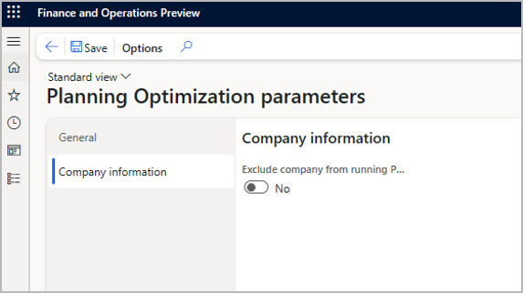

# Continue to use deprecated master planning for some companies

[!include [banner](../../includes/banner.md)]

Starting with Supply Chain Management version 10.0.32, it's possible allow some companies (legal entities) to run Planning Optimization while others continue to use the [deprecated master planning engine](deprecated-master-planning-overview.md) until they are ready to be migrated.

## Company with disabled planning processes

If the company you wish to use deprecated master planning for, has the planning processes disabled, you need to ensure that Planning Optimization is installed and enabled on **Planning Optimization parameters** page.
Starting with release 10.0.32, is mandatory to install the Planning optimization add-in before enabling Planning Processes even if you plan to use the deprecated master planning engine.

After installing and enabling Planning Optimization, planning processes can be enabled for this company by setting the parameter **Disable all planning processes** to **No**, on the **Master planning parameters** page.

## Excluding companies from using Planning Optimization and continue to use deprecated master planning

Follow these steps to set a company to use the deprecated master planning engine on an environment that is otherwise enabled to use Planning Optimization:

1. Use the company picker to choose the company (legal entity) that you want to set up.
1. Go to **Master planning \> Setup \> Planning Optimization parameters**.
1. Open the **Company information** tab.

    

1. Set **Exclude company from running Planning Optimization** to one of the following values
    - *Yes* – Use the deprecated master planning engine for this company.
    - *No* – Use Planning Optimization for this company.
1. Select **Save** on the Action Pane.
1. Repeat this procedure for each company you want to set up.
