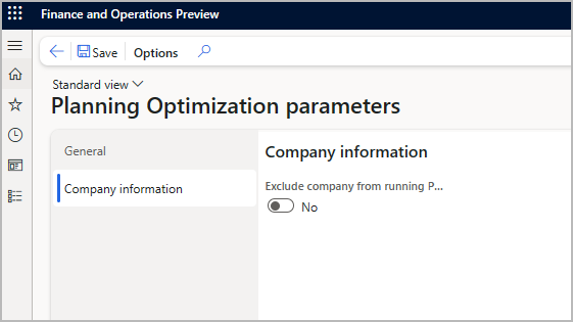

# Continue to use deprecated master planning with existing companies

[!include [banner](../../includes/banner.md)]

> [!NOTE]
> This article applies to **existing deployments** where one or more companies (legal entities) already use the deprecated master planning engine. If you're setting up a new deployment or a new tenant, Planning Optimization is the required engine starting with Supply Chain Management version 10.0.41. For more information, see [Migration to Planning Optimization for master planning](new-master-planning-engine.md).

Starting in Supply Chain Management version 10.0.41, the deprecated master planning engine is blocked for all new legal entities (companies) added to existing deployments. There's no manual way to enable the deprecated master planning engine for these companies. However, existing companies can continue to use the [deprecated master planning engine](deprecated-master-planning-overview.md) until they're ready to migrate.

> [!IMPORTANT]
> The deprecated master planning engine is only available to existing companies that already use it. Existing companies that use the deprecated engine aren't affected when you upgrade to a new version of Supply Chain Management. However, any new companies added to the deployment must use Planning Optimization.

## Companies where planning processes are disabled

Starting with release 10.0.32, you must install the Planning Optimization Add-in before you can enable planning processes, even if you plan to continue using the deprecated master planning engine. If the company where you want to use deprecated master planning has planning processes disabled, follow the steps in this section to enable them.

When you try to set **Disable all planning processes** to *No* on the **Master planning parameters** page without the Planning Optimization Add-in installed, you receive one of the following error messages:

> To enable all planning processes please first follow these instructions https://go.microsoft.com/fwlink/?linkid=2219798 Then, return to this page and enable the parameter.

or

> All planning processes are disabled. Please enable planning processes to continue.

To resolve this error and enable planning processes, follow these steps:

1. Make sure Planning Optimization is installed and enabled as described in [Get started with master planning](planning-optimization/get-started.md). This step is mandatory starting with release 10.0.32, even if you don't intend to use Planning Optimization.
1. Make sure Planning Optimization is enabled on the **Planning Optimization parameters** page.
1. Enable planning processes for the relevant company by setting **Disable all planning processes** to *No*, on the **Master planning parameters** page.

> [!NOTE]
> Starting in Supply Chain Management version 10.0.41, the deprecated master planning engine is blocked for all new legal entities (companies) added to existing deployments. If you're setting up a new company, you must use Planning Optimization. To continue using the deprecated engine for existing companies, see the next section.

## Exclude companies from using Planning Optimization and continue to use deprecated master planning

Follow these steps to set a company to continue to use the deprecated master planning engine on an environment that is otherwise enabled to use Planning Optimization:

1. Use the company picker to choose the company (legal entity) that you want to set up.
1. Go to **Master planning \> Setup \> Planning Optimization parameters**.
1. Open the **Company information** tab.

    

1. Set **Exclude company from running Planning Optimization** to one of the following values
    - *Yes* – Use the deprecated master planning engine for this company.
    - *No* – Use Planning Optimization for this company.
1. Select **Save** on the Action Pane.
1. Repeat this procedure for each company you want to set up.

> [!NOTE]
> If the **Company information** tab appears blank and the **Exclude company from running Planning Optimization** toggle is greyed out, this behavior is expected. The tab and toggle are only relevant for companies that have been granted an exception to use the deprecated master planning engine. Starting from Supply Chain Management version 10.0.41, Planning Optimization is the standard engine for all new deployments and legal entities. Companies that aren't enabled for the deprecated engine don't need this configuration, so the tab remains empty by design. Learn more in [Migration to Planning Optimization for master planning](new-master-planning-engine.md).

## Unsupported features and exceptions

If your company requires features that aren't yet supported by Planning Optimization, you can continue to use the deprecated engine for the affected companies. Supply Chain Management includes an automated exception process that evaluates your system and shows appropriate instructions for each legal entity. Learn more about the exception process and the features supported by Planning Optimization in [Migration to Planning Optimization for master planning](new-master-planning-engine.md#exception-process-for-version-10032-and-later).

## Next steps

- [Migration to Planning Optimization for master planning](new-master-planning-engine.md)
- [Planning Optimization fit analysis](planning-optimization/planning-optimization-fit-analysis.md)
- [Deprecated master planning overview](deprecated-master-planning-overview.md)
