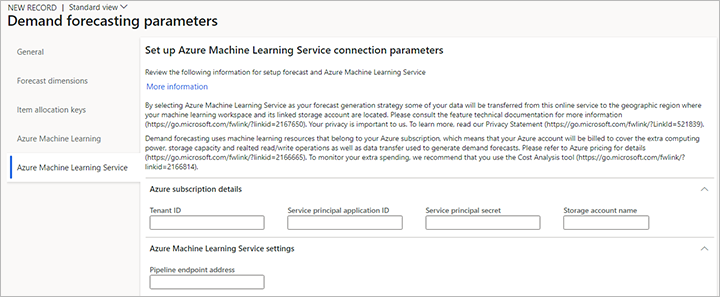

# Demand forecasting setup

[!include [banner](../includes/banner.md)]

This article describes how to set up demand forecasting.  

## Item allocation keys

Item allocation keys establish groups of items. A demand forecast is calculated for an item and its dimensions only if the item is part of an item allocation key. This rule is enforced to group large numbers of items so that demand forecasts can be created more quickly. Forecasts are created based on historical data only.

An item and its dimensions must be part of only one item allocation key if the item allocation key is used during forecast creation.

To create item allocation keys and add a stockkeeping unit (SKU) to them, follow these steps.

1. Go to **Master planning \> Setup \> Demand forecasting \> Item allocation keys**.
1. Either select an item allocation key in the list pane, or select **New** on the Action Pane to create a new one. On the header for the new or selected key, set the following fields:

    - **Item allocation key** – Enter a unique name for the key.
    - **Name** – Enter a descriptive name for the key.

1. Follow one of these steps to add items to the selected item allocation key or remove items:

    - On the **Item allocation** FastTab, use the **New** and **Delete** buttons on the toolbar to add or remove items as needed. For each row, select the item number, and then assign dimension values in the other columns as you require. Select **Display dimensions** on the toolbar to change the set of dimension columns that is shown in the grid. (The value in the **Percent** column is ignored when demand forecasts are generated.)
    - If you want to add a large number of items to the key, select **Assign items** on the Action Pane to open a page where you can find and assign multiple items to the selected key.

> [!IMPORTANT]
> Be careful to include only relevant items in each item allocation key. Unnecessary items might cause increased costs when you use Microsoft Azure Machine Learning.

## Intercompany planning groups

Demand forecasting can generate cross-company forecasts. In Dynamics 365 Supply Chain Management, companies that are planned together are grouped into the same intercompany planning group. To specify, per company, which item allocation keys should be considered for demand forecasting, associate an item allocation key with the intercompany planning group member.

> [!IMPORTANT]
> Planning Optimization doesn't currently support intercompany planning groups. To do intercompany planning that uses Planning Optimization, set up master planning batch jobs that include master plans for all the relevant companies.

To set up your intercompany planning groups, follow these steps.

1. Go to **Master planning \> Setup \> Intercompany planning groups**.
1. Either select a planning group in the list pane, or select **New** on the Action Pane to create a new one. On the header for the new or selected group, set the following fields:

    - **Name** – Enter a unique name for the planning group.
    - **Description** – Enter a short description of the planning group.

1. On the **Intercompany planning group members** FastTab, use the buttons on the toolbar to add a row for each company (legal entity) that should be part of the group. For each row, set the following fields:

    - **Legal entity** – Select the name of a company (legal entity) that is a member of the selected group.
    - **Scheduling sequence** – Assign the order that the company should be processed in relative to other companies. Low values are processed first. This order can be important when demand for one company affects other companies. In these cases, the company that supplies the demand should be processed last.
    - **Master plan** – Select the master plan to trigger for the current company.
    - **Automatic copy to static plan** – Select this checkbox to copy the result of the plan to the static plan.
    - **Automatic copy to dynamic plan** – Select this checkbox to copy the result of the plan to the dynamic plan.

1. By default, if no item allocation keys are assigned to intercompany planning group members, a demand forecast is calculated for all items that are assigned to all item allocation keys from all companies. Additional filtering options for companies and item allocation keys are available in the **Generate statistical baseline forecast** dialog box (**Master planning \> Forecasting \> Demand forecasting \> Generate statistical baseline forecast**). To assign item allocation keys to a company in the selected intercompany planning group, select the company, and then, on the **Intercompany planning group members** FastTab, select **Item allocation keys** on the toolbar.

> [!IMPORTANT]
> Be careful to include only relevant item allocation keys in each intercompany planning group. Unnecessary items might cause increased costs when you use Azure Machine Learning.

## Set up Demand forecasting parameters

Use the **Demand forecasting parameters** page to set up several options that control how demand forecasting will work in your system.

### Open the Demand forecasting parameters page

To set up demand forecasting parameters, go to **Master planning \> Setup \> Demand forecasting \> Demand forecasting parameters**. Because demand forecasting runs cross-company, the setup is global. In other words, it applies to all legal entities (companies).

### General settings

Use the **General** tab of the **Demand forecasting parameters** page to define general settings for demand forecasting.

#### Demand forecast unit

Demand forecasting generates the forecast in quantities. Therefore, the unit of measure that the quantity should be expressed in must be specified in the **Demand forecast unit** field. This field defines the unit that will be used for all demand forecasts, regardless of the usual inventory units for each product. By using a consistent forecast unit, you help ensure that the aggregation and percentage distribution make sense. For more information about aggregation and percentage distribution, see [Make manual adjustments to the baseline forecast](manual-adjustments-baseline-forecast.md).

For every unit of measure that is used for SKUs that are included in demand forecasting, make sure that there's a conversion rule for the unit of measure and the general forecasting unit of measure that you select here. When you generate a forecast, the list of items that don't have a unit of measure conversion is logged. Therefore, you can easily correct the setup. For more information about units of measure and how to convert among them, see [Manage units of measure](../pim/tasks/manage-unit-measure.md).

#### Transaction types

Use the fields on the **Transaction types** FastTab to select the transaction types that are used when the statistical baseline forecast is generated.

Demand forecasting can be used to forecast both dependent demand and independent demand. For example, if only the **Sales order** option is set to *Yes*, and all the items that are considered for demand forecasting are items that are sold, the system calculates independent demand. However, critical subcomponents can be added to item allocation keys and included in demand forecasting. In this case, if the **Production line** option is set to *Yes*, a dependent forecast is calculated.

You can override transaction types for one or more specific item allocation keys by using the **Item allocation keys** tab. That tab provides similar fields.

#### Choose how to create the baseline forecast

The **Forecast generation strategy** field lets you select the method that is used to create a baseline forecast. Three methods are available:

- *Copy over historical demand* – Create forecasts by just copying historical data.
- *Azure Machine Learning Service* – Use a forecast model that uses the Azure Machine Learning Service. The Azure Machine Learning Service is the current machine learning solution for Azure. Therefore, we recommend that you use it if you want to use a forecast model.
- *Azure Machine Learning* – Use a forecast model that uses Azure Machine Learning studio (classic). Azure Machine Learning studio (classic) has been deprecated and will soon be removed from Azure. Therefore, so we recommend that you select *Azure Machine Learning Service* if you're setting up demand forecasting for the first time. If you're currently using Azure Machine Learning studio (classic), you should plan to switch to the Azure Machine Learning Service as soon as possible.

You can override the forecast generation method for one or more specific item allocation keys by using the **Item allocation keys** tab. That tab provides similar fields.

#### Override default forecast algorithm parameters globally

Default forecast algorithm parameters and values are assigned on the **Demand forecasting parameters** page (**Master Planning \> Setup \> Demand forecasting \> Demand forecasting parameters**). However, you can override them globally by using the **Forecast algorithm parameters** FastTab on the **General** tab of the **Demand forecasting parameters** page. (You can also override them for specific allocation keys by using the **Item allocation keys** tab on the **Demand forecasting parameters** page.)

Use the **Add** and **Remove** buttons on the toolbar to establish the required collection of parameter overrides. For each parameter in the list, select a value in the **Name** field, and then enter an appropriate value in the **Value** field. All parameters that aren't listed here will take their values from the settings on the **Demand forecasting parameters** page. For more information about how to use the standard set of parameters and select values for them, see the [Default parameters and values for demand forecasting models](#model-parameters) section.

### Set forecast dimensions

A forecast dimension indicates the level of detail that the forecast is defined for. Company, site, and item allocation key are required forecast dimensions. You can also generate forecasts at the warehouse, inventory status, customer group, customer account, country/region, state, and/or item level, and at all item dimension levels. Use the **Forecast dimensions** tab on the **Demand forecasting parameters** page to select the set of forecast dimensions that is used when the demand forecast is generated.

At any time, you can add forecast dimensions to the list of dimensions that are used for demand forecasting. You can also remove forecast dimensions from the list. However, manual adjustments are lost if you add or remove a forecast dimension.

### Set up overrides for specific item allocation keys

Not all items work in the same way from a demand forecasting perspective. Therefore, you can establish allocation key–specific overrides for most of the settings that are defined on the **General** tab. The exception is the demand forecast unit. To set up overrides for a specific item allocation key, follow these steps.

1. On the **Demand forecasting parameters** page, on the **Item allocation keys** tab, use the toolbar buttons to add item allocation keys to the grid on the left, or remove them, as you require. Then select the allocation key that you want to set up overrides for.
1. On the **Transaction types** FastTab, enable the types of transactions that you want to use to generate the statistical baseline forecast for products that belong to the selected allocation key. The settings work just as they work on the **General** tab, but they apply only to the selected item allocation key. All the settings here (both the *Yes* values and the *No* values) override all the **Transaction types** settings on the **General** tab.
1. On the **Forecast algorithm parameters** FastTab, select the forecast generation strategy and forecast algorithm parameter overrides for products that belong to the selected allocation key. These settings work just as they work on the **General** tab, but they apply only to the selected item allocation key. Use the **Add** and **Remove** buttons on the toolbar to define the required collection of parameter overrides. For each parameter in the list, select a value in the **Name** field, and then enter an appropriate value in the **Value** field. For more information about how to use the standard set of parameters and select values for them, see the [Default parameters and values for demand forecasting models](#model-parameters) section.

### Set up the connection to the Azure Machine Learning Service

Use the **Azure Machine Learning Service** tab to set up the connection to the Azure Machine Learning Service. This solution is one of the options for creating the baseline forecast. These settings on this tab have an effect only when the **Forecast generation strategy** field is set to *Azure Machine Learning Service*.

For more information about how to set up the Azure Machine Learning Service and then use the settings here to connect to it, see the [Set up the Azure Machine Learning Service](#setup-amls) section.

### Set up the connection to Azure Machine Learning studio (classic)

> [!IMPORTANT]
> Azure Machine Learning Studio (classic) has been deprecated. Therefore, you can no longer create new workspaces for it in Azure. It has been replaced by the Azure Machine Learning Service, which provides similar functionality and more. If you aren't already using Azure Machine Learning, you should start to use the Azure Machine Learning Service. If you already have a workspace that was created for Azure Machine Learning Studio (classic), you can continue to use it until the feature is completely removed from Azure. However, we recommend that you update to the Azure Machine Learning Service as soon as possible. Although the application will continue to warn you that Azure Machine Learning Studio (classic) has been deprecated, the forecasting result won't be affected. For more information about the new Azure Machine Learning Service and how to set it up, see the [Set up the Azure Machine Learning Service](#setup-amls) section.
>
> You can freely switch between using the new and old machine learning solutions with Supply Chain Management for as long as your old Azure Machine Learning Studio (classic) workspace remains available.

If you already have an available Azure Machine Learning studio (classic) workspace, you can use it to generate forecasts by connecting it to Supply Chain Management. You can establish this connection by using the **Azure Machine Learning** tab on the **Demand forecasting parameters** page. (The settings on this tab have an effect only when the **Forecast generation strategy** field is set to *Azure Machine Learning*.) Enter the following details for your Azure Machine Learning studio (classic) workspace:

- Web service application programming interface (API) key
- Web service endpoint URL
- Azure storage account name
- Azure storage account key

> [!NOTE]
> The Azure storage account name and key are required only if you use a custom storage account. If you deploy the on-premises version, you must have a custom storage account in Azure, so that Machine Learning can access the historical data.

## Default parameters and values for demand forecasting models

When you use machine learning to generate your forecast planning models, you control machine learning options by setting values for *forecasting algorithm parameters*. These values are sent from Supply Chain Management to Azure Machine Learning. Use the **Forecasting algorithm parameters** page to control which types of values should be provided and which values each should have.

To set up the default parameters and values used for demand forecasting models, go to **Master Planning \> Setup \> Demand forecasting \> Forecasting algorithm parameters**. A standard set of parameters is provided. Each parameter has the following fields:

- **Name** – The name of the parameter, as used by Azure. Usually, you shouldn't change this name unless you've customized the experiment in Azure Machine Learning.
- **Description** – A common name for the parameter. This name is used to identify the parameter in other places in the system (for example, on the **Demand forecasting parameters** page).
- **Value** – The default value for the parameter. The value that you should enter depends on the parameter that you're editing. 
- **Explanation** – A short description of the parameter and how to use it. This description typically includes advice about valid values for the **Value** field.

The following parameters are provided by default. (If you must ever revert to this standard list, select **Restore** on the Action Pane.)

- **Confidence level percentage** – A confidence interval consists of a range of values that act as good estimates for the demand forecast. A 95% confidence level percentage indicates there's a 5% risk that the future demand falls outside the confidence interval range.
- **Force seasonality** – Specifies whether to force the model to use a specific type of seasonality. This parameter applies to ARIMA and ETS only. Options: *AUTO (default)*, *NONE*, *ADDITIVE*, *MULTIPLICATIVE*.
- **Forecasting model** – Specifies which forecasting model to use. Options: *ARIMA*, *ETS*, *STL*, *ETS+ARIMA*, *ETS+STL*, *ALL*. To select the best-fit model, use *ALL*.
- **Maximum forecasted value** – Specifies the maximum value to use for predictions. Format: +1E[n] or numeric constant.
- **Minimum forecasted value** – Specifies the minimum value to use for predictions. Format: -1E[n] or numeric constant.
- **Missing value substitution** – Specifies how gaps in historical data are filled. Options: *(numeric value)*, *MEAN*, *PREVIOUS*, *INTERPOLATE LINEAR*, *INTERPOLATE POLYNOMIAL*.
- **Missing value substitution scope** – Specifies whether the value substitution applies only to the date range of each individual granularity attribute, or to the entire dataset. The following options are available for establishing the date range that the system uses when filling in gaps in historical data:

    - *GLOBAL* – The system uses the full range of dates of all granularity attributes.
    - *HISTORY_DATE_RANGE* – The system uses a specific date range that is defined by the **From date** and **To date** fields in the **Historical horizon** section in the **Generate statistical baseline forecast** dialog box.
    - *GRANULARITY_ATTRIBUTE* – The system uses the date range of the currently processed granularity attribute.

    > [!NOTE]
    > A granularity attribute is a combination of forecast dimensions against which the forecast is done. You can define forecast dimensions on the **Demand forecasting parameters** page.

- **Seasonality hint** – For seasonal data, provide a hint to the forecasting model to improve forecast accuracy. Format: integer number that represents the number of buckets that a demand pattern repeats itself for. For example, enter *6* for data that repeats itself every six months.
- **Test set size percentage** – Percentage of historical data to be used as a test set for forecast accuracy calculation.

You can override the values for these parameters by going to **Master Planning \> Setup \> Demand forecasting \> Demand forecasting parameters**. On the **Demand forecasting parameters** page, you can override the parameters in the following ways:

- Use the **General** tab to override the parameters globally.
- Use the **Item allocation keys** tab to override the parameters for specific item allocation keys. Parameters that are overridden for a specific item allocation key affect only the forecast of items that are associated with that item allocation key.

> [!NOTE]
> On the **Forecasting algorithm parameters** page, you can use the buttons on the Action Pane add parameters to the list, or remove parameters from the list. However, usually, you should not use this approach unless you've customized the experiment in Azure Machine Learning.

## Set up the Azure Machine Learning Service

Supply Chain Management calculates demand forecasts by using the Azure Machine Learning Service, which you must set up and run on your own Azure subscription. This section describes how to set up the Azure Machine Learning Service in Azure and then connect it to your Supply Chain Management environment.

### Enable the Azure Machine Learning Service in Feature management

To use this feature, it must be turned on for your system. As of Supply Chain Management version 10.0.32, it's turned on by default. As of Supply Chain Management version 10.0.36, the feature is mandatory and can't be turned off. If you're running a version older than 10.0.36, then admins can turn this functionality on or off by searching for the *Azure Machine Learning Service for demand forecasting* feature in the [Feature management](../../fin-ops-core/fin-ops/get-started/feature-management/feature-management-overview.md) workspace.

### Set up machine learning in Azure

To enable Azure to use machine learning to process your forecasts, you must set up an Azure machine learning workspace for this purpose. You have two options:

- To set up the workspace by running a script that is provided by Microsoft, follow the instructions in the [Option 1: Run a script to automatically set up your machine learning workspace](#ml-workspace-script) section, and then skip ahead to the [Set up Azure Machine Learning Service connection parameters in Supply Chain Management](#demand-forecast-parameters) section.
- To manually set up your workspace, follow the instructions in the [Option 2: Manually set up your machine learning workspace](#ml-workspace-manual) section, and then skip ahead to the [Set up Azure Machine Learning Service connection parameters in Supply Chain Management](#demand-forecast-parameters) section. This option takes more time, but it gives you more control.

#### Option 1: Run a script to automatically set up your machine learning workspace

This section describes how to set up your machine learning workspace by using an automated script that is provided by Microsoft. If you prefer, you can manually set up all the resources by following the instructions in the [Option 2: Manually set up your machine learning workspace](#ml-workspace-manual) section. You don't have to complete both options.

1. On GitHub, open the [Templates for Dynamics 365 Supply Chain Management demand forecasting with Azure Machine Learning](https://github.com/microsoft/Dynamics-365-Supply-Chain-Management-Demand-Forecasting-With-Azure-Machine-Learning-Service) repository (repo), and download the following files:

    - quick_setup.ps1
    - sampleInput.csv
    - src/parameters.py
    - src/api_trigger.py
    - src/run.py
    - src/REntryScript/forecast.r

1. Open a PowerShell window, and run the **quick_setup.ps1** script that you downloaded in the previous step. Follow the on-screen instructions. The script will set up the required workspace, storage, default datastore, and compute resources. However, you must still create the required pipelines by following the remaining steps of this procedure. (Pipelines provide a way to start forecasting scripts from Supply Chain Management.)
1. In Azure Machine Learning studio, upload the **sampleInput.csv** file that you downloaded in step 1 to the container that is named *demplan-azureml*. (The quick_setup.ps1 script created this container.) This file is required to publish the pipeline and generate a test forecast. For instructions, see [Upload a block blob](/azure/storage/blobs/storage-quickstart-blobs-portal#upload-a-block-blob).
1. In Azure Machine Learning studio, select **Notebooks** in the navigator.
1. Find the following location in the **Files** structure: **Users/\[current user\]/src**.
1. Upload the remaining four files that you downloaded in step 1 to the location that you found in the previous step.
1. Select the **api_trigger.py** file that you just uploaded, and run it. It will create a pipeline that can be triggered through the API.
1. Your workspace is now set up. Skip ahead to the [Set up Azure Machine Learning Service connection parameters in Supply Chain Management](#demand-forecast-parameters) section.

#### Option 2: Manually set up your machine learning workspace

This section describes how to manually set up your machine learning workspace. You must complete the procedures in this section only if you decided not to run the automated setup script, as described in the [Option 1: Run a script to set up your machine learning workspace](#ml-workspace-script) section.

##### Step 1: Create a new workspace

Use the following procedure to create a new machine learning workspace.

1. Sign in to your Azure portal.
1. Open the **Machine learning** service.
1. Select **Create** on the toolbar to open the **Create** wizard.
1. Complete the wizard by following the on-screen instructions. Keep the following points in mind as you work:

    - Use default settings unless other points in this list recommend different settings.
    - Be sure to select the geographic region that matches the region where your instance of Supply Chain Management is deployed. Otherwise, some of your data might pass through region boundaries. For more information, see the [privacy notice](#privacy) later in this article.
    - Use dedicated resources, such as resource groups, storage accounts, container registries, Azure key vaults, and networking resources.
    - On the **Set up Azure Machine Learning Service connection parameters** page of the wizard, you must provide a storage account name. Use an account that is dedicated to demand forecasting. Demand forecasting input and output data will be stored in this storage account.

For more information, see [Create the workspace](/azure/machine-learning/quickstart-create-resources#create-the-workspace).

##### Step 2: Configure storage

Use the following procedure to set up your storage.

1. On GitHub, open the [Templates for Dynamics 365 Supply Chain Management demand forecasting with Azure Machine Learning](https://github.com/microsoft/Dynamics-365-Supply-Chain-Management-Demand-Forecasting-With-Azure-Machine-Learning-Service) repo, and download the **sampleInput.csv** file.
1. Open the storage account that you created in the [Step 1: Create a new workspace](#create-workspace) section.
1. Follow the instructions in [Create a container](/azure/storage/blobs/storage-quickstart-blobs-portal#create-a-container) to create a container that is named *demplan-azureml*.
1. Upload the **sampleInput.csv** file that you downloaded in step 1 to the container that you just created. This file is required to publish the pipeline and generate a test forecast. For instructions, see [Upload a block blob](/azure/storage/blobs/storage-quickstart-blobs-portal#upload-a-block-blob).

##### Step 3: Configure a default datastore

Use the following procedure to set up your default datastore.

1. In Azure Machine Learning studio, select **Datastores** in the navigator.
1. Create a new datastore of the *Azure Blob Storage* type that points to the *demplan-azureml* Blob storage container that you created in the [Step 2: Configure storage](#config-storage) section. (If the authentication type of the new datastore is *Account key*, provide an account key for the created storage account. For instructions, see [Manage storage account access keys](/azure/storage/common/storage-account-keys-manage?tabs=azure-portal).)
1. Make your new datastore the default datastore by opening its details and selecting **Set as default datastore**.

##### Step 4: Configure compute resources

Use the following procedure to set up a compute resource in Azure Machine Learning studio to run your forecasting generation scripts.

1. Open the details page for the machine learning workspace that you created in the [Step 1: Create a new workspace](#create-workspace) section. Find the **Studio web URL** value, and select the link to open it.
1. Select **Compute** on the navigation pane.
1. On the **Compute instances** tab, select **New** to open a wizard that will help you create a new compute instance. Follow the on-screen instructions. The compute instance will be used to create the demand forecasting pipeline (It can be deleted after pipeline is published.) Use the default settings.
1. On the **Compute clusters** tab, select **New** to open a wizard that will help you create a new compute cluster. Follow the on-screen instructions. The compute cluster will be used to generate demand forecasts. Its settings affect performance and the maximum level of parallelization of the run. Set the following fields, but use the default settings for all other fields:

    - **Name** – Enter *e2ecpucluster*.
    - **Virtual machine size** – Adjust this setting according to the volume of data that you expect to use as input for demand forecasting. The node count shouldn't exceed 11, because one node is required to trigger demand forecast generation and the maximum number of nodes that can then be used to generate a forecast is 10. (You'll also set the node count in the parameters.py file in the [Step 5: Create pipelines](#create-pipelines) section.) On each node, there will be several worker processes that run forecasting scripts in parallel. The total number of worker processes in your job will be *Number of cores that a node has* × *Node count*. For example, if your compute cluster has a type of *Standard\_D4* (eight cores) and a maximum of 11 nodes, and if the `nodes_count` value is set to *10* in the parameters.py file, the effective level of parallelism is 80.

##### Step 5: Create pipelines

Pipelines provide a way to start forecasting scripts from Supply Chain Management. Use the following procedure to create the required pipelines.

1. On GitHub, open the [Templates for Dynamics 365 Supply Chain Management demand forecasting with Azure Machine Learning](https://github.com/microsoft/Dynamics-365-Supply-Chain-Management-Demand-Forecasting-With-Azure-Machine-Learning-Service) repo, and download the following files:

    - src/parameters.py
    - src/api_trigger.py
    - src/run.py
    - src/REntryScript/forecast.r

1. In Azure Machine Learning studio, select **Notebooks** in the navigator.
1. Find the following location in the **Files** structure: **Users/\[current user\]/src**.
1. Upload the four files that you downloaded in step 1 to the location that you found in the previous step.
1. In Azure, open and review the **parameters.py** file that you just uploaded. Make sure that the `nodes_count` value is one less than the value that you configured for the compute cluster in the [Step 4: Configure compute resources](#config-compute-resources) section. If the `nodes_count` value is greater than or equal to the number of nodes in the compute cluster, the pipeline run might be able to start. However, it will then stop responding while it waits for the required resources. For more information about the node count, see the [Step 4: Configure compute resources](#config-compute-resources) section.
1. Select the **api_trigger.py** file that you just uploaded, and run it. It will create a pipeline that can be triggered through the API.

### Set up a new Active Directory application

An Active Directory application is required to authenticate with the resources that are dedicated to demand forecasting by using service principal. Therefore, the application should have the lowest level of privilege that is required to generate the forecast.

1. Sign in to your Azure portal.
1. Register a new application in the tenant's Azure Active Directory (Azure AD). For instructions, see [Use the portal to create an Azure AD application and service principal that can access resources](/azure/active-directory/develop/howto-create-service-principal-portal).
1. Follow the on-screen instructions as you complete the wizard. Use the default settings.
1. Give your new Active Directory application access to the following resources that you created in the [Set up machine learning in Azure](#ml-workspace) section. For instructions, see [Assign Azure roles using the Azure portal](/azure/role-based-access-control/role-assignments-portal?tabs=current). This step will enable the system to import and export forecasting data, and to trigger machine learning pipeline runs from Supply Chain Management.

    - Contributor role to the machine learning workspace
    - Contributor role to the dedicated storage account
    - Storage Blob Data Contributor role to the dedicated storage account

1. In the **Certificates & secrets** section of the application that you created, create a secret for the application. For instructions, see [Add a client secret](/azure/active-directory/develop/quickstart-register-app#add-a-client-secret).
1. Make a note of the application ID and its secret. You'll need the details of this application later, when you set up the **Demand forecasting parameters** page in Supply Chain Management.

### Set up Azure Machine Learning Service connection parameters in Supply Chain Management

Use the following procedure to connect your Supply Chain Management environment to the machine learning service that you just set up in Azure.

1. Sign in to Supply Chain Management.
1. Go to **Master planning \> Setup \> Demand forecasting \> Demand forecasting parameters**.
1. On the **General** tab, make sure that the **Forecast generation strategy** field is set to *Azure Machine Learning Service*.
1. On the **Item allocation keys** tab, make sure that the **Forecast generation strategy** field is set to *Azure Machine Learning Service* for each allocation key that should use the Azure Machine Learning Service for demand forecasting.
1. On the **Azure Machine Learning Service** tab, set the following fields:

    - **Tenant ID** – Enter the ID for your Azure tenant. Supply Chain Management will use this ID to authenticate with the Azure Machine Learning Service. You can find your tenant ID on the **Overview** page for Azure AD in the Azure portal.
    - **Service principal application ID** – Enter the application ID for the application that you created in the [Active Directory Application](#aad-app) section. This value is used to authorize API requests to Azure Machine Learning Service.
    - **Service principal secret** – Enter the service principal application secret for the application that you created in the [Active Directory Application](#aad-app) section. This value is used to acquire the access token for the security principal that you created to perform authorized operations against Azure Storage and the Azure Machine Language workspace.
    - **Storage account name** – Enter the Azure storage account name that you specified when you ran the setup wizard in your Azure workspace. (For more information, see the [Set up machine learning in Azure](#ml-workspace) section.)
    - **Pipeline endpoint address** – Enter the URL of the pipeline REST endpoint for your Azure Machine Learning Service. You created this pipeline as the last step when you [set up machine learning in Azure](#ml-workspace). To get the pipeline URL, sign in to your Azure portal, select **Pipelines** on the navigation. On the **Pipeline** tab, select the pipeline endpoint that is named **TriggerDemandForecastGeneration**. Then copy the REST endpoint that is shown.

    

## Privacy notice

When you select *Azure Machine Learning Service* as your forecast generation strategy, Supply Chain Management automatically sends your customer data for historical demand, such as aggregated quantities, product names and their product dimensions, shipping and receiving locations, customer identifiers, and also forecast parameters, to the geographic region where your machine learning workspace and its linked storage account are located, for the purpose of forecasting future demands. The Azure Machine Learning Service might be in a different geographic region than the geographic region where Supply Chain Management is deployed. Some users can control whether this functionality is enabled by selecting the forecast generation strategy on the **Demand forecasting parameters** page.

## Additional resources

- [Demand forecasting overview](introduction-demand-forecasting.md)
- [Generate a statistical baseline forecast](generate-statistical-baseline-forecast.md)
- [Make manual adjustments to the baseline forecast](manual-adjustments-baseline-forecast.md)
- [Webinar: Demand Forecasting with Azure Machine Learning Series](https://aka.ms/DemandForecastingwithAzureMachineLearningSeries)

[!INCLUDE[footer-include](../../includes/footer-banner.md)]
