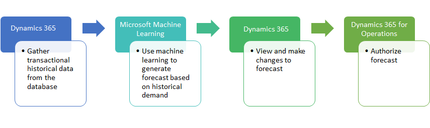

# Demand forecasting overview

[!include [banner](../includes/banner.md)]

Demand forecasting is used to predict independent demand from sales orders and dependent demand at any decoupling point for customer orders. The enhanced demand forecast reduction rules provide an ideal solution for mass customization.

To generate the baseline forecast, a summary of historical transactions is passed to Microsoft Azure Machine Learning hosted on Azure. Because this service isn't shared among users, it can easily be customized to meet industry-specific requirements. You can use Supply Chain Management to visualize the forecast, adjust the forecast, and view key performance indicators (KPIs) about forecast accuracy.

> [!NOTE]
> Microsoft Azure Machine Learning Studio (classic) is required for forecast generation with machine learning. As of December 1, 2021, you will not be able to create new Machine Learning Studio (classic) resources. However, you will be able to continue to use your existing Machine Learning studio (classic) resources until August 31, 2024. For updated information, see [Azure Machine Learning Studio](/azure/machine-learning/overview-what-is-machine-learning-studio#ml-studio-classic-vs-azure-machine-learning-studio).
>
> Dynamics 365 Supply Chain Management version 10.0.23 and later support the new Azure Machine Learning Studio.

## Key features of demand forecasting

Here are some of the main features of demand forecasting:

- Generate a statistical baseline forecast that is based on historical data.
- Use a dynamic set of forecast dimensions.
- Visualize demand trends, confidence intervals, and adjustments of the forecast.
- Authorize the adjusted forecast to be used in planning processes.
- Remove outliers.
- Create measurements of forecast accuracy.

## Major themes in demand forecasting

Three major themes are implemented in demand forecasting:

- **Modularity** – Demand forecasting is modular and easy to configure. You can turn the functionality on and off by changing the configuration key at **Trade \> Inventory forecast \> Demand forecasting**.
- **Reuse of the Microsoft stack** – Machine Learning, which is part of the Microsoft Cortana Analytics Suite, lets you quickly and easily create predictive analysis experiments, such as demand estimation experiments, by using algorithms R or Python programming languages and a simple drag-and-drop interface.
  - You can download the Demand forecasting experiments, change them to meet your business requirements, publish them as a web service on Azure, and use them to generate demand forecasts. The experiments are available for download if you've purchased a Supply Chain Management subscription for a production planner as enterprise-level user.
  - You can download any of the currently available demand prediction experiments from the [Cortana Analytics Gallery](https://gallery.cortanaanalytics.com/). Whereas the Demand forecasting experiments are automatically integrated with Supply Chain Management, customers and partners must handle the integration of experiments that they download from the [Cortana Analytics Gallery](https://gallery.cortanaanalytics.com/). Therefore, experiments from the [Cortana Analytics Gallery](https://gallery.cortanaanalytics.com/) aren't as straightforward to use as the finance and operations Demand forecasting experiments. You must modify the code of the experiments so that they use the finance and operations application programming interface (API).
  - You can create your own experiments in Microsoft Azure Machine Learning studio (classic), publish them as services on Azure, and use them to generate demand forecasts.
  - If you don’t require high performance, or if you don't require that a large amount of data be processed, you can use the Machine Learning free tier. We recommend that you always start from this tier, especially during implementation and testing phases. If you require higher performance and additional storage, you can use the Machine Learning standard tier. This tier requires an Azure subscription and involves additional costs. For details about Machine Learning pricing, see [Machine Learning Studio pricing](https://aka.ms/machine-learning-price-info).
- **Forecast reduction at any decoupling point** – Demand forecasting in builds on this functionality, which lets you forecast both dependent and independent demand at any decoupling point.

## Basic flow in demand forecasting

The following diagram shows the basic flow in demand forecasting.

Demand forecast generation starts in Supply Chain Management. Historical transactional data from the Supply Chain Management transactional database is gathered and populates a staging table. This staging table is later fed to a Machine Learning service. By performing minimal customization, you can plug various data sources into the staging table. The data sources can include Microsoft Excel files, comma-separated value (CSV) files, and data from Microsoft Dynamics AX 2009 and Microsoft Dynamics AX 2012. Therefore, you can generate demand forecasts that consider historical data that is spread among multiple systems. However, the master data, such as item names and units of measure, must be the same across the various data sources.

If you use the Demand forecasting Machine Learning experiments, they look for a best fit among five time series forecasting methods to calculate a baseline forecast. The parameters for these forecasting methods are managed in Supply Chain Management.

The forecasts, historical data, and any changes that were made to the demand forecasts in previous iterations are then available in Supply Chain Management.

You can use Supply Chain Management to visualize and modify the baseline forecasts. Manual adjustments must be authorized before the forecasts can be used for planning.

## Limitations

Demand forecasting is a tool that helps customers in the manufacturing industry create forecasting processes. It offers the core functionality of a demand forecasting solution and is designed so that it can easily be extended. Demand forecasting might not be the best fit for customers in industries such as commerce, wholesale, warehousing, transportation, or other professional services.

### Demand forecast variant conversion limitation

Unit of measure (UOM) per variant conversion isn't fully supported when generating demand forecast if inventory UOM is different than the demand forecast UOM.

Generating forecast (**Inventory UOM \> Demand forecast UOM**) uses product UOM conversion. When loading historical data for the demand forecast generation, the product level UOM conversion will be always used when converting from inventory UOM to the demand forecast UOM, even if there are conversions defined on the variant level.

The first part of authorizing forecast (**Demand forecast UOM \> Inventory UOM**) uses product UOM conversion. The second part of authorizing forecast (**Inventory UOM \> Sales UOM**) uses the variant UOM conversion. When the generated demand forecast is authorized, the conversion to inventory UOM from demand forecast UOM will be done using product level UOM conversion. At the same time, conversion between the inventory unit and the sales UOM will respect the variant level defined conversions.

> [!NOTE]
> The demand forecast UOM doesn't have to have any specific meaning. It can be defined as *Demand forecast unit*. For each of the products, you can define the conversion to be 1:1 with the inventory UOM.

## Additional resources

- [Demand forecasting setup](demand-forecasting-setup.md)
- [Generate a statistical baseline forecast](generate-statistical-baseline-forecast.md)
- [Make manual adjustments to the baseline forecast](manual-adjustments-baseline-forecast.md)
- [Authorize an adjusted forecast](authorize-adjusted-forecast.md)
- [Monitor forecast accuracy](monitor-forecast-accuracy.md)
- [Remove outliers from historical transaction data when calculating a demand forecast](remove-historical-outliers-calculating-demand-forecast.md)
- [Video: Extend the demand forecasting functionality](https://www.youtube.com/watch?v=4OIKIXLiNjI&feature=youtu.be)
- [Webinar: Demand Forecasting with Azure Machine Learning Series](https://aka.ms/DemandForecastingwithAzureMachineLearningSeries)

[!INCLUDE[footer-include](../../includes/footer-banner.md)]

