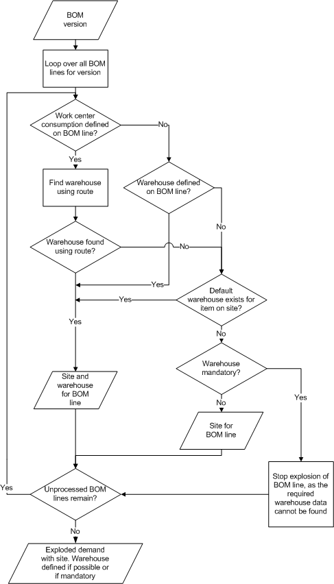

# Explosion of a BOM version

[!include [banner](../includes/banner.md)]

This article explains a master planning scenario that involves explosion of a bill of materials (BOM) version.

A demand explosion of a bill of materials (BOM) version creates a demand for each BOM line item at a specific site and, possibly, at a specific warehouse. In a site-specific BOM, a specific warehouse can be defined for each BOM line. Additionally, for each BOM line, the item's dimension settings determine whether the warehouse is required. The resulting demand for each BOM line item then becomes the starting point for additional demand explosion. This master planning scenario involves the following conditions:

-   The site dimension is mandatory and must be entered on the demand transaction.
-   The site dimension is consistent. Therefore, the site for lower-level demand is the same as the site on the initial demand transaction.

The following illustration shows how the process for master planning demand explosion. 

## Related information

- [Determine the BOM version](master-plan-bom-version-determined.md)
- [Master planning and multisite functionality overview](master-plan-multisite-functionality.md)

[!INCLUDE[footer-include](../../includes/footer-banner.md)]