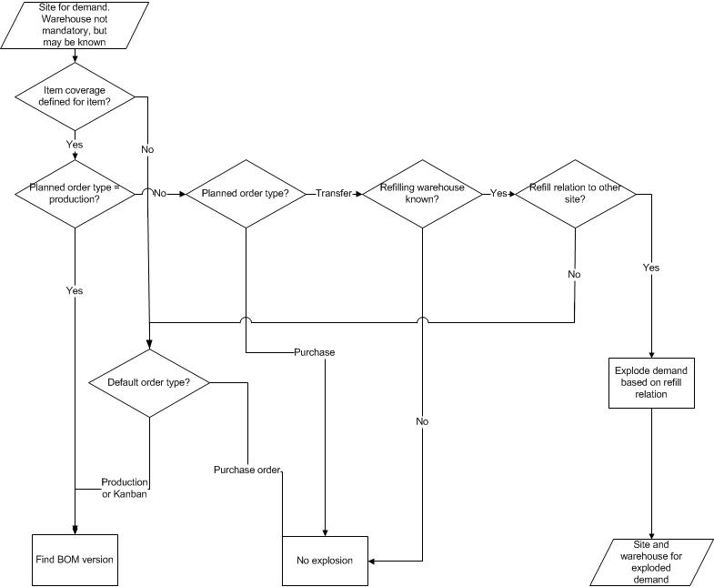

# Master planning for site coverage, warehouse not mandatory

[!include [banner](../includes/banner.md)]

This article describes how an item that has the site dimension set for coverage is planned.

This master planning scenario involves the following conditions:

-   The site dimension is set to mandatory and must be entered on the demand transaction.
-   The warehouse dimension is not set to mandatory. The warehouse may be known, but it is not used in the master planning calculation.
-   The site dimension is set for coverage planning.
-   The warehouse dimension is not set for coverage planning. Therefore, supply and demand are aggregated by site and, perhaps, other coverage-planned dimensions also.

The following graphic illustrates how master planning proceeds. The parameters that are referred to in the graphic, and their locations, are as follows:
-   Item coverage is defined for the item. Click **Product information management &gt; Products&gt; Released products**. Select the item, and then click **Plan &gt; Item coverage**.
-   Refill relations are defined for the warehouse. Click **Inventory management &gt; Setup &gt; Inventory breakdown &gt; Warehouses**. On the **Master planning** tab, see the **Main warehouse** field group.
-   The default order type is set to Production, Purchase order or Kanban. Click **Product information management &gt; Products&gt; Released products**. Select the item, and then click **Plan &gt; Default order settings**. In the **Default order settings** form, see the **Default order type** field.

## Related information

- [Master planning and multisite functionality overview](master-plan-multisite-functionality.md)
- [Master planning for site and warehouse coverage, warehouse mandatory](master-plan-site-coverage-warehouse-mandatory.md)
- [Master planning for site coverage, mandatory warehouse](master-plan-site-warehouse-coverage-warehouse-not-mandatory.md)
- [Master planning for site coverage, warehouse not mandatory](master-plan-site-warehouse-coverage-warehouse-mandatory.md)
- [Determine the BOM version](master-plan-bom-version-determined.md)

[!INCLUDE[footer-include](../../includes/footer-banner.md)]