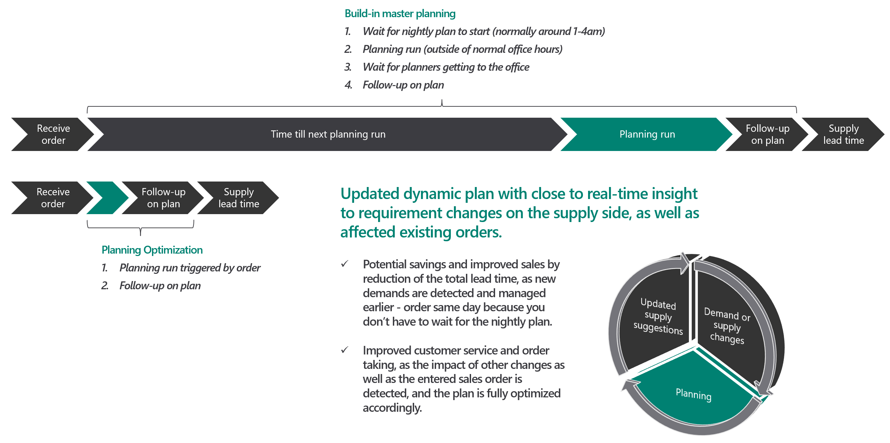

# Master planning system architecture

[!include [banner](../../includes/banner.md)]

In Supply Chain Management, master planning is managed by the Planning Optimization Add-in for Microsoft Dynamics 365 Supply Chain Management, which enables master planning calculation to occur outside Dynamics 365 Supply Chain Management and the related SQL database. The benefits that are associated with the Planning Optimization functionality include improved performance and minimal impact on SQL database during master planning runs. Quick planning runs can be done even during office hours, so that planners can immediately react to demand or parameter changes.

To use Planning Optimization, you must install the Planning Optimization Add-in from your project in Microsoft Dynamics Lifecycle Services (LCS) and turn on the Planning Optimization functionality in Supply Chain Management. For more information, see [Get started with master planning](planning-optimization/get-started.md).

The following illustration shows the advantage of running Planning Optimization during office hours.

## Performance

Planning Optimization can be used in scenarios that involve long-running master plans. It's specifically designed for very fast calculations that involve very large volumes of data. Because it's built as a hyper-scalable multitenant service, multiple instances can work together simultaneously to calculate the plan. Additionally, the planning service removes the load of master planning from your system and works with a data stream that minimizes the server load.

Planning Optimization can help you achieve the following goals:

- Improve planning performance through a shorter runtime.
- Reduce the impact on other processes during the master planning run.
- Do more frequent planning runs. (You aren't limited to daily runs.)
- Be confident that future business growth won't overload the planning system.

## Architecture and data flow

When the Planning Optimization Add-in is installed from LCS, a secure connection to the Planning Optimization service is established. The service is located in the same data center country or region as the related Supply Chain Management instance. After Planning Optimization is set up, when master planning is run, master data and transactional data are sent from Supply Chain Management to the Planning Optimization service.

If the Planning Optimization Add-in is uninstalled, all related data in the Planning Optimization service is removed.

### High-level data flow for regeneration runs

1. The Supply Chain Management client sends a signal to request a planning run from Planning Optimization.
2. Planning Optimization requests the required data via the integrated connector.
3. The SQL database sends the requested information about setup, master, and transactional data to Planning Optimization via the connector. The connector translates information between Supply Chain Management and the Planning Optimization service.
4. The Planning Optimization service holds planning-related data in memory and does the required calculations.
5. The planning result is sent to the Supply Chain Management database via the connector. The results include information such as planned orders and pegging information. Planning Optimization sends a signal to Supply Chain Management to indicate that the planning run has been completed. It also sends any relevant messages and warnings.

The following illustration shows the data flow.

