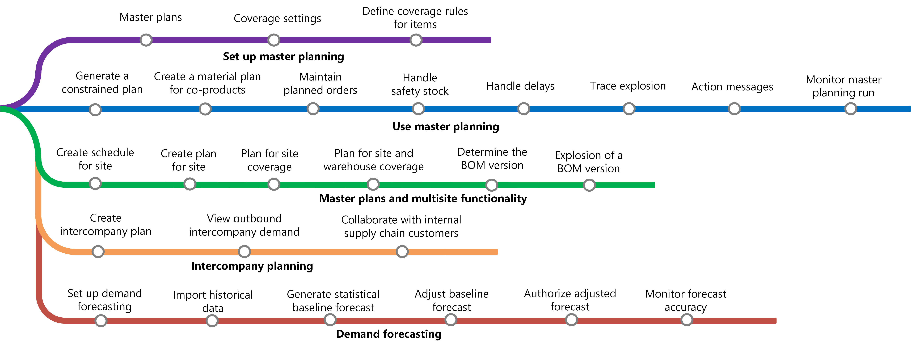

# Master planning home page

[!include [banner](../includes/banner.md)]

At its core, Master planning allows companies to determine and balance the future need for raw materials and capacity to meet company goals. Master planning assesses the following:

- What raw materials and capacities are currently available?
- What raw materials and capacities are required to complete production? For example, what must be manufactured, purchased, transferred, or set aside as safety stock before you can complete production.

Master planning uses the information to calculate the requirements and generate planned orders.

The three main planning processes are:

- **Master planning** - The master plan calculates net requirements. It's based on actual current orders and enables companies to control inventory replenishment on a short-term, day-to-day basis. Another term to describe it's the *Net requirements plan*. For more information, see [Master plans overview](master-plans.md).

- **Forecast planning** - The forecast schedule calculates gross requirements. It's based on future projections (or forecasts), and enables companies to conduct long-term planning of materials and capacity. For more information, see [Demand forecasting overview](introduction-demand-forecasting.md).

- **Intercompany master planning** - The intercompany master plan calculates net requirements across legal entities. It connects demand and supply between companies not only for short term, but also for long-term, planned (not yet firmed) demand and supply. For more information, see [Intercompany planning](planning-optimization/Intercompany-planning.md).

Companies can change the output of the plan. They can run regenerative, net change, or both. Regenerative plans update all requirements, whereas, net change plans only update the plan on items with new requirements that have come in since the last scheduling run.

Master scheduling plans typically involve the short term, which can be anywhere from one week to six months. The Master planning module determines the supply (materials) and capacity (resources) needs that will meet current demand (the net requirements). In most companies, this is extended to include the longest cumulative lead time among the products to be received.

## Learning map

The following learning map shows the major concepts and tasks that make up the framework of the Master planning module.

## Additional resources

### Roadmaps

Go to the [Microsoft Dynamics 365 Roadmap](https://roadmap.dynamics.com/) to see what new features have been released and what new features are in development.

### Blogs

You can find opinions, news, and other information about Master planning and other solutions on the
[Dynamics AX Manufacturing R&D Team blog](/archive/blogs/axmfg/) and [Supply Chain Management in Dynamics AX R&D Team blog](https://blogs.msdn.microsoft.com/dynamicsaxscm).

### Webinars

[Use Azure machine learning for demand forecasting](https://www.youtube.com/watch?v=4nQsccdFFDA&feature=youtu.be)

### Tech conference recordings

- [Planning Optimization service](https://community.dynamics.com/365/dynamics-365-fasttrack/b/techtalks/posts/dynamics-365-supply-chain-management---planning-optimization-service-february-21-2020)
- [Get started with Planning Optimization](https://community.dynamics.com/365/dynamics-365-fasttrack/b/techtalks/posts/get-started-with-planning-optimization-for-dynamics-365-supply-chain-management-march-1-2021)
- [Demand forecasting series](https://community.dynamics.com/365/dynamics-365-fasttrack/b/techtalks/posts/demand-forecasting-with-azure-machine-learning-series)
- [Extend the demand forecasting functionality](https://www.youtube.com/watch?v=4OIKIXLiNjI&feature=youtu.be)

[!INCLUDE[footer-include](../../includes/footer-banner.md)]
