# Negative days and dynamic negative days

[!include [banner](../includes/banner.md)]

This topic provides information about negative days and dynamic negative days, and how you can use them to help your business. The *negative days time fence* represents the number of days that you're willing to wait before you order new replenishment when you have negative inventory.

In this topic, you will learn the following information:

- How planned orders are created
- The correlation between the negative days time fence and the item's lead time
- How the dynamic negative days time fence is calculated, and how the item's lead time is factored into the calculation
- How to interpret the [suggestions for improving the running time for material requirements planning (MRP) (master planning)](https://blogs.msdn.com/b/axmfg/archive/2015/01/02/checklist-for-improving-mrp-performance-part-2-how-to-setup-planning-parameters.aspx) that are related to negative days

This topic uses three hypothetical scenarios to help you understand this information. The difference between the scenarios is the point at which you get demand: before, during, or after the item's lead time period.

## Scenario 1: You get demand before the item's lead time period

You might get demand either relatively early in your item's lead time or just before the lead time period begins. Here is an example of this scenario:

- The DemoProduct item has a six-day purchase lead time.
- On day zero (January 1), the inventory level for the DemoProduct item is 0 (zero).
- On day zero (January 1), you get a sales order for a quantity of 10 of the DemoProduct item.
- On day seven (January 8), there is an existing purchase order for a quantity of 10 of the DemoProduct item.

The following illustration shows a graphical view of this scenario.

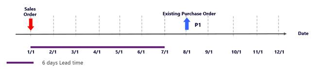

### Case A: Negative days are less than the item's lead time

If you set the negative days to a number that is less than the item's lead time, MRP looks for receipts for the DemoProduct item inside the negative days time fence. Because it doesn't find any receipts, MRP creates a new planned purchase order. This planned order is immediately delayed by six days (the lead time). Therefore, it will arrive on January 7. The existing purchase order gets a **Cancel** action message, because the creation of the new planned purchase order has made it redundant.

The following illustration shows a screenshot of this case.

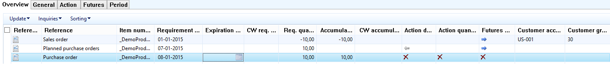

The following illustration shows a graphical view of what occurs in this case.

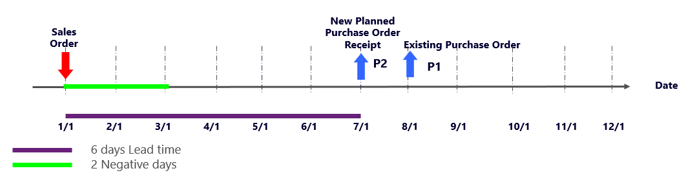

If you consider MRP performance and plan nervousness, this case doesn't perform well. MRP must create a new planned order, and must calculate delays and actions. These tasks are time-consuming. This case also adds two more transactions to your plan. On the other hand, the sales order is delayed by only six days, not seven days.

### Case B: Negative days are more than the item's lead time

To help improve MRP performance, you can set the negative days to a number that is more than the item's lead time. Because you can't get the supply inside the lead time in this scenario, you can search for receipts for as long as this search makes sense. Although the running time for MRP will be shorter, you should watch out for additional delays to the orders.

### Case C: Automatically correlate the item's lead time to the negative days time fence

To automatically correlate the item's lead time to the negative days time fence, use dynamic negative days. To use dynamic negative days, go to **Master planning \> Setup \> Master planning parameters**, and then, on the **General** tab, in the **Coverage** section, set the **Use dynamic negative days** option to **Yes**. MRP then looks for receipts inside the dynamic negative days time fence. This time fence is calculated by using the following formula:

Dynamic negative days time fence = Purchase lead time + Negative days time fence + (Current date – Requirement date)

(If the default order type of the DemoProduct item is **Production** or **Transfer**, the lead time is the **inventory** lead time.)

When dynamic negative days are used, the time fence that MRP looks at for receipts is now 6 + 2 + 0 = 8 days. MRP finds the existing purchase order and pegs the sales order against it. No new planned orders are created. Therefore, the running time for MRP is shorter. The following illustration shows the net requirements for the DemoProduct item.

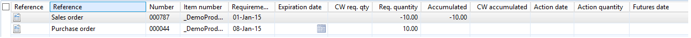

The following illustration shows a graphical view of what occurs in this case.

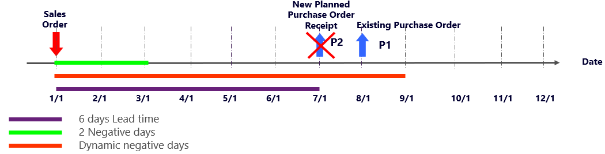

### Case D: Use only dynamic negative days

If you set the negative days to **0** (zero) and use only the dynamic negative days time fence, the dynamic negative days time fence is 6 + 0 + 0 = 6 days. In this case, the result is the same as the result in case A for this scenario. MRP must create a new planned order, and must calculate delays and actions. These tasks are time-consuming and can also be frustrating. You also have two more transactions to process. Because the demand can't be fulfilled on time for the item to arrive, this case adds unnecessary complications to your plan.

The following illustration shows a screenshot for this case.

The following illustration shows a graphical view of what occurs in this case.

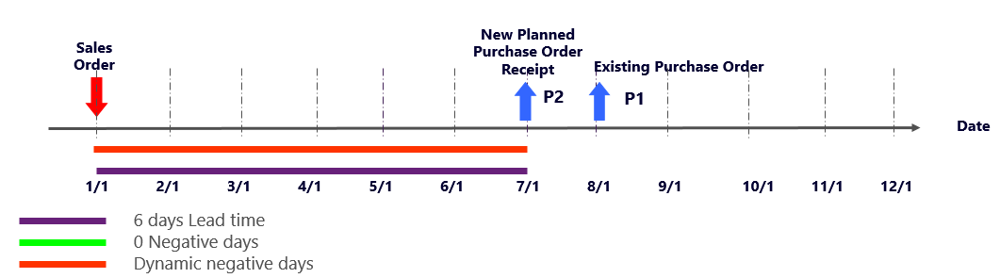

### Case E: Use both negative days that are more than the item's lead time and the dynamic negative days time fence

If you set the negative days to a number that is more than the item's lead time, and if you also use the dynamic negative days time fence, the dynamic negative days time fence is 6 + 6 + 0 = 12 days. This approach might produce a very long time fence that MRP must search for results in. For information about how case E is related to a situation where you set the negative days to a long time fence, see the [Conclusion](#conclusion) section of this topic.

## Scenario 2: You get demand during the item's lead time period

You might get demand sometime during your item's lead time. Here is an example of this scenario:

- The DemoProduct item has a six-day purchase lead time. 
- On day zero (January 1), the inventory level for the DemoProduct item is 0 (zero).
- On day four (January 5), which is inside the item's lead time, you get a sales order for a quantity of 10 of the DemoProduct item.
- On day seven (January 8), there is a purchase order for a quantity of 10 of the DemoProduct item.

The following illustration shows a graphical view of this scenario.

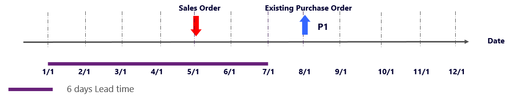

### Case A: Negative days are less than the item's lead time

If you set the negative days to a number that is less than the item's lead time, MRP looks for receipts for the DemoProduct item inside the negative days time fence. Because it doesn't find any receipts, MRP creates a new planned purchase order that uses the current date as the order date. This planned order is immediately delayed by six days (the lead time). Therefore, it will arrive on January 7. The existing purchase order gets a **Cancel** action message, because the creation of the new planned purchase order has made it redundant.

The following illustration shows a screenshot for this case.

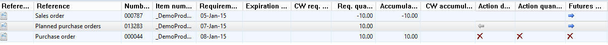

The following illustration shows a graphical view of what occurs in this case.

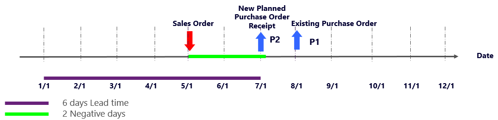

### Case B: Negative days are more than the item's lead time

This case resembles case B for scenario 1. If you set the negative days to a number that is more than the item's lead time, you don't get a new planned order. The sales order is attached to the existing purchase order.

### Case C: Automatically correlate the item's lead time to the negative days time fence

This case resembles case C for scenario 1, because dynamic negative days work just as well as they do in that case. The dynamic negative days time fence is now 6 + 2 – 4 = 4 days. If you use this approach, MRP finds the existing purchase order and attaches the sales order to it. Because no new planned orders are created, the running time for MRP is shorter.

The following illustration shows a screenshot of this case.

The following illustration shows a graphical view of what occurs in this case.

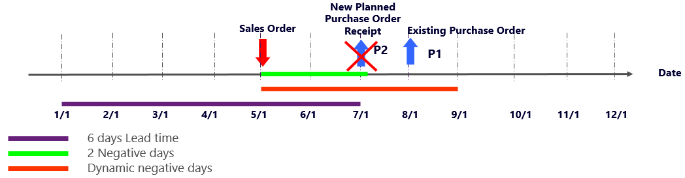

### Case D: Use only dynamic negative days

If you set the negative days to **0** (zero) and use only the dynamic negative days time fence, the dynamic negative days time fence is now 6 + 0 – 4 = 2 days. In this case, the result is the same as the result in case A for this scenario. For a graphical view of what occurs, see case A for this scenario.

### Case E: Use both negative days that are more than the item's lead time and the dynamic negative days time fence

If you set the negative days to a number that is more than the item's lead time, and if you also use the dynamic negative days time fence, the dynamic negative days time fence is 6 + 6 – 4 = 8 days. This approach might produce a very long time fence that MRP must search for results in. For information about how case E is related to a situation where you set the negative days to a long time fence, see the [Conclusion](#conclusion) section of this topic.

## Scenario 3: You get demand after the item's lead time period

You might get demand after the item's lead time. Here is an example of this scenario:

- The DemoProduct item has a six-day purchase lead time.
- On day zero (January 1), the inventory for the DemoProduct item is 0 (zero).
- On day seven (January 8), which is outside the item's lead time, you get a sales order for a quantity of 10 of the DemoProduct item.
- On day ten (January 11), there is a purchase order for a quantity of 10 of the DemoProduct item.

The following illustration shows a graphical view of this scenario.

### Case A: Negative days are less than the item's lead time

If you set the negative days to a number that is less than the item's lead time, MRP looks two days ahead of the sales order's requirement date. Because it doesn't find anything, MRP creates a planned purchase order on January 2. This planned purchase order will be shipped just in time to fulfill the sales order demand. The existing purchase order gets a **Cancel** action message, because it isn't required.

The following illustration shows a screenshot of this case.

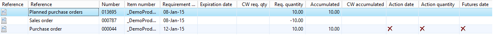

The following illustration shows a graphical view of what occurs in this case.

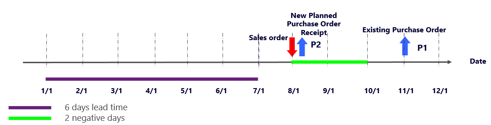

> [!NOTE]
> In the preceding screenshot, the purchase order requirement date is January 12. Because that screenshot was taken in 2015, when January 11 was a Sunday, MRP moved the requirement date to the next working day, which was Monday, January 12. Nevertheless, the purchase order has a delivery date of January 11.

### Case B: Negative days are more than the item's lead time

If you set the negative days to a number that is more than the item's lead time, you don't get a new planned order. The sales order is pegged against the existing purchase order. Therefore, the sales order is delayed. If you create a planned order, you can ship the sales order on time.

The following illustration shows a screenshot of this case.

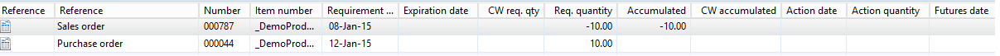

The following illustration shows a graphical view of what occurs in this case.

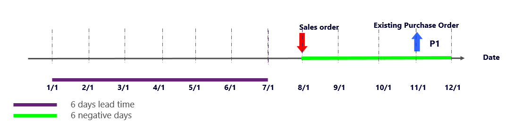

### Case C: Automatically correlate the item's lead time to the negative days time fence

This case resembles case C for scenario 1, because dynamic negative days work just as well as, if not better than, they work in case B for this scenario.

The dynamic negative days time fence is 6 + 2 – 7 = 1 day. However, in this case, the system still considers the negative days lead time (2), because MRP considers the maximum value between the negative days lead time and the dynamic negative days lead time. Therefore, the result in this case is the same as the result in case A for this scenario.

The following illustration shows a graphical view of what occurs in this case.

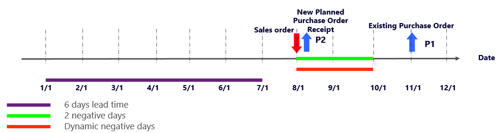

### Case D: Use only dynamic negative days

If you set the negative days to **0** (zero) and use only the dynamic negative days time fence, the dynamic negative days time fence is now 6 + 0 – 7 = -1 day. In this case, the system still considers the negative days lead time (2). Therefore, the result in this case is the same as the result in case A for this scenario and has all the same drawbacks. For a graphical view of what occurs, see case A for scenario 2.

### Case E: Use both negative days that are more than the item's lead time and the dynamic negative days time fence

This case is the same as case E for scenarios 1 and 2. It has basically the same benefits and drawbacks.

## Conclusion

As the three scenarios in this topic show, it's a good idea to set the negative days to a number that is more than the lead time of the items in the coverage group. It's also a good idea to use only dynamic negative days, and to set the negative days to the number of days that you're willing to wait before you order new replenishment when you have negative inventory (in other words, the number of days that you're willing to further delay demand). Additionally, items in the same coverage group should have similar lead times.

If you set the negative days to **0** (zero) and don't use dynamic negative days, MRP always creates a new planned order to fulfill demand. In this situation, it's important that you work with the action messages to make sure that you don't pile up inventory.

You might want to set the negative days to a long time fence and then work with the action messages. This approach produces good planning results, but it's also a bit slower. It might also be more difficult to analyze, because you must analyze and apply the action messages. Here is an example:

- The DemoProduct item has a six-day purchase lead time.
- On day zero (January 1), the inventory for the DemoProduct item is 0 (zero).
- On day zero (January 1), you get a sales order for a quantity of 10 of the DemoProduct item.
- On day nine (January 10), you get a sales order for a quantity of 10 of the DemoProduct item.
- On day eleven (January 12), there is a purchase order for a quantity of 10 of the DemoProduct item.
- Negative days are set to **20**, which is much more than the item's lead time.

The following illustration shows a graphical view of what occurs.

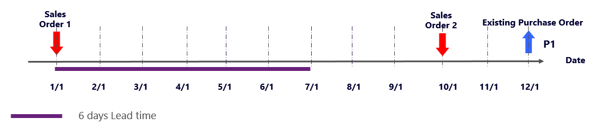

MRP produces the following results.

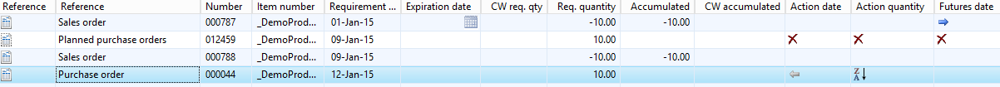

In the preceding screenshot, the sales order requirement date is January 9 instead of January 10. Because that screenshot was taken in 2015, when January 10 was a Saturday, the requirement date of the order should be the previous working day, which was Friday, January 9.

MRP creates a planned purchase order to fulfill the demand that is requested by the first sales order, but then it also recommends that you cancel the planned order, because you can advance the existing purchase order and increase the quantity on it.

The results aren't wrong, but the running time for MRP might be longer, because MRP must create all the delays and suggestions. Additionally, the planner might require more time to understand the MRP results. Most importantly, in this case, it's essential that the planner understand and use the action messages.

If you reduce the negative days to a number that's closer to the item's lead time, and you use dynamic negative days, MRP produces the following results.

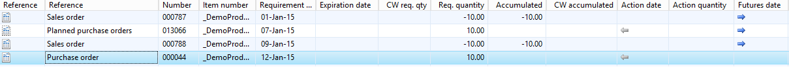

MRP creates a planned order that is attached to the first sales order. Then, as is expected, the second sales order is pegged against the existing purchase order, based on the negative days setting. This planning result is also correct, and the running time for MRP might be shorter. In this case, it isn't essential that you understand and know how to work with the action messages.

To help guarantee that the correct values are entered for your business, you must think in terms of both functionality and MRP running time. Therefore, it can take a little trial and error to determine the optimal values.

## See also

For more discussion, see the original [More about (dynamic) negative days](/archive/blogs/axmfg/more-about-dynamic-negative-days) blog post.

[!INCLUDE[footer-include](../../includes/footer-banner.md)]
