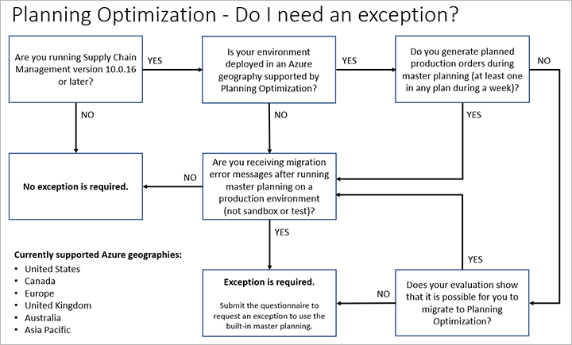

# Migration to Planning Optimization for master planning

[!include [banner](../includes/banner.md)]

The built-in master planning engine is obsolete (deprecated). It's being replaced by the Planning Optimization Add-in for Microsoft Dynamics 365 Supply Chain Management. This article provides information about the impact on new and existing deployments. It includes information about required actions.

Planning Optimization enables master planning calculations to occur outside Supply Chain Management and its Azure SQL database. The benefits that are associated with Planning Optimization include improved performance and minimized impact on the SQL database during master planning runs. Because quick planning runs can be done even during office hours, planners can immediately react to demand or parameter changes.

For more information about Planning Optimization, see [Master planning system architecture](master-planning-architecture.md).

## Obsolescence of the existing master planning engine

Microsoft has deprecated the built-in master planning engine in favor of Planning Optimization. This change affects all cloud environments. On-premises installations aren't affected.

For more information about the deprecated master planning engine, see the announcements in [Removed or deprecated features in Dynamics 365 Supply Chain Management](../get-started/removed-deprecated-features-scm-updates.md).

## New deployments

Planning Optimization is the standard master planning engine for all new cloud deployments. It must be used for all new deployments that don't generate planned production orders during master planning. If you're setting up a new deployment that requires functionality that isn't currently supported by Planning Optimization, you can request an exception that will allow you to use the deprecated master planning engine instead.

Starting with Supply Chain Management version 10.0.32, if you are rolling out new companies (legal entities) for an implementation that you are still developing before going live, you must use Planning Optimization for the new companies. However, you can continue to use the deprecated master planning engine for one or more previously created companies (until you are ready to migrate them) even while using Planning Optimization for the others. Therefore, Microsoft will now grant exceptions on a per-company basis. For instructions on how to set a company to continue to use the deprecated master planning engine, see [Continue to use deprecated master planning for some companies](planning-optimization/get-started.md#exclude-po).

## Existing deployments

Owners of existing cloud-based deployments that depend on master planning must plan to migrate to Planning Optimization. If your implementation depends on functionality that Planning Optimization doesn't currently support, you must request an exception to continue to use the deprecated master planning engine.

Starting in Supply Chain Management version 10.0.32, it's possible to allow some companies (legal entities) to run Planning Optimization while others continue to use the deprecated master planning engine until they are ready to be migrated. Therefore, Microsoft will now grant exceptions on a per-company basis. The exception only applies to existing companies&mdash;starting with version 10.0.32, all new companies that you add to your existing environment must use Planning Optimization. For instructions on how to set a company to use the deprecated master planning engine, see [Continue to use deprecated master planning for some companies](planning-optimization/get-started.md#exclude-po).

## Migration recommendations

There are several differences between the deprecated master planning engine and Planning Optimization.

For distribution companies, the two planning engines provide very similar feature sets. Based on our experience helping other customers migrate, we recommend that distribution companies enable and test Planning Optimization in a test environment, and then, when testing is successful, enable it in a production environment.

Manufacturing companies might be affected by some of the minor architectural differences that exist between Planning Optimization and the deprecated planning engine. Based on our experience helping other customers migrate, we recommend that you set up a test environment and proceed in the following way:

1. Create two testing plans, one for Planning Optimization and the other for the deprecated planning engine. Use the same settings for both plans.
1. While the deprecated planning engine is enabled, run the plan that you created for it.
1. Enable Planning Optimization, and run the plan that you created for it.
1. For each plan, export the planned orders to an Excel file.
1. For each plan, sum the planned order quantities for each of several regular periods (for example, every month).
1. Compare the quantities for each plan to make sure that the result is the same (or very similar). Some variation can be expected for orders that occur at the start or end of a period
1. If your test is successful, continue testing on the test environment.
1. If all of your tests are successful, enable Planning Optimization in your production system.

## Exception process for version 10.0.32 and later

As of Supply Chain Management version 10.0.32, the process of evaluating your system and moving to Planning Optimization is fully automated. The system will analyze your setup and automatically show you the correct instructions for your situation and for each company (legal entity). The following subsections provide details about the possible cases.

### Deployments where Planning Optimization supports all required features

If the system detects that all the relevant features that you're using are supported by Planning Optimization, but you're still running the deprecated planning engine, it will ask you to migrate. The next time that you manually run master planning, the system will show the following message:

> You are supported to use the non-deprecated and faster master planning (Planning Optimization). For more information, see [Get started with master planning](planning-optimization/get-started.md#install-enable-po)
>
> We need you to provide some information regarding master planning.
>
> Do you have customizations on the master planning engine?

If you haven't customized the master planning engine for this deployment, you must migrate to Planning Optimization. If you require some more time to test and migrate, select the time that you'll require. The system will automatically apply an exception for the selected time.

If you do have customizations, you must move them to the existing extensibility point. For more information, see [Planning Optimization extensibility](planning-optimization/extensibility.md).

### Deployments requiring features not yet supported by Planning Optimization

If the system detects that you're using features that aren't supported by Planning Optimization, it will show the following message the next time that you manually run master planning:

> You are not supported yet to use the non-deprecated master planning (Planning Optimization). We expect to be supporting you in the coming future. When you are supported, you will be asked to move to Planning Optimization. If you have customizations on the master planning engine, you can already start evaluating them and preparing to move them to the Planning Optimization extensibility point https://go.microsoft.com/fwlink/?linkid=2220303

This message informs you that you should start planning to move to Planning Optimization as soon as it supports the features that you're using. Therefore, you should evaluate any customizations that you've made to the deprecated planning engine, plan to move them to the existing extensibility point (see [Planning Optimization extensibility](planning-optimization/extensibility.md)), and take other actions to prepare for the migration (for example, by contacting your Microsoft partner or consultant).

For information about which features are already supported and estimates about when each feature will become available for Planning Optimization, see [Planning Optimization fit analysis](planning-optimization/planning-optimization-fit-analysis.md).

If you've already received an exception, it will remain in place until Planning Optimization supports the features that you require.

### <a name="unsupported-environments"></a>Environments that don't support Planning Optimization

Regardless of the features that you're using, to use Planning Optimization, you must be running Supply Chain Management version 10.0.7 or later in a tier 2 or higher high-availability environment that's Microsoft Dynamics Lifecycle Services–enabled. The environment must **not** be a OneBox environment. If you try to install the add-in in a OneBox environment, the installation won't be completed, and you'll have to cancel it.

If your environment doesn't support Planning Optimization, you'll receive the following message:

> You can only run deprecated master planning in this environment. If you would like to get an environment that supports non-deprecated planning (Planning Optimization) please follow the instructions: [Get started with master planning](planning-optimization/get-started.md)

If you're a Microsoft partner or independent software vendor (ISV), you can obtain, at a reduced price, a non-production environment that supports Planning Optimization, and that includes Microsoft business applications and demo data. These environments are available only to partners and ISVs, and they can be used only on partner tenants, never on customer tenants. You can use the environment that you obtain to learn how Planning Optimization works, test your solutions while you're using it, and deliver end-to-end customer demos. To request a license, go to the [partner sandbox request page](https://experience.dynamics.com/requestlicense/).

## Exception process for version 10.0.31 and earlier

For Supply Chain Management version 10.0.31 and earlier, owners of existing environments who run the deprecated master planning engine without generating planned production orders will receive an email that provides details about the exception process. The system might also show an error message that includes guidance about migration and instructions for requesting an exception. If you receive such a message and/or email, we recommend that you work with a partner to evaluate and plan the migration to Planning Optimization.

If your implementation depends on functionality that Planning Optimization doesn't currently support, you can request an exception that will allow you to continue to use the deprecated master planning engine. (For a list of available features, see [Planning Optimization fit analysis](planning-optimization/planning-optimization-fit-analysis.md).) For environments that currently use master planning processes that are being made obsolete, Microsoft will send an email to the environment admin. This email will provide information about the actions that are required to migrate or to request an exception.

Currently, exceptions for Planning Optimization migration are relevant only if your master planning process doesn't include production (that is, planned production orders that are generated by master planning), and if you require the deprecated master planning engine beyond Supply Chain Management version 10.0.15.

After the required features become available, Microsoft will provide a grace period until the exception expires. The environment admin will be informed when the required features have become available and the grace period has started.

The following flowchart summarizes the information in this article, so that you can quickly determine whether you should request an exception. If you have to request an exception, fill out and submit the [Planning Optimization migration and exception questionnaire](https://go.microsoft.com/fwlink/?linkid=2144962). The product group is responsible for evaluating and approving each exception request. Therefore, you should submit your request directly to the product group, by using the link that's provided. Don't create a support ticket for the request. If your request is rejected, don't create a support ticket, because Microsoft Support can't reevaluate requests or grant exceptions.



> [!NOTE]
> You can only request an exception for tenants that currently include, or will include, a production environment, not for tenants with sandbox environments only. If you need to disable the Planning Optimization exception error on an infrastructure as a service (IaaS) sandbox environment, run the SQL query provided in [Sandbox environments](#faq-sandbox).

## Frequently asked questions

### <a name="faq-sandbox"></a>Sandbox environments

Can I use the deprecated master planning engine on my sandbox environment? Do I need an exception?

**Answer:** Exceptions aren't normally relevant for sandbox environments because the Planning Optimization exception error doesn't prevent the deprecated master planning engine from running successfully. However, if the error message disturbs you, you can disable it on an IaaS (not Service Fabric) sandbox environment by running the following query on your database:

```sql
-- Insert or update an enabled flight:
DECLARE @flightName NVARCHAR(100) = 'ReqPlanningOptimizationExceptionToggle';
IF NOT EXISTS (SELECT TOP 1 1 FROM SysFlighting WHERE flightName = @flightName)
    INSERT INTO SYSFLIGHTING(FLIGHTNAME,ENABLED, FLIGHTSERVICEID,PARTITION)
    SELECT @flightName, 1, 12719367,RECID FROM DBO.[PARTITIONS];
ELSE
    UPDATE SysFlighting SET enabled = 1, flightServiceId = 12719367 WHERE flightName = @flightName;
```

### On-premises environments

My environment is on-premises. Do I need an exception?

**Answer:** No. An exception isn't required for on-premises environments. You can continue to use the deprecated master planning engine. Your environment admin will be informed if any action is required.

### Production scenarios

We use planned production orders, but I'm concerned about what will happen when we upgrade to version 10.0.16. Should I take any action?

**Answer:** You shouldn't be concerned. You can continue to use the deprecated master planning engine in version 10.0.16. However, we recommend that you evaluate whether migration to Planning Optimization can start with the current functionality. We also recommend that you remain informed about new functionality.

### Email from Microsoft

Our environment admin received an email from Microsoft. This email states that we should migrate to Planning Optimization or request an exception. Do I need to take any action?

**Answer:** Yes. Your environment will be affected unless you follow the instructions in the email. You can either migrate to Planning Optimization by the date specified or request an exception by using the link in the email. This link opens a questionnaire. After you've completed and submitted this questionnaire, you'll receive a reply via email. Although this process is manual, Microsoft tries to reply within a week after the questionnaire is submitted.

### Error messages

I'm using version 10.0.16 or later, and I receive the following error message when I run master planning. Is master planning blocked?

> You receive this error message because the deprecated master planning engine was used for scenarios supported by Planning Optimization. You should migrate to Planning Optimization now, as the built-in master planning engine has been deprecated. Note that this master planning run did complete successfully.
>
> In case your migration has strong dependencies on pending features, an exception to continued usage of the deprecated master planning engine can be requested.
>
> Please complete the following questionnaire to get started and if relevant request exception from migration to Planning Optimization.

**Answer:** No, master planning isn't blocked. Your master planning run was successfully completed, and you can use the result in the usual way. However, to avoid receiving this error message during future master planning runs, you must either migrate to Planning Optimization immediately or request an exception by using the link in the error message.

[!INCLUDE[footer-include](../../includes/footer-banner.md)]
