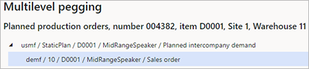
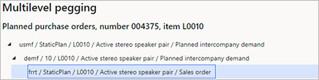

# Intercompany planning

[!include [banner](../../includes/banner.md)]

For some organizations, logistics operations depend on other legal entities (companies) in the organization. These operations are handled by using intercompany sales and purchases, because each legal entity has a separate chart of accounts.

This article describes intercompany planning and explains how to configure intercompany planning in Microsoft Dynamics 365 Supply Chain Management.

This article uses the following important intercompany terms:

- **Upstream** – A relative reference in a firm or supply chain. It indicates movement in the direction of the raw material supplier.
- **Downstream** – A relative reference in a firm or supply chain. It indicates movement in the direction of the customer.
- **Planned intercompany demand** – Planned demand for a product in a company, based on planned demand for the product from a downstream company.

In master planning, a plan in one company can include planned intercompany demand that is related to planned orders from a plan in another company. This capability is useful, because it provides full visibility into planned orders across companies. It also ensures that all required planned supply orders are created, but without requiring that planned orders be firmed for the intercompany demand.

If you run master planning from a master plan that includes planned downstream demand, planned purchase orders from the related intercompany vendors will be included in the plan as demand.

## Required setup

To use intercompany planning, you must prepare your system in the following way:

1. The relevant products must be released in all the relevant companies. Learn more in [Configure and use intercompany trade in Dynamics 365 Supply Chain Management](/training/modules/configure-use-intercompany-trade-dyn365-supply-chain-mgmt/).
1. Downstream demand must be covered by purchases from a vendor that has an intercompany relation to the upstream company and relevant default inventory dimensions (site and warehouse) on the customer. Learn more in [Configure and use intercompany trade in Dynamics 365 Supply Chain Management](/training/modules/configure-use-intercompany-trade-dyn365-supply-chain-mgmt/).
1. The master plan in the upstream company must include planned downstream demand, and the relevant company and master plan must be specified in the downstream plans.

## Include planned downstream demand

Follow these steps to configure your master plan so that it includes planned downstream demand.

1. Go to **Master planning \> Setup \> Plans \> Master plans**.
1. Select or create a master plan.
1. On the **Intercompany planning** FastTab, set the following fields:

    - **Include planned downstream demand** – Set this option to *Yes* to enable intercompany planning for the master plan.
    - **Downstream plans** – If you set the **Include planned downstream demand** option to *Yes*, use the toolbar and grid to add the desired master plans from other companies.

## Peg across companies by using multilevel pegging

In multilevel pegging, you can view pegging across companies to see the initial source of demand that is being covered by a supply.

To view multilevel pegging information, follow these steps.

1. Go to **Master planning \> Master planning \> Planned orders**.
1. Select or open a planned order.
1. On the Action Pane, on the **View** tab, in the **Requirements** group, select **Multilevel pegging**.

### Intercompany example that involves two companies

For this example, a planned production order is created in the USMF company to cover a sales order in the DEMF company. In USMF, the direct demand is planned intercompany demand. To make this demand appear in USMF, master planning is run first in DEMF and then in USMF.

The following illustration shows how this example might appear on the **Multilevel pegging** page for the planned production order.

### Intercompany example that involves three companies

For this example, a planned purchase order is created in the USMF company to cover a sales order in the FRRT company. In the DEMF and USMF companies, the direct demand is planned intercompany demand. To make this demand appear in USMF, master planning is run first in FRRT, then in DEMF, and finally in USMF.

The following illustration shows how this example might appear on the **Multilevel pegging** page for the planned production order.

[!INCLUDE[footer-include](../../../includes/footer-banner.md)]
