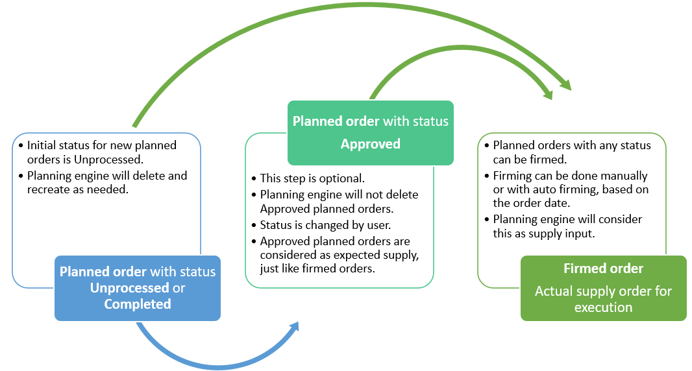

# View, manage, and approve planned orders

[!include [banner](../../includes/banner.md)]

This article provides information about how to view, manage, and approve planned orders.

## View and manage planned orders

You can view and manage planned orders on any planned orders list page. Go to one of the following places, depending on the type of planned orders that you want to work with:

- Master planning \> Workspaces \> Master planning
- Master planning \> Master planning \> Planned orders
- Production control \> Production orders \> Planned production orders
- Procurement and sourcing \> Purchase orders \> Planned purchase orders
- Inventory management \> Inbound orders \> Planned transfers
- Inventory management \> Outbound orders \> Planned transfers

## View and edit the status of planned orders

You can use the **Status** field of each planned order to help track your progress or change how a planned order will be processed. The following **Status** values are available:

- **Unprocessed** – When master planning generates planned orders, they are given this status. Planned orders that have this status will be deleted during the next planning run.
- **Completed** – This status indicates that the planned order has been completed. If you decide not to firm a planned order, you can manually change its status to *Completed*. Note that the system treats the *Unprocessed* and *Completed* statuses in the same way.
- **Approved** – This status indicates that the planned order is approved for firming. If you want to firm a planned order, you can change its status to *Approved*. If you want to keep the edits that have been made to a planned order, or if you're planning to firm a planned order, change its status to *Approved*. Planned orders that have a status of *Approved* are considered fixed and expected supply by master planning. Therefore, they aren't modified or deleted during later master planning runs. To achieve this behavior, the planning logic copies planned orders that have a status of *Approved* from the old plan version to the new plan version during master planning. Note that planned orders that have a status of *Approved* are considered supply only within the specific master plan.

To change the status of a single planned order, [open any planned orders list page](#view-planned-orders), open the order, and then follow one of these steps:

- On the **General** FastTab, change the value of the **Status** field.
- On the Action Pane, on the **Planned order** tab, in the **Process** group, select **Change status**.
- On the Action Pane, select **Approve** to mark the order as approved.

To change the status of several planned orders at the same time, [open any planned orders list page](#view-planned-orders), select the check box for each order that you want to change, and then follow one of these steps:

- On the Action Pane, on the **Planned order** tab, in the **Process** group, select **Change status**.
- On the Action Pane, select **Approve** to mark the orders as approved.

## Approve planned orders

Approval of planned orders is an optional step in the process of creating a firmed order from a planned order.

The following illustration shows how you can use the **Status** value that is assigned to each planned order to implement an approval workflow. To implement an approval process, manually adjust the **Status** value for each planned order as described in the previous section.

> [!TIP]
> We recommend that you approve any modified planned orders. Otherwise, the edits will be ignored and overwritten by the next planning run.

## Related information

- [Firm planned orders](planned-order-firming.md)

[!INCLUDE[footer-include](../../../includes/footer-banner.md)]
