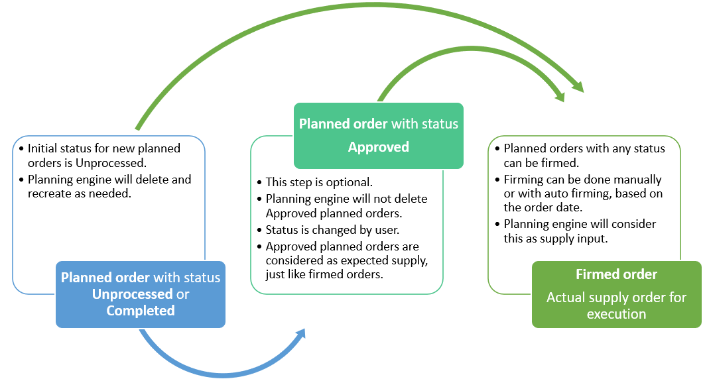

# View, manage, and approve planned orders

[!INCLUDE [banner](../../includes/banner.md)]

This article explains how to view, manage, and approve planned orders.

## View and manage planned orders

You can view and manage planned orders on any planned orders list page. Go to one of the following places, depending on the type of planned orders that you want to work with:

- **Master planning** > **Workspaces** > **Master planning**
- **Master planning** > **Master planning** > **Planned orders**
- **Production control** > **Production orders** > **Planned production orders**
- **Procurement and sourcing** > **Purchase orders** > **Planned purchase orders**
- **Inventory management** > **Inbound orders** > **Planned transfers**
- **Inventory management** > **Outbound orders** > **Planned transfers**

## View and edit the status of planned orders

Use the **Status** field of each planned order to track your progress or change how a planned order is processed. The following **Status** values are available:

- *Unprocessed* – When master planning generates planned orders, it assigns this status. Planned orders with this status are deleted during the next planning run.
- *Completed* – This status indicates that the planned order is completed. If you decide not to firm a planned order, you can manually change its status to *Completed*. The system treats the *Unprocessed* and *Completed* statuses in the same way.
- *Approved* – This status indicates that the planned order is approved for firming. If you want to firm a planned order, change its status to *Approved*. If you want to keep the edits that you made to a planned order, or if you're planning to firm a planned order, change its status to *Approved*. Planned orders with a status of *Approved* are considered fixed and expected supply by master planning. Therefore, they're not modified or deleted during later master planning runs. To achieve this behavior, the planning logic copies planned orders with a status of *Approved* from the old plan version to the new plan version during master planning. Planned orders with a status of *Approved* are considered supply only within the specific master plan.

To change the status of a single planned order, [open any planned orders list page](#view-planned-orders), open the order, and then follow one of these steps:

- On the **General** FastTab, change the value of the **Status** field.
- On the Action Pane, on the **Planned order** tab, in the **Process** group, select **Change status**.
- On the Action Pane, select **Approve** to mark the order as approved.

To change the status of several planned orders at the same time, [open any planned orders list page](#view-planned-orders), select the check box for each order that you want to change, and then follow one of these steps:

- On the Action Pane, on the **Planned order** tab, in the **Process** group, select **Change status**.
- On the Action Pane, select **Approve** to mark the orders as approved.

## Approve planned orders

Approving planned orders is an optional step in the process of creating a firmed order from a planned order.

The following illustration shows how you can use the **Status** value that is assigned to each planned order to implement an approval workflow. To implement an approval process, manually adjust the **Status** value for each planned order as described in the previous section.

> [!TIP]
> We recommend that you approve all modified planned orders because the next planning run will ignore and overwrite all unapproved edits.

## Avoid approving or editing planned orders during a planning run

The preceding text and illustration explain how approving planned orders prevents the system from ignoring and overwriting edits to those orders. However, an exception to this behavior might occur if you make changes to planned orders while the system is executing a full regenerative planning run.

This exception applies to all types of planned orders (production, purchase, and transfer) and can result in the system not preserving your changes, including split orders and field values (quantities, prices, dates, and so on). Even if you approve a planned order and therefore expect to find it after the next regenerative planning run, the order might not be available if you approved it in the middle of a planning run.

This exception occurs because, early in the planning run, the system creates a snapshot in the database during the data export stage. Then, at the end of the planning run, the system creates a new plan version, re-inserts the exported approved planned orders, and clears the previous plan version. As a result, if you approve planned orders or make changes to already approved planned orders during the exact period between the data export and re-insertion, the system overwrites those approved orders and ignores any changes to already approved planned orders. However, the demand still exists, and the planning run still considers it.

> [!TIP]
> To completely avoid the risk of badly timed edits being ignored and overwritten, run master planning outside normal business hours.

## Related information

- [Firm planned orders](planned-order-firming.md)

[!INCLUDE[footer-include](../../../includes/footer-banner.md)]
