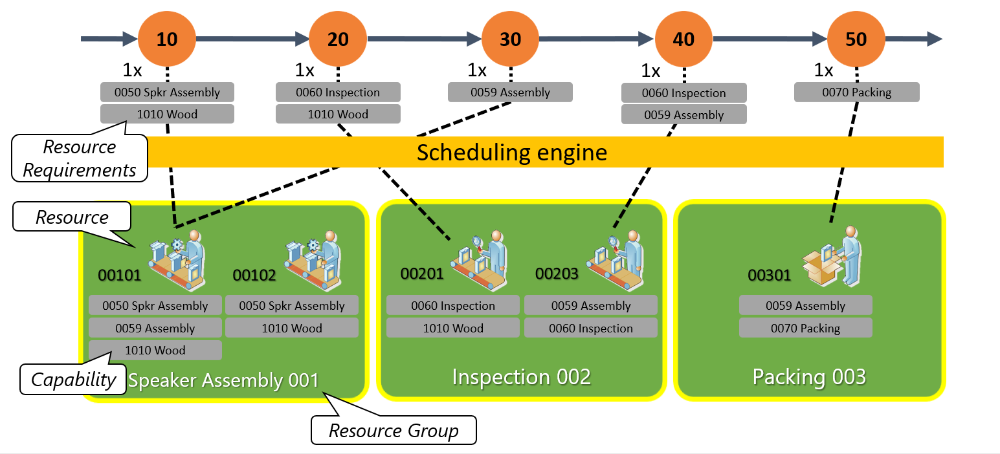

# Scheduling with resource selection based on capability

[!include [banner](../../includes/banner.md)]

By specifying resource requirements for an operation of a production route, you define what is required to perform that operation. For example, an operation might require a specific resource or a resource group, or a combination of skills or capabilities. This article describes resource selection during infinite capacity scheduling when you specify capabilities as resource requirements for an operation.

## Turn the capability-based scheduling feature on or off

To use this feature, it must be turned on for your system. As of Supply Chain Management version 10.0.29, the feature is turned on by default. Admins can turn this functionality on or off by searching for the *Infinite capacity scheduling for Planning Optimization* feature in the [Feature management](../../../fin-ops-core/fin-ops/get-started/feature-management/feature-management-overview.md) workspace.

For more information about this feature, see [Scheduling with infinite capacity](infinite-capacity-planning.md).

## Capability-based scheduling

A capability is the ability of an operation resource to perform a specific activity. More than one capability can be assigned to a single operation resource, and a single capability can be assigned to more than one resource. Capabilities can be assigned to all types of resources, such as tools, vendors, machines, locations, facilities, and human resources.

When you specify capabilities as resource requirements, you can defer resource allocation until orders are scheduled. Instead of assigning specific resources or resource groups to a route operation, you can define the capabilities that are required for each route operation. Then, during scheduling, the system matches required capabilities with the capabilities that are defined for the resources. The system selects only resources that satisfy the requirements.

To assign capabilities to an operation resource, use the **Capabilities** FastTab of the **Resources** page. To assign resources to a capability, use the **Resources** FastTab of the **Resource capabilities** page. Both pages are accessible under **Production control \> Setup \> Resources** on the navigation pane. Both FastTabs include a grid that lists the resources that are associated with a selected resource or capability. Both FastTabs also include a toolbar that you can use to add, remove, and edit rows in the grid. The grid includes the following columns:

- **Resource** or **Capability** – Select the resource or capability that is being assigned by the row.
- **Description** – Enter a short description of the resource or capability.
- **Effective** – Specify the first date when the resource or capability assignment applies. During scheduling, the system won't use a resource or capability that has an expired capability assignment, even if that resource otherwise satisfies the requirements.
- **Expiration** – Specify the last date when the resource or capability assignment applies. During scheduling, the system won't use a resource or capability that has an expired capability assignment, even if that resource otherwise satisfies the requirements.
- **Level** – Specify the level of proficiency that the resource must have for the capability. Then, if you specify a **Minimum level needed** value for the resource or capability requirement, the scheduling engine considers the level of proficiency during resource selection. The system selects only resources that have the required capability at a level that equals or exceeds the minimum level that is specified in the resource requirement.
- **Priority** – Set a priority for the resource or capability. Then, if *Priority* is selected in the **Primary resource selection** field on the **Scheduling parameters** page, the system first selects the resource that has the highest priority (that is, the lowest numeric value in the **Priority** field) during scheduling.

## Example

This example shows how the scheduling engine selects resources, based on capability.

A production route has five operations: *10*, *20*, *30*, *40*, and *50*. Each route operation requires a resource that has different capabilities. For example, route operation *10* requires a resource that has the capability to assemble a speaker (*0050 Spkr Assembly*) and the capability do woodworking (*1010 Wood capabilities*). Route operation *50* requires a resource that has the capability to pack a product (*0070 Packing capability*).

During scheduling, the engine looks for resources that satisfy the operation requirements. For example, the scheduling engine selects resource *00101* to perform operation *10*, because this resource is the first resource that is found that has both the required capabilities. The scheduling engine selects resource *00301* to perform operation *50*, because this resource is the only resource that has the packing capability.

Next, consider how this example is affected when proficiency levels are used:

- Operation *10* requires a minimum proficiency level of *7* for the *0059 Assembly* capability.
- Resource *00101* has a proficiency level of *5* for the *0059 Assembly* capability.
- Resource *00102* has a proficiency level of *10* for the *0059 Assembly* capability.

In this case, during infinite capacity scheduling, the scheduling engine selects resource *00102* to perform operation *10*, because this resource, unlike the resource *00101*, has the required proficiency level for the capability.

[!INCLUDE[footer-include](../../../includes/footer-banner.md)]
