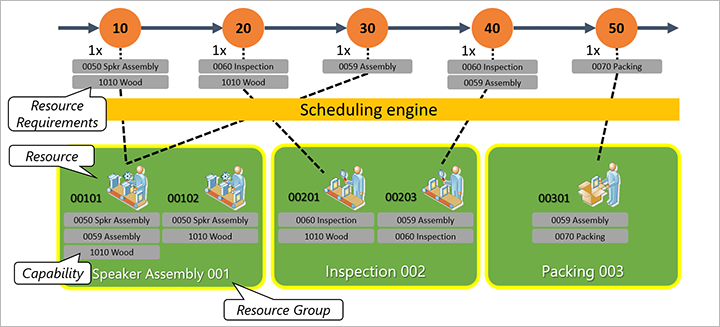

# Scheduling with resource selection based on capability

[!include [banner](../../includes/banner.md)]
[!INCLUDE [preview-banner](../../includes/preview-banner.md)]

By specifying resource requirements for an operation of a production route, you define what is required to perform the operation. It can be a specific resource or a resource group, combination of skills or capabilities, and so on. This topic describes resource selection during infinite capacity scheduling when you specify capabilities as resource requirements for an operation.

## Turn on the capability-based scheduling feature

Before you can use this feature, it must be turned on in your system. Admins can use the [feature management](../../fin-ops-core/fin-ops/get-started/feature-management/feature-management-overview.md) settings to check the status of the feature and turn it on. In the **Feature management** workspace, the feature is listed in the following way:

- **Module:** *Master planning*
- **Feature name:** *Infinite capacity scheduling for Planning Optimization*

For more information about this feature, see also [Scheduling with infinite capacity](infinite-capacity-planning.md).

## Capability-based scheduling

A capability is the ability if an operations resource to perform a particular activity. An operations resource can have more than one capability assigned to it, and a capability can be assigned to more than one resource. Capabilities can be assigned to all types of resources, including tools, vendors, machines, locations, facilities, and human resources.

Capabilities as resource requirements allow you to defer resource allocation until orders are scheduled. Instead of assigning specific resources or resource groups to a route operation, you can define the capabilities required for each route operation. Then, during scheduling, the system matches required capabilities with the capabilities that are defined for the resources. The system will select only those resources that satisfy the requirements.

To assign capabilities to an operations resource, use the **Capabilities** FastTab of the **Resources** page. To assign resources to a capability, use the **Resources** FastTab of the **Resource capabilities** page. Both pages are located under **Production control \> Setup \> Resources** on the navigation pane. Each of these FastTabs provides a grid that lists the resources associated with a selected resource or capability and a toolbar for adding, removing, and editing rows in the grid. Each row provides the following settings and information:

- **Resource** or **Capability** – Select the resource or capability being assigned by the row.
- **Description** – Enter a short description of the resource or capability.
- **Effective** – Specify the first date on which the capability/resource assignment applies. During scheduling, the system will not use a capability/resource with an expired capability even if it otherwise satisfies the requirements.
- **Expiration** – Specify the last date on which the capability/resource assignment applies. During scheduling, the system will not use a capability/resource with an expired capability even if it otherwise satisfies the requirements.
- **Level** – Specify the resource's level of proficiency regarding the capability. The scheduling engine considers the level of proficiency during the resource selection if you specify **Minimum level needed** value for the capability resource requirement. The system will select only those resources that have the required capability at a level that is equal or exceeds the minimum level that is specified in the resource requirement.
- **Priority** – This field isn't yet supported by Planning Optimization, but if you are using the built-in planning engine, you can use the **Priority** field in the capability/resource assignment to define the resource priority. During scheduling, the system will first select the resource with the highest priority (the lowest numeric value in the **Priority** field), given that *Priority* is selected in the **Primary resource selection** field on the **Scheduling parameters** page.

## Example

This example shows how the scheduling engine selects resources based on capability.

There is a production route with several operations: *10*, *20*, *30*, *40*, and *50*. Each route operation requires resources with some capabilities. For example, route operation *10* requires a resource that has a capability to assemble a speaker (*0050 Spkr Assembly*) and to do wood work (*1010 Wood capabilities*), while route operation 50 requires a resource that has a capability to pack a product (*0070 Packing capability*).

During scheduling, the engine will look for resources that satisfy operation requirements. For example, to perform operation *10*, the scheduling engine will select resource 00101 since it is the first found resource with both required capabilities. To perform operation *50*, the scheduling engine will select resource *00301* since it is the only resource with packing capability.

Let's consider some additional input data:

- Operation *10* requires a minimum proficiency level of *7* for the *0059 Assembly* capability
- Resource *00101* has a proficiency level of *5* for the *0059 Assembly* capability.
- Resource *00102* has a proficiency level of *10* for the *0059 Assembly* capability.

In this case, during the infinite capacity scheduling, the scheduling engine will select resource *00102* to perform operation *10* since this resource, unlike the resource *00101*, has the required capability level.

[!INCLUDE[footer-include](../../../includes/footer-banner.md)]