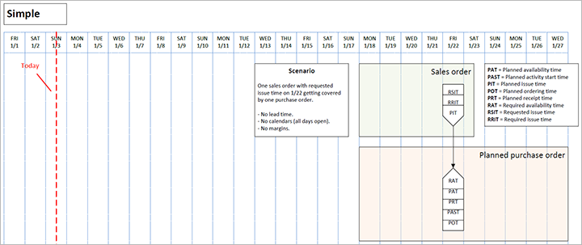
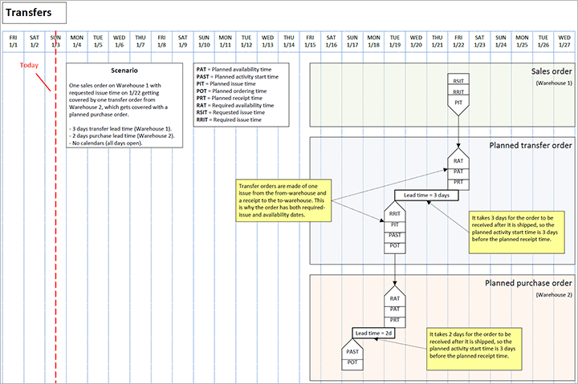

# Date and time parameters used by Planning Optimization

[!include [banner](../../includes/banner.md)]

This article provides information about the date and time parameters that Planning Optimization uses during its operation.

Whereas the deprecated master planning engine uses transaction dates in all calculations, Planning Optimization works with date and time values that are converted to dates. This difference in behavior can lead to situations where, for example, forecast transactions that are created at midnight on the day when master planning is run aren't included because Planning Optimization considers that they were created before the current date.

## Parameters for issue and demand transactions

The following table lists the parameters that Planning Optimization uses when it processes issue and demand transactions.

| Parameter | Parameter name in Planning Optimization | Description | Equivalent field in Microsoft Dynamics 365 Supply Chain Management (in the ReqTrans table) |
|---|---|---|---|
| Planned issue time | `PlannedIssueTime` | The date that the issue is currently planned for. | **To date** (`FuturesDate`) and **Delayed to time** (`FuturesTime`) |
| Requested issue time | `RequestedIssueTime` | The date of issue that was requested by the user and set in Supply Chain Management. This parameter is applicable only for released or approved planned orders. For planned orders, it's blank by default. | **Requested date** (`ReqDateDlvOrig`) |
| Required issue time | `RequiredIssueTime` | The required issue date that that is adjusted by Planning Optimization. If the requested issue time is in the past when Planning Optimization is run, the required issue time will be adjusted to the first open day that is no earlier than today's date. If the requested issue time is marked as blocked in the calendar, the required issue time will be adjusted to the first open day before that date. | **Requirement date** (`ReqDate`) and **Requirement time** (`ReqTime`) |
| Issue time delay | `IssueTimeDelay` | The time difference between the planned issue time and either the requested issue time for approved and released orders or the required issue time. | **Delay (in days)** (`FuturesDays`) |

## Parameters for receipt and supply transactions

The following table lists the parameters that Planning Optimization uses when it processes receipt and supply transactions.

| Parameter | Parameter name in Planning Optimization | Description | Equivalent field in Supply Chain Management (in the ReqTrans or ReqPO table) |
|---|---|---|---|
| Planned availability time | `PlannedAvailabilityTime` | The date when the receipt is planned to be available. | **Requirement date** (`ReqDate`) and **Requirement time** (`ReqTime`) |
| Planned receipt time | `PlannedReceiptTime` | The date when the receipt will arrive at the location. | **To date** (`FuturesDate`), **Delayed to time** (`FuturesTime`), and **Delivery date** (`ReqDateDlv`) or **Requested date** (`ReqDateDlvOrig`) if the order isn't released yet. |
| Required availability time | `RequiredAvailabilityTime` | The required availability date that is adjusted by Planning Optimization. | **Requirement date** (`ReqDate`) and **Requirement time** (`ReqTime`) |
| Expected receipt time | `ExpectedReceiptTime` | The expected receipt date for a released receipt. The value is set by the user in Supply Chain Management and isn't adjusted by Planning Optimization. This parameter applies only to released receipts. | **Requested date** (`ReqDateDlvOrig`) |
| Required receipt time | `RequiredReceiptTime` | The required receipt date that is adjusted by Planning Optimization. | **Requirement date** (`ReqDate`) and **Requirement time** (`ReqTime`) |
| Planned ordering time | `PlannedOrderingTime` | The ordering date that is calculated by Planning Optimization. | **Order date** (`ReqDateOrder`) and **Order time** (`ReqTimeOrder`) |
| Planned activity start time | `PlannedActivityStartTime` | The date when the activity for this receipt should start. | **Start date** (`SchedFromDate`) |
| Receipt time delay | `ReceiptTimeDelay` | The time difference between the planned receipt time and the required receipt time. | **Delay (days)** (`FuturesDays`) and **Delayed to time** (`FuturesTime`) |

## Examples of date parameter use by Planning Optimization

The plans in the following illustrations are at the day level, but Planning Optimization is run at a more detailed level. For example, because margins can be in hours, the planning ordering time can be January 22, 2021, at 11:35, and so on.

### Example 1: Simple scenario

One sales order that has a requested issue time on January 22 is covered by one purchase order. The following settings are used:

- No lead time
- No calendars (All days are open.)
- No margins

The following illustration shows this scenario. (Select the illustration to open a larger version.)

### Example 2: Lead time scenario

One sales order that has a requested issue time on January 22 is covered by one purchase order. The following settings are used:

- Three days of lead time
- No calendars (All days are open.)
- No margins

The following illustration shows this scenario. (Select the illustration to open a larger version.)

### Example 3: Margin scenario

One sales order that has a requested issue time on January 22 is covered by one purchase order. The following settings are used:

- Three days of lead time
- Four-day ordering margin
- Five-day availability margin
- No calendars (All days are open.)

The following illustration shows this scenario. (Select the illustration to open a larger version.)

### Example 4: Delay scenario

One sales order that has requested issue time on January 22 is covered by one purchase order. This example uses the same settings as example 3, but the planning date has been moved to January 15. Backward scheduling (red markers) fails because the planned ordering time would have to be before today's date. Therefore, master planning must schedule forward, and delays occur.

The following illustration shows this scenario. (Select the illustration to open a larger version.)

### Example 5: Transfer scenario

One sales order from warehouse 1 that has a requested issue time on January 22 is covered by one transfer order from warehouse 2 that is covered by a planned purchase order. The following settings are used:

- Three days of transfer lead time (warehouse 1)
- Two days of purchase lead time (warehouse 2)
- No calendars (All days are open.)

The following illustration shows this scenario. (Select the illustration to open a larger version.)

### Example 6: Lead time with calendars scenario

One sales order that has a requested issue time on January 22 is covered by one purchase order. The following settings are used:

- Three days of lead time
- Issue calendar (closed on Friday)
- Availability calendar (closed on Thursday and Friday)
- Receipt calendar (closed on Tuesday, Wednesday, and Sunday)
- Lead time calendar (closed on Thursday and Friday)
- Ordering calendar (open on Monday and Saturday)

The following illustration shows this scenario. (Select the illustration to open a larger version.)

### Example 7: Delay with calendars scenario

One sales order that has a requested issue time on January 22 is covered by one purchase order. This example uses the same settings as example 6, but the planning date has been moved to January 13. Backward scheduling (red markers) fails because the planned ordering time would have to be before today's date. Therefore, master planning must schedule forward, and delays occur.

The following illustration shows this scenario. (Select the illustration to open a larger version.)

