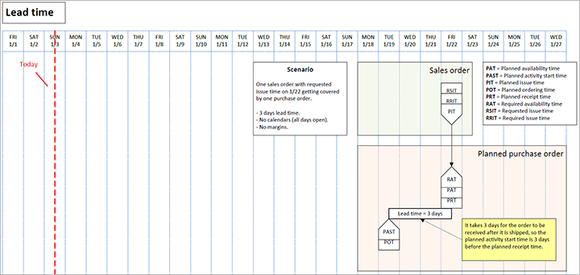
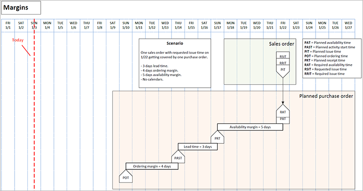
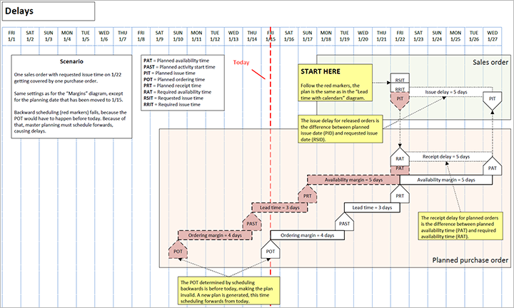
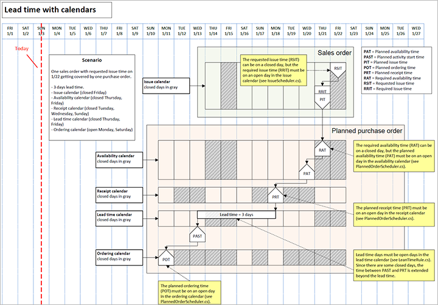
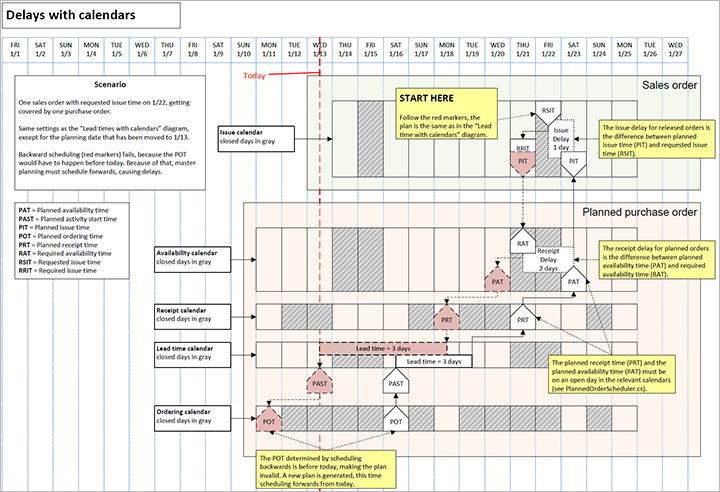

# Date and time parameters used by Planning Optimization

[!include [banner](../../includes/banner.md)]

This topic lists the date and time parameters that Planning Optimization uses during its operation.

One of the key differences is that while the built-in master planning engine uses transaction dates in all calculations, Planning Optimization operates with date and time values that are converted to dates. This could lead to situations where, for example, forecast transactions that were created at midnight on the day master planning is run aren't included because Planning Optimization considers them to have been created before the current date.

## Issue transactions

The following table lists the parameters that Planning Optimization uses when processing issue or demand transactions.

| Parameter | Parameter name in Planning Optimization | Description | Equivalent field in Dynamics 365 Supply Chain Management (in the `ReqTrans` table) |
|---|---|---|---|
| Planned issue time | `PlannedIssueTime` | The date the issue is currently planned for.| To date (`FuturesDate`), Delayed to time (`FuturesTime`) |
| Requested issue time | `RequestedIssueTime` | The date of issue requested by the user and set in Supply Chain Management. It is applicable only for released or approved planned orders. The default value for planned orders is blank.| Requested date (`ReqDateDlvOrig`) |
| Required issue time | `RequiredIssueTime` | The required issue date adjusted by Planning Optimization. If the requested issue time is in the past at the time Planning Optimization is run, the required issue time will be adjusted to the first open day not earlier than today's date. If the requested issue time is marked as blocked in the calendar, the required issue time will be adjusted to the first open day before that date. | Requirement date (`ReqDate`), Requirement time (`ReqTime`) |
| Issue time delay | `IssueTimeDelay` | The time difference between the planned issue time and either the requested issue time for approved and released orders or the required issue time. | Delay (in days) (`FuturesDays`) |

## Receipt transactions

The following table lists the parameters that Planning Optimization uses when processing receipt or supply transactions.

| Parameter | Parameter name in Planning Optimization | Description | Equivalent field in Dynamics 365 Supply Chain Management (in the `ReqTrans` or `ReqPO` table) |
|---|---|---|---|
| Planned availability time | `PlannedAvailabilityTime` | The date the receipt is actually planned to be available.| Requirement date (`ReqDate`), Requirement time (`ReqTime`) |
| Planned receipt time | `PlannedReceiptTime` | The date the receipt will arrive at the location.| To date (`FuturesDate`), Delayed to time (`FuturesTime`), Delivery date (`ReqDateDlv`), Requested date (`ReqDateDlvOrig`) if the order isn't released yet. |
| Required availability time | `RequiredAvailabilityTime` | The required availability date adjusted by Planning Optimization. | Requirement date (`ReqDate`), Requirement time (`ReqTime`) |
| Expected receipt time | `ExpectedReceiptTime` | The expected receipt date for a released receipt. It is set by the user in Supply Chain Management and isn't adjusted by Planning Optimization. It only applies to released receipts. | Requested date (`ReqDateDlvOrig`) |
| Required receipt time | `RequiredReceiptTime` | The required receipt date adjusted by Planning Optimization. | Requirement date (`ReqDate`), Requirement time (`ReqTime`) |
| Planned ordering time | `PlannedOrderingTime` | The ordering date calculated by Planning Optimization. | Order date (`ReqDateOrder`), Order time (`ReqTimeOrder`) |
| Planned activity start time | `PlannedActivityStartTime` | The date the activity for this receipt should start.| Start date (`SchedFromDate`) |
| Receipt time delay | `ReceiptTimeDelay` | The time difference between the planned receipt time and the required receipt time. | Delay (`days`) (`FuturesDays`), Delayed to time (`FuturesTime`) |

## Examples of date parameters usage by Planning Optimization

The plans in the following diagrams are at the day level, but Planning Optimization is run at a more detailed level. For example, margins can be in hours, so the planning ordering time can be 22/1/2021, 11:35, and so on.

### Scenario 1

One sales order with requested issue time on 22/1 is covered by one purchase order.

- No lead time.
- No calendars (all days open).
- No margins.

The following figure illustrates this scenario (select to enlarge).

### Scenario 2

One sales order with requested issue time on 22/1 covered by one purchase order.

- 3 days lead time.
- No calendars (all days open).
- No margins.

The following figure illustrates this scenario (select to enlarge).

### Scenario 3

One sales order with requested issue time on 22/1 covered by one purchase order.

- 3 days lead time.
- 4 days ordering margin.
- 5 days availability margin.
- No calendars (all days open).

The following figure illustrates this scenario (select to enlarge).

### Scenario 4

One sales order with requested issue time on 22/1 covered by one purchase order. Same settings as Scenario 3, except that the planning date has been moved to 15/1. Backward scheduling (red markers) fails because the planned ordering time would have to happen before today's date. Because of that, master planning must schedule forward, causing delays.

The following figure illustrates this scenario (select to enlarge).

### Scenario 5

One sales order from warehouse 1 with requested issue time on 22/1 covered by one transfer order from warehouse 2, which gets covered with a planned purchase order.

- 3 days transfer lead time (warehouse 1).
- 2 days purchase lead time (warehouse 2).
- No calendars (all days open).

The following figure illustrates this scenario (select to enlarge).

### Scenario 6

One sales order with requested issue time on 22/1 covered by one purchase order.

- 3 days lead time.
- Issue calendar (closed Friday).
- Availability calendar (closed Thursday, Friday).
- Receipt calendar (closed Tuesday, Wednesday, Sunday).
- Lead time calendar (closed Thursday, Friday).
- Ordering calendar (open Monday, Saturday).

The following figure illustrates this scenario (select to enlarge).

### Scenario 7

One sales order with requested issue time on 22/1 covered by one purchase order. Same settings as scenario 6, except that the planning date has been moved to 13/1. Backward scheduling (red markers) fails because the planned ordering time would have to happen before today. As a result, master planning must schedule forward, causing delays.

The following figure illustrates this scenario (select to enlarge).

