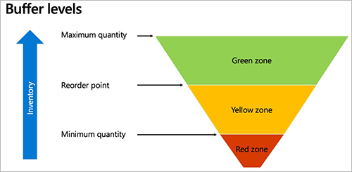
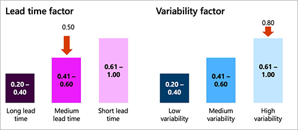
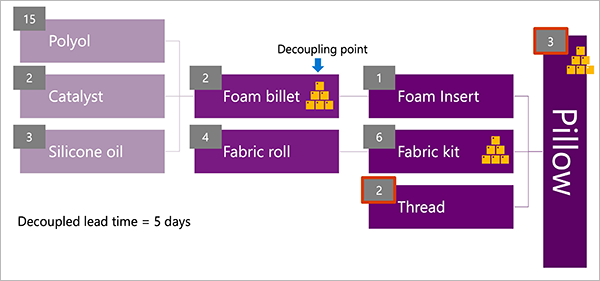
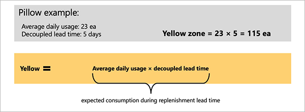
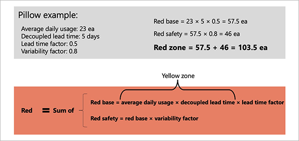
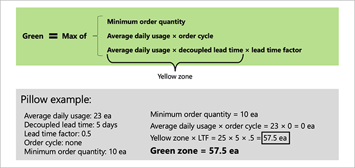
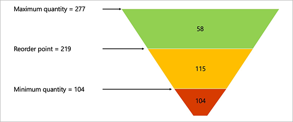

# Buffer profile and levels

[!include [banner](../../includes/banner.md)]

After you've identified your decoupling points (key items that you will strategically keep in stock), you must decide how much stock (buffer) you will keep at each of them. This task is the second step of Demand Driven Materials Resource Planning (DDMRP).

## Buffer levels and zones

In DDMRP, each stock buffer is defined by using three values: the minimum quantity, the maximum quantity, and the reorder point. These values establish three difference zones, which are identified by the following color codes:

- **Red zone** – The area below the minimum quantity. The minimum quantity is also referred to as "top of red," and your planning strategy should be designed to ensure that stock levels are always above this point.
- **Yellow zone** – The area between the minimum quantity and the reorder point. The reorder point is also referred to as "top of yellow". When this point is reached, the system should reorder.
- **Green zone** – The area between the reorder point and the maximum quantity. The maximum quantity is also referred to as "top of green". This point is the maximum level that the stock will be replenished to.

The following illustration shows the three colored zones and how they relate to the minimum quantity, maximum quantity, and reorder point.

## Calculating the buffer zones

This section explains how the height of each buffer zone is calculated.

The yellow zone is typically calculated first. This zone represents the quantity that you consume from the moment when you order until the order arrives. In other words, it's the expected consumption during the replenishment lead time. It's calculated by using the following equation:

- **Yellow zone** = *Average daily usage (ADU)* × *Decoupled lead time*

The *decoupled lead time* represents the time that is required to produce or receive an item if the decoupling points are always in stock. It's usually much shorter than the *cumulative lead time* that is traditionally used in master planning. Correct buffer settings are key to ensuring that decoupling points are always actually in stock but not overstocked.

The red zone is calculated by using the following equations:

- **Red base** = *ADU* × *Decoupled lead time* × *Lead time factor*
- **Red safety** = *Red base* × *Variability factor*
- **Red zone** = *Red base* + *Red safety*

The green zone is calculated as the maximum result of the following three equations:

- *Minimum order quantity*
- *ADU* × *Order cycle*
- *ADU* × *Decoupled lead time* × *Lead time factor*

## Calculating average daily usage

The system uses one of three approaches to calculate the amount that you consume per day:

- **Average daily usage (past)** – This approach is based on actual past consumption.
- **Average daily usage (forward)** – This approach is based on the forecasted future consumption.
- **Average daily usage (blended)** – This approach is based on a weighted mix of past and forecasted consumption.

### Average daily usage (past)

Past ADU is calculated as an average by adding the quantities that are used each day for a specified number of past days and then dividing the total by the number of days. The following illustration shows how this approach works when the calculation looks three days into the past.

 chart")

In the previous illustration, if today is the morning of June 11, the ADU for the previous three days (June 8, 9, and 10) is 21.

- **ADU (past)** = (29 + 11 + 23) ÷ 3 = 21

The following transactions are taken into account for the average daily usage (past) calculation:

- Transactions that diminish the quantity of the item (in the `inventtrans` table where quantity is less than zero)
- Transactions with a status of *On order*, *Reserved ordered*, *Reserved physical*, *Picked*, *Deducted*, or *Sold*
- Transactions dated within the chosen backwards period (the average daily usage past period)
- Transactions other than warehouse work, quarantine, sales quotations, or statements (`WHSWork`, `WHSQuarantine`, `SalesQuotation`, or `Statement`)
- Transactions other than transfer journals that are within the same coverage dimension

### Average daily usage (forward)

For a new product, you might not have any past usage data. Therefore, you might instead use the projected ADU going forward (for example, based on forecasted demand). The following illustration shows how this approach works when the calculation looks three days into the future (including today).

 chart")

In the previous illustration, if today is the morning of June 11, the ADU for the next three days (June 11, 12, and 13) is 21.66.

- **ADU (forward)** = (18 + 18 + 29) ÷ 3 = 21.66

The following transactions are taken into account for the average daily usage (forward) calculation:

- Forecast transactions for the item where the forecast is selected on the master plan
- Transactions dated within the chosen forward period (the average daily usage forward period)

### Average daily usage (blended)

The blended ADU combines the average past usage and average forward usage, as shown in the following illustration.

 chart")

In the previous illustration, if today is the morning of June 11, the blended ADU for the previous and next three days (June 8 to 13) is 21.33.

- **ADU blended** = (*ADU past* + *ADU forward*) ÷ 2 = (21 + 21.66) ÷ 2 = 21.33

## Buffer calculation factors

For each item, you can define two factors to adjust how large the red and green zones should be. In this way, you can compensate for the expected lead time and demand variability.

The first factor is the *lead time factor*. The value is a decimal value from 0 to 1. The longer the lead time is, the lower the value should be. The Demand Driven Institute recommends the following ranges:

- **Long lead time:** 0.20–0.40
- **Medium lead time:** 0.41–0.60
- **Short lead time:** 0.61–1.00

The second factor is the *variability factor*. The value is a decimal value from 0 to 1. The higher the demand variability is, the lower the value should be. The Demand Driven Institute recommends the following ranges:

- **Low variability:** 0.20–0.40
- **Medium variability:** 0.41–0.60
- **High variability:** 0.61–1.00

## Buffer calculation examples

This example continues the pillow production example that is provided in [Inventory positioning](ddmrp-inventory-positioning.md). In that example, you selected decoupling points that reduced the lead time from 21 days to five days, as shown in the following illustration.

For this example, assume that the ADU has been calculated as 23 pieces and, as shown in the previous illustration, the decoupled lead time is five days. By using these values, you can calculate the yellow zone by using the following equation:

- **Yellow zone** = *ADU* × *Decoupled lead time* = 115

The red zone calculation resembles the yellow zone calculation, but it's padded for variability and lead time. For this example, assume that you've observed a medium lead time (factor = 0.50) and high demand variability (factor = 0.8). By using these values together with the components from the yellow zone equation, you can calculate the red zone by using the following equations:

- **Red base** = *ADU* × *Decoupled lead time* × *Lead time factor* = 57.5
- **Red safety** = *Red base* × *Variability factor* = 46
- **Red zone** = *Red base* + *Red safety* = 103.5

The system will round the red zone to 104 pieces (ea), because pieces are counted in whole numbers.

The green zone calculation also includes the components from the yellow zone equation, but it allows for a minimum order size, order cycle, and lead time factor. For this example, assume that there is no order cycle (therefore, you don't have any time constraints about how frequently you order), and the minimum order quantity is 10 pieces. The green zone is then calculated as the maximum result of the following three equations:

- *Minimum order quantity* = 10
- *ADU* × *Order cycle* = 0
- *ADU* × *Decoupled lead time* × *Lead time factor* = 57.5

The system will round the green zone to 58 pieces (ea), because pieces are counted in whole numbers.

The following illustration summarizes these zone calculation results by using the funnel graphic that is often used in DDMRP.

## Dynamic adjustments

Dynamic adjustments let you apply a *demand adjustment factor* during periods of high or low demand. This factor multiplies the ADU in all calculations for the selected period. The buffer zones are then modified in turn. You will usually apply this factor after you generate your initial buffer values, so that you can fine-tune them over time and in response to changing conditions. This task is the third step of DDMRP.

For example, there might be more demand for a pillow product in August as people head out on vacation. Therefore, sales are expected to be higher. In this case, you can change the **Demand adjustment factor** value for the product to *1.5* for all the weeks in August.

In this way, you can calculate buffer values over time and then adjust them based on more than just the information that the system has. In a full DDMRP implementation, you will calculate new buffer values every day through a batch job and automatically accept the values. You will then run planning as a batch job and review the planned orders every day to refill the buffers.

## Implement buffers in Supply Chain Management

This section describes how to implement your buffer zone strategy in Microsoft Dynamics 365 Supply Chain Management. It assumes that you've already done the analyses and calculations that are outlined in the first half of this article.

### Set up buffers for a decoupling point item

Follow these steps to set up buffer values for a decoupling point.

1. Go to **Product information management \> Products \> Released products**.
1. Select a released item that is set up as a decoupling point. (For more information, see [Inventory positioning](ddmrp-inventory-positioning.md).)
1. On the Action Pane, on the **Plan** tab, select **Item coverage**.
1. On the **Item coverage** page, select an item coverage record that creates a decoupling point. (This record will show the name of a coverage group that is set up to create decoupling points.)
1. Select the **General** tab.
1. If you want the system to recalculate buffer values every day or every week, based on your sales history, forecasts, and coverage group settings, follow these steps:

    1. Set **Buffer values over time** option to *Yes*.
    1. A message box notifies you that your manual buffer settings (**Minimum**, **Reorder point**, and **Maximum**) will be reset if you continue. Select **Yes** to keep the new setting.

    Alternatively, if you prefer to calculate or enter your buffer settings just once, follow these steps:

    1. Set **Buffer values over time** option to *No*.
    1. Set the **Minimum**, **Reorder point**, and **Maximum** fields to the buffer values that you've calculated for the item, as described earlier in this article.

1. Set the following fields to finish setting up the DDMRP calculations for the item:

    - **Order cycle** – Specify the number of days that must pass between purchase orders for the item. Set the value to *0* (zero) if no order restrictions exist. This field affects the maximum quantity buffer, as previously discussed in this article.
    - **Average daily usage** – You can optionally enter an estimated ADU for the item. This field is for informational purposes only. Usually, the value is automatically calculated as part of the buffer calculations.
    - **Order spike threshold** – Specify the minimum number of daily sales of the item that qualify as a sales spike (unusually high demand). The system uses this field to increase the reorder quantity of planned orders in periods of high demand. For more information, see [Demand-driven planning](ddmrp-planning.md).

### Calculate or enter decoupled lead times

For items where you choose to allow the system to [calculate your buffer zones automatically](#set-up-buffers), follow these steps to calculate or enter decoupled lead times for a decoupling point item.

1. Open the **Item coverage** page for your decoupling point item. (For more information, see [Set up buffers for a decoupling point item](#set-up-buffers).)
1. Select an item coverage record that creates a decoupling point.
1. Select the **Buffer values** tab.
1. If no time periods are shown in the grid, on the Action Pane, on the **Buffer values** tab, select **Add time periods**. The system fills the grid with rows for each daily or weekly time period, depending on whether the **Min, max, and re-order point period** field for the [coverage group](ddmrp-inventory-positioning.md) is set to *Daily* or *Weekly*. The system will add enough rows to reach the time fence that is specified for the coverage group that is assigned to the item.
1. Select the time period where you want to calculate the decoupled lead time. (Usually, this time period is the period that includes today's date.)
1. On the Action Pane, on the **Buffer values** tab, select **Calculate decoupled lead time**.
1. In the **Calculate decoupled lead time** dialog box, set the following fields:

    - **BOM** – Select the bill of materials (BOM) that you want to run the calculation on.
    - **Date** – Select the date that you want to run the calculation on. The set of available BOMs will be filtered so that only BOMs that are active for the selected date are shown.
    - **Quantity** – Enter the quantity that you want to run the calculation for. The set of available BOMs will be filtered so that only BOMs that apply to the specified quantity are shown.

1. Select **OK** to run the calculation and close the **Calculate decoupled lead time** dialog box. The **Decoupled lead time** column for your selected time period now shows the calculated value.

### Calculate or enter average daily usage

For items where you choose to allow the system to [calculate your buffer zones automatically](#set-up-buffers), follow these steps to calculate or enter the ADU for a decoupling point item.

1. Open the **Item coverage** page for your decoupling point item. (For more information, see [Set up buffers for a decoupling point item](#set-up-buffers).)
1. Select an item coverage record that creates a decoupling point.
1. Select the **Buffer values** tab.
1. If no time periods are shown in the grid, on the Action Pane, on the **Buffer values** tab, select **Add time periods**. The system fills the grid with rows for each daily or weekly time period, depending on whether the **Min, max, and re-order point period** field for the [coverage group](ddmrp-inventory-positioning.md) is set to *Daily* or *Weekly*. In addition, default values for the **Lead time factor** and **Variability factor** fields are taken from the coverage group. You can edit these values for each row as required.
1. Select a time period where you want to calculate ADU.
1. On the Action Pane, on the **Buffer values** tab, select **Calculate average daily usage**. The system tries to collect data that is required for the ADU calculation, as defined for the [coverage group](ddmrp-inventory-positioning.md).
1. Follow one of these steps:

    - If the required data is available, calculation results are added to the **Average daily usage** column. In this case, no action is required.
    - If the required data isn't available, no values are automatically added. In this case, manually enter estimated values for each row where you're planning to calculate buffer values.

### Calculate and apply buffer values

For items where you choose to allow the system to [calculate your buffer zones automatically](#set-up-buffers), you can manually trigger the calculation of buffer values by following these steps.

1. For the relevant decoupling point item, [configure the buffer calculation](#set-up-buffers), [calculate or enter decoupled lead times](#calc-lead-time), and [calculate or enter average daily usage](#calc-adu) for all relevant time periods, as previously described in this article.
1. Open the **Item coverage** page for your decoupling point item.
1. Select the **Buffer values** tab, which should already show a list of time periods.
1. Select the time period where you want to calculate buffer values. (Usually, this time period will be the period that includes today.) The row that you select must already have non-zero values in the **Average daily usage** and **Decoupled lead time** columns.
1. Edit the **Demand adjustment factor** field for one or more rows as required. The system will apply this factor to the **Average daily usage** value in all buffer calculations where that value is used. This factor lets you adjust for the way that demand fluctuates by date (for example, for holidays or seasonal items).
1. On the Action Pane, on the **Buffer values** tab, select **Calculate min, max and reorder point quantities**. The system calculates and fills in the **Calculated min**, **Calculated reorder point**, and **Calculated max** columns in the grid on the **Item coverage** page.
1. When you've finished reviewing the calculated values, you must apply them. Otherwise, they will have no effect. When you apply a calculation for one or more rows, values from the **Calculated min**, **Calculated reorder**, and **Calculated max** fields are copied to the **Min**, **Reorder point**, and **Max** columns, respectively. On the Action Pane, on the **Buffer values** tab, in the **Take action** group, select one of the following buttons:

    - **Accept all calculations** – Apply all calculated values in the grid.
    - **Accept calculations for selected rows** – Apply calculated values for the selected rows only.
    - **Discard all calculations** – Discard all calculated values for minimum quantities, maximum quantities, and reorder points in the grid.
    - **Discard calculations for selected rows** – Discard all calculated values for minimum quantities, maximum quantities, and reorder points for the selected rows.

### Schedule automatic buffer value calculations

After you've fully set up your DDMRP settings and confirmed that they work as expected, you will probably want to set up a batch job to periodically recalculate ADU and related buffer values as required, based on actual consumption data and/or updated forecasts. This procedure applies only to items where you choose to allow the system to [automatically calculate your buffer zones](#set-up-buffers).

Follow these steps to schedule automatic buffer value calculations.

1. Go to **Master planning \> Master planning \> DDMRP \> Calculate buffer values**.
1. In the **Calculate buffer values** dialog box, set the following fields:

    - **Calculate average daily usage** – Set this option to *Yes* to recalculate the ADU of decoupling point items each time that the job runs. Set it to *No* to skip this calculation. Usually, you should set this option to *Yes*.
    - **Calculate decoupled lead time** – Set this option to *Yes* to recalculate the decoupled lead times each time that the job runs. Set it to *No* to skip this calculation. Usually, you should set this option to *Yes*.
    - **Calculate buffer values** – Set this option to *Yes* to recalculate buffer values each time that the job runs. Set it to *No* to skip this calculation. Usually, you should set this option to *Yes*.
    - **Accept calculation for min, max and reorder point** – Set this option to *Yes* to automatically approve and apply the recalculated buffer values each time that the job runs. Set it to *No* to leave the recalculated values unapplied. In this case, the recalculated values won't take effect unless somebody manually applies them later from each product's **Item coverage** page. Usually, you should set this option to *Yes*.
    - **Master plan** – Select a master plan that includes the items that will be affected by the calculation. The calculation will apply to all the items in the plan filter, which will be further limited by the **Filter** settings in this dialog box.

1. To limit the set of records that this batch job should run on, on the **Records to include** FastTab, select **Filter** to open the **Inquiry** dialog box. This dialog box works just as it does for other types of [background jobs](../../../fin-ops-core/dev-itpro/sysadmin/batch-processing-overview.md) in Supply Chain Management.
1. On the **Run in the background** FastTab, specify how, when, and how often the selected calculations should be done for the selected items. The fields work just as they do for other types of [background jobs](../../../fin-ops-core/dev-itpro/sysadmin/batch-processing-overview.md) in Supply Chain Management.
1. Select **OK** to add the new job to a batch queue for execution.

### Review and recalculate decoupled lead times for all items

Follow these steps to review and recalculate all decoupled lead times that are available in your legal entity (company).

1. Go to **Master planning \> Master planning \> DDMRP \> Decoupled lead time**.
1. On the **Decoupled lead time** page, browse and filter the list as required to find the information that you're looking for. To view even more information for an item, select its link in the **Item number** column.
1. If you want to recalculate the decoupled lead time for any item, select the item, and then select **Calculate decoupled lead time** on the Action Pane. The **Calculate decoupled lead time** dialog box appears. This dialog box works just as it does when you [calculate decoupled lead times](#calc-lead-time) for the same item on the **Item coverage** page.
