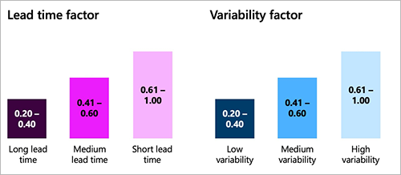

# Buffer profile and levels

[!include [banner](../includes/banner.md)]

Once you have identified your decoupling points (key items that you will strategically keep in stock) you must decide how much stock (buffer) you will keep at each of them. This is the second step of Demand Driven Materials Resource Planning (DDMRP).

## Buffer levels and zones

In DDMRP, each stock buffer is defined using three values: minimum quantity, maximum quantity, and reorder point. These values establish three difference zones, are identified using the following color codes:

- **Red zone** – This is the area below the minium quantity. The minimum point is also called "top of red" and your planning strategy should be designed to ensure that stock levels are always above this point.
- **Yellow zone** – This is the area between the minimum quantity and the reorder point. The reorder point is also called "top of yellow". When this point is reached, the system should reorder.
- **Green zone** – This is the area between the reorder point and the maximum quantity. The maximum point is also called "top of green". This point is the maximum level to which the stock will be replenished.

The following illustration shows the three colored zones and how they relate to the minimum quantity, maximum quantity, and reorder point.

## Calculating the buffer zones

This section explains how the height of each buffer zone is calculated.

The yellow zone is usually calculated first. This zone represents the quantity you consume from the moment you order until the order arrives. In other words, it's the expected consumption during the replenishment lead time and is calculated using the following equation:

- **Yellow zone** = \[Average daily usage\] × \[decoupled lead time\]

The *decoupled lead time* represents the time it takes to produce or receive an item assuming the decoupling points are always stock, and is normally much shorter than the *cumulative lead time* traditionally used in master planning. Correct buffer settings are key to ensuring that decoupling points actually are always in stock without being overstocked.

The red zone is calculated using the following equations:

- **Red base** = \[Average daily usage\] × \[Decoupled lead time\] × \[Lead time factor\]
- **Red safety** = \[Red base\] × \[Variability factor\]
- **Red zone** = \[Red base\] + \[Red safety\]

The green zone is calculated as the maximum result of the following three equations:

- \[Minimum order quantity\]
- \[Average daily usage\] × \[Order cycle\]
- \[Average daily usage\] × \[Decoupled lead time\] × \[Lead time factor\]

## Calculating average daily usage

The system calculates the amount you consume per day using one of three approaches:

- **Average daily usage (past)** – Based on actual past consumption
- **Average daily usage (forward)** – Based on the forecasted future consumption.
- **Average daily usage (blended)** - Based on a weighted mix of past and forecasted consumption

<!-- KFM: We should provide examples/logic for picking each of the above. -->

### Average daily usage (past)

Past average daily usage (ADU) is calculated as an average by adding up the quantities used each day for a specified number of past days and then dividing by that number of days. The following illustration shows how this works when looking three days into the past.

 chart")

<!-- KFM: The average values in the figure are shifted back one day, so this image should be updated. -->

In previous illustration, if today is the morning of June 11th, the average daily usage for the previous 3 days (June 8th, 9th, and 10th) is 21.

- **ADU (past)** = (29+11+23) ÷ 3 = 21

### Average daily usage (forward)

For a new product, you may not have any past usage data, so you might instead use the projected average daily usage going forward, for example based on forecasted demand. The following illustration shows how this works when looking three days into the future (which includes today).

 chart")

In previous illustration, if today is the morning of June 11th, the average daily usage for the next 3 days (June 11th, 12th, and 13th) is 21.66.

- **ADU (forward)** = (18+18+29) ÷ 3 = 21.66

### Average daily usage (blended)

The blended average daily usage combines the average past usage and average forward usage, as shown in the following illustration.

 chart")

In previous illustration, if today is the morning of June 11th, the blended average daily usage for the previous and next 3 days (June 8th to 13th) is 21.33.

- **ADU blended** = (\[ADU past\] + \[ADU forward\]) ÷ 2 = (21+ 21.66) ÷ 2 = 21.33

<!-- KFM: We should probably show the weighting factors here. -->

## Zone calculation factors

For each item, you can define two factors to adjust how big the red and green zones should be to compensate for the expected lead time and supply variability.

The first factor is the lead time factor. The values range from 0 to 1 and the guidance is that the longer the lead time is, the lower the value should be. The following ranges presented here which are recommended by the Demand Driven Institute.

In our Pillow Example, we have a medium lead time and will use the value of 0.5 as our lead time factor.

The second factor is the variability factor. The values once again range from 0 to 1 and the guidance for this is that products with a higher demand variability should have a higher value for this factor. On the picture you can see the recommended ranges for low, medium, and high variability.

Our example product has a pretty high demand variability so we will set the variability factor at 0.8

## Example of Buffer levels calculation

We will start by calculating the yellow zone because it is the simplest. The equation for yellow is average daily usage times the decoupled lead time. In other terms, this amount is the expected consumption of inventory during the replenishment lead time for the item

Using the data we showed in our example, with an average daily usage of 23 eaches and a lead time of 5 days

We multiple these together and we get a yellow zone of 115 eaches

Next step is to calculate parameters for red zone – the red zone is made up of two parts – the red base and the red safety. The red base is average daily usage times decoupled lead time times the lead time factor. Then we have the red safety component which is the red base times the variability factor, allowing us to pad our red zone amount for items with a higher demand variability you'll notice that the red base equation is related to the yellow zone – the average daily usage times the decoupled lead time.

Looking again at the example data for our pillow, we have the same data for yellow plus our lead time factor of 0.5 and our variability factor of 0.8

Using this data, our red base will be 23 times 5 times 0.5 which comes out to 57.5 eaches. Then our red safety is that 57.5 for the red base times our variability factor of 0.8 and giving us 46 eaches. Then we will sum these two together to get the red zone value of 103.5 eaches, which will be rounded by the system to 104 units since we count in whole numbers for our eaches unit

And finally, we will calculate the green zone, which is the max of these three calculations – the item's minimum order quantity, the average daily usage times the order cycle, or the average daily usage times decoupled lead time times the lead time factor.

Once again, we have our equation also based on the yellow zone equation. If we look at our data for the pillow when we calculate this, we will assume there is no order cycle (which means we don't have any time constraints around how frequently we order), and we will use our minimum order quantity of 10 eaches.

- Our first option for green will be the minimum order quantity which is 10.
- Our second option is the 23 eaches of the average daily usage times our order cycle which is zero, so this would result in zero eaches.
- Our third option is to take the yellow zone times the lead time factor which will give us a value of 57.5 eaches

That is the highest value of the three, so our green zone will be set at 58 eaches since we will round, as we mentioned before.

So to summarize, taking the zone calculations we completed, our red zone is 104 eaches and our minimum is also 104. Our yellow zone is 115 eaches which gives us a reorder point on 219, and our green zone is 58 eaches which gives us a maximum quantity of 277 eaches.

## How should we do that in DYNAMICS?

As a precondition step you need to set up decoupling points as described above.

After setting up the decoupling point you can see (19:30)

Set up buffer values for a decoupling point

1. Go to **Product information management \> Products \> Released products**

1. Select a released item that you want to set up

1. Click the **Plan** tab

1. Click **Item coverage** under **Coverage** button group

1. Select a record for decoupling point

1. Click the **General** tab

1. Set **Buffer values over time** = *Checked*

1. The confirmation page opens.

1. Click **Yes**, as a result the system will disable **Minimum**, **Reorder** **point** and **Maximum** fields and will begin calculating these values automatically. The result of this calculations you can see on the **Buffer values** tab

Note: If you set **Buffer values over time** = *Unchecked*, you can set values for the**Minimum**, **Reorder** **point** and **Maximum** fields manually.

Work with the **Buffer values**

1. Preconditions are a decoupling point is set up, the **Buffer values over time** = *Checked* for this decoupling point.

1. Go to **Product information management \> Products \> Released products**

1. Select a released item that you want to set up

1. Click the **Plan** tab

1. Click **Item coverage** under **Coverage** button group

1. Select a record for decoupling point

1. Click the **Buffer values** tab

1. Click **Add time period**s under the **Periodic setup button** group on the **Buffer values** tab of the ribbon

1. The grid on the **Buffer values** tab of the **Item coverage** page is populated with **From date** and **To date** values

1. Click **Calculate decoupled lead time** under the **Calculate** button group on the the **Buffer values** tab of the ribbon

1. The **Calculate decoupled lead time** page shows

1. Set **BOM** = the BOM you want to run calculation and **Date** and **Quantity** for this calculation

1. Click **OK** to run the calculation process

1. The system calculates the **Decoupled lead time** for the selected date

1. Select dates you want to calculate average daily usage

1. Click **Calculate** **average daily usage** under the **Calculate** button group on the the **Buffer values** tab of the ribbon

1. The system calculates the value of **Average daily usage** for the selected dates in case you have any usage data. If not, set the value of **Average daily usage** manually in the grid

1. Select dates you want to calculate min, max and reorder point quantities

1. Click **Calculate min, max and reorder point quantities** under the **Calculate** button group on the the **Buffer values** tab of the ribbon

1. The system calculates and populates the **Calculated min**, **Calculated reorder point** and **Calculated max** fields in the grid on the **Item coverage** page.

1. Click **Accept all calculations** under the **Take action** button group on the the **Buffer values** tab of the ribbon. You also can use **Accept calculations from selected rows** depends on what calculation you want to accept or **Decline all calculations** or **Decline calculations from selected rows** in case you want to decline calculations

1. The **Min**, **Reorder** **point** and **Max** fields will be populated based on the calculated valued for accepted records

Calculating the Buffer values in batch mode

1. Go to **Master planning \> Master planning \> DDMRP \> Calculate buffer values**

1. The **Calculate buffer values** form opens

1. Set **Calculate average daily usage** = *Yes*

1. Set **Calculate decoupled lead time** = *Yes*

1. Set **Calculate buffer values** = *Yes*

1. Set **Accept calculation for min, max and reorder point** = *Yes*

1. Set filter to run this calculation for the selected items

1. Set **Batch processing** = *Yes* on the**Run in the background** FastTab

1. Se Recurrence if you want

1. Click OK to put new task in a batch queue for execution.

As a result, the system will calculate the buffer values on a date when the batch task is executed.

Calculating the **Decoupling lead time**

1. Go to **Master planning \> Master planning \> DDMRP \> Decoupled lead time**

1. Click **OK**

1. The **Decoupled lead time** form opens

1. Select the line you want to check the Decoupled lead time calculation

1. Click the selected record to open a page with detailed information

1. Expand the **General** tab

1. Verify calculated values in **Decoupled lead time** and **Lead time** fields

